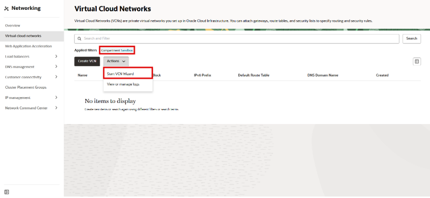
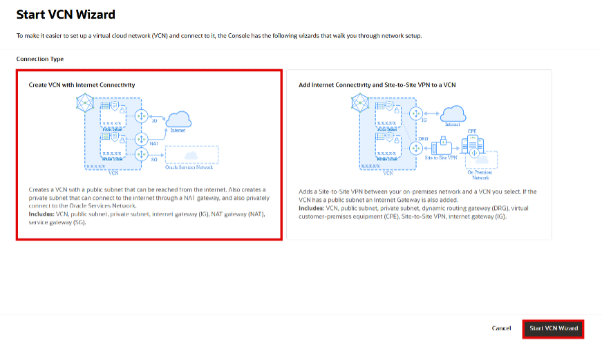
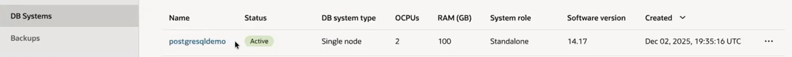
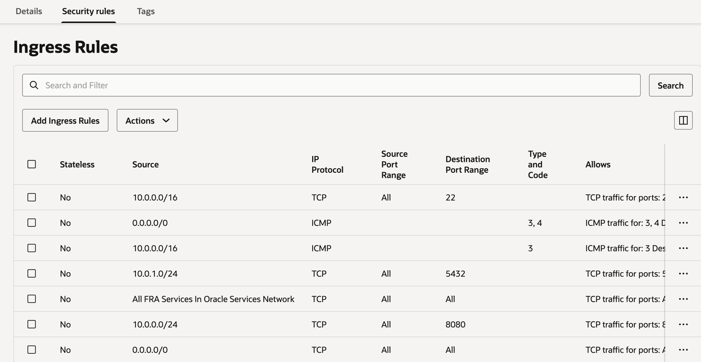

# Create OCI Resources

## Introduction

This lab walks you through the steps required to create a Virtual Cloud Network (VCN), Container Registry, PostgreSQL database system and Load Balancer in Oracle Cloud Infrastructure (OCI), including the necessary configuration.

Estimated Time: 50 minutes

### Objectives

In this lab, you will:
* Create a Virtual Cloud Network (VCN) using the OCI Console
* Set security rules
* Create a Container registry using the OCI Console
* Create a system PostgreSql DB
* Create a Load Balancer

### Prerequisites 

This lab assumes you have:
* An Oracle Cloud account
* Permissions to create networking resources (VCN, subnets), Container Registry, Load balancer
* Access to the OCI Console

## Task 1: Create a Virtual Cloud Network

### About Virtual Cloud Networks (VCN)
A Virtual Cloud Network (VCN) is a customizable and private network in OCI. It closely resembles a traditional data center network, giving you full control over IP addressing, subnets, routing, and security.

A VCN is a foundational component for deploying compute instances, Kubernetes clusters, databases, and other OCI services.

 In this task, you will create a new VCN using the OCI Console.

1. Sign in to the OCI Console.

2. From ☰ Navigation Menu, click Networking, then click Virtual Cloud Networks.

3. Select the appropriate Compartment from the Compartment dropdown.
4. Start the VCN Wizard 
   

5. Select Create VCN with Internet Connectivity, and then click Start VCN Wizard.

   
6. Complete the following fields:

| Field               | Value                 |
|---------------------|-----------------------|
| VCN Name | Appointment_Manager   |
| Compartment | Choose your compartment |
| VCN CIDR Block| 10.0.0.0/16           |
| Public Subnet CIDR Block| 10.0.0.0/24           |
| Private Subnet CIDR Block| 10.0.1.0/24           |
| Use DNS Hostnames In This VCN| Checked             |

7. Click the Next button at the bottom of the screen.
8. Review your settings to be sure they are correct. Click the Create button to create the VCN.
9. It will take a moment to create the VCN, and a progress screen will keep you apprized of the workflow.

## Task 2: Create Container Registry

### About OCI Container Registry
A container registry in OCI is a fully managed service that stores, secures, and distributes container images, so they can be deployed on OCI services like Kubernetes, Compute instances, and CI/CD pipelines.

 In this task, you will create a new Container Registry using the OCI Console.

1. Sign in to the OCI Console.

2. From ☰ Navigation Menu, click Developer Services → Containers & Artifacts → Container Registry

3. Choose the Compartment where you want the registry repository

4. Click Create repository and fill in:  Repository name example: demo_repo  Access: Private (recommended), Public (only if required)

5. Click Create 
The registry that the image will live in must be reachable from the subnet that you provide for the container instance.

## Task 3: PostgreSQL DB System

### About PostgreSQL DB System in OCI
In this task, you will create a PostgreSQL DB System using Oracle Cloud Infrastructure (OCI).
 
The PostgreSQL service in OCI is a fully managed database, handling backups, patching, and high availability.
 
If the container image lives in OCI Container Registry, specify the image in a subnet in a virtual cloud network (VCN) with a service gateway. If the container image lives in an external registry hosted on the public internet, specify the image in a public subnet in a VCN with an internet gateway or in a private subnet in a VCN with a network address translation (NAT) gateway.
 
1. Sign in to the OCI Console.

2. From ☰ Navigation Menu, click Databases → PostgreSQL

3. Click Create DB System
 
   Select creation type: Create new DB system
4. Configure DB System Basics
 
DB System name: 
 
Example: demo_db
 
Select Compartment and PostgreSQL version

5. DB System
 
Node count: 1
    
Performance tier: 75K IOPS
 
Data placement: Availability Domain-specific
6. Hardware configuration
Image: OS Image 
 
Shape:
Example: PostgreSQL.VM.Standard.E5.Flex
 
OCPUs: 1–2 (depending on workload)
 
Memory (GB): auto-calculated or custom
 
Storage size:
Example: 100 GB
Configure Extensions
Choose an extension that was configured in your compartment
7. Network configuration
 
   Subnet: The private subnet of the VCN created in the previous step
 
   Virtual Cloud Network: The VCN created in the previous step 
8. Set username and password for db system.

## Task 4: Create Load Balancer

### About OCI Load Balancer
An OCI Load Balancer is a fully managed service that distributes incoming traffic across multiple backend resources, improving availability, scalability, and fault tolerance for applications running on OCI.
 In this task, you will create a public Load Balancer using the OCI Console.

1. Sign in to the OCI Console.

2. From ☰ Navigation Menu, click Networking → Load Balancers

3. Choose the Compartment where you want the Load Balancer to be created.

4. Click Create Load Balancer and fill in:
   Load Balancer name example: demo-lb  
   Visibility: Public (use Private if internal only)  
   Choose Networking: The VCN created at the previous task and the Public Subnet from this VCN. 
   Bandwidth: Minimum 10 Mbps / Maximum 10 Mbps
    Management: your Compartment
   Choose backends
    Policy: IP Hash  
   Add backend servers: Select the backend Container instance  
   Configure the listener
 
   Protocol: HTTP 
 
   Port: 8080
 
   Click Create Load Balancer
  

The Load Balancer will be provisioned in a few minutes and assigned a public IP address.

## Task 5: VCN configuration
1. Edit the security rules for the private subnet as shown in the image below.
    

