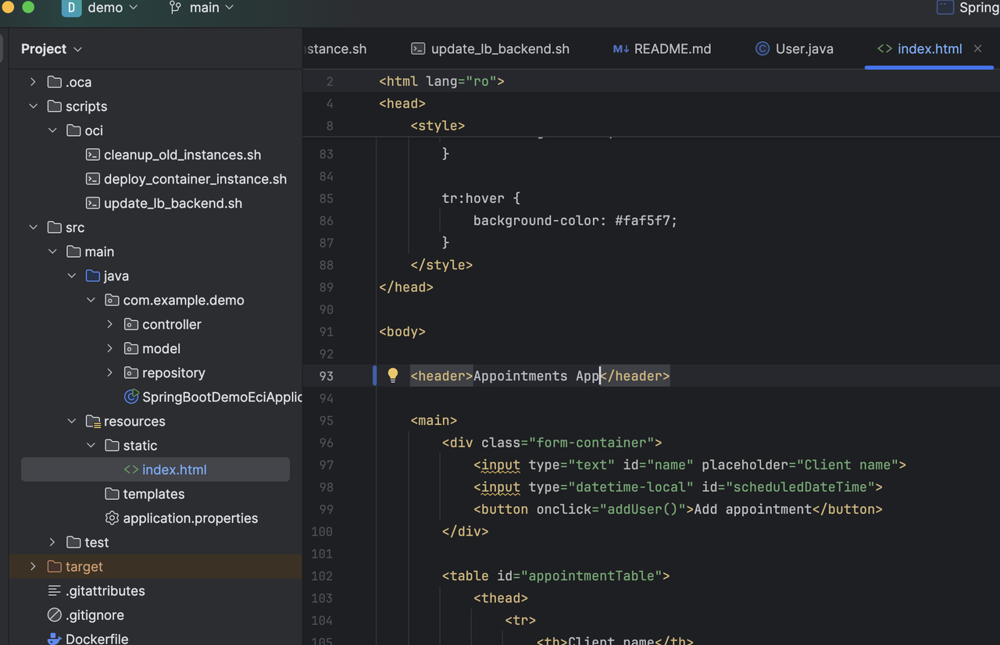
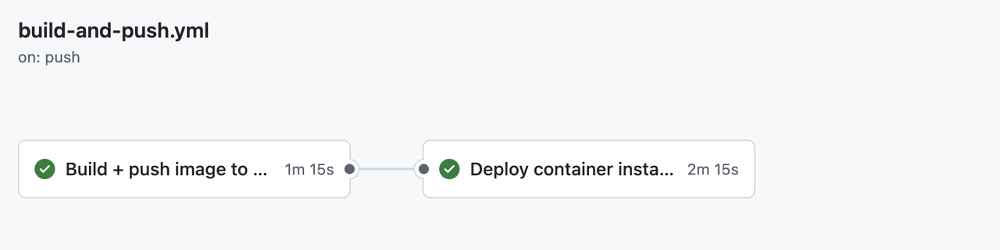
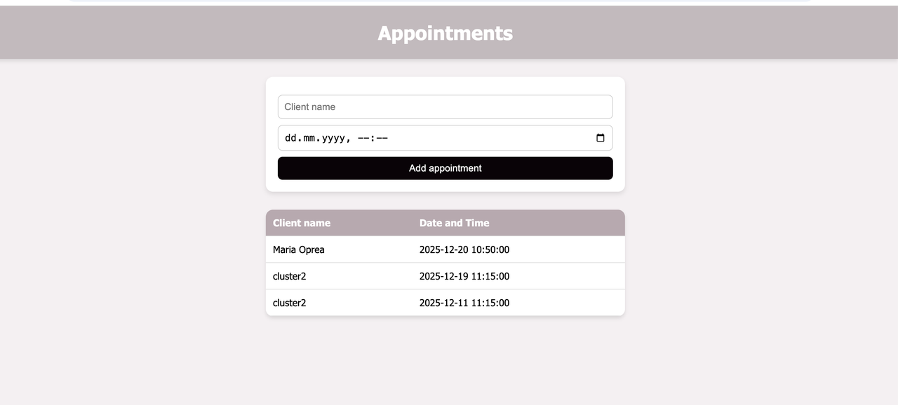

# Release Application to OCI Using GitHub Actions

## Introduction

In this step, you will trigger a full end-to-end CI/CD pipeline by pushing code to the main branch.
This will automatically build, containerize, publish, and deploy your Spring Boot application into Oracle Cloud Infrastructure (OCI) using a blue-green deployment strategy.

Check this video to see the flow
[](youtube:SzLCGE0w6u4)

## About Blue-Green Deployment steps
When you push code to the main branch, your CI/CD pipeline performs a fully automated blue-green deployment on Oracle Cloud Infrastructure.
1. Build Phase

The pipeline automatically executes:

Spring Boot source code  
→ Maven build (JAR)  
→ Docker image  
→ Push to OCI Container Registry (OCIR)

This produces a versioned Docker image and also updates the latest tag.

2. Deploy Phase (Blue-Green Strategy)

The deployment scripts then execute the following workflow:

- Detect Existing Instances

The pipeline finds all currently running OCI Container Instances for this application: "list_matching_instance_ids()"


These represent the currently live version.

- Create a New Container Instance

A brand-new container instance is created using:

The newly built image from OCIR

Environment variables for PostgreSQL:

SPRING_DATASOURCE_URL

SPRING_DATASOURCE_USERNAME

SPRING_DATASOURCE_PASSWORD

This guarantees the new version is immutable and isolated from the old one.

- Wait Until the New Instance Is Ready

The pipeline waits until OCI reports:

lifecycleState = ACTIVE


This ensures the container is fully started and ready to receive traffic.

- Resolve the Instance IP

The pipeline retrieves the new instance’s:

Private IP (for internal Load Balancer)

or Public IP (if configured)

This IP will be registered into the Load Balancer.

- Register the New Instance in the Load Balancer

The new container instance is added to the OCI Load Balancer backend set.

Traffic is not yet switched until health checks pass.

- Wait for Health Checks

The pipeline continuously polls OCI until the Load Balancer reports:

health = OK (or WARNING)


Only when the new container is healthy does the system proceed.

- Remove Old Backends

All old container instances are removed from the Load Balancer.

At this moment, 100% of traffic is now served by the new version.

- Delete Old Container Instances

The previous container instances are then deleted from OCI.

This frees resources and guarantees only the new version remains running.

Final Result

You have achieved:

Zero-downtime, enterprise-grade blue-green deployment on Oracle Cloud Infrastructure

### Objectives

* Verify that a Git push automatically triggers:

- Maven build of the Spring Boot application

- Docker image creation

- Push to OCI Container Registry (OCIR)

- Deployment to OCI Container Instances

- Load Balancer traffic cutover

- Zero-downtime replacement of the running version

### Prerequisites 

This lab assumes you have:
* An active GitHub account
* IntelliJ IDEA installed (Community or Ultimate edition)
* Basic familiarity with the command line

## Task 1: Make a Small Application Change

Edit any file in the Spring Boot project, for example, change the name of the header in the html page.



## Task 2: Commit and Push to main branch

Run:

```
git add .
<br>
git commit -m "Update application message"
<br>
git push origin main
<br>
```
This push triggers the GitHub Actions workflow:

Build + Deploy to OCI Container Instances


The workflow can be observed in parallel within OCI.

## Task 3: Access the Spring Boot application via a web browser

Take the public IP of the load balancer and paste it into your browser. The application should appear, and you can proceed with further testing.
Please follow the video from the Introduction step to replicate the entire flow.



