# Lab 4 - Implantação automatizada

## Introdução

Esse workshop foi desenvolvido com o intuito de demonstrar as funcionalidades da Oracle Cloud Infrastructure em cenários onde se faz necessário construir uma esteira de desenvolvimento, com o serviço OCI DevOps, que irá automatizar a entrega de uma aplicação conteinerizada a um cluster Kubernetes!

***Conceitos desse laboratório***

**Oracle Container Engine for Kubernetes**
O Oracle Cloud Infrastructure Container Engine for Kubernetes é um serviço totalmente gerenciado, escalável e altamente disponível que você pode usar para implantar seus aplicativos de contêineres na nuvem.

**OCI Devops**

O serviço Oracle Cloud Infrastructure DevOps é uma plataforma completa de integração contínua/entrega contínua (CI/CD) para que os desenvolvedores simplifiquem e automatizem o ciclo de vida de desenvolvimento do software.

*Tempo estimado para o Lab:* 30 Minutos

### Pré requisitos

 * Efetuar os laboratórios de Resource Provisioning e Desenvolvendo aplicações Cloud Native - Parte 1
 * Coletar as seguintes informações:

Vamos coletar algumas informações na tenancy do OCI que serão utilizadas ao logo do laboratório, recomendamos que as anote em um bloco de nota para ter sempre em mãos de modo fácil. Serão coletadas as seguintes informações:

1. Após acessar sua conta.No 🍔 menu hambúrguer, acesse: Observability & Management → Application Performance → Administration.
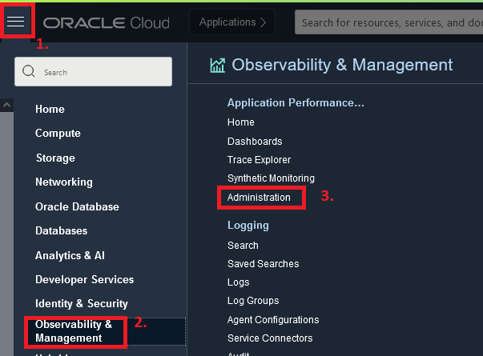

2. No canto esquerdo inferior, em Scope, valide se o Comparment criado no Lab 1 está selecionado.

3. Selecione o domínio APM listado.
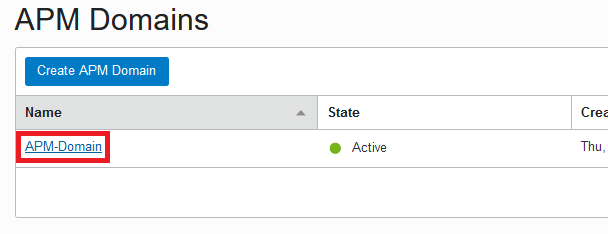

4. Copie a chave privada do domínio para um bloco de notas.
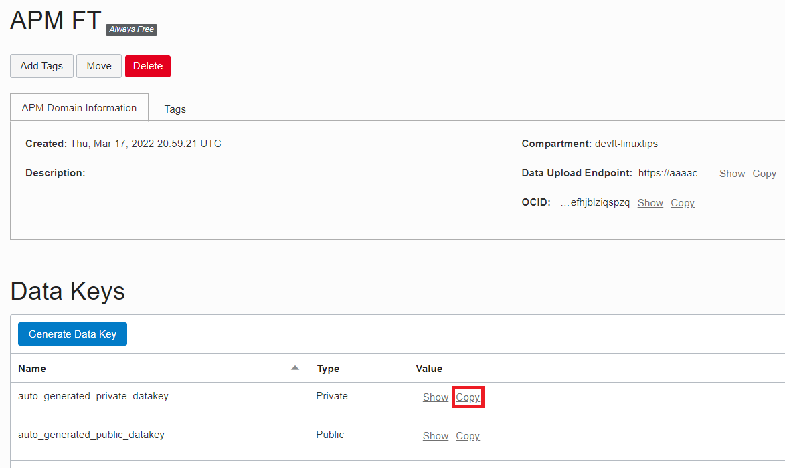

## Task 1: Clonar o repositório e movimentar conteúdo para repositório do projeto DevOps

1. Acesse o Cloud Shell, clicando no ícone como na imagem abaixo.

2. Clone o repositório do projeto:
git clone https://github.com/CeInnovationTeam/BackendFTDev.git

3. No 🍔 menu de hambúrguer, acesse: Developer Services → DevOps → Projects.
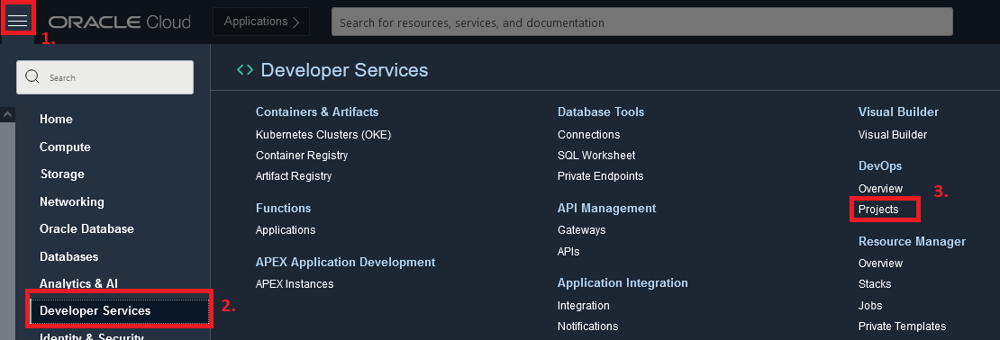

4. Acesse o projeto listado (criado no provisionamento do Resource Manager).
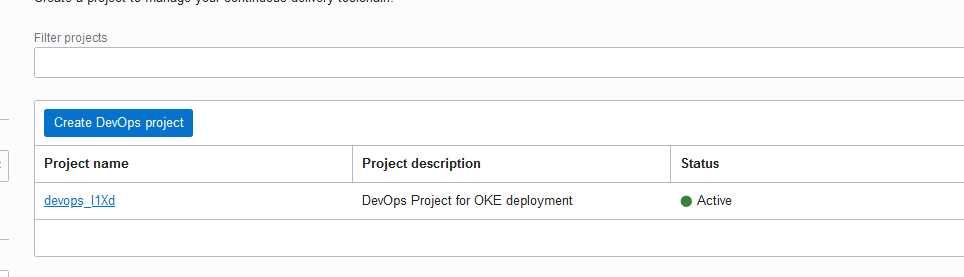

5. Na página do projeto, clique em Create repository.
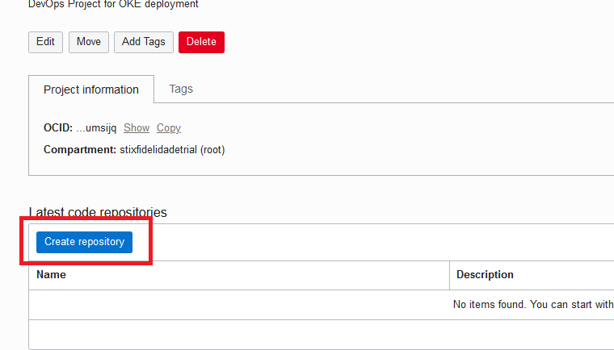

6. Preencha o formulário da seguinte forma:
Name: ftRepo
Description: (Defina uma descrição qualquer).
Default branch: main
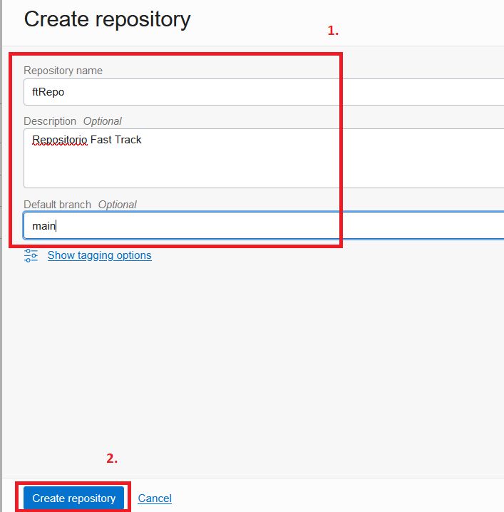

7. Na página do repositório recém-criado, clique em HTTPS e:
[1] Copie para o bloco de notas a informação do usuário a ser utilizado para trabalhar com o git (Usuário Git).
[2] Copie o comando git clone e o execute no Cloud Shell.

8. No Cloud Shell, ao executar o comando, informe o Usuario Git recém-copiado, e o seu Auth Token como senha.

9. Neste momento, o Cloud Shell deve possuir dois novos diretórios:

BackendFTDev
ftRepo
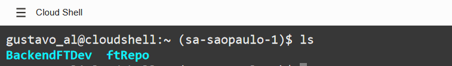

10. Execute os seguintes comandos para copiar o conteúdo do repositório BackendFTDev, para o repositório ftRepo:

git config --global user.email "<seu-email>"
git config --global user.name "<seu-username>"
cp -r BackendFTDev/* ftRepo/
cd ftRepo
git add -A
git commit -m "Início do projeto"
git push origin main

Ao final do último comando o Usuário git e a senha (Auth Token) poderão ser solicitados novamente.

## Task 2: Criar e configurar processo de Build (CI)

1. Retorne à página inicial do projeto DevOps.
2. Clique em Create build pipeline.

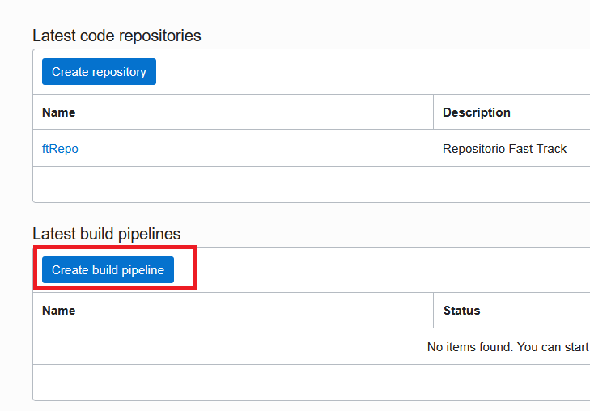

3. Preencha o formulário da seguinte forma, e clique em Create:
Name: build
Description: (Defina uma descrição qualquer).

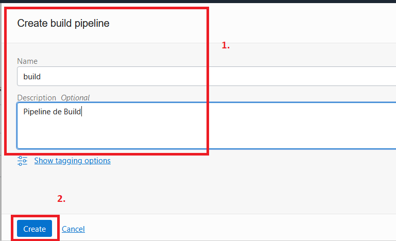

4. Abra o pipeline de build recém-criado.
5. Na aba parâmetros, defina os seguintes parametros:
APM_ENDPOINT: Informação coletada nos pré requisitos.
APM_PVDATAKEY: Informação coletada nos pré requisitos.
APM_AGENT_URL: Informação coletada nos pré requisitos.

ATENÇÃO - Ao inserir nome, valor e descrição, clique no sinal de "+" para que a informação fique salva.
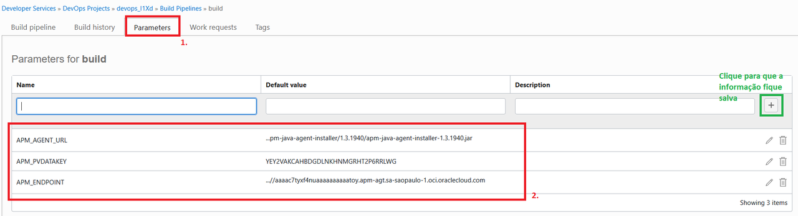

6. Acesse a aba de Build Pipeline, e clique em Add Stage.
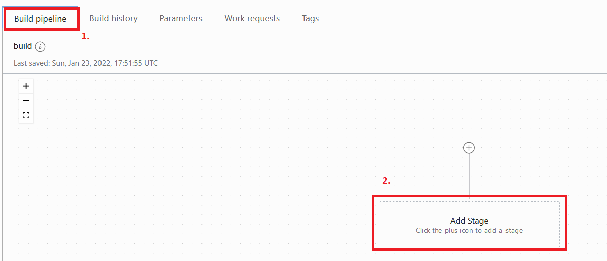

7.Selecione a opção Managed Build e clique Next.
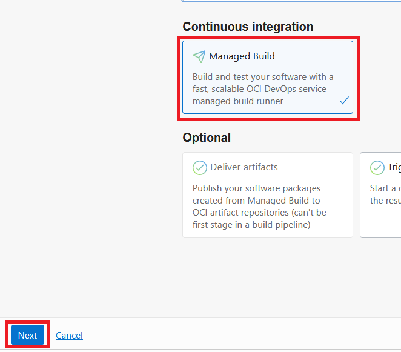

8. Preencha o formulário da seguinte forma:
Stage Name: Criacao de artefatos
Description: (Defina uma descrição qualquer).
OCI build agent compute shape: Não alterar.
Base container image: Não alterar.
Build spec file path: Não alterar.

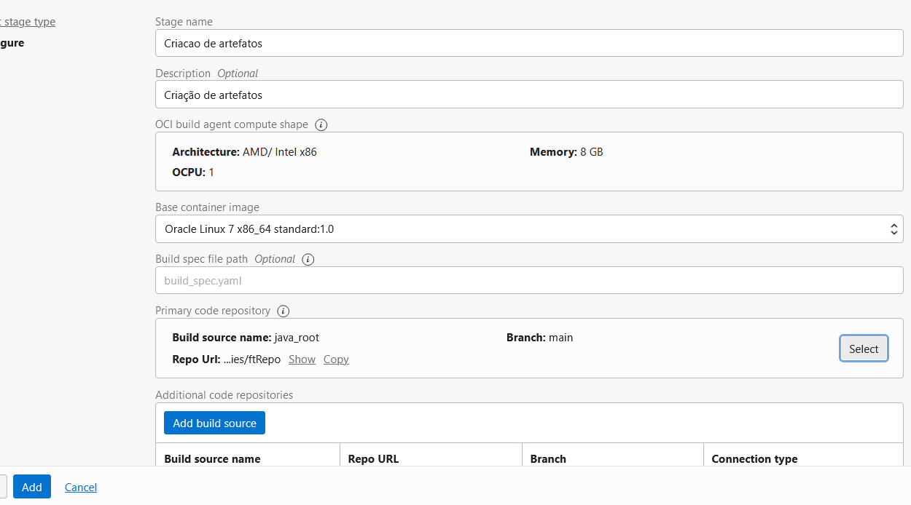

9. Em Primary code repository, clique em Select, selecione as opções abaixo e clique em Save.
Source Connection type: OCI Code Repository
Repositório: ftRepo
Select Branch: Não alterar
Build source name: java_root

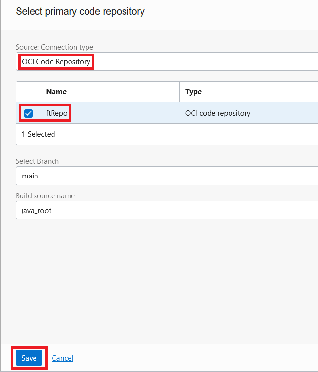

10. Feito isto, clique em Add.
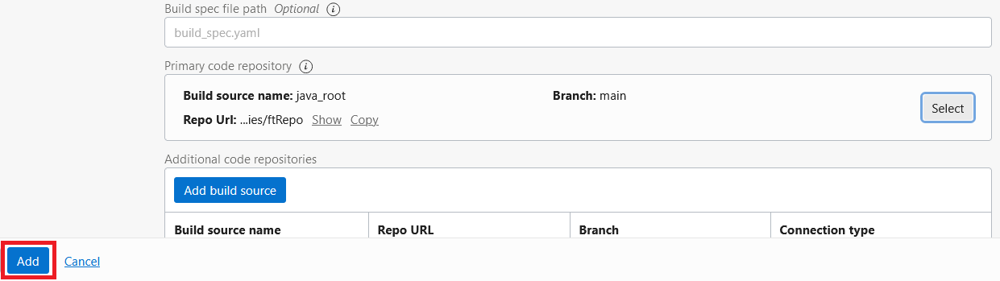

Neste momento é importante entender a forma como a ferramenta trabalha 📝.

A ferramenta utiliza um documento no formato YAML para definir os passos que devem ser executados durante o processo de construção da aplicação.
Por padrão este documento é chamado de build_spec.yaml e deve ser configurado previamente de acordo com as necessidades da aplicação.
Os passos serão então executados por uma instância temporária (agent), que será provisionada no início de cada execução e destruída ao final do processo.
🧾 Documentação de como formatar o documento de build (https://docs.oracle.com/pt-br/iaas/Content/devops/using/build_specs.htm)
📑 Documento utilizado neste workshop > build_spec.yaml(https://raw.githubusercontent.com/CeInnovationTeam/BackendFTDev/main/build_spec.yaml)

## Task 3: Criar e configurar entrega de artefatos (CI)

1. Na aba de Build Pipeline, clique no sinal de "+", abaixo do stage Criacao de artefatos, e em Add Stage.
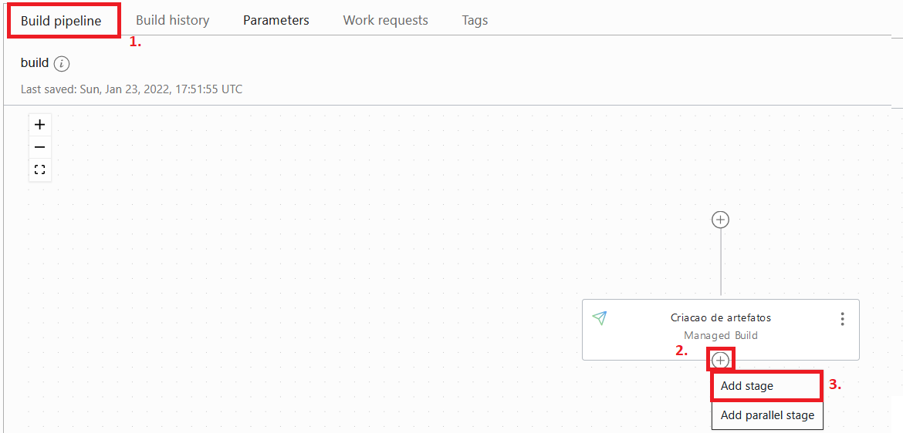

2. Selecione a opção Deliver Artifacts e clique em Next.
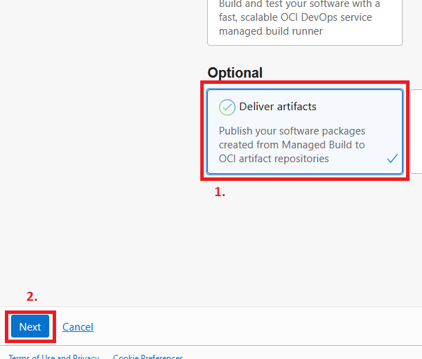

3. Preencha o formulário como abaixo e clique em Create artifact.
Stage name: Entrega de artefato
Description: (Defina uma descrição qualquer)

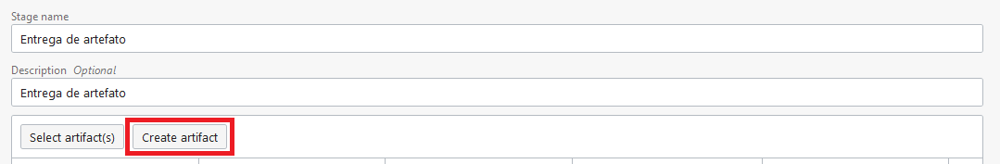

4. Na opção de seleção de artefatos, preencha como abaixo e clique em Add.
Name: backend_jar
Type: General artifact
Artifact registry: Selecione o Artifact registry gerado pelo terraform de nome "artifact_repository".
Artifact location: Set a Custom artifact location and version
Artifact path: backend.jar
Version: ${BUILDRUN_HASH}
Replace parameters used in this artifact: Yes, substitute placeholders

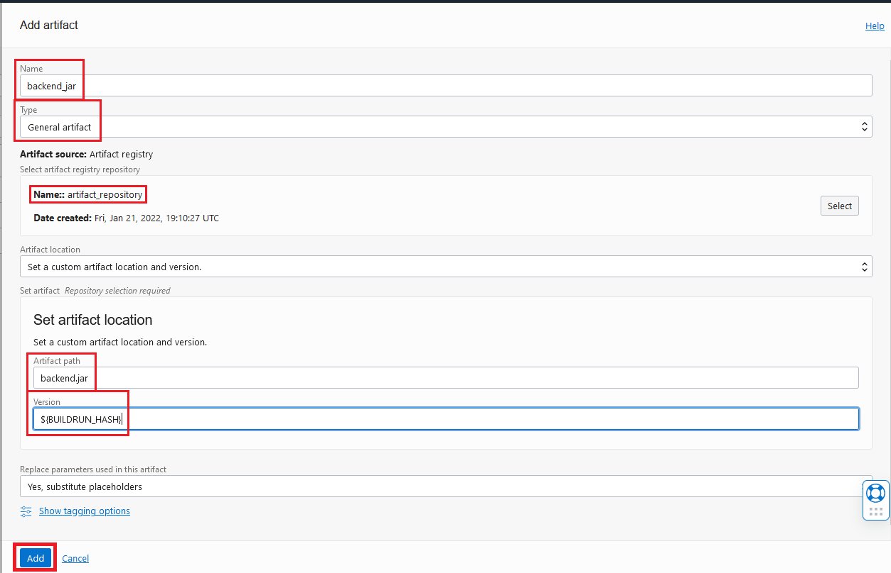

5. Preencha o campo restante da tabela Build config/result artifact name com "app" e clique em Add.
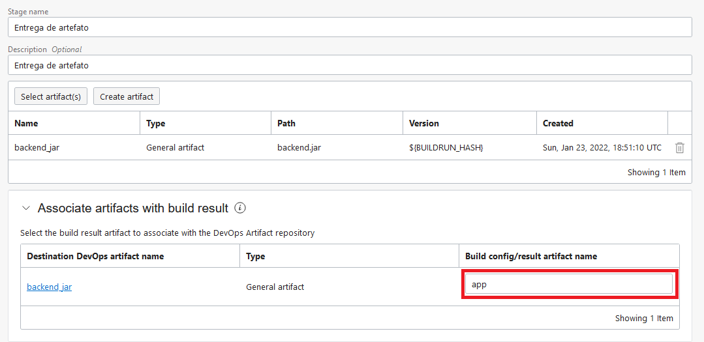

6. Na aba de Build Pipeline, clique no sinal de "+" abaixo do stage Entrega de artefato e em Add Stage.
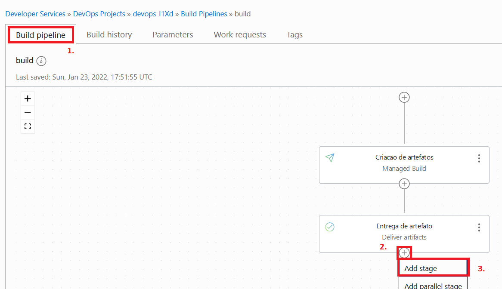

7. Novamente, clique em Deliver Artifacts e em Next.

8. Preencha o formulário como abaixo e clique em Create Artifact.
Stage name: Entrega de Image de Container
Description: (Defina uma descrição qualquer).
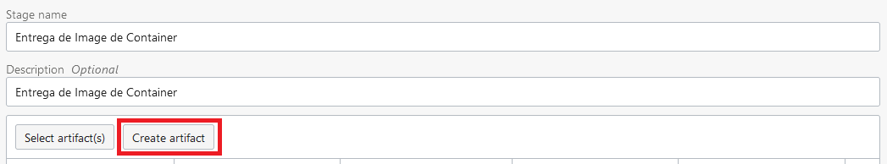

9. Em Add artifact, preencha o formulário como abaixo e clique em Add.
Name: backend_img
Type: Container image repository
Artifact Source: <código-de-região>.ocir.io/${IMG_PATH}
Replace parameters used in this artifact: Yes, substitute placeholders
Para Ashburn e São Paulo, os códigos de região são respectivamente "iad" e "gru". Caso esteja em outra região, utilize a tabela de refêrencia (https://docs.oracle.com/en-us/iaas/Content/General/Concepts/regions.htm)
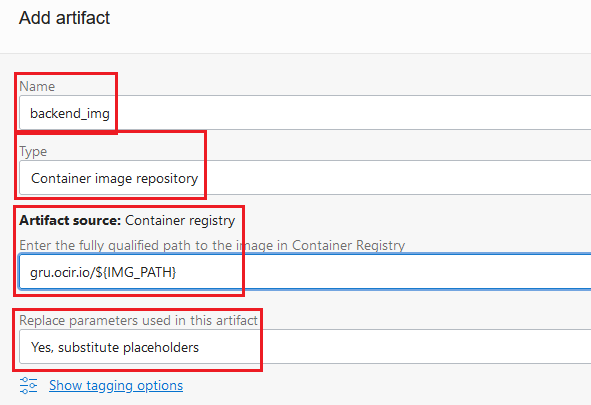

10. Preencha o campo restante da tabela Build config/result artifact name com: docker-img e clique em Add.
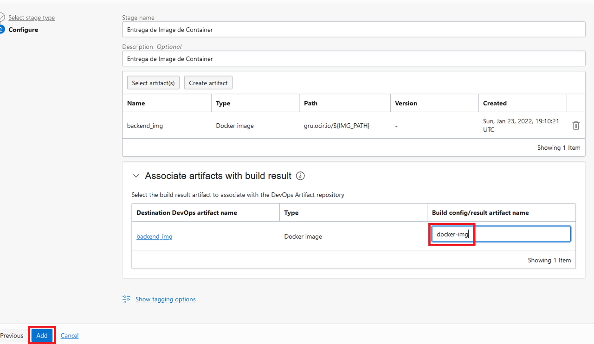

Isso conclui a parte de Build (CI) do projeto! Até aqui automatizamos a compilação do código java, criamos a imagem de contêiner, e armazenamos ambas nos repositórios de artefatos, e de imagens de contêiner respectivamente. Vamos agora para a parte de Deployment (CD)!

## Task 4: Criar e configurar entrega de aplicação a cluster Kubernetes (CD)

1. No Cloud Shell, para a criação do secret, execute os comandos abaixo e informe o seu User OCID e Auth Token, coletados anteriormente.

 cd ftRepo/scripts/
 chmod +x create-secret.sh
 ./create-secret.sh

2. Aguarde o final do fluxo.

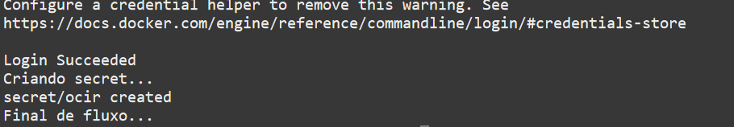

3. Retorne ao seu projeto DevOps clicando no 🍔 menu hamburguer e acessando: Developer Services → Projects.
4. No canto esquerdo, selecione Environments.

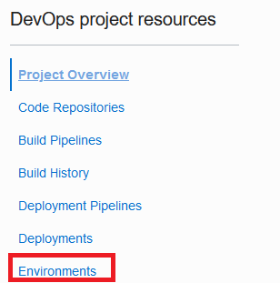

5. Clique em Create New Environment.

6. Preencha o formulário como abaixo e clique em Next.

Environment type: Oracle Kubernetes Engine
Name: OKE
Description: OKE

7. Selecione o Cluster de Kubernetes, e clique em Create Envrinoment.

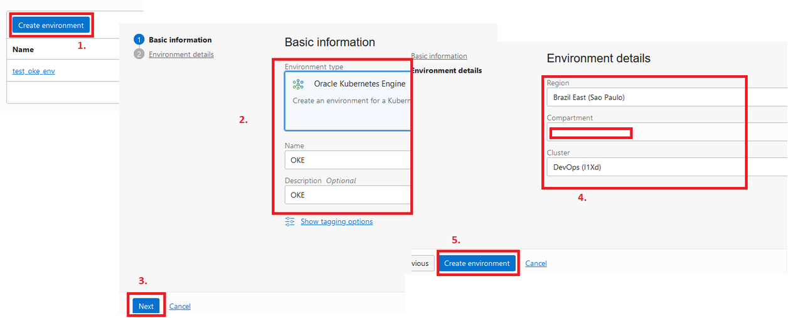

8. No canto esquerdo selecione Artifacts em seguida em Add Artifact.
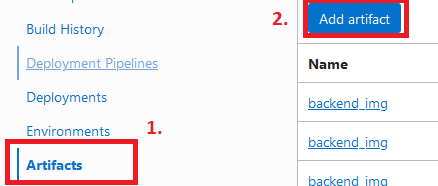

9. Preencha o formulario como abaixo e clique em Add.
Name: deployment.yaml
Type: Kubernetes manifest
Artifact Source: Inline
Value: Cole o conteúdo do arquivo https://github.com/CeInnovationTeam/BackendFTDev/blob/main/scripts/deployment.yaml Não altere a identação (espaços) do documento, pois isso pode quebrá-lo.
Replace parameters used in this artifact: Yes, substitute placeholders

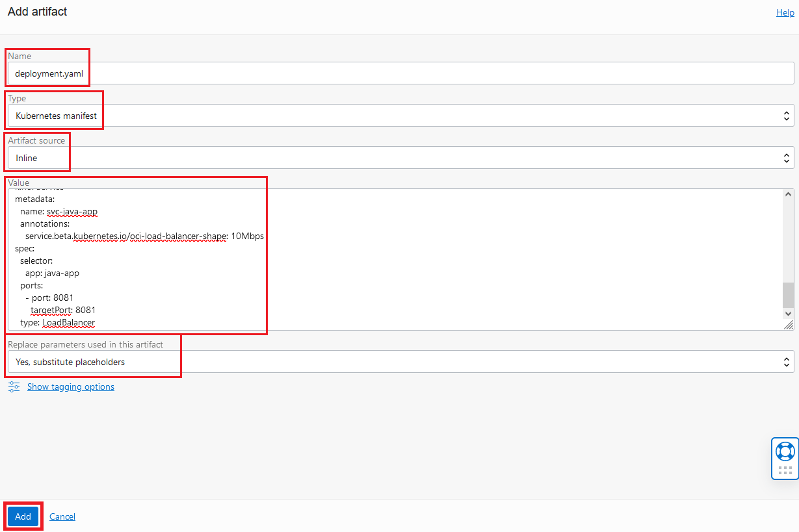

10. No canto esquerdo, selecione Deployment Pipelines e, em seguida, clique em Create Pipeline.

11. Preencha o formulário como abaixo e clique em Create pipeline.
Pipeline name: deploy
Description: (Defina uma descrição qualquer).
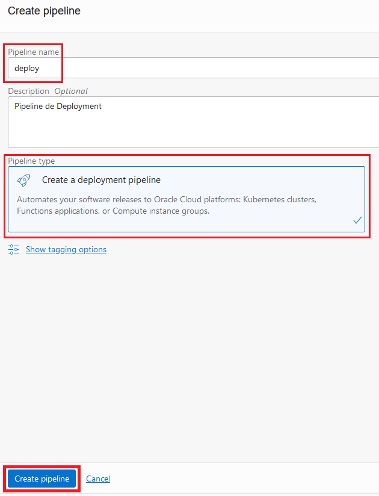

12. Na Aba de Parameters configure o seguinte parâmetro:
REGISTRY_REGION: <código-de-região>.ocir.io
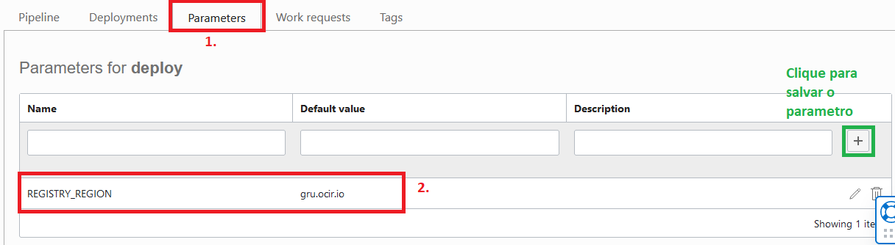

13. Retorne à aba de Pipeline e clique em Add Stage
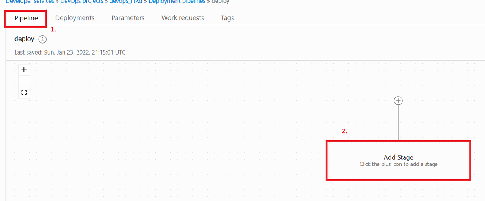

14. Selecione a Opção Apply Manifest to your Kubernetes Cluster e clique em Next.
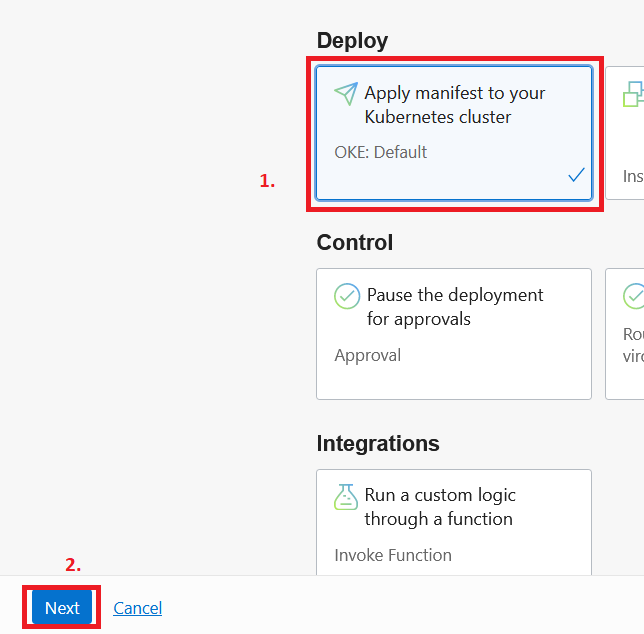

15. Preencha o formulário da seguinte forma:
Name: Deployment da Aplicacao
Description: (Defina uma Descrição qualquer).
Environment: OKE

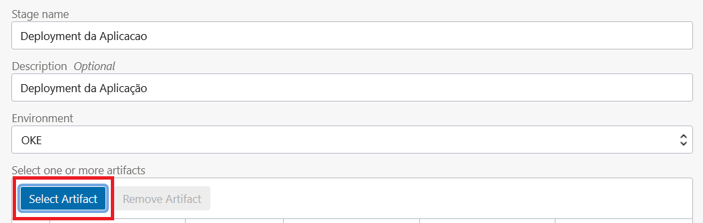

16. Clique em Select Artifact, e selecione deployment.yaml.
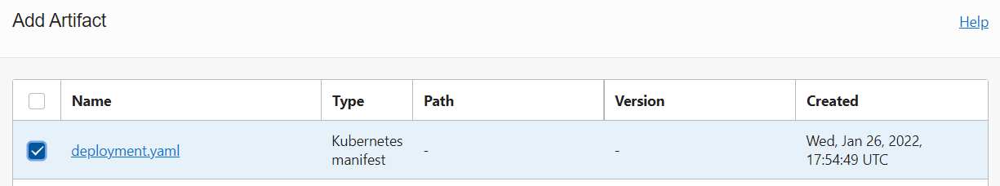

17. Feito isto, clique em Add.
Com isso finalizamos a parte de Deployment (CD) do nosso projeto! No passo a seguir vamos conectar ambos os pipelines, e definir um gatilho (trigger) para que o processo automatizado se inicie!

## Task 5: Criar e configurar entrega de aplicação a cluster Kubernetes (CD)

1. Retorne ao projeto clicando no 🍔 menu hambúrguer e acessando: Developer Services → Projects.
2. No canto esquerdo selecione Triggers, e em seguida clique em Create Trigger.
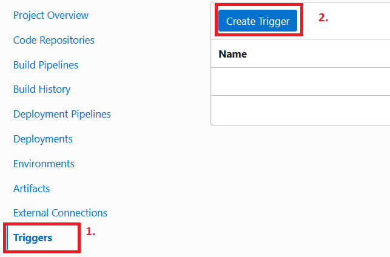

3. Preencha o formulário como abaixo e clique em Create.
Name: Inicio
Description: (Defina uma descrição qualquer).
Source connection: OCI Code Repository
Select code repository: ftRepo
Actions: Add Action
Select Build Pipeline: build
Event: Push (check)
Source branch: main
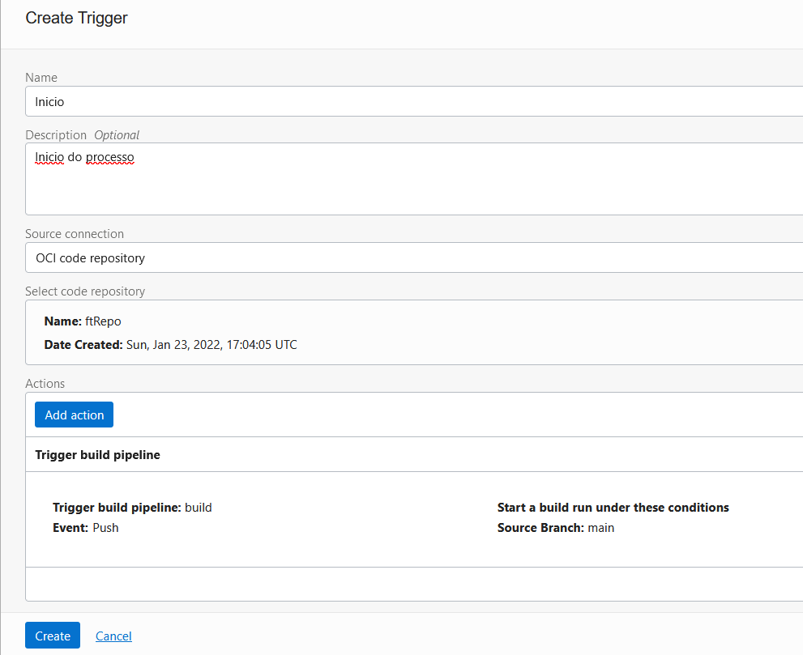

A partir desse momento, qualquer novo push feito no repositório do projeto iniciará o pipeline de build criado nesse workshop.

4. Retorne à configuração do pipeline de build do projeto selecionando Build Pipelines → build.

5. Na aba de Build Pipeline, clique no sinal de "+" abaixo do stage Entrega de Imagem de Container e clique em Add Stage.

6. Selecione o item de Trigger Deployment, e clique em Next.
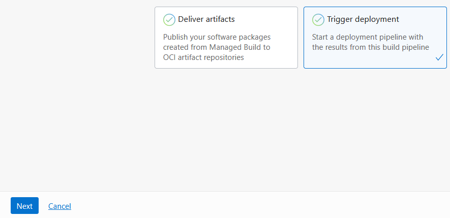

7. Preencha o formulário como abaixo e clique em Add.
Nome: Inicio de Deployment
Description: (Defina uma descrição qualquer).
Select deployment pipeline: deploy
Mantenha os demais campos sem alteração.
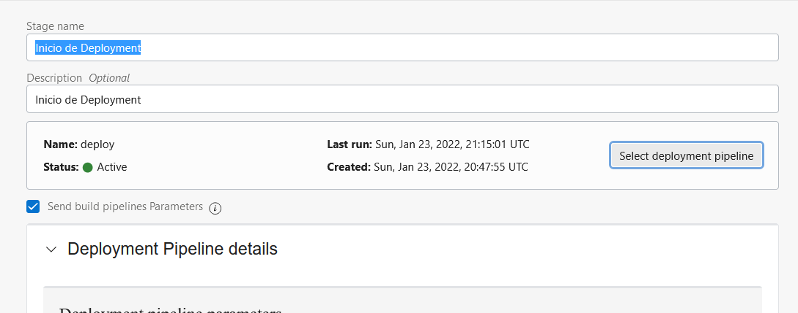

Parabéns por chegar até aqui!! Nosso pipeline já está pronto! No próximo passo iremos validar o projeto, checando se está tudo ok.

## Task 6: Execução e testes

1. Retorne ao projeto clicando no 🍔 menu hambúrguer e acessando: Developer Services → Projects.
2. Retorne à configuração do pipeline de build do projeto selecionando Build Pipelines → build
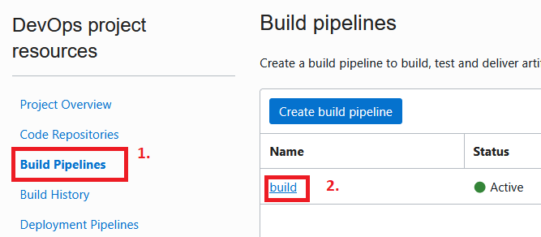

3. No canto direito superior, selecione Start Manual Run.
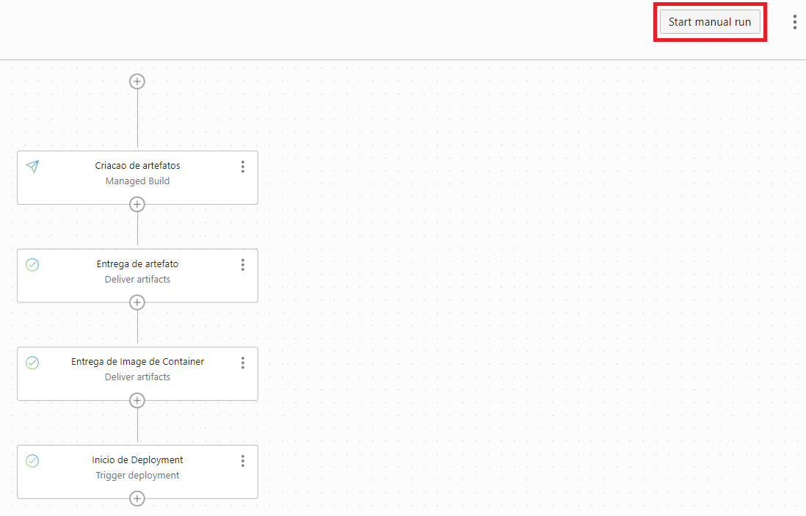

4. Mantenha as informações do formulário padrão, e clique em Start Manual Run.
5. Aguarde a execução do fluxo.
6. Acesse novamente o Cloud Shell e execute o comando abaixo:

kubectl get svc

7. Copie a informação de EXTERNAL-IP do serviço svc-java-app assim que estiver disponível

NAME           TYPE           CLUSTER-IP      EXTERNAL-IP       PORT(S)          AGE
kubernetes     ClusterIP      10.96.0.1       <none>            443/TCP          30h
svc-app        LoadBalancer   10.96.252.115   <svc-app-ip>   80:31159/TCP     29h
svc-java-app   LoadBalancer   10.96.16.229    <EXTERNAL-IP>   8081:32344/TCP   103m

8. No Cloud Shell, execute o comando abaixo substituindo a informação de <EXTERNAL-IP> pelo IP copiado.

curl --location --request POST '<EXTERNAL-IP>:8081/processcart' \
--header 'Content-Type: application/json' \
--data '[
   {   "nome":"Oranges",
   "preco":1.99
   },
   {   "nome":"Apples",
       "preco":2.97
   },
   {   "nome":"Bananas",
       "preco":2.99
   },
   {   "nome":"Watermelon",
       "preco":3.99
   }
]'

-Você deverá visualizar como resposta a soma dos preços dos produtos! Experimente modificar os valores para checar a soma!
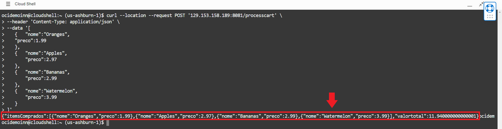

👏🏻 Parabéns!!! Você foi capaz de construir com sucesso um pipeline completo de DevOps na OCI! 🚀

## Conclusão

Nesta sessão você aprendeu a construir uma esteira de desenvolvimento, com o serviço OCI DevOps, que automatiza a entrega de uma aplicação conteinerizada a um cluster Kubernetes!

## Autoria

- **Autores** - Andressa Siqueira, Debora Silva, Thais Henrique
- **Último Update Por/Date** - Debora Silva, Fev/2023
