# Lab 2 - Desenvolver Aplicações Nativas - Parte 1

Laboratório para mostrar na prática o funcionamento das ferramentas de desenvolvimento em OCI.

## Introdução

Criar uma aplicação no Kubernetes com as imagens de container armazenadas no Oracle Container Registry (OCIR). O backend da aplicação será exposto através do API Gateway, onde receberá os headers de CORS necessários para se comunicar com o frontend.

A aplicação já contará com as bibliotecas e configurações necessárias para ser monitorada pelo APM que será demonstrado no laboratório 5.

Vamos coletar algumas informações na tenancy do OCI que serão utilizadas ao longo do laboratório, recomendamos que as anote em um bloco de notas para ter acesso quando necessário. São elas:

```bash
1. Tenancy Namespace:
2. User Name:
3. Auth Token:
4. APM Endpoint:
5. Public Key:
6. Código da Região:
```

## Task 1: Tenancy Namespace

1. Acesse a console, do seu lado direito, no ícone do usuário, em seguida encontre o nome da sua tenancy.

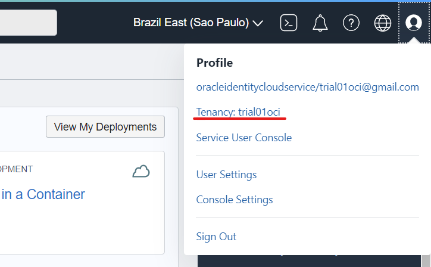

2. Agora copie o nome encontrado em "tenancy information" e cole em seu bloco de notas

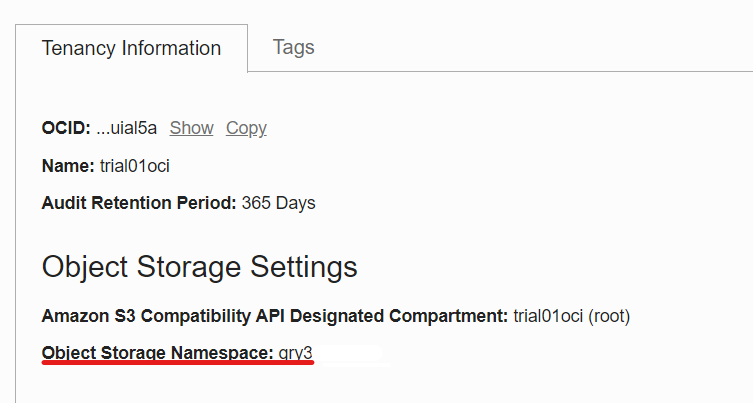

## Task 2: User OCID & Auth Token

1. Clique no menu do lado direto no icone do usuário, clique no nome do seu usuário.

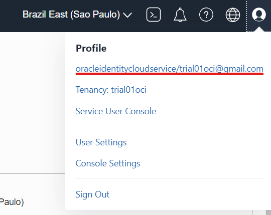

2. Copie o OCID do usuário e salve no bloco de notas.

3. Depois, vá em Auth Tokens no menu do seu lado esquerdo e gere um novo token, salve o token no bloco de notas.


## Task 3:  Dados do APM

1. Navegue no menu principal em Observability & Management > Application Monitoring> Administration

2. Clique no domínio criado pelo Resource Manager no laboratório anterior, e copie os dados do Endpoint e da Public Key.

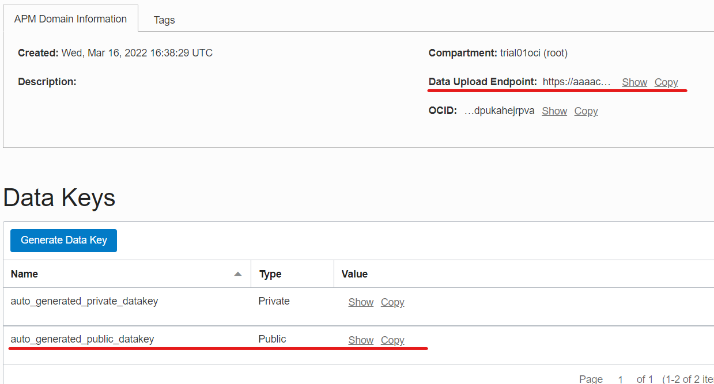

### Código da Região

Você pode pesquiar o código da sua região [aqui](https://docs.oracle.com/en-us/iaas/Content/Registry/Concepts/registryprerequisites.htm#regional-availability)

## Task 4:  Docker Login

Vamos precisar do Docker para fazer o build dos containers da aplicação e fazer o push para o OCIR. Antes do push, precisamos nos logar no OCIR através do docker-CLI.

1. Abra o **Cloud Shell** e execute o comando abaixo substituindo o username, tenanacy ocid e código da região. E na senha utilize o Auth Token gerado anteriormente.


```bash
docker login <Codigo Region>.ocir.io -u <tenancy-namespace>/<username>
```

Resultado:

```bash
password: <Auth Token>
WARNING! Your password will be stored unencrypted in /home/trial01oci/.docker/config.json.
Configure a credential helper to remove this warning. See
https://docs.docker.com/engine/reference/commandline/login/#credentials-store
```

## Task 5: Configurar o Kubectl

Agora vamos configurar o acesso ao Kubernetes via Kubectl no Cloud Shell, no menu principal vá em **Developer Services > Containers & Artifacts > Kubernetes Clusters (OKE)**.

1. Entre no cluster criado via Resource manager e clique no botão **Access Cluster**

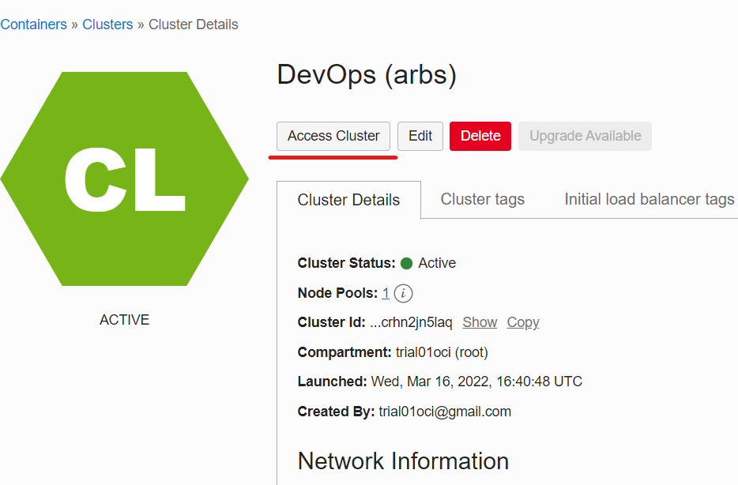

2. Copie o comando que aparece no popup e execute no cloud shell.

Exemplo:

```bash
$ oci ce cluster create-kubeconfig --cluster-id ocid1.cluster.oc1.sa-saopaulo-1.aaaaaaaan2pf --file $HOME/.kube/config --region sa-saopaulo-1 --token-version 2.0.0  --kube-endpoint PUBLIC_ENDPOINT

New config written to the Kubeconfig file /home/trial01oci/.kube/config

```

O acesso pode ser testado com o seguinte comando:

```bash
kubectl get nodes
```

Deve ter uma resposta parecida com essa:

```bash
NAME           STATUS   ROLES   AGE     VERSION
10.20.10.125   Ready    node    3h23m   v1.21.5
10.20.10.138   Ready    node    3h23m   v1.21.5
10.20.10.208   Ready    node    3h23m   v1.21.5
```

## Task 6: Copiar o Código

1. Abra o Cloud Shell e execute o git clone do código da aplicação:

```bash
git clone https://github.com/ChristoPedro/labcodeappdev.git
```

## Task 7: Configurar e fazer o Deploy do Backend

1. Navegue até a pasta do backend:

```bash
cd labcodeappdev/Backend/code
```

2. Vamos realizar o build da imagem do backend e depois fazer o push para o OCIR.

### Docker Build

3. Execute o comando:

```bash
docker build -t <Codigo Region>.ocir.io/<tenancy-namespace>/ftdeveloper/back .
```

### Docker Push

Depois da Build vamos fazer o push para o OCIR

```bash
docker push <Codigo Region>.ocir.io/<tenancy-namespace>/ftdeveloper/back
```

## Task 8:  Criando Secret no Kubernetes

Vamos criar um secret que irá conter as informações do login do OCIR. Permitindo assim que seja feito o pulling das images.

1. Basta executar esse código, substituindo os valores

```bash
kubectl create secret docker-registry ocisecret --docker-server=<region-key>.ocir.io --docker-username='<tenancy-namespace>/<oci-username>' --docker-password='<oci-auth-token>' --docker-email='<email-address>'
````

Resposta:

```bash
secret/ocisecret created
```

2.  Configurar o Manifesto de Kubernetes

Vamos agora voltar uma pasta:

```bash
cd ..
```

3. Editar o código para adicionar os parametros do APM e da imagem:

```bash
vi Deploybackend.yaml
```

4. Pressione **i** para editar.

5. Substitua os valores de **Image-Name**, **Endpoint do APM** e **Key do APM** nas seguites linhas:

```note
Image-Name = <Codigo Region>.ocir.io/<tenancy-namespace>/ftdeveloper/back
```

```yaml
      - name: backend
        image: [Image-Name]:latest
        imagePullPolicy: Always
        ports:
        - containerPort: 5000
        env:
        - name: APM_URL
          value: "[Substitua pelo Endpoint do APM]"
        - name: APM_KEY
          value: "[Substitua pela Public Key do APM]"
```

6. Após substituir os valores utilize os seguintes comando **ESC : WQ** e pressione Enter.

7. Deploy no Kubernetes

Com o arquivo editado podemos executar o seguinte comando para realizar o deploy:

```bash
kubectl apply -f Deploybackend.yaml
```

Deve ter uma saida como a seguinte:

```bash
deployment.apps/cepapp-backend created
service/cepapp-backend created
```

Podemos usar o seguinte código para saber se os pods já estão no ar:

```bash
kubectl get pods
```

## Task 9:  Configuração API Gateway

1. Primeiro precisamos descobrir o IP do **Load Balancer** do serviço do backend.

```bash
kubectl get svc cepapp-backend
```

A resposta será parecida com essa:

```bash
NAME             TYPE           CLUSTER-IP      EXTERNAL-IP    PORT(S)          AGE
cepapp-backend   LoadBalancer   10.96.123.143   10.20.20.237   5000:31952/TCP   13m
```

Vamos utilizar o EXTERNAL-IP para realizar expor-lo através do **API Gateway**.

2. Agora vamos navegar no menu principal **Developer Services > API Management > Gateways**. E selecionar o gateway já criado pelo Resource Manager. No menu do lado esquerdo vamos em Deploymets.

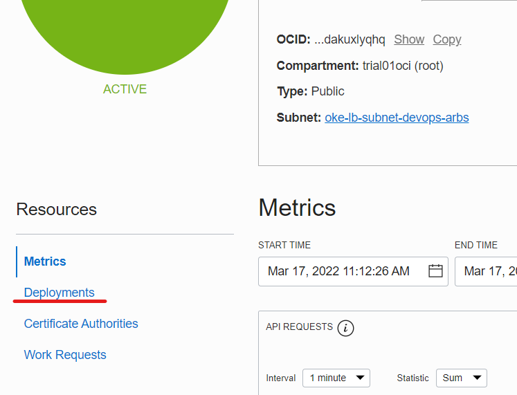

3. E agora vamos criar um novo deployment, que conterá a rota do backend que será consumida pelo frontend.

### Deployment

Preencha as informações básicas com os sequintes dados:

- **Name**: backend
- **PATH PREFIX**: /cep
- **Compartment**: Selecione seu compartimento.

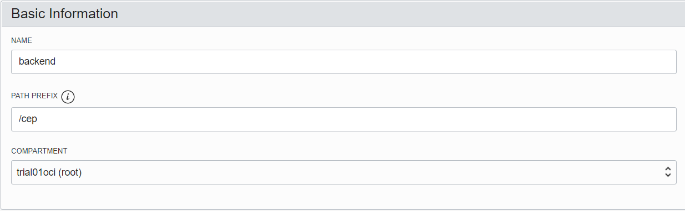

4. Agora vamos preencher as informações de **CORS**, sem elas vamos ter erros nas chamadas entre o Frontend e o Backend.

Na região do CORS clique no botão add e preencha os seguintes campos:

- **ALLOWED ORIGINS**: *
- **Methods**: GET

5. E aplique as modificações.

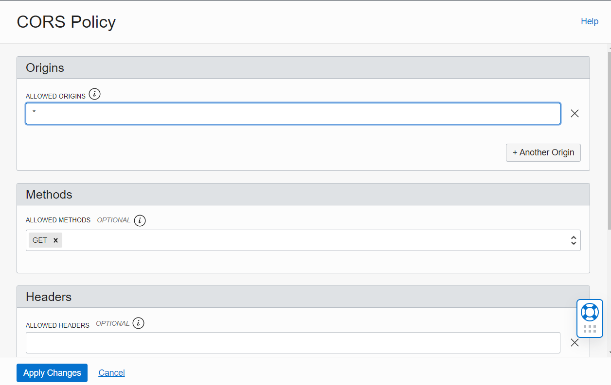

6. Com o CORS configurado, podemos clicar em **Next** e configurar a rota. Vamos preencher os campos da Rota1 da seguinte forma:

- **PATH**: /getcep
- **METHODS**: GET
- **TYPE**: HTTP
- **URL**: ```http://[External-IP-do-LoadBalancer]:5000```

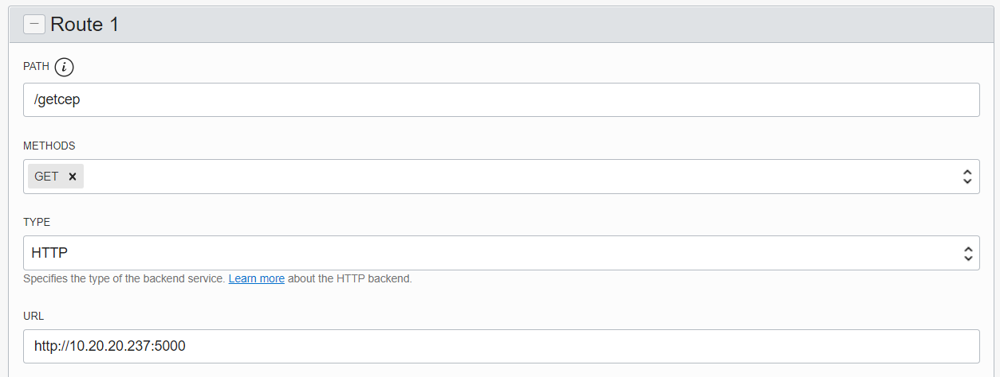

7. Depois de preenchido clique em **Next** e depois **Create**.

8. Quando a criação do Deployment estiver concluida, copie o URL do endpoint e teste a rota.

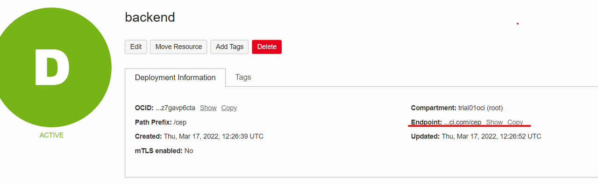

9. Basta jogar o endpoint no navegador, no seguinte formato:

```bash
<seu_endpoint>/getcep?cep=<cep-da-sua-casa>
```

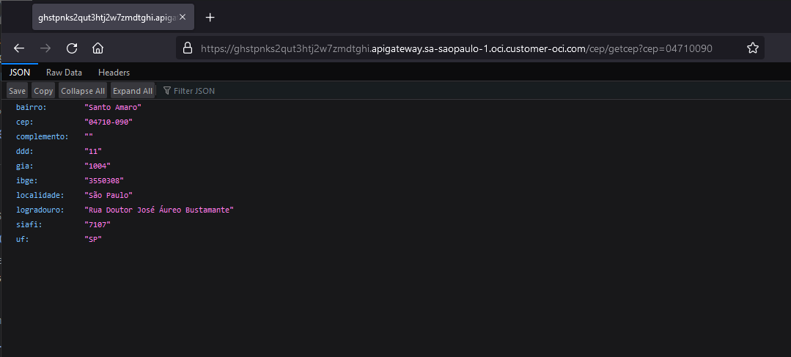

## Task 10: Configurar e fazer Deploy do Frontend

Para o Frontend precisamos substituir o URL do backend e as informações do APM antes de fazer a build do Docker.

1. Configurando o Frontend

Vamos navegar até a pasta do javascript:

```bash
cd $HOME/labcodeappdev/Frontend/code/js
```

E editar o arquivo **api.js**

```bash
vi api.js
```

2. Vamos substituir a variável url.

```js
const url = '[Substituia com a URL do API Gateway]'
```

3. Para isso pressione **i** para editar o arquivo substitua as informações dentro das aspas.

```js
const url = 'https://ghstpnks2qut3htj2w7zmdtghi.apigateway.sa-saopaulo-1.oci.customer-oci.com/cep/getcep'
```

4. Para salvar use as teclas **ESC : WQ** .

5. Agora precisamos configurar o APM no HTML, vamos voltar uma pasta:

```bash
cd ..
```

6. Editar o arquivo **index.html**:

```bash
vi index.html
```

7. Substituir os valores nas seguintes linhas:

```html
<script>
  window.apmrum = (window.apmrum || {}); 
  window.apmrum.serviceName='CEP';
  window.apmrum.webApplication='cepapp';
  window.apmrum.ociDataUploadEndpoint='[Substitua com o Endpoint do APM]';
  window.apmrum.OracleAPMPublicDataKey='[Substitua com a Public Key do APM]';
</script>
<script async crossorigin="anonymous" src="[Substitua com o Endpoint do APM]/static/jslib/apmrum.min.js"></script>
```

8. Salve o arquivo.

### Docker Build Front

9. Após, configurar o frontend, vamos realizar a build do docker com o seguinte comando.

```bash
docker build -t <Codigo Region>.ocir.io/<tenancy-namespace>/ftdeveloper/front .
```

### Docker Push Front

10. Ao final da build podemos fazer o push para o OCIR

```bash
docker push <Codigo Region>.ocir.io/<tenancy-namespace>/ftdeveloper/front
```

## Task 11: Configurar o Manifesto do Kubernetes

1. Agora precisamos voltar mais uma pasta:

```bash
cd ..
```

2. Editar o arquivo Deployfrontend.yaml:

```bash
vi Deployfrontend.yaml
```

 3. Pressione **i** para editar o arquivo, e substitua a **Image-Name**:

 ```note
Image-Name = <Codigo Region>.ocir.io/<tenancy-namespace>/ftdeveloper/front
```

 ```yaml
     spec:
      containers:
      - name: front
        image: [Image-Name]:latest
        imagePullPolicy: Always
        ports:
        - containerPort: 80
      imagePullSecrets:
```

4. Após a alteração salve o arquivo com **ESC : WQ**.

### Deploy do Front no Kubernetes

5. Agora vamos executar o deploy do frontend no Kubernetes com o seguinte comando:

```bash
kubectl apply -f Deployfrontend.yaml
```

Resultado:

```bash
deployment.apps/cepapp-front created
service/cepapp-front created
```

## Task 12:  Testando a Aplicação

Agora com o deploy do frontend e do backend podemos testar a aplicação.

1. Vamos obter o IP do Load Balancer do Frontend para acessar a aplicação:

```bash
kubectl get svc cepapp-front
```

Obtendo um resultado parecido com esse:

```bash
NAME           TYPE           CLUSTER-IP     EXTERNAL-IP      PORT(S)        AGE
cepapp-front   LoadBalancer   10.96.188.10   152.70.213.248   80:31117/TCP   89s
```

2. Basta copiar o IP externo no navegador e testar se aplicação retorna as informações.

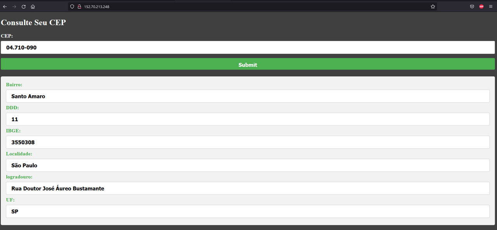

## Conclusão

Nesta sessão você aprendeu como utilizar Kubernetes na criação de uma aplicação já com bibliotecas e configurações necessárias!


## Reconhecimentos

- **Autores** - Andressa Siqueira, Debora Silvia, Thais Henrique
- **Último Update Por/Date** - Andressa Siqueira Agosto/2023