# Lab 3 - Desenvolver Aplicações Nativas - Parte 2

## Introdução

Esse workshop foi desenvolvido com o intuito de demonstrar as funcionalidades da Oracle Cloud Infrastructure em cenários onde se faz necessário orquestrar sua infraestrutura baseando-se em Eventos.
O objetivo final deste workshop, é a criação e implementação do seguinte fluxo de evento:

### Conceitos desse laboratório

**Functions**

A Oracle Cloud Infrastructure (OCI) Functions é uma plataforma serverless que permite os desenvolvedores criarem, executarem e escalarem aplicações sem precisar administrar nenhuma infraestrutura.

**Streaming**

O serviço de Streaming da Oracle Cloud Infrastructure (OCI) é uma plataforma de streaming de eventos em tempo real, serverless e compatível com Apache Kafka para desenvolvedores e cientistas de dados.

**Events**

O Oracle Cloud Infrastructure Events permite que você crie automação com base nas alterações de estado dos recursos em toda a sua locação. Use Eventos para permitir que suas equipes de desenvolvimento respondam automaticamente quando um recurso alterar seu estado.

*Tempo estimado para o Lab:* 30 Minutos

## Task 1: Coleta de Informações
Vamos coletar algumas informações na tenancy do OCI que serão utilizadas ao logo do laboratório, recomendamos que as anote em um bloco de nota para ter sempre em mãos de modo fácil. Serão coletadas as seguintes informações:

1. Para geração de auth token:
No canto direito superior clique no icone de perfil, e em seguida selecione seu usuário, conforme imagem abaixo:
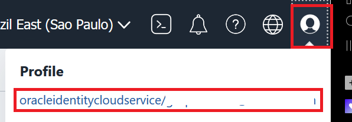

2. No canto esquerdo inferior, abaixo de Recursos (Resources) selecione Auth Tokens:
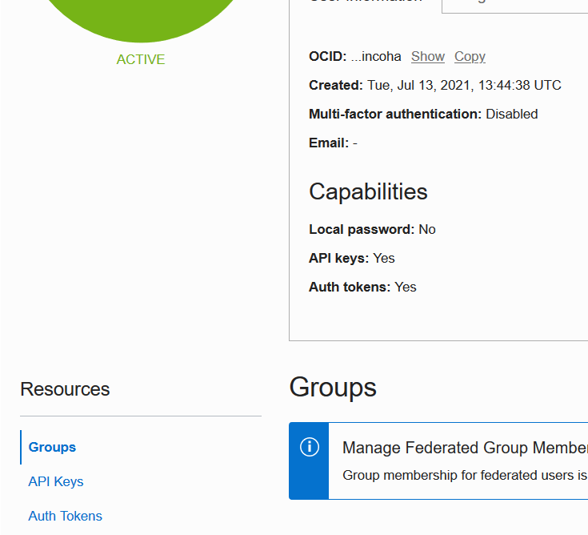

3. Clique em Gerar Token (Generate Token)
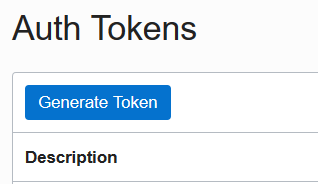

4. Escreva uma descrição da sua preferência para o token, e clique em Gerar Token (Generate Token)

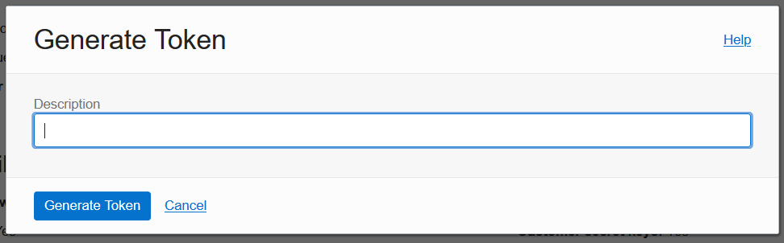

5.[IMPORTANTE] Copie o token gerado para um bloco de notas, esse token não será mostrado novamente.

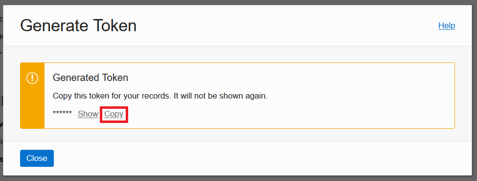

6.Clique em Fechar (Close)

## Task 2: Criando a Function Application

1. Abra o menu no canto superior esquerdo, em Serviços de Desenvolvimento (Developer Services), selecione Functions
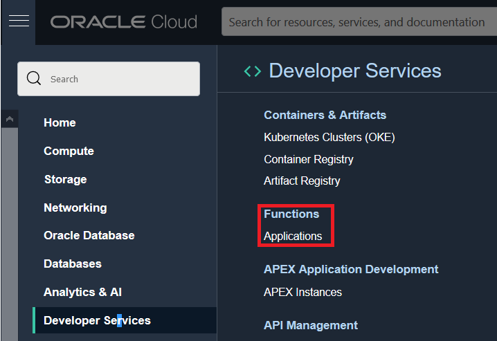

2. No canto esquerdo inferior verifique se o compartimento que você esta utilizando para esse laboratório esta selecionado.
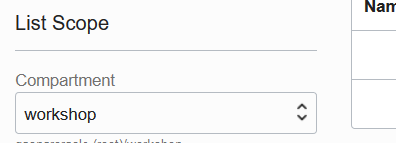

3. Clique em Criar Aplicação (Create Application).

4. No Formulario de Nova Aplicação preencha:

- Nome: < Defina um nome pra sua função >
- VCN: Selecione vcn_workshop
- Subnets: Selecione a subnet_workshop

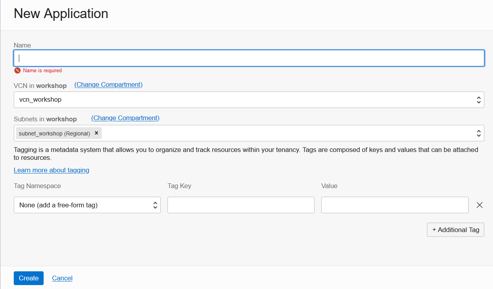

5. Clique em Criar (Create)

## Task 3: Acessando e configurando a function

Na página da aplicação criada, seguiremos o guide gerado pela propria plataforma para configurar o cloud shell.
Para acessar o guide, clique em Conceitos Básicos (Getting Started) no canto inferior esquerdo.

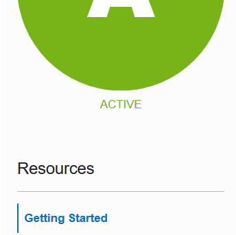

Selecione a opção de Configuração do Cloud Shell (Cloud Shell Setup).
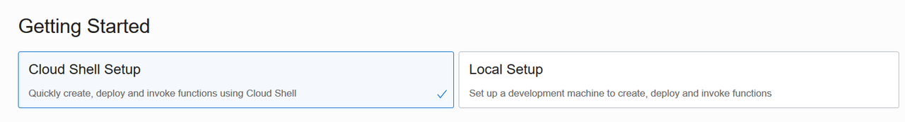

Execute os passos 1,2 e 3 do guide sem nenhuma alteração:
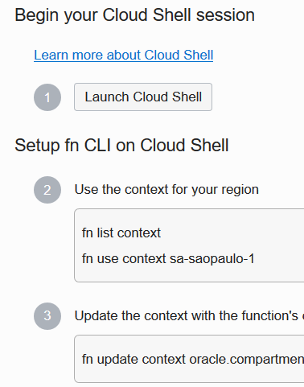

Execute o passo 4 substituindo [OCIR-REPO] por 'workshop' conforme exemplo abaixo:
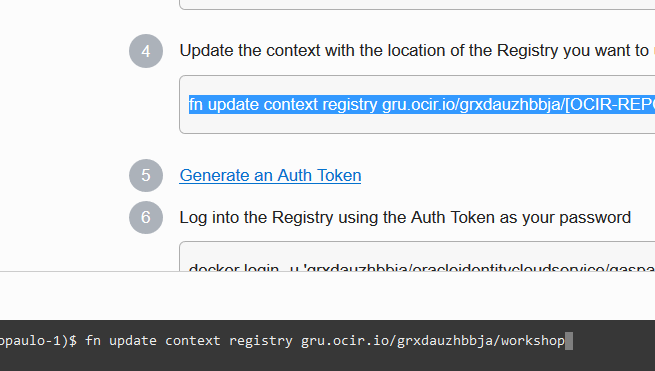

Pularemos o passo 5 visto que já geramos o Auth token anteriormente.

Execute o passo 6, e ao ser solicitada a informação de password, insira a informação de Auth Token gerada no passo 3 deste laboratório.
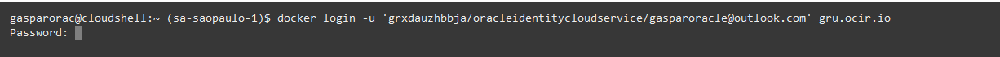

Execute o passo 7 para validar se a configuração foi realizada com sucesso.
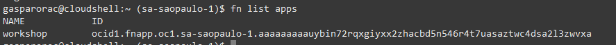

Realizando o Deploy da Função
Ainda utilizando o Cloud Shell, clone o repositório da função que vamos utilizar nesse workshop:

$ git clone https://github.com/gustavogaspar/events-function.git

Entre na pasta do projeto
$ cd events-function

Execute o comando de deploy, substituindo a informação de [APP-NAME] pelo nome da sua aplicação criada no passo 11 deste laboratório. (Você pode utilizar o comando apresentado no passo 10 da guia de Conceitos Basicos (Getting Started). Esse processo pode levar bastante tempo
$ fn -v deploy --app [APP-NAME]

Execute o comando abaixo, para chamar a função e validar se ela foi criada corretamente:
$ fn invoke [APP-NAME] final-workshop

O Retorno esperado é: {"message":"No event"}

## Task 4: Criando Regra de Eventos

Criando regra de evento
  1. Acesse o menu no canto superior esquerdo, em Observability & Management, clique em Serviço Events (Events Service).
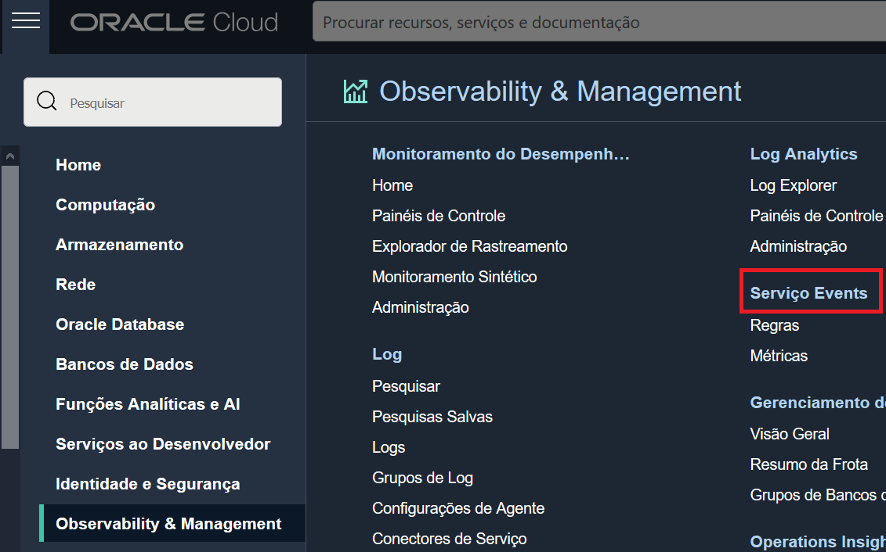

 2. No canto esquerdo inferior verifique se o compartimento que você esta utilizando para esse laboratório esta selecionado.

3. Clique em Criar Regra (Create Rule)
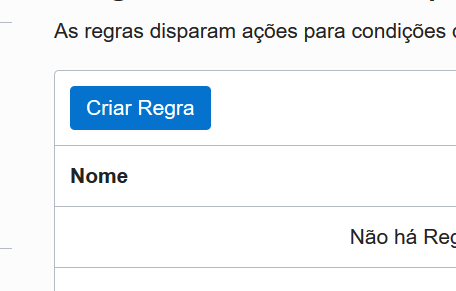

Preencha o formulário de regra da seguinte forma:
Nome para Exibição: < Defina um nome para regra >
Descrição: < Defina uma descrição para a regra >
Condições da Regra:
Condição: "Tipo de Evento"
Nome do Serviço: "Object Storage"
Tipo de Evento: "Object Create"

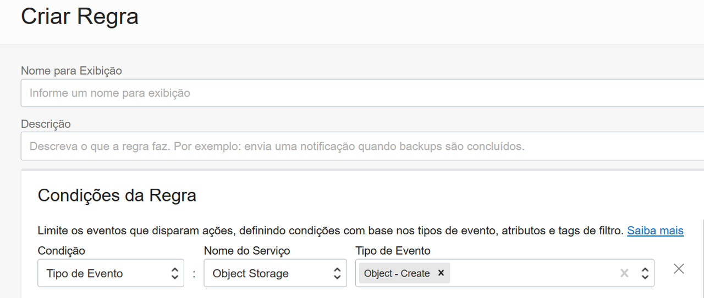

Ações:
Tipo de Ação: "Funções"
Compartimento da Função: < Selecione o compartimento da função criada no lab anterior>
Aplicativo de Função: < Selecione o aplicativo de função criado no lab anterior >
Função: "final-workshop"

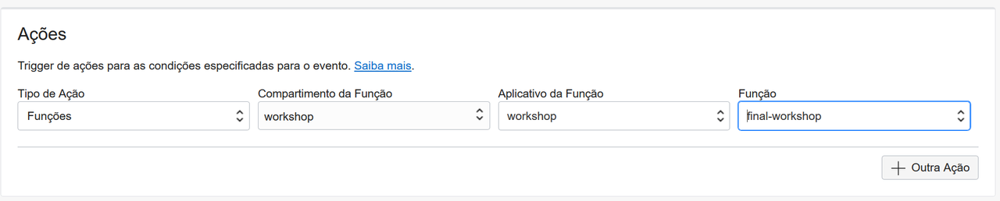

4. Clique em Criar (Create)

## Task 5: Testando o funcionamento do fluxo
Agora que temos o fluxo criado, podemos testar sua funcionalidade, para isso abriremos uma nova aba no navegador, onde acessaremos a nossa stream, e na nossa aba principal iremos fazer o teste de criação de um arquivo .txt em nosso bucket.

1. Nova Aba
2. Acesse a console da cloud: https://www.oracle.com/cloud/sign-in.html
3. Insira o nome da sua tenancy no campo de Cloud Account Name
4. Clique no botão Continue para ir para a página de login.
5. Insira seu usuario/senha e clique em Sing In (Se o seu navegador já possui uma sessão ativa, esse passo provavelmente não será necessário)
6. No menu no canto esquerdo superior, em Funções Analíticas e AI (Analytics & AI), selecione Mensagens (Messaging)

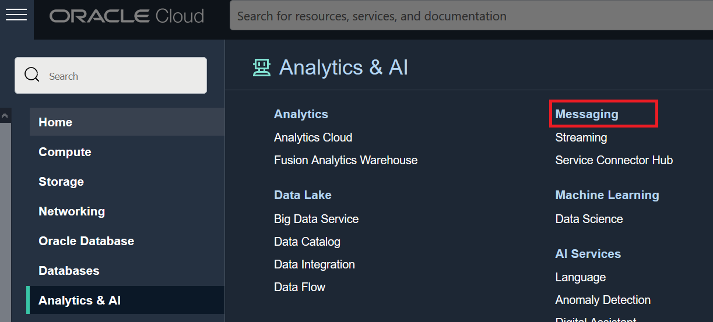

7. No canto esquerdo inferior verifique se o compartimento que você esta utilizando para esse laboratório esta selecionado

8. Você observará que um fluxo (stream) já estará criado neste compartimento com o nome de "workshop" . Este fluxo foi criado durante o primeiro laboratório, onde executamos o código de terraform através do resource manager.
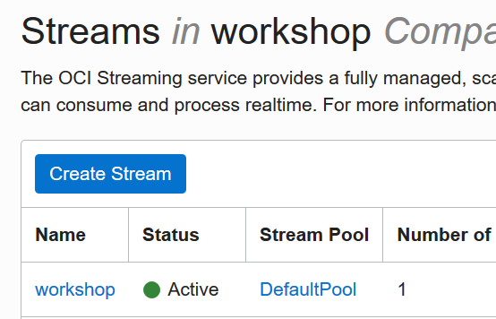

9. Selecione o fluxo "workshop"
Mantenha a aba aberta, e volte para a aba principal do seu navegador

10. Aba Principal
No menu no canto esquerdo superior, em Armazenamento (Storage), acesse Buckets
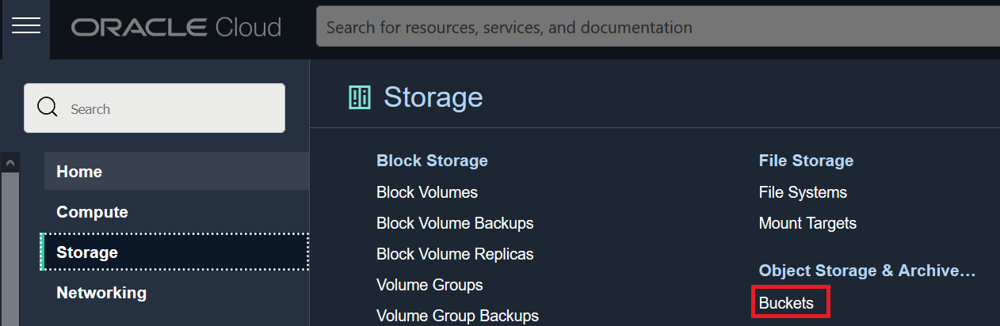

11. No canto esquerdo inferior verifique se o compartimento que você esta utilizando para esse laboratório esta selecionado.

12. Você observará que um Bucket já estará criado neste compartimento com o nome de "workshop_bucket".
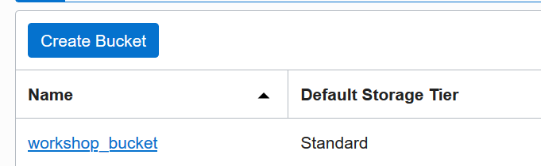

13. Selecione o bucket "workshop_bucket".
A emissão de eventos a partir de um bucket é opcional, podendo ser habilitada ou desabilitada a qualquer momento.Valide se a emissão de eventos (Emit Object Events) está habilitada para este bucket.
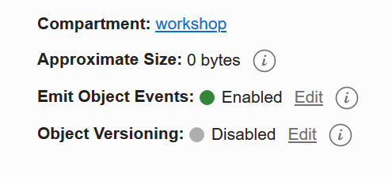

14. Estamos prontos para realizar o teste, mantenha a aba principal aberta.

## Task 6: Teste
1. Crie um arquivo de formato .txt em seu computador local, com o conteúdo de sua preferência. (O formato .txt utf-8 não é obrigatório, porém todos os testes realizados nesse workshop foram considerando esse formato)

2. Na sua aba principal ( Onde temos a página do Bucket "workshop_bucket" aberta ) clique em Upload.

3. No formulário de upload de objetos, clique em selecionar arquivos (select files)
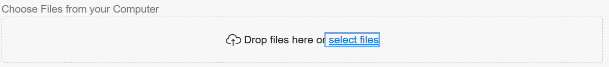

4. Selecione o arquivo .txt criado para este teste
Clique em Upload
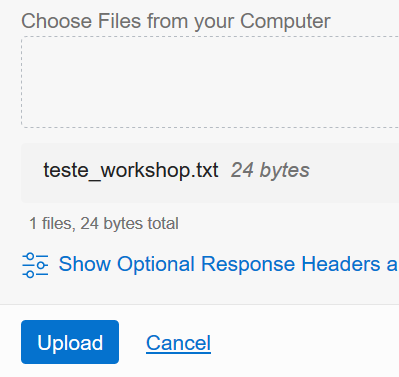

5. Aguarde o upload do arquivo, e clique em Fechar(Close)
Na nova aba ( Onde temos a página do fluxo "workshop" aberta) clique em Carregar Mensagens(Load Messages).
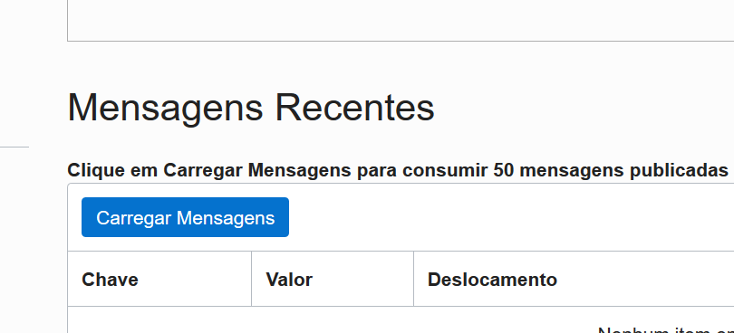

Não se preocupe caso nenhum item tenha sido encontrado, este processo pode levar algum tempo visto que é a primeira execução da função. Aguarde alguns segundos e tente carregar as mensagens novamente se for necessário.
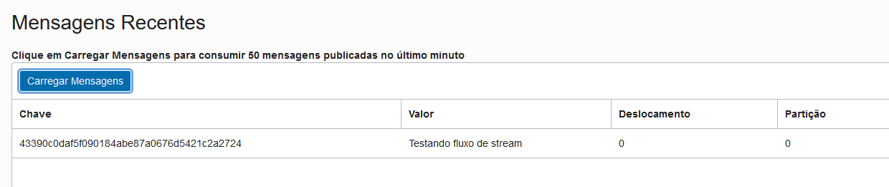

## Conclusão

### Parabéns!!!👏🏻 Nesta sessão você aprendeu a criar uma aplicação baseada em eventos que coleta informações e envia á uma fila de ingestão de dados! Você terminou esse laboratório pode seguir para o próximo Lab.

## Autoria

- **Autores** - Andressa Siqueira, Debora Silva, Thais Henrique
- **Último Update Por/Date** - Andressa Siqueira Agosto/2023
