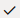

Introduction
------------

This 45-minute tutorial shows you how to integrate generative AI into your skill by connecting it to a large language model, or LLM. An LLM is an AI system that has been trained on vast amounts of text data. These models can be trained on various domains to perform a variety of tasks, including audience-specific text summarization and sentiment analysis of chat histories.

By integrating your skill with an LLM, you enable it to not only field a range of user input, but also to respond with context-appropriate answers in a human-like tone. To help the LLM predict the most likely words or phrases for its responses, you send it the appropriate context and instructions in a block of text known as a prompt. In response, the LLM generates a completion, a sequence of words or phrases that it believes are the most probable continuation of the prompt.

### Scenario

For this tutorial, the LLM that you're going to integrate a skill with is the `cohere.command` model that's accessed through [Oracle Cloud Infrastructure (OCI) Generative AI](https://docs.oracle.com/en-us/iaas/Content/generative-ai/overview.htm). The skill will use this model to generate \[\[ \]\].

### Objectives

*   Create a service that provides access to the `cohere.command` model via Generative AI to your Oracle Digital Assistant instance.
*   Create an event handler that transforms the REST payloads to and from the format used by Oracle Digital Assistant.
*   Add a state to the dialog flow that connects users to the Generative AI service.
*   Add the prompt that describes the email to the model.
*   Test the prompt.

Task 1: Explore the Sample Skill 
--------------------------------

First, you'll need to create your own working copy of the skill:

1.  With the Oracle Digital Assistant UI open in your browser, click  to open the side menu.
2.  Click **Development** and then select **Skills**.
4.  Click  again to collapse the side menu.
5.  Within the tile for \[\[\]\], click the Options menu icon .
6.  Select **Clone**.
7.  In the Display Name field, enter <YourInitials>\[\[ \]\].
8.  Select **Open cloned skill afterwards**. Then click **Clone**.

### Review the Artifacts

If it's not already open, you can open your skill by clicking the tile. Then take a look at the following artifacts:

*   Intents  -- The \[\[ \]\] intent.
*   Entities  -- The \[\[ \]\] composite bag that contains \[\[ \]\].
*   Flows  -- The starter flow, \[\[ \]\], which is mapped to the \[\[ \]\] intent. This flow has two states: \[\[ \]\], which resolves the \[\[ \]\] composite bag entity, and the \[\[ \]\] state, which returns the payloads from the \[\[ \]\] REST service. The flow also has the following flow-scoped variables:
    
    Variable Name
    
    Value
    
    Variable
    
    Value
    
    Variable
    
    Value
    
    Variable
    
    Value
    
    Note:
    
    Check the status of the **Train** button to make sure that training has started.
    

Task 2: Connect the Skill to the Generative AI `cohere.command` Model
---------------------------------------------------------------------

We're now going to enable the skill to access the Generative AI `cohere.command` LLM service by creating a custom component with an event handler that transforms the REST payloads into formats that are accepted by both Cohere's provider and Oracle Digital Assistant.

Complete the following steps:

1.  Click **Components**  in the left navbar.
3.  Click **Add Service**.
4.  In the Create Service dialog:
    *   Name the service `GenAI`.
    *   Accept the default setting, **Embedded Container**.
    *   Select **New Component**.
    *   Enter `GenAI` as the component name
    *   Select **LLM Transformation** from the Component Type drop down list.
    *   Select **Cohere** (located under **Oracle Generative AI** > **Generate Text**).
    
5.  Click **Create**.

[Description of the illustration](files/create-vcn-dialog.txt)

  
The Edit Component page opens after the service has been deployed, displaying the template generated for the Cohere Command model as accessed through Generative AI.

[Description of the illustration](files/handler_template.txt)

  
Its transformation handlers call the following methods that map the model-specific payload format to the interface used by Oracle Digital Assistant, which is known as Common LLM Interface (CLMI).

*   `transformRequestPayload`
*   `transformResponsePayload`
*   `transformErrorResponsePayload`

Because you selected the Generative AI Cohere template for text generation, these handlers already include the `cohere.command`\-specific transformation code. No editing is required. If your skill calls a non-Cohere model, then you'll need to manually update the handlers.

12.  Click **Close** (located at the upper right) to return to the Components page.
14.  Ensure that **Service Enabled** (the default setting) is switched on.

[Description of the illustration](files/services_page.txt)

Task 3: Define the Generative AI `cohere.command` LLM Service for the Skill
---------------------------------------------------------------------------

To enable the skill to connect users to the `cohere.command` model through the dialog flow, you need to create an LLM Service. This is a skill-level service that combines one of the the instance-wide Cohere REST services with the Cohere\_Command or GenAI transformation event handler that you created in the previous step.

1.  Click **Settings**  in the left navbar.
3.  Open the Configuration page.
5.  In the Large Language Models Services section (located near the bottom of the page), click **+New LLM Service**.

[Description of the illustration](files/large_language_models_settings_page.txt)

7.  Complete the following fields:
    *   **Name**: Enter `GenAIService`. You'll reference on of these names when you build the dialog flow in the next step.
    *   **LLM Provider**: Select the name of the LLM service.
    *   **Transformation Handler**: Select `GenAI`.
    *   Leave the remaining properties in their default settings. Note that **Default** is switched on.
        
        Important:
        
        Be sure that **Mock** is switched off (`false`).
        
8.  Click the **Save** icon (located at the right in the Action column).  
    

[Description of the illustration](files/llm_service_completed.txt)

Task 4: Integrate the Generative AI `cohere.command` Model with the Skill
-------------------------------------------------------------------------

Now that the skill is connected to the LLM service, you're now going to connect your skill's users to the model by creating a dialog flow component that can call the model and tell it what to do. The component conveys these instructions using a prompt, which is a block of human-readable text.

1.  Click **Flows**  in the left navbar.
3.  Select the **\[\[ \]\]** flow.
5.  In the \[\[ \]\] state, click  and then select **Add State** from the menu.
7.  Select **Service Integration**.

[Description of the illustration](files/add_state_dialog_service_integration.txt)

9.  Select **Invoke Large Language Model**.
10.  Enter \[\[ \]\] in the Name field. Then click **Insert**.

[Description of the illustration](files/add_state_dialog_invoke_large_language_model.txt)

The the dialog flow now includes the \[\[ \]\] and the \[\[ \]\] states.

[Description of the illustration](files/invokeLLM_state_in_flow.txt)

13.  Click the \[\[ \]\] state.
14.  In the Component tab, select `GenAIService` for the LLM Service field.  
    
    
    
    [Description of the illustration](files/llm_component_select_service.txt)
    
    Note:
    
    Select **Default** if you've created a single LLM Service (CohereService or GenAIService).
    

### Add the Prompt and Prompt Parameters

In this step, you're going to add the prompt that describes the type of email expected from the model.

1.  Click **Build Prompt** to open the Prompt Builder, a tool that enables you to iterate, or engineer, your prompt.

[Description of the illustration](files/.txt)

3.  Paste the [prompt text](files/prompt_text.txt) into the Prompt field. Then click **Save Settings** (located at the bottom right).

[Description of the illustration](files/.txt)

5.  The prompt text references the the variable values that are passed in for the \[\[ \]\], \[\[ \]\], \[\[ \]\], and \[\[ \]\] parameters. For example:
    
    Example text here.
    
    For the LLM to incorporate these parameters, they need values. Because these values are missing, the editor notes errors. You will add these values in the next step.

[Description of the illustration](files/undefined_parameters..txt)

To provide the LLM with the parameter values it needs to generate the email, you need to provide FreeMarker expressions for each parameter. Because the parameters provide the LLM with values from various sources (composite bag entity items and the OpportunityDetails REST service), the FreeMarker syntax will vary. To add these parameters:

*   Click **Add**  next to Prompt Parameters.
*   Enter the parameter name in the Name field.
*   Enter the static value or FreeMarker iterator expression in the Value field.
*   Click **Save** .  
    
    
    
    [Description of the illustration](files/add_prompt_parameters.txt)
    
    Add the following parameters and expressions.
    
    Parameter
    
    FreeMarker Expression
    
    Variable Value Source
    
    `Name`
    
    ${cb.value.listItem.value}
    
    Entity Name
    
    `Name`
    
    ${cb.value.string\_nonEntityListItem}
    
    Entity Name
    
    `Name`
    
    ${variable\_name}
    
    Flow Variable Name
    
    `Name`
    
    ${variable\_name}
    
    Flow Variable Name
    
    The error messages will disappear as you define the parameters. When you're finished, all of the error messages should be gone.

8.  Click  to expand the **User Messaging** section of the Component tab.

[Description of the illustration](files/user_messaging.txt)

10.  Set **Use Streaming** is set to **False** so that the message is delivered in its entirety, not incrementally. We recommend that you disable streaming for Cohere models.
12.  For the **Standard Actions**, remove all of the actions except for **Undo**.

[Description of the illustration](files/.txt)

Task 5: Test the Prompt with the Prompt Builder
-----------------------------------------------

Before we test the prompt that you added in the previous step, let's take a quick look at it.

This prompt reflects good prompt design because:

*   It assigns a persona to the LLM that is use case-specific:
    
    Example.
    
*   It provides brief and concise instructions:
    
    Example
    
*   It defines clear acceptance criteria:
    
    \- Example
    - Example
    - Example
    
    ...		 
    
    Writing prompts is an iterative process. In fact, continually refining your prompt is a best practice. It may take several revisions before a prompt returns the results that you expect. To help you through this revision cycle, you can use the Prompt Builder to incrementally test and modify your prompt until it functions properly.
    
    
    
    [Description of the illustration](files/test_prompt_llm_prompt_tester.txt)
    

To test the prompt, you need to add mock values for the referenced parameters. The tone and content of the model's output is based on these values. You can have the model generate random values by clicking **Generate Mock Values**, but to control the output, you need to add your own. To add these values:

1.  In the Component tab, scroll back to the top and click **Build Prompt** to open the Prompt Builder.
3.  Click **Edit** .
4.  Enter value for the parameter in the Mock Value field. When you're done, click **Apply** .  
    
    
    
    [Description of the illustration](files/enter_mock_values.txt)
    
    Here are the example values:
    
    Parameter
    
    Mock Value
    
    `Name`
    
    Value
    
    `Name`
    
    Value
    
    `Name`
    
    Value
    
    `Name`
    
    Value
    
5.  After you've completed the mock values, click **Generate Output**.
7.  Verify that the LLM output in the LLM Output field is an email that both adheres to the prompt guidelines and incorporates the parameter values. For example, the output may be like this:  
    `Example`

[Description of the illustration](files/prompt_builder_llm_output.txt)

9.  Optional step -- Here are a couple of things for you to experiment with before you click **Close**  to return to the Component tab:
    *   Step:
        
        \- Text
        
        with
        
        \- Text
        
        Then click **Generate Output**. Your results may differ, but here's an example:  
        `Example`
    *   Allow the model to generate more creative responses by changing the **Temperature** from 0 (straightforward responses) to 1 (more randomized responses).  
          
        Click **Generate Output**. Here's an example (your results may again differ):  
        `Example`
10.  Click **Close** . Do not click **Save Settings** as this will overwrite the original prompt text.

Task 6: Test the Prompt with the Skill Tester
---------------------------------------------

Now that you've verified that the LLM can receive the skill's input, you're ready to interact with it in the Skill Tester.

1.  Open the Skill Tester by clicking **Preview** (located at the upper right).
  
4.  Enter the following request:
    
    Example
    
    The output may look something like this.

[Description of the illustration](files/conversation.txt)

6.  In the Conversation pane, notice that the conversation remains in the \[\[ \]\] state.  
    
    
    
    [Description of the illustration](files/conversation_dialog_flow_multi_turn.txt)
    
7.  To get a look at the outcome the \[\[ \]\] state processing, open the **LLM Interaction** tab.
  
This view renders when the dialog flow lands on an LLM component state like \[\[ \]\]. From it, you can compare the outcome of the state's processing at each turn of the conversation with the result that's sent to skill users. You can also can review the prompt populated with variable values. In our case, we want to find out which values were sent for the `[[ ]]`, `[[ ]]`, and `[[ ]]` variables. To access the prompt in this form, hover over the text in the Initial Prompt/Refinement column, right-click, then choose **Show Full Text**.  

[Description of the illustration](files/tester_show_full_text.txt)

By scrolling along the Prompt window, note, for example, that `[[${}]]` and `[[${}]]` in the original prompt text have been replaced \[\[ \]\].  
21.  Click **Close**  to exit the Prompt window.
22.  To compare the model's processing to the result that's output by the skill, hover over the text in the Outcome field, right-click, then select **Show Full Text**.  
      
    Because the model processed an error-free and valid response, the contents in the Outcome field match those in the Result field. The two may not always match, as you'll find out in [Task 6: Extra Credit - Validate the LLM Output](#task_six).
  
25.  Click **Close**  to exit the Outcome window.
26.  Try refining the output by entering the following:
    
    Example
    
    The LLM should incorporate this feedback into its response. For example, it might include something like the following:  
    `Example`

28.  This new iteration of the message now includes the **Undo** button. Click it to revert to the previous response. Note that the conversation remains in the \[\[ \]\] state.
29.  Click **Reset**, then close the Skill Tester.

Task 7: Extra Credit: Validate the LLM Output
---------------------------------------------

In this step, you're going to use the declarative validation functions of the InvokeLLM component to test the LLM output for the presence (or absence) of one of the values defined for the CustomerRequirement such as competitive pricing, customizable design, etc.

1.  Open the \[\[ \]\] state and select the Component tab.
2.  Expand **User Messaging** again. Note the **Use Streaming** setting, which you set to **False** in [Task 6: Test the Prompt with the Skill Tester](#task_six) to accommodate the Cohere model. Despite the model, you must always disable user streaming when validating the LLM output because messages can't be validated in chunks. They can only be validated when they're complete. If you enable both user streaming and validation, users may see multiple streams of output, which may confuse them.

[Description of the illustration](files/.txt)

4.  Click  to expand **Response Validation**.

[Description of the illustration](files/response_validation.txt)

6.  In the Validation Entities field, select **\[\[ \]\]**.

[Description of the illustration](files/validation_entity_list.txt)

8.  Open the Skill Tester.
9.  Enter the following request:
    
    Example
    
    The skill will reply with an "Enhancing the response. One moment, please..." message.  
    
    
    
    [Description of the illustration](files/valid_response.txt)
    
    The message that follows it may be valid because \[\[ \]\], or it may not be valid because these values are missing. When the message is not valid, the dialog flow transitions to the showLLMError state, which outputs an error message that names the missing entity (`CustomerRequirement`, the HTTP status code returned by the call to the LLM (`200`) and the CLMI (Common LLM Interface) error code noting that output failed validation (`responseInvalid`):  
    `An unexpected error occurred while invoking the Large Language Model: {"errorMessage":"The [[ ]] is not specified in the response.","errorStatus":200,"errorCode":"responseInvalid"}`  
    
    
    
    [Description of the illustration](files/error_dialog_flow.txt)
    
      
    Here's an example of valid output:  
    `Example`
    

* * *

[Title and Copyright Information](#copyright-information)

Access OCI Generative AI from Your Skill

[Copyright ©](https://docs.oracle.com/pls/topic/lookup?ctx=en/legal&id=cpyr) 2024, Oracle and/or its affiliates.