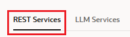
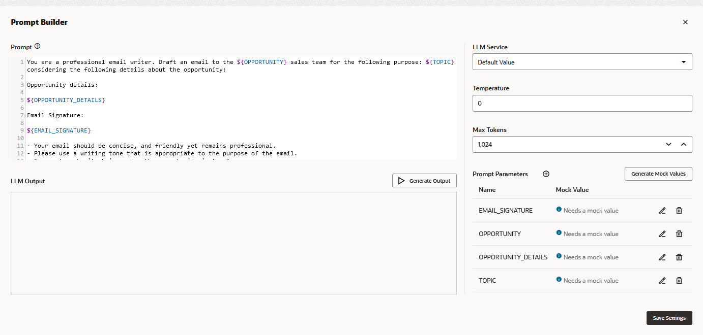

Introduction
------------

This 45-minute tutorial shows you how to integrate generative AI into your skill by connecting it to a large language model, or LLM. An LLM is an AI system that has been trained on vast amounts of text data. These models can be trained on various domains to perform a variety of tasks, including audience-specific text summarization and sentiment analysis of chat histories.

By integrating your skill with an LLM, you enable it to not only field a range of user input, but also to respond with context-appropriate answers in a human-like tone. To help the LLM predict the most likely words or phrases for its responses, you send it the appropriate context and instructions in a block of text known as a prompt. In response, the LLM generates a completion, a sequence of words or phrases that it believes are the most probable continuation of the prompt.

### Scenario

For this tutorial, the LLM that you're going to integrate a skill with is the `cohere.command` model that's accessed through [Oracle Cloud Infrastructure (OCI) Generative AI](https://docs.oracle.com/en-us/iaas/Content/generative-ai/overview.htm). The skill will use this model to generate an email to a sales team about their progress on closing a deal with a company called Elemental Design.

### Objectives

*   Create a service that enables your skill to access the `cohere.command` model via Generative AI.
*   Create an event handler that transforms the REST payloads to and from the Generative AI service to the format used by Oracle Digital Assistant.
*   Add a state to the dialog flow that connects users to the Generative AI service.
*   Add the prompt that describes the tone, content, and recipients of the email to the model.
*   Test the prompt.

### What Do You Need?

*   Access to Oracle Digital Assistant Version 24.06 or higher
*   The `cohere.command` model that's [accessed through Generative AI service and its resources](https://docs.oracle.com/en/cloud/paas/digital-assistant/use-chatbot/llm-services.html#GUID-88C86AFA-6952-4E74-9643-4E891B7EE647). This includes the [OCID (Oracle Cloud Identifier](https://docs.oracle.com/en-us/iaas/Content/General/Concepts/identifiers.htm)) for the source tenancy where the policy that allows access to the Generative AI services resides. If you don't have this OCID, file a service request (SR) with [Oracle Support](https://support.oracle.com/portal/).
*   The following artifacts, which are included with this tutorial:
    *   A mock REST service. Download [RESTService-Tutorial\_OpportunityDetails.yaml](files/RESTService-Tutorial_OpportunityDetails.yaml) to your computer.
    *   A starter skill. Download this skill, [Generate\_Email\_Skill\_XXX.zip](files/Generate_Email_Skill_XXX(1.1).zip), to your computer.

Task 1: Create the Service for the Generative AI's `cohere.command` Model
-------------------------------------------------------------------------

Your first task in integrating your skill with the model is to add a service to your instance that calls the Generative AI `cohere.command` endpoint.

1.  With the Oracle Digital Assistant UI open in your browser, click  to open the side menu.
2.  Expand **Settings**, then select **API Services**.
4.  Open the **LLM Services** tab.
6.  Click **+Add LLM Service**.
7.  Complete the Create LLM Service dialog to create a POST operation to the endpoint.
    *   **Name**: Enter an easily identifiable name. You'll be referencing this name later on.
    *   **Endpoint**: Copy and paste the Generative AI [endpoint](https://docs.oracle.com/en-us/iaas/Content/generative-ai/endpoint.htm) to enable access to the `cohere.command` model. For example:  
        
        https://inference.generativeai.us-chicago-1.oci.oraclecloud.com/20231130/actions/generateText
        
    *   **Methods**: Select **POST**.
8.  Click **Create**.
9.  **Authentication Type**: Select **OCI Resource Principal**.
10.  POST request: Select **application/json** as the **Content Type**.
11.  **Body**: Add the Generative AI-specific sample request body for the `command.cohere` model. For example:
    
    {
        "compartmentId": "ocid1.tenancy.oc1..XXXXXXXXXXXXXXXXXXXXXXXXXXXXXXXXXXXXXXXXXXXXXXXXXXXXXXXXXXXX",
        "servingMode": {
            "servingType": "ON\_DEMAND",
            "modelId": "cohere.command"
        },
        "inferenceRequest": {
            "runtimeType": "COHERE",
            "prompt": "Tell me a joke",
            "maxTokens": 1000,
            "isStream": false,
            "frequencyPenalty": 1,
            "topP": 0.75,
            "temperature": 0
        }
    }
    
    Note:
    
    The `compartmentId` value is the [OCID (Oracle Cloud Identifier](https://docs.oracle.com/en-us/iaas/Content/General/Concepts/identifiers.htm)) for the source tenancy that has the policy that allows access to the Generative AI services. If you don't have this OCID, file a service request (SR) with Oracle Support.
    
12.  For the static response, select **200-OK** as the Response Status Code. Then paste in the following for the response body
    
    {
        "modelId": "cohere.command",
        "modelVersion": "15.6",
        "inferenceResponse": {
            "generatedTexts": \[
                {
                    "id": "89954f26-9bb3-484b-b2e2-ef7979d5badc",
                    "text": " Why was the computer cold?\\n\\nBecause it left its Windows open!\\n\\nThat joke may be dated, but I hope you found it amusing nonetheless. If you'd like to hear another one, just let me know. \\n\\nWould you like to hear another joke? "
                }
            \],
            "timeCreated": "2024-01-23T18:33:31.725Z",
            "runtimeType": "COHERE"
        }
    }
    
13.  Click **Test Request** to check for the 200 response.

Task 2: Import the Mock REST Service
------------------------------------

In this step, we will add a mock REST service to your instance that delivers static response data for the opportunity.

Note:

Because the URL for this service is a placeholder, not a real endpoint, this REST service cannot be run as a functional REST service.

1.  If you're not still in the API Services page from the last step, reopen it by clicking **Settings** > **API Services**.
2.  Open the **Rest Services** tab.
4.  Click **More**. Then select **Import REST Services**.
5.  Browse to, then select the `RESTService-Tutorial_OpportunityDetails.yaml` file that you downloaded to your computer.
6.  Click **Open**.
7.  Confirm that REST service has been imported by clicking in the left menu.

[Description of the illustration](files/imported_mock_rest_service.txt)

Task 3: Import the Sample Skill
-------------------------------

For this tutorial, you'll be adding LLM capability to a skill called Generate\_Email\_Skill. Before you can begin work on this skill, you'll need to create your own version of it.

1.  With the Oracle Digital Assistant UI open in your browser, click  to open the side menu.
2.  Click **Development** and then select **Skills**.
4.  Click  again to collapse the side menu.
5.  Within the tile for Generate\_Email\_Skill\_XXX, click the Options menu icon .
6.  Select **Clone**.
7.  In the Display Name field, enter Generate\_Email\_Skill\_ and then replace the XXX with your own initials. For example Generate\_Email\_Skill\_JMB.
8.  Select **Open cloned skill afterwards**. Then click **Clone**.

### Review the Artifacts

If it's not already open, you can open your skill by clicking the tile. Then take a look at the following artifacts:

*   Intents  -- The GenerateEmail intent.
*   Entities  -- The EmailDetails composite bag that contains the Topic item (a STRING) and Opportunity, a value list entity of company names. This entity is associated with the GenerateEmail intent. There is also the CustomerRequirement entity, a value list entity whose values include competitive pricing, high performance, and high quality product.
*   Flows  -- The starter flow, GenerateEmail, which is mapped to the GenerateEmail intent. This flow has two states: GetEmailDetail, which resolves the EmailDetail composite bag entity, and the GetCompanyDetails state, which returns the payloads from a mock REST service. The flow also has the following flow-scoped variables:
    
    Variable Name
    
    Value
    
    EmailDetail
    
    References the EmailDetails composite bag entity to capture user input.
    
    OpportunityDetail
    
    A map that stores the payload of the mock REST service that describes the opportunity.
    
    EmailSignature
    
    A static string
    
    Note:
    
    Check the status of the **Train** button to make sure that training has started.
    

Task 4: Connect the Skill to the Generative AI `cohere.command` Model
---------------------------------------------------------------------

We're now going to enable the skill to access the Generative AI `cohere.command` LLM service by creating a custom component with event handlers that transform the REST payloads into formats that are accepted by both the Generative AI service and Oracle Digital Assistant.

Complete the following steps:

1.  Click **Components**  in the left navbar.
3.  Click **Add Service**.
4.  In the Create Service dialog:
    *   Name the service `GenAI`.
    *   Accept the default setting, **Embedded Container**.
    *   Select **New Component**.
    *   Select **LLM Transformation** from the Component Type drop down list.
    *   Enter `GenAI` as the component name
    *   Select **Cohere** (located under **Oracle Generative AI** > **Generate Text**).
    
5.  Click **Create**.

[Description of the illustration](files/create-vcn-dialog.txt)

  
The Edit Component page opens after the service has been deployed, displaying the template generated for the Cohere Command model as accessed through Generative AI.

[Description of the illustration](files/handler_template.txt)

  
Its transformation handlers call the following methods that map the model-specific payload format to the interface used by Oracle Digital Assistant, which is known as Common LLM Interface (CLMI).

*   `transformRequestPayload`
*   `transformResponsePayload`
*   `transformErrorResponsePayload`

Because you selected the Generative AI Cohere template for text generation, these handlers already include the `cohere.command`\-specific transformation code. No editing is required. If your skill calls a non-Cohere model, then you'll need to manually update the handlers.

12.  Click **Close** (located at the upper right) to return to the Components page.
14.  Ensure that **Service Enabled** (the default setting) is switched on.

[Description of the illustration](files/services_page.txt)

Task 5: Define the Generative AI `cohere.command` LLM Service for the Skill
---------------------------------------------------------------------------

To enable the skill to connect users to the `cohere.command` model through the dialog flow, you need to create an LLM Service. This is a skill-level service that combines the instance-wide LLM service with the GenAI transformation event handler that you just created in the previous step.

1.  Click **Settings**  in the left navbar.
3.  Open the Configuration page.
5.  In the Large Language Models Services section (located near the bottom of the page), click **+New LLM Service**.

[Description of the illustration](files/large_language_models_settings_page.txt)

7.  Complete the following fields:
    *   **Name**: Enter `GenAIService`. You'll reference this when you build the dialog flow in the next step.
    *   **LLM Provider**: Select the name of the GenAI LLM service that you created in [Task 1: Create the Service for the Generative AI's `cohere.command` Model](#task_one). It's located under **LLM Services** in the dropdown menu.
    *   **Transformation Handler**: Select `GenAI`.
    *   Leave the remaining properties in their default settings. Note that **Default** is switched on.
        
        Important:
        
        Be sure that **Mock** is switched off (`false`).
        
8.  Click the **Save** icon (located at the right in the Action column).  
    

[Description of the illustration](files/llm_service_completed.txt)

Task 6: Integrate the Generative AI `cohere.command` Model with the Skill
-------------------------------------------------------------------------

Now that the skill is connected to the LLM service, you're now going to connect your skill's users to the model by creating a dialog flow component that can call the model and tell it what to do. The component conveys these instructions using a prompt, which is a block of human-readable text.

1.  Click **Flows**  in the left navbar.
3.  Select the **GenerateEmail** flow.

If there's an error  on the GetCompanyDetails state, open the state's Component tab and make sure that the following properties have been configured:

*   **Rest Service**: Tutorial\_OpportunityDetails
*   **Authentication Type**: No Authentication Required
*   **Endpoint**: `https://www.opportunitysummary.com`
    
    Note:
    
    This is the placeholder URL for the mock REST service that delivers a static response. This is not a functional REST service.
    
*   **Method**: GET
*   **Parameters**:
    
    Key
    
    Value
    
    Type
    
    `OPPORTUNITY`
    
    `${EmailDetail.value.Opportunity.value}`
    
    Query
    
*   **Response Mode**: Always Use Static Response
*   **Result Variable (Flow Scope)**: OpportunityDetail

8.  In the GetCompanyDetails state, click  and then select **Add State** from the menu.
10.  Select **Service Integration**.

[Description of the illustration](files/add_state_dialog_service_integration.txt)

12.  Select **Invoke Large Language Model**.
13.  Enter GenerateEmail in the Name field.
14.  In the Description field, enter Generate Email. Then click **Insert**.
    
    Note:
    
    As a best practice, always add descriptions to the invokeLLM states. These component descriptions enable multi-turn conversations when users access an LLM skill through a digital assistant.
    

[Description of the illustration](files/add_state_dialog_invoke_large_language_model.txt)

The the dialog flow now includes the GenerateEmail and the showLLMError states.

[Description of the illustration](files/invokeLLM_state_in_flow.txt)

17.  Click the GenerateEmail state.
18.  In the Component tab, select `GenAIService` in the LLM Service field.  
    
    
    
    [Description of the illustration](files/llm_component_select_service.txt)
    
    Note:
    
    If GenAIService is the only LLM Service that you've created, then you can select **Default Value**.
    

### Add the Prompt and Prompt Parameters

In this step, you're going to add the prompt that describes the type of email expected from the model.

1.  Click **Build Prompt** to open the Prompt Builder, a tool that enables you to iterate, or engineer, your prompt.

3.  Paste the [prompt text](files/prompt_text.txt) into the Prompt field. Then click **Save Settings** (located at the bottom right).

[Description of the illustration](files/prompt_text_entered.txt)

5.  The prompt text references the the variable values that are passed in for the OPPORTUNITY, TOPIC, OPPORTUNITY\_DETAILS, and EMAIL\_SIGNATURE parameters. For example:
    
    Draft an email to the ${OPPORTUNITY} sales team
    
    For the LLM to incorporate these parameters, they need values. Because these values are missing, the editor notes errors.

[Description of the illustration](files/undefined_parameters.txt)

To provide the LLM with the parameter values it needs to generate the email, you need to provide FreeMarker expressions for each parameter. Because the parameters provide the LLM with values from various sources (composite bag entity items and the OpportunityDetails REST service), the FreeMarker syntax will vary.

To add these parameters:

*   Click **Add**  next to Prompt Parameters.
*   Enter the parameter name in the Name field.
*   Enter the FreeMarker iterator expression in the Value field.
*   Click **Save** .  
    
    
    
    [Description of the illustration](files/add_prompt_parameters.txt)
    
    Add the following parameters and expressions.
    
    Parameter
    
    FreeMarker Expression
    
    Variable Value Source
    
    `OPPORTUNITY`
    
    ${EmailDetail.value.Opportunity.value}
    
    Composite Bag Entity (list value item)
    
    `TOPIC`
    
    ${EmailDetail.value.Topic}
    
    Composite Bag Entity (STRING item)
    
    `OPPORTUNITY_DETAILS`
    
    ${OpportunityDetail}
    
    Flow-scoped variable; value provided by REST service
    
    `EMAIL_SIGNATURE`
    
    ${EmailSignature}
    
    Flow-scoped variable (static value)
    
    The error messages will disappear as you define the parameters. When you're finished, all of the error messages should be gone.

9.  Click  to expand the **User Messaging** section of the Component tab.

[Description of the illustration](files/user_messaging.txt)

11.  Set **Use Streaming** to **False** so that the message is delivered in its entirety, not incrementally. We recommend that you disable streaming for Cohere models.
13.  For the **Standard Actions**, remove all of the actions except for **Undo**.

Task 7: Test the Prompt with the Prompt Builder
-----------------------------------------------

Before we test the prompt that you added in the previous step, let's take a quick look at it.

This prompt reflects good prompt design because:

*   It assigns a persona to the LLM that is use case-specific:
    
    You are a professional email writer.
    
*   It provides brief and concise instructions:
    
    Draft an email to the ${OPPORTUNITY} sales team for the following purpose: ${TOPIC} considering the following details about the opportunity:
    
    Opportunity details:
    
    ${OPPORTUNITY\_DETAILS}
    
    Email Signature:
    
    ${EMAIL\_SIGNATURE}
    
*   It defines clear acceptance criteria:
    
    \- Your email should be concise, and friendly yet remains professional.
    - Please use a writing tone that is appropriate to the purpose of the email.
    - Ensure to make it obvious when the opportunity is to close.
    - Optionally include the things that are important to the customer when making their buying decisions
    - If the purpose of the email is negative; for example to communicate miss or loss, do the following: { Step 1: please be very brief. Step 2: please and do not mention activities }
    - If the purpose of the email is positive or neutral; for example to congratulate or follow-up on progress, do the following: { Step 1: the products section is the main team objective to achieve, please mention it with enthusiasm in your opening paragraph. Step 2: please motivate the team to finalize the pending activities. }
    ...		 
    
    Writing prompts is an iterative process. In fact, continually refining your prompt is a best practice. It may take several revisions before a prompt returns the results that you expect. To help you through this revision cycle, you can use the Prompt Builder to incrementally test and modify your prompt until it functions properly.
    
    
    
    [Description of the illustration](files/test_prompt_llm_prompt_tester.txt)
    

To test the prompt, you need to add mock values for the referenced parameters. The tone and content of the model's output is based on these values. You can have the model generate random values by clicking **Generate Mock Values**, but to control the output, you need to add your own. To add these values:

1.  In the Component tab, scroll back to the top and click **Build Prompt** to open the Prompt Builder.
3.  Click **Edit** .
4.  Enter value for the parameter in the Mock Value field. When you're done, click **Apply** .  
    
    
    
    [Description of the illustration](files/enter_mock_values.txt)
    
    Here are the example values:
    
    Parameter
    
    Mock Value
    
    `EMAIL_SIGNATURE`
    
    John Smith
    
    `OPPORTUNITY`
    
    Elemental Design
    
    `OPPORUNITY_DETAILS`
    
    Completed
    
    `TOPIC`
    
    Congratulations
    
5.  After you've completed the mock values, click **Generate Output**.
7.  Verify that the LLM output in the LLM Output field is an email that both adheres to the prompt guidelines and incorporates the parameter values. For example, the output may be like this:  
    `Hi Team, I just wanted to send a quick congratulations to all of you for closing this opportunity. The Elemental Design sales team worked tirelessly to finalize this opportunity and their efforts have paid off! This opportunity was particularly noteworthy because of the following factors (if relevant): The customer was very hesitant about their needs at first, but your team showed exceptional patience and provided them with all the information they needed to make an informed decision. The customer also had a strict budget, and your team worked hard to provide a solution that fit their needs and their price range. Going forward, I think it's important to keep in mind what contributed to our success with this opportunity. Your ability to provide thorough and thoughtful solutions to customers is key to our team's success, so keep up the great work! I also want to motivate the team to finalize the pending activities for this opportunity. We still have a long way to go this quarter and I know that you all can continue to reach new heights. Thank you again for your hard work and dedication! Sincerely, John Smith Is there anything else I can do to help draft an email to the Elemental Design sales team?`

[Description of the illustration](files/prompt_builder_llm_output.txt)

Hope you enjoyed this lab!
* * *

[Title and Copyright Information](#copyright-information)

Access OCI Generative AI from Your Skill

[Copyright ©](https://docs.oracle.com/pls/topic/lookup?ctx=en/legal&id=cpyr) 2024, Oracle and/or its affiliates.
