# Deploy the Web Services in OCI

### Introduction

Estimated Time: 60 minutes

### About this lab

We will start the workshop with the environment setup. For the entire workshop we will use the same deployment ( VCNs, Web Servers) and only change configuration related to the DNS Policies. Also, we will use two Oracle Cloud regions, Chicago and Franfurt, to host the Web Servers which the DNS records will point to. When you do this workshop in your tenancy you can choose any two regions in the Oracle Cloud.

### Objectives

In this lab, you will:

* Build a Virtual Cloud Network (VCN), with the needed subcomponents, in two OCI regions.
* Deploy and configure two public OCI Compute instances with a WEB server

## Task 1: Deploy a VCN (Virtual Cloud Network) 

We will start with a basic VCN deployment. Since the main goal is to have a publicly accesible web server we will not get into many details and we will use the VCN Creation Wizard which OCI provides.  

1. Log into the Oracle Cloud console and select the **Chicago** region. On the Oracle Cloud Infrastructure Console Home page, go to the Burger menu (on top left), select Networking and click on **Virtual cloud networks**. Press **Start VCN Wizard**.
  

2. In the menu that opens leave option 1 selected and press **Start VCN Wizard**.
  

3. In the next menu, give the VCN a name, leave everything else as it is and press **Next**. In the new menu, simply press **Create** and wait for the VCN to be created. After it is done, press **View VCN**.
  

  

## Task 2: VCN Route table and Subnet Security List

  Now that we have a VCN and a Subnet, we need to add a VCN Route Table and a Security List to that subnet. While the default ones, deployed automatically by OCI, can be used, it is recommended to have dedicated ones.

1. On the VCN Details page, on the left menu, click **Route Tables** and then click on **Create Route Table**.
  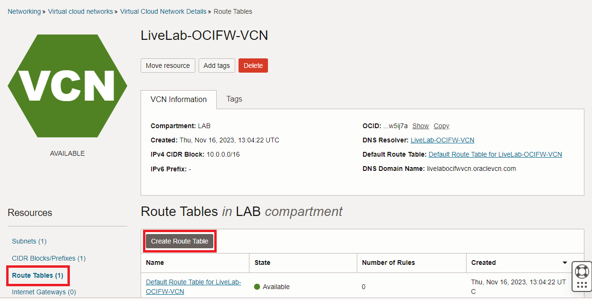

   In the menu that opens, give this route table a name and press **Create**. No routes are needed at this step of the lab.
  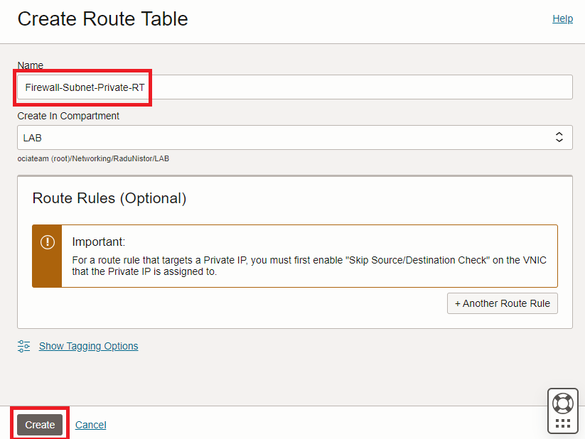

2. On the VCN Details page, on the left menu, click **Subnets** and then click on the Firewall subnet created earlier.
  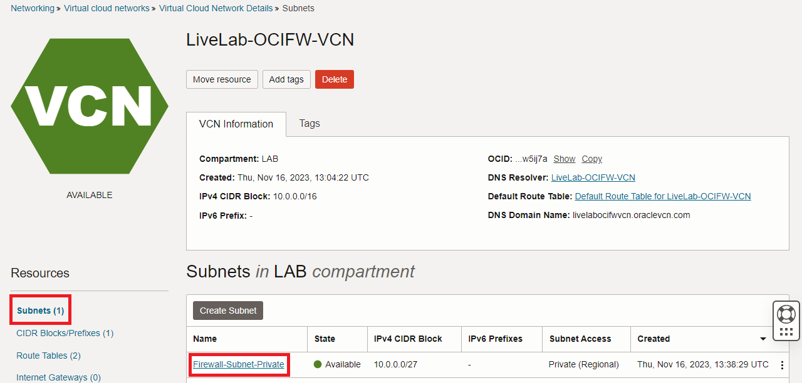

   In the menu that opens (subnet details), click **Edit**. In the new menu, replace the default Route Table with the one previously created and save the changes.
  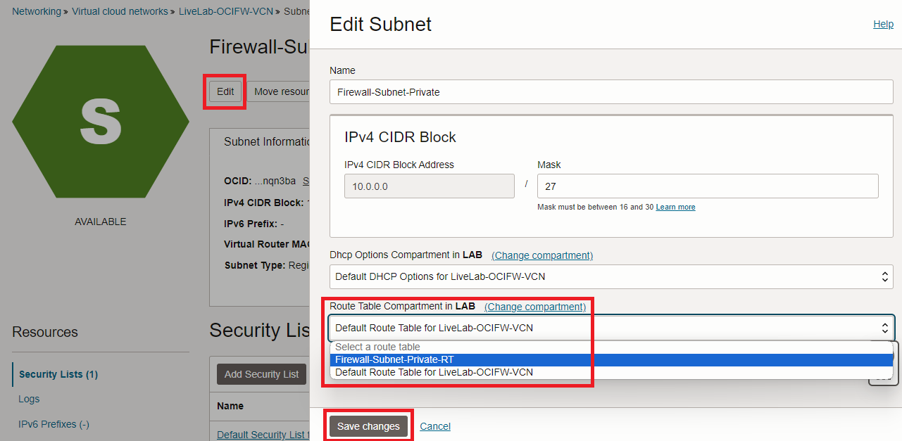

3. On the VCN Details page, on the left menu, click **Security Lists** and then click on **Create Security List**.
  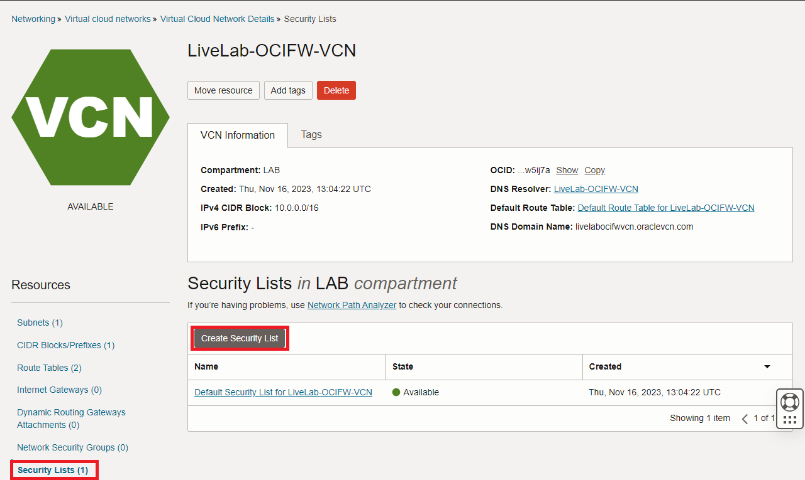

   In the menu that opens, give it a name and press **+Another Ingress Rule** and **+Another Egress Rule**.
  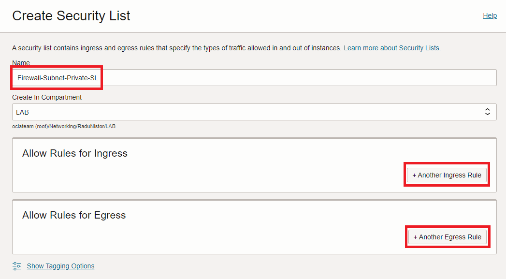

   In the rule menus that open, create an entry that allows **0.0.0.0/0** on Ingress and Egress, respectively. 
  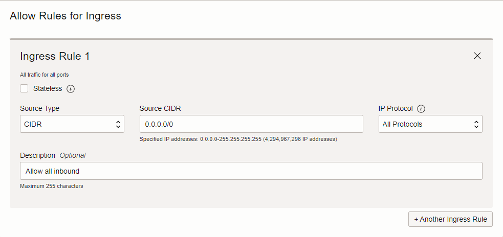
  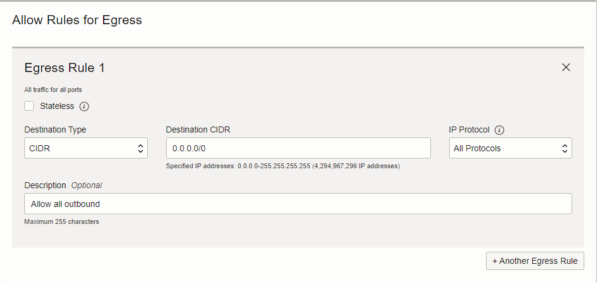
  
  Press **Create Security List**. 

4. On the VCN Details page, on the left menu, click **Subnets** and then click on the Firewall subnet created earlier.
  

   In the menu that opens (subnet details), click **Add Security List** and add the new one we created.
  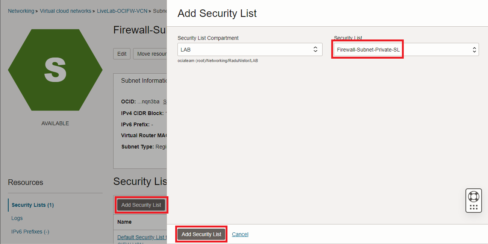

   Next, remove the Default Security List by clicking on the 3 **dots** at the end of the row, and clicking **Remove**.
  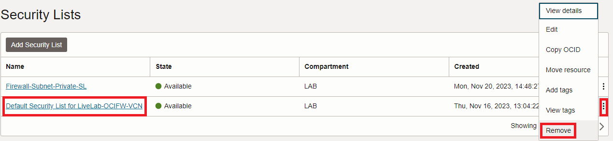

## Task 3: Deploy an OCI Network Firewall

  Now that we prepared the VCN and the Subnet, it is time to focus on the OCI Network Firewall. To deploy a Firewall we need to give it a policy. We will start by deploying an empty Firewall Policy and then use it to deploy an OCI Network Firewall.

1. On the Oracle Cloud Infrastructure Console Home page, go to the Burger menu (on top left), select **Identity and Security** and click on **Network firewall policies**.
  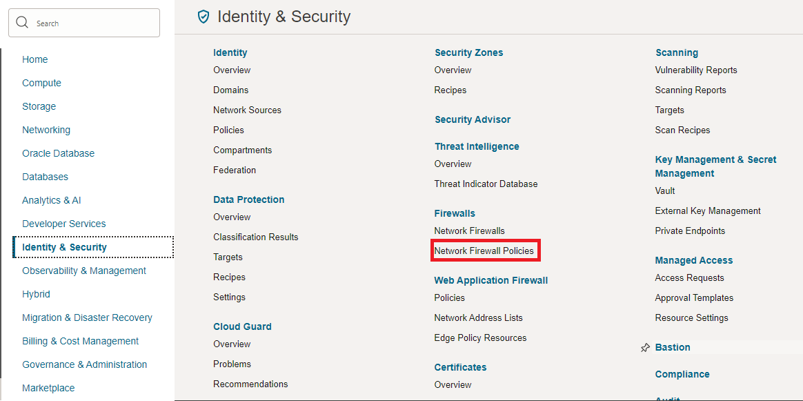

   In the menu that opens, click **Create network firewall policy**. In the next menu, give it a name and press Create...
  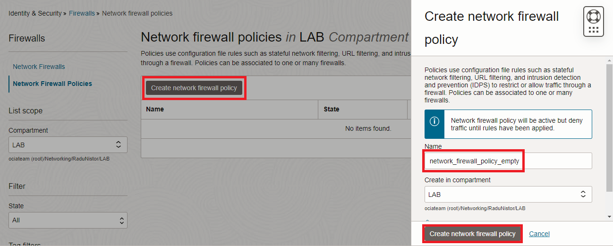

   The Firewall policy that gets created will be empty of any configuration but we can use it to deploy a Network Firewall.

2. On the Oracle Cloud Infrastructure Console Home page, go to the Burger menu (on top left), select **Identity and Security** and click on **Network firewalls**. In the menu that opens, click **Create Network firewall**.
  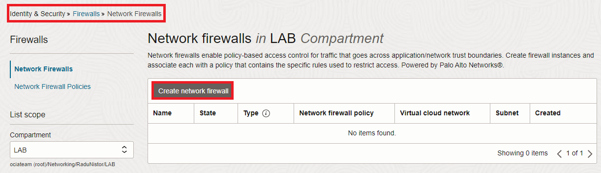

   In the menu that opens, give the firewall a name, select the empty policy we previously created and select the correct VCN and subnet, created earlier in this lab. Then press Create.
  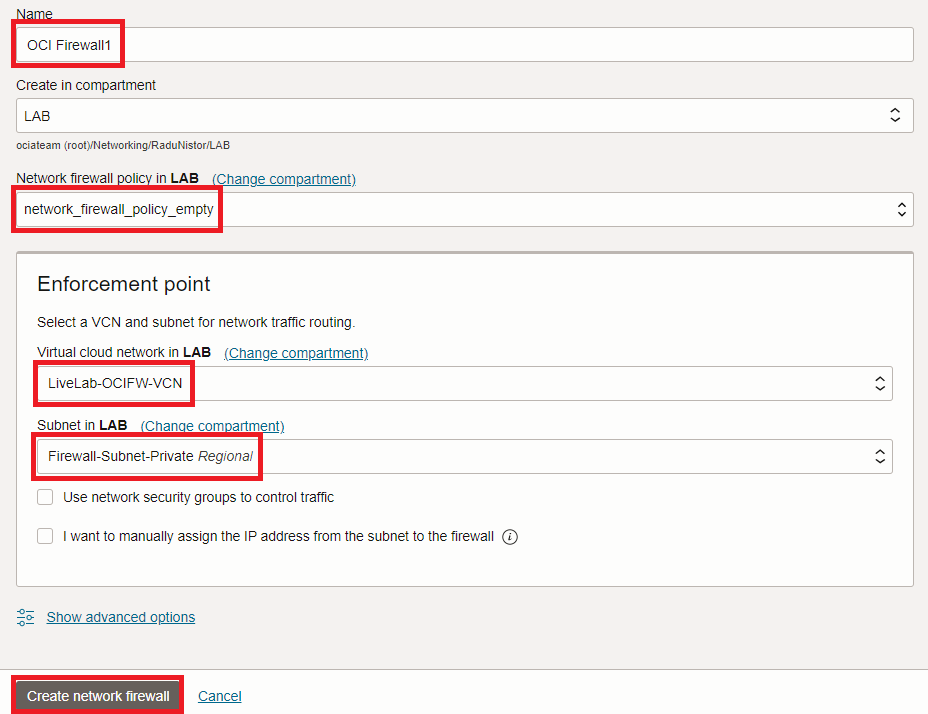

   Wait for the Firewall to become **ACTIVE** before moving on to the next step.

  Note: OCI Network Firewall creation can take up to 30 minutes. Consider taking a break!

3. Once the firewall is **ACTIVE**, click on the left hand menu on **Logs** and enable both Traffic and Threat Logs by using the toggle.
  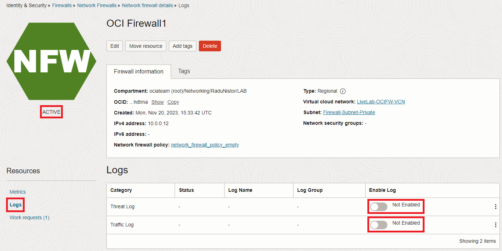

**Congratulations!** You have successfully deployed an OCI Network Firewall and completed this lab. You may now **proceed to the next lab**.

## Acknowledgements

* **Author** - Radu Nistor, Principal Cloud Architect, OCI Networking
* **Last Updated By/Date** - Radu Nistor, November 2023
