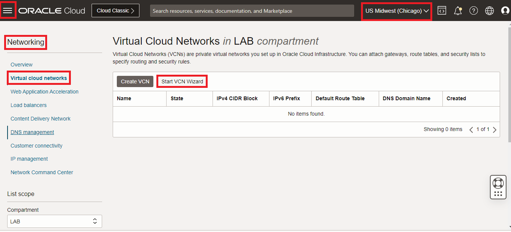
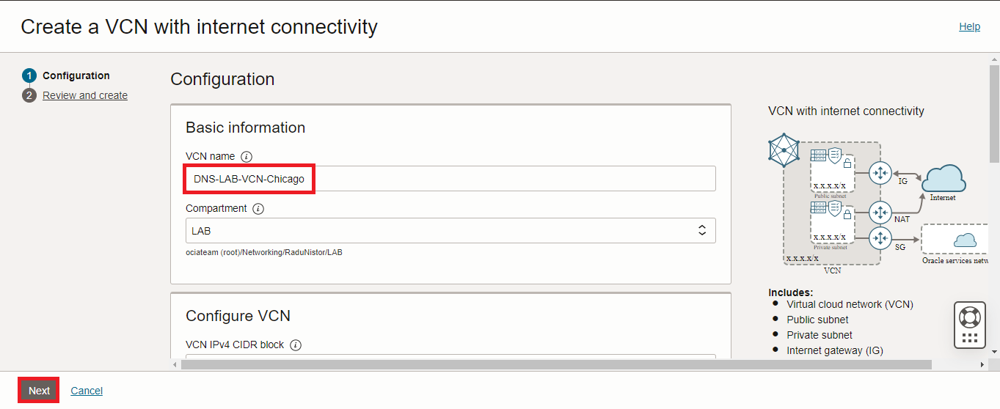
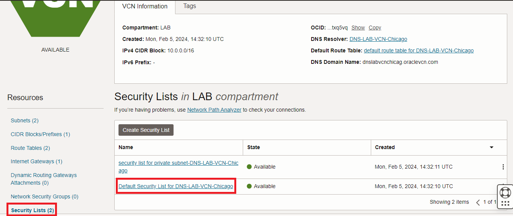
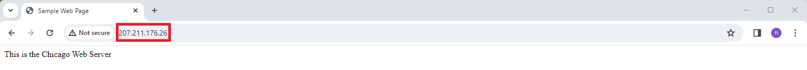

# Deploy the Web Services in OCI

### Introduction

Estimated Time: 20 minutes

### About this lab

We will start the workshop with the environment setup. For the entire workshop, we will use the same deployment (VCNs, Web Servers) and only change configuration related to the DNS Policies. Also, we will use two Oracle Cloud regions, Chicago and Frankfurt, to host the Web Servers which the DNS records will point to. When you do this workshop in your tenancy you can choose any two regions in the Oracle Cloud.

### Objectives

In this lab, you will:

* Build a Virtual Cloud Network (VCN), with the needed subcomponents, in two OCI regions.
* Deploy and configure two public OCI Compute instances with a WEB server.


## Task 1: Deploy a VCN (Virtual Cloud Network) 

We will start with a basic VCN deployment. Since the main goal is to have a publicly accessible web server we will not get into many details and we will use the VCN Creation Wizard which OCI provides.  

1. Log into the Oracle Cloud console and select the **Chicago** region. On the Oracle Cloud Infrastructure Console Home page, go to the Burger menu (on top left), select Networking and click on **Virtual cloud networks**. Press **Start VCN Wizard**.
  

2. In the menu that opens leave option 1 selected and press **Start VCN Wizard**.
  

3. In the next menu, give the VCN a name, leave everything else as it is, and press **Next**. In the new menu, simply press **Create** and wait for the VCN to be created. After it is done, press **View VCN**.
  

  

4. On the VCN Details page we can see that the VCN was deployed with subnets, gateways, route tables, and so on. The only thing we need to add is a security list entry that allows HTTP from the Internet. Go to the **Security Lists** menu on the left and click the **Default** Security List.
  

  In the menu that opens you should see there is a rule to allow SSH from Internet which we will use to connect to the compute hosts. We also need an ingress rule to allow HTTP. 
  

Note: this workshop is focused on the DNS Traffic Steering Policies product so the security configuration for the VCN is very basic as we are allowing unrestricted SSH and HTTP connections from the Internet. 

5. **REPEAT** steps 1 to 4 and deploy a VCN in the Frankfurt Region.

## Task 2: Deploy a Compute Instance with a Public IP

  Now that we have a VCN and a Public Subnet, we will deploy a Compute Instance with a public IP. We will use that public to manage it (SSH) and to serve WEB traffic.

1. On the Oracle Cloud Infrastructure Console Home page, go to the Burger menu (on top left), select Compute and click on **Instances**. In the menu that opens, click **Create Instance**
  

2. In the menu that opens, we need to input data into multiple fields. Unless specified otherwise in this tutorial, leave the fields with the **Default** input.

    * Compute Name: Chicago-Web-Server
    * Everything else until **Primary VNIC information** remains on default
    * Network details: the previously deployed VCN and the **Public** subnet should already be selected. If they are not, select them. Make sure a Public IP will be assigned.

  

  In the **Add SSH keys** menu, let OCI generate SSH Keys by downloading both the private and the public keys. Then click **Create**.

  

  Wait for the Instance to go into the **Running** state and note the **public** IP it was assigned.

  

4. **REPEAT** steps 1 and 2 and deploy a public compute instance in Frankfurt in the VCN deployed in Task 1, step 5.
  

  Before moving on, note the Public IPs of both Instances as we will need them for management and the DNS configuration. They are:
    * Chicago Web Server: 207.211.176.26
    * Frankfurt Web Server: 141.147.5.4

  **Note that the Public IPs are randomly allocated so you will get different IPs when doing this workshop in your tenancy. Throughout this workshop I will use the IPs above in various configuration pages so you need to remember to use the ones you got in your tenancy and not the ones above.**

## Task 3: Configure the web services

  To set up a basic web server we will use **Apache** following this [tutorial](https://docs.oracle.com/en/learn/apache-install/#introduction).

1. Connect to the Chicago Compute Instance Public IP with an SSH client. There are many SSH clients available, I will use [Putty](https://www.chiark.greenend.org.uk/~sgtatham/putty/). Download and open Putty. In the sessions menu input the public IP of the Compute in Chicago and in the connections menu, under SSH, select the **private** SSH key you saved when you deployed the instance. 
   

  Click **Open**, input user **opc** and you should see the Linux CLI of the Compute.

2. Input these commands in the console, one by one:

    * sudo su -
    * yum install -y httpd
    * systemctl enable --now httpd.service
    * firewall-cmd --add-service=http --permanent
    * firewall-cmd --reload
    * echo "```<html><head><title>Sample Web Page</title></head><body>This is the Chicago Web Server</body></html>```" > /var/www/html/index.html
    * systemctl restart httpd
    * systemctl status httpd

  

  If everything looks fine, we should be able to connect to the Compute with a Web Browser. Let's try *http://207.211.176.26* (don't forget to use your actual Chicago IP). 
  

  **Success!** The Chicago Compute is running an Apache web server!
 
3. **Repeat** steps 1 and 2 and deploy Apache on the Frankfurt Compute. When done, test with *http://141.147.5.4* (don't forget to use your actual Frankfurt IP). 
  

**Congratulations!** You have successfully completed this lab. You may now **proceed to the next lab**.

## Acknowledgements

* **Author** - Radu Nistor, Principal Cloud Architect, OCI Networking
* **Last Updated By/Date** - Radu Nistor, February 2024
