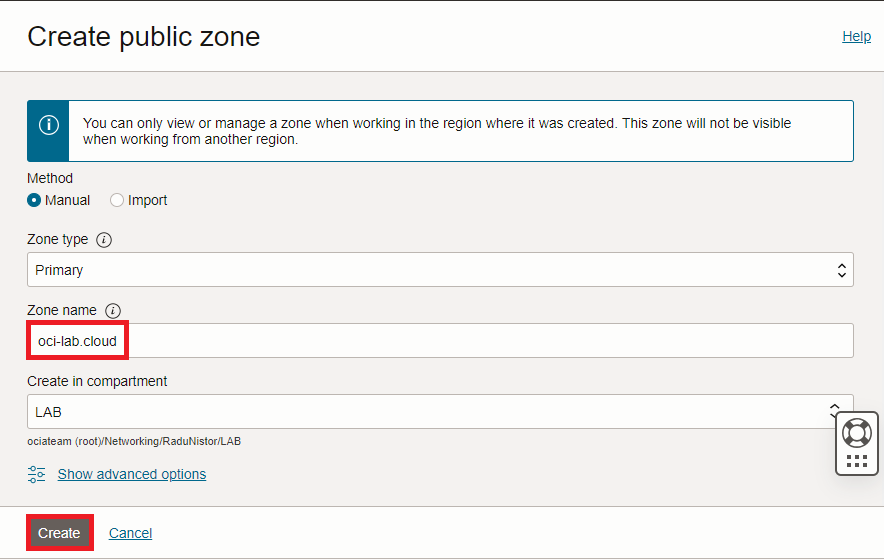
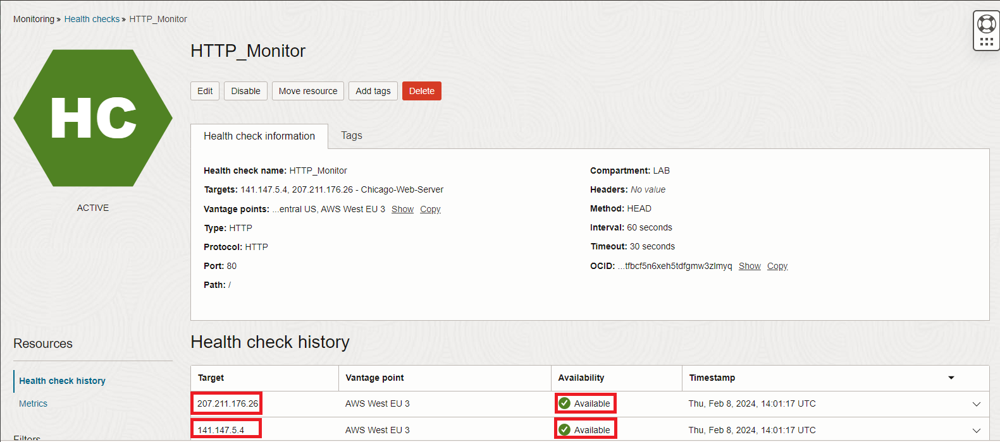

# DNS Zone and OCI Health Checks

### Introduction

Estimated Time: 15 minutes

### About this lab

OCI DNS Traffic Steering can work only on DNS Zones managed by the OCI Public DNS service. You can:
* Buy a DNS domain from a Registrar and configure the Registrar's DNS menu to point to the OCI Name Servers.
* If you already own a domain (ex: customer.com) but is managed by another DNS service you can delegate a subdomain (ex: oci.customer.com) to the OCI Name Servers. 
In this lab we will cover the steps to add a public zone/domain to OCI. Note that without an OCI managed DNS Zone you cannot use the DNS Traffic Steering Policies.

We will also add, in task 2, an OCI [Health Check](https://docs.oracle.com/en-us/iaas/Content/HealthChecks/Concepts/healthchecks.htm) Monitor. The OCI Traffic Steering service uses this monitoring service to decide, based on the policy, what to respond to the DNS query.

### Objectives

In this lab, you will:

* Onboard a Public DNS Zone in OCI.
* Create an OCI Health Check instance to monitor the web servers deployed in the previous lab.

## Task 1: Onboard a public DNS Zone into OCI

1. Log into the Oracle Cloud console. On the Oracle Cloud Infrastructure Console Home page, go to the Burger menu (on top left), select Networking and click on **Zones**, under **DNS Management**. Press **Create zone**. 
  

  Make sure **Primary** is selected and input the DNS Zone/domain you bought at a registrar or a subdomain which you intend to delegate to OCI. For this workshop I will use the zone **oci-lab.cloud**.
  

2. In zone's details page you will see the Name Servers OCI allocated to your zone. There should be four of them.
  

3. Go to your registrar's management console and point the domain you own to the OCI Name Servers. This step varies from registrar to registrar as each have their own management console. Here is how it looks on the registrar I use.
  

  Note that this change can take up to two days to propagate.
   
## Task 2: Create a Health Check HTTP Monitor

The last piece oh environment setup is the Heatlh Check. You should create it in one of the two regions you selected for your lab. I will create it in Chicago.

1. On the Oracle Cloud Infrastructure Console Home page, go to the Burger menu (on top left), select Observability & Management and click on **Health Checks**, under **Monitoring**. Press **Create health check**.
  

2. In the new menu, enter the following:

    * Name: any name, I will name it HTTP_Monitor.
    * Compartment: I will use my LAB Compartment.
    * Targets: enter the Public IPs of the two Web servers, Chicago and Frankfurt.
    * Vantage points: these are remote systems owned by Oracle which will be used to source the health checks. I typicaly choose 3 (you can have more), somewhat close to the OCI regions where I deployed the web servers.
    * Request type: it is mandatory that we use an HTTP type monitor. 
    * Protocol and port: in normal, production, environments this would be HTTPS with port 443 but, for this workshop, I have not enabled HTTPS on the Webservers so I will go with HTTP and port 80. 
    * Target path and headers: these are used to customise your health check to match your deployed application. For this Workshop, I will leave them on the default settings. 
    * Method: you can choose between **HEAD** and **GET**. I typically use the HEAD method.
    * Timeout and interval: these you can customise as you wish; more aggresive health checks will consume more resources on your web servers but will notice an issue much faster.

  

  

  Press Create and wait a few minutes for the monitor to gather data. Make sure the monitor reports both web servers as healthy before moving on. 
  

**Congratulations!** You have completed this lab. You may now **proceed to the next lab**.

## Acknowledgements

* **Author** - Radu Nistor, Principal Cloud Architect, OCI Networking
* **Last Updated By/Date** - Radu Nistor, February 2024
