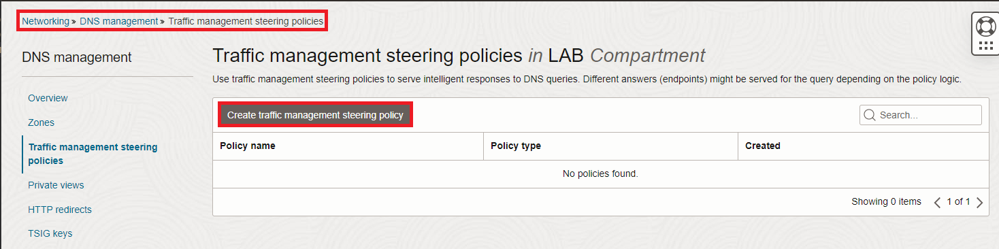
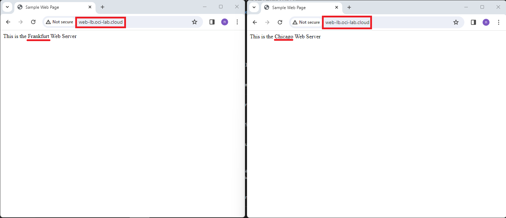

# Deploy a load balancer steering policy

### Introduction

Estimated Time: 15 minutes

### About the load balancer steering policy

The load balancer steering policy will direct users to all eligible sites on a round-robin method. If any of the configured targets stop responding to the health check created in lab 2, OCI will remove it from the eligible targets list.

### Objectives

In this lab, you will:

* Deploy a load balancer DNS policy
* Test the load balancer DNS policy

## Task 1: Deploy a load balancer steering policy

1. Log into the Oracle Cloud console. On the Oracle Cloud Infrastructure Console Home page, go to the Burger menu (on top left), select Networking and click on **Traffic management steering policies**, under **DNS Management**. Press **Create Traffic management steering policy**. 
  
 
2. In the policy creation menu we need to input various information.

    * Type is: Load balancer
    * Give it a name
    * Policy TTL: you can choose any value you like; with a high TTL value there will be less DNS traffic but more time to failover in case a server has issues.
    * Maximum answer count: we will go with one answer
    * Under the answer section we will add the IPs of the two web servers, as A records.
    * Attach the HTTP health check created in lab 2.
    * Attach the subdomain of the DNS Zone. In my case I will use **web-lb** from **oci-lab.cloud** so the final FQDN is **web-lb.oci-lab.cloud**.
    
  
  
  

## Task 2: Test the load balancer policy

1. After the policy is deployed you should see a status page, like below:
  

2. If you try to connect to *http://web-lb.oci-lab.cloud* multiple times you should see that you land on Frankfurt and Chicago alternatively. Note that you need to wait some time between attempts as DNS caching comes into play.
  
  
3. Let's see what happens if the Frankfurt web server stops responding to health checks. Go to the Frankfurt region and go to the compute management page. Shut down the web server.
  

  Now go back to the traffic steering policy details page and check the status. 
  

  Now you will only get directed to the Chicago Web Server. 
  Before moving on, start the Frankfurt Web Server as we will need it in the other labs.

**Congratulations!** You have successfully completed this lab. You may now **proceed to the next lab**.

## Acknowledgements

* **Author** - Radu Nistor, Principal Cloud Architect, OCI Networking
* **Last Updated By/Date** - Radu Nistor, February 2024
