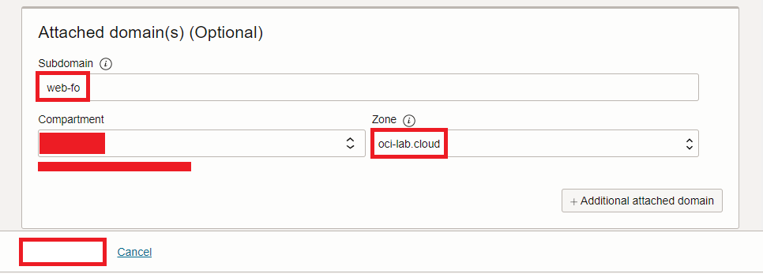
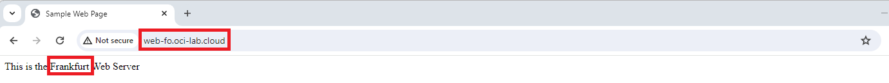

# Failover steering policy

### Introduction

Estimated Time: 15 minutes

### About the failover steering policy

The failover steering policy will direct users to the primary pool. If the primary pool stops responding to the health check created in lab 2, OCI will redirect the users to a site with a lower priority. Each pool can have one or more webservers. For this demo, each pool will have only one eligible server.

### Objectives

In this lab, you will:

* Deploy a failover DNS policy
* Test the failover DNS policy

## Task 1: Deploy a failover steering policy

1. Log into the Oracle Cloud console. On the Oracle Cloud Infrastructure Console Home page, go to the Burger menu (on top left), select Networking and click on **Traffic management steering policies**, under **DNS Management**. Press **Create Traffic management steering policy**. 
  
 
2. In the policy creation menu we need to input various information.

    * type is: Failover
    * give it a name
    * Policy TTL: you can choose any value you like; with a high TTL value there will be less DNS traffic but more time to fail over in case a server has issues.
    * Maximum answer count: this type will always have one.
    * Answer pools: create a pool for Chicago with the Web Server there as an answer and one for Frankfurt.
    * Pool priority: I will choose Chicago as the primary pool (priority 1) and Frankfurt as the backup pool (priority 2).
    * Attach the HTTP health check created in lab 2.
    * Attach the subdomain of the DNS Zone. In my case I will use **web-fo** from **oci-lab.cloud** so the final FQDN is **web-fo.oci-lab.cloud**.
    
  
  
  
  
  

## Task 2: Test the failover policy

1. After the policy is deployed you should see a status page, like below:
  

2. If you try to connect to *http://web-fo.oci-lab.cloud* you will always get directed to the Chicago web server. 
  
  
3. Let's see what happens if the Chicago web server stops responding to health checks. Go to the Chicago compute management page. Shut down the web server.
  

  Now go back to the traffic steering policy details page and check the status. 
  

  Now you will only get directed to the Frankfurt Web Server. 
  

  Before moving on, start the Chicago Web Server as we will need it in the other labs.

**Congratulations!** You have successfully completed this lab. You may now **proceed to the next lab**.

## Acknowledgements

* **Author** - Radu Nistor, Principal Cloud Architect, OCI Networking
* **Last Updated By/Date** - Radu Nistor, February 2024