# Deploy a geolocation steering policy

### Introduction

Estimated Time: 15 minutes

### About the geolocation steering policy

The geolocation steering policy will direct users to a site based on the user's location. Each geolocation rule allows for a backup site so users are redirected in case the main site goes down. In this lab, I will create a rule with the following:
* users in Europe will go to the Frankfurt site. If Frankfurt goes down, they will be redirected to Chicago.
* users in North America will go to the Chicago site. If Chicago goes down, they will be redirected to Frankfurt.
* no *global catch-all rule* which means that users outside of Europe or North America will get a random DNS answer, either the Frankfurt or the Chicago site.

**Note that the evaluation is actually done on the user's Local DNS server IP not the IP of the user trying to connect to the site. This can be important in some scenarios, for example when the user is using the Corporate DNS server via a VPN.**

### Objectives

In this lab, you will:

* Deploy a Geolocation DNS policy
* Test the Geolocation DNS policy

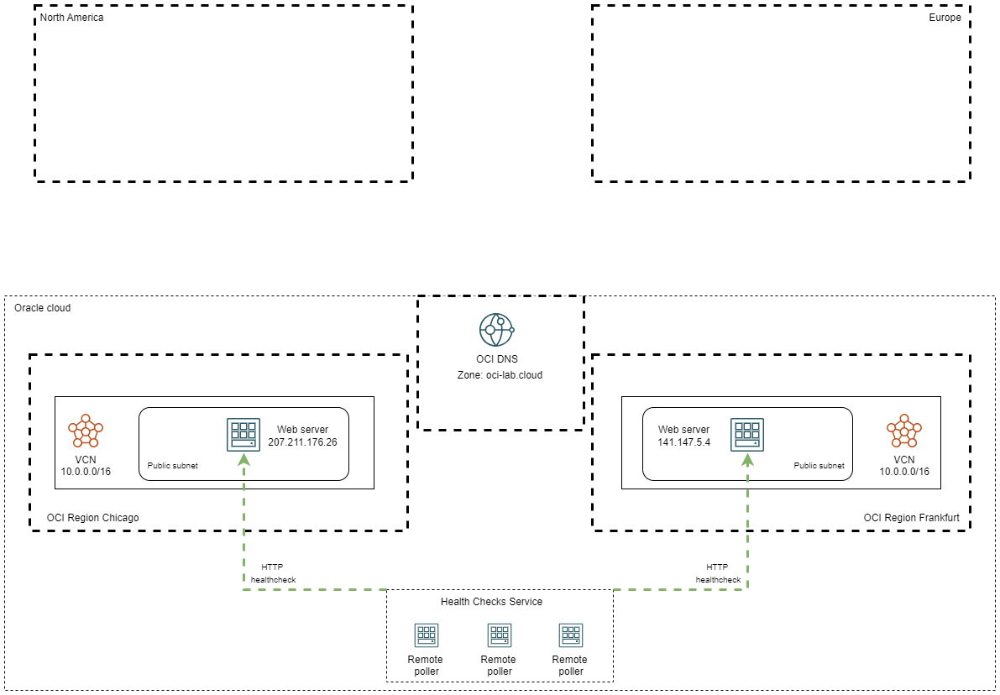

## Task 1: Deploy a geolocation steering policy

1. Log into the Oracle Cloud console. On the Oracle Cloud Infrastructure Console Home page, go to the Burger menu (on top left), select Networking and click on **Traffic management steering policies**, under **DNS Management**. Press **Create Traffic management steering policy**. 
  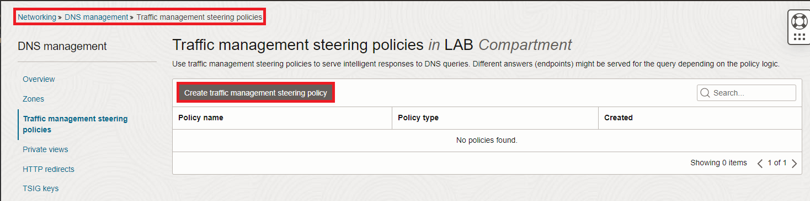
 
2. In the policy creation menu we need to input various information.

    * Type is: Geolocation steering.
    * Give it a name.
    * Policy TTL: you can choose any value you like; with a high TTL value there will be less DNS traffic but more time to failover in case a server has issues.
    * Maximum answer count: this type will always have one.
    * Answer pools: create a pool for Chicago with the Web Server there as an answer and one for Frankfurt.
    * Geolocation steering rules: add a rule for Europe with Pool 1 Frankfurt and Pool 2 Chicago and a rule for North America with Pool 1 Chicago and Pool 2 Frankfurt. 
    * Attach the HTTP health check created in lab 2.
    * Attach the subdomain of the DNS Zone. In my case I will use **web-geo** from **oci-lab.cloud** so the final FQDN is **web-geo.oci-lab.cloud**.
    
  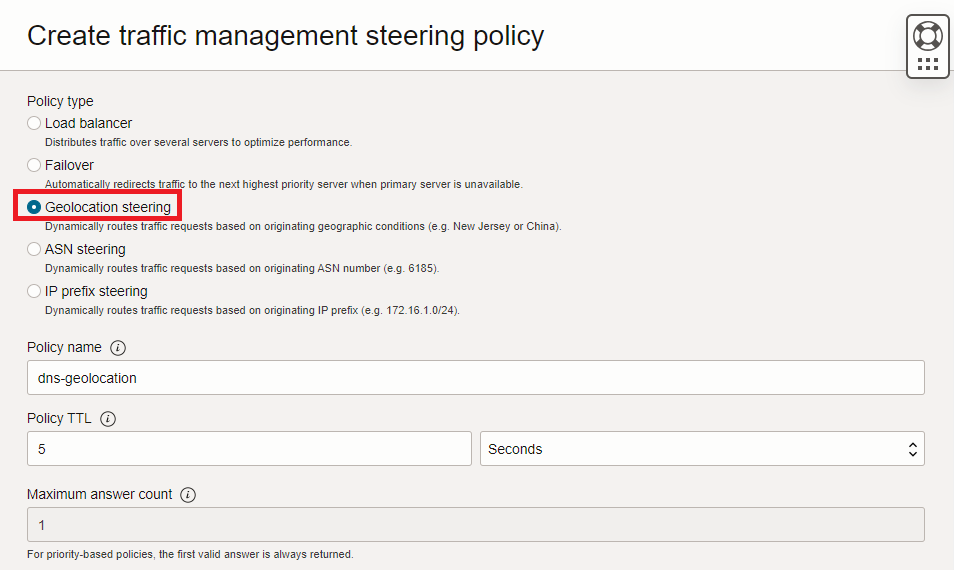
  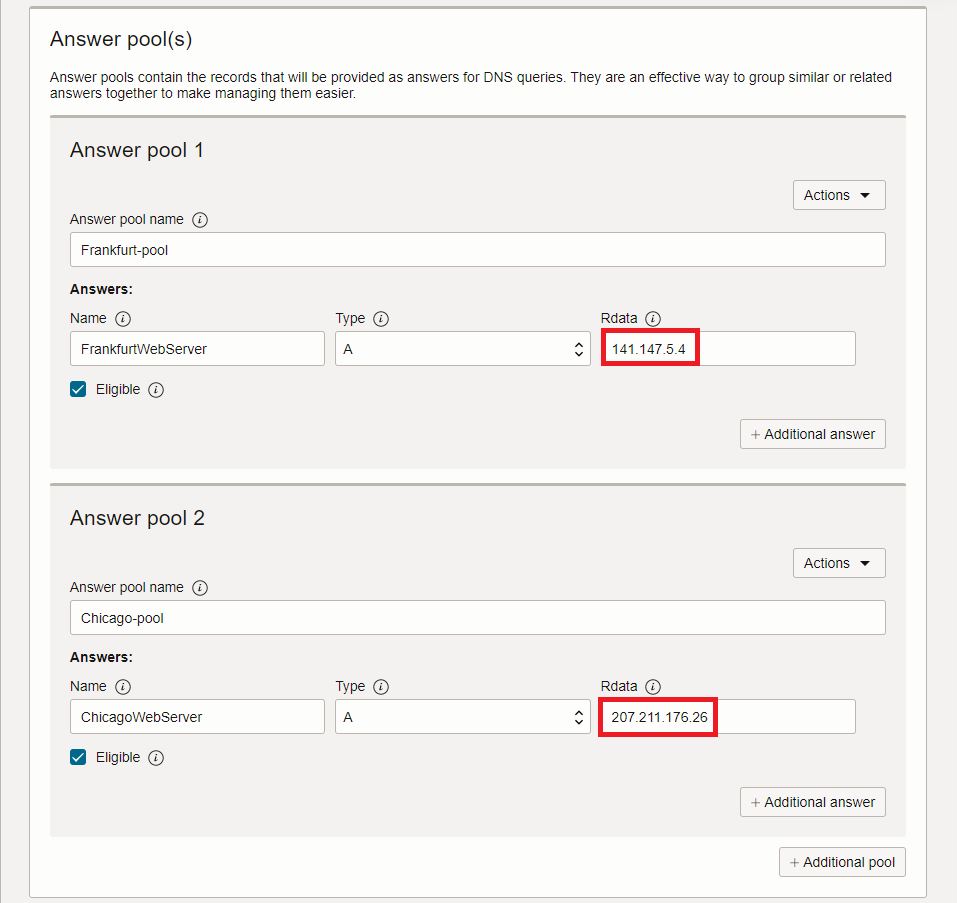
  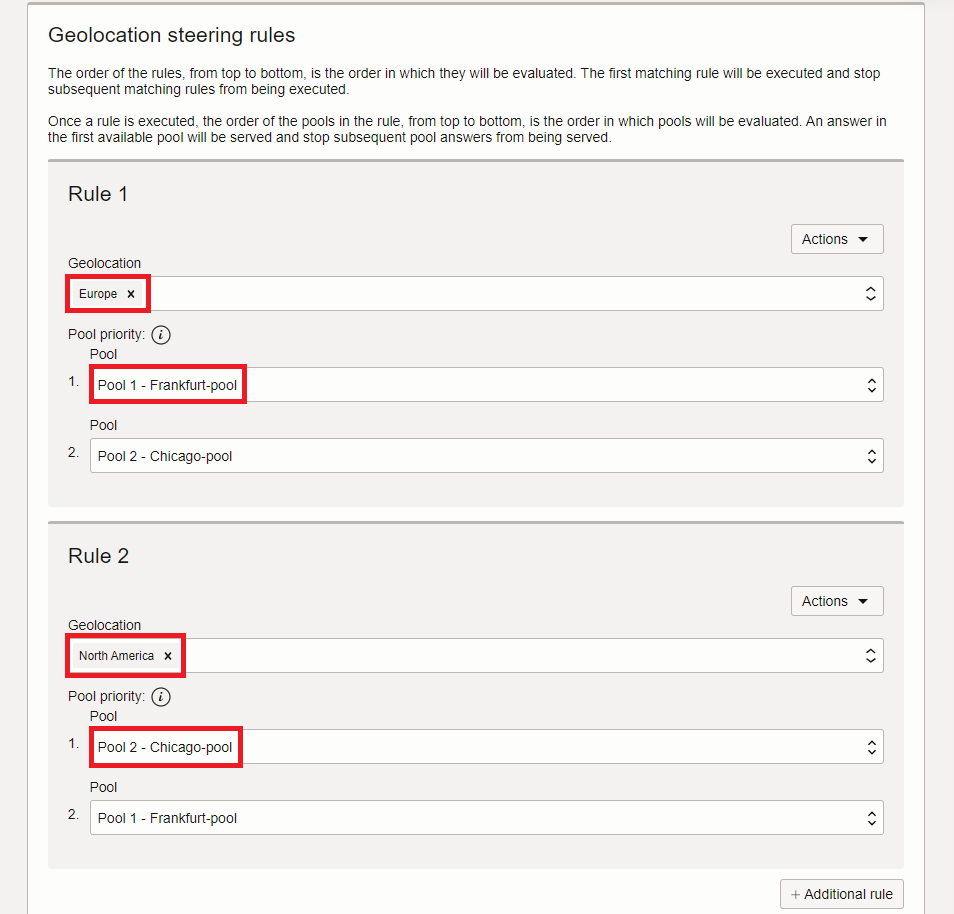
  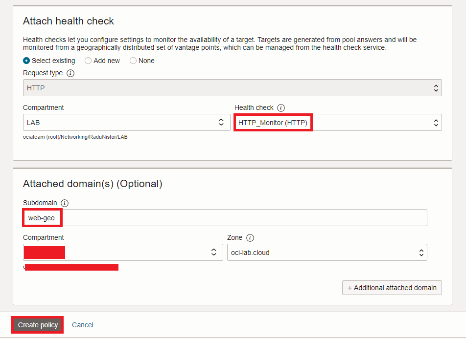
  
## Task 2: Test the geolocation policy

1. After the policy is deployed you should see a status page, like below:
  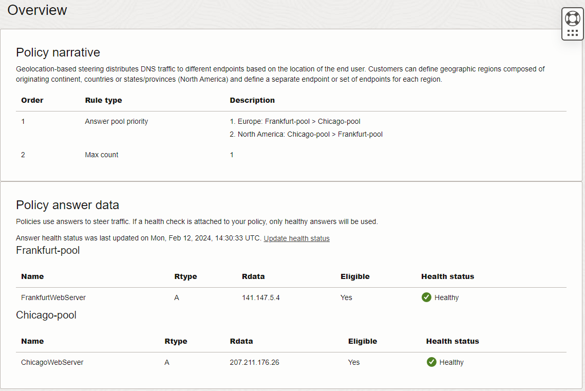

2. Now let's test the policy. If I try to connect to *http://web-geo.oci-lab.cloud* while having a public IP from Europe I should be redirected to Frankfurt. Similarly, if I try to connect to *http://web-geo.oci-lab.cloud* while having a public IP from North America I should be redirected to Chicago.

  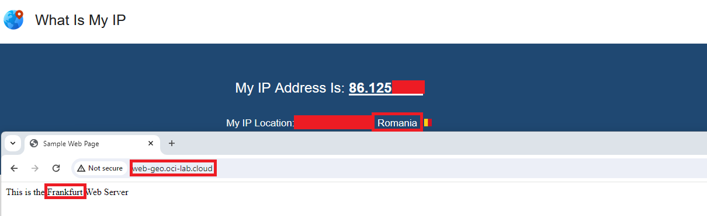

  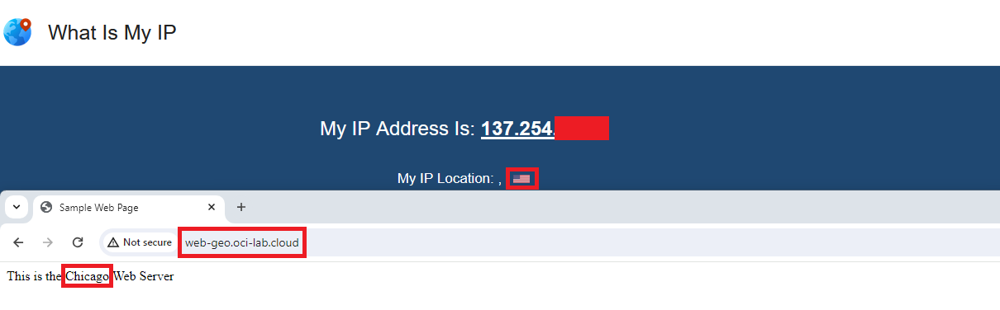
  
3. Let's see what happens if the Chicago web server stops responding to health checks. Go to the Chicago compute management page. Shut down the web server.
  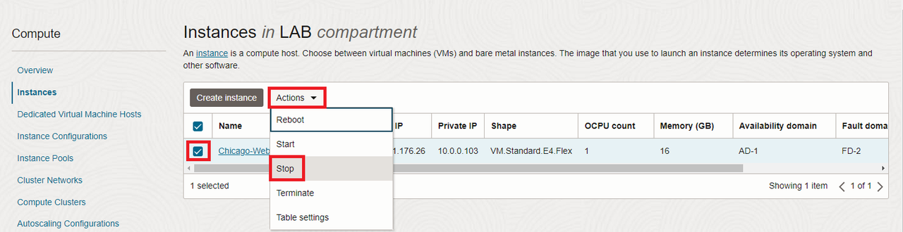

  Now go back to the traffic steering policy details page and check the status. 
  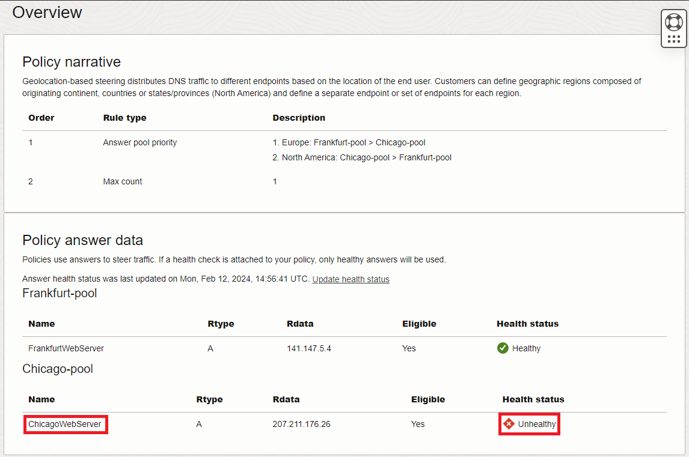

  Now, even though I have an IP from North America, I will get directed to the Frankfurt Web Server. 
  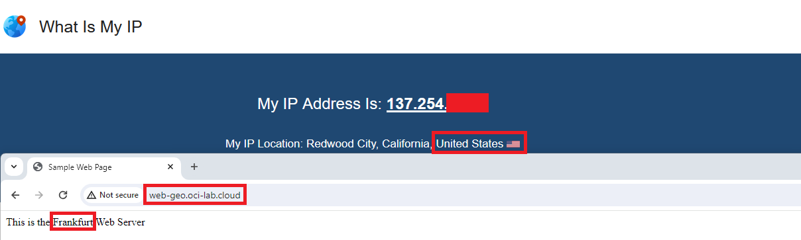

  Before moving on, start the Chicago Web Server as we will need it in the other labs.

**Congratulations!** You have successfully completed this lab. You may now **proceed to the next lab**.

## Acknowledgements

* **Author** - Radu Nistor, Principal Cloud Architect, OCI Networking
* **Last Updated By/Date** - Radu Nistor, February 2024