# Deploy an ASN steering policy

### Introduction

Estimated Time: 15 minutes

### About the ASN steering policy

The ASN steering policy will direct users to a site based on the user's DNS server IP and the public records that match that IP to a BGP ASN. Each ASN rule allows for a backup site so users are redirected in case the main site goes down. In this lab, I will create a rule with the following:
* users using a DNS server in AS 13335 (the Cloudflare 1.1.1.1 DNS) will go to the Chicago site. If Chicago goes down, they will be redirected to Frankfurt.
* any other user in the world, outside AS 13335, will go to Frankfurt. If Frankfurt goes down, they will be redirected to Chicago. We will do this using a *global catch-all* rule.

### Objectives

In this lab, you will:

* Deploy an ASN DNS steering policy
* Test the ASN DNS steering policy

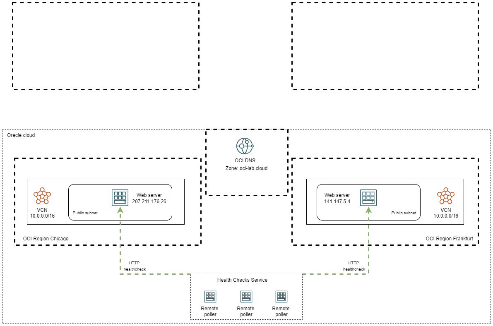

## Task 1: Deploy an ASN steering policy

1. Log into the Oracle Cloud console. On the Oracle Cloud Infrastructure Console Home page, go to the Burger menu (on top left), select Networking and click on **Traffic management steering policies**, under **DNS Management**. Press **Create Traffic management steering policy**. 
  
 
2. In the policy creation menu we need to input various information.

    * Type is: ASN steering.
    * Give it a name.
    * Policy TTL: you can choose any value you like; with a high TTL value there will be less DNS traffic but more time to failover in case a server has issues.
    * Maximum answer count: this type will always have one.
    * Answer pools: create a pool for Chicago with the Web Server there as an answer and one for Frankfurt.
    * ASN steering rules: add a rule for ASN 13335 with Pool 1 Chicago and Pool 2 Frankfurt. Add a global catch-all rule with Frankfurt as Primary and Chicago as a Secondary.
    * Attach the HTTP health check created in lab 2.
    * Attach the subdomain of the DNS Zone. In my case I will use **web-asn** from **oci-lab.cloud** so the final FQDN is **web-asn.oci-lab.cloud**.
    
  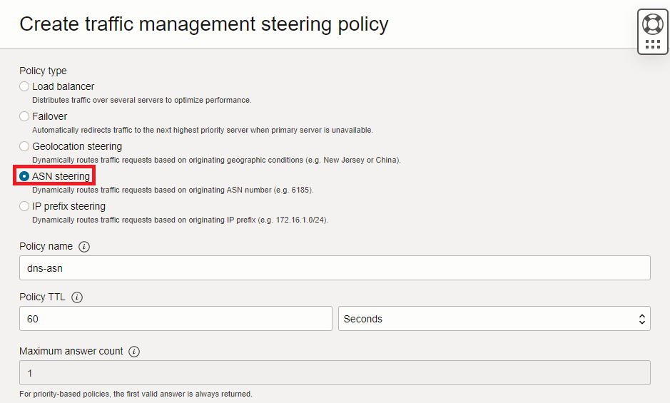
  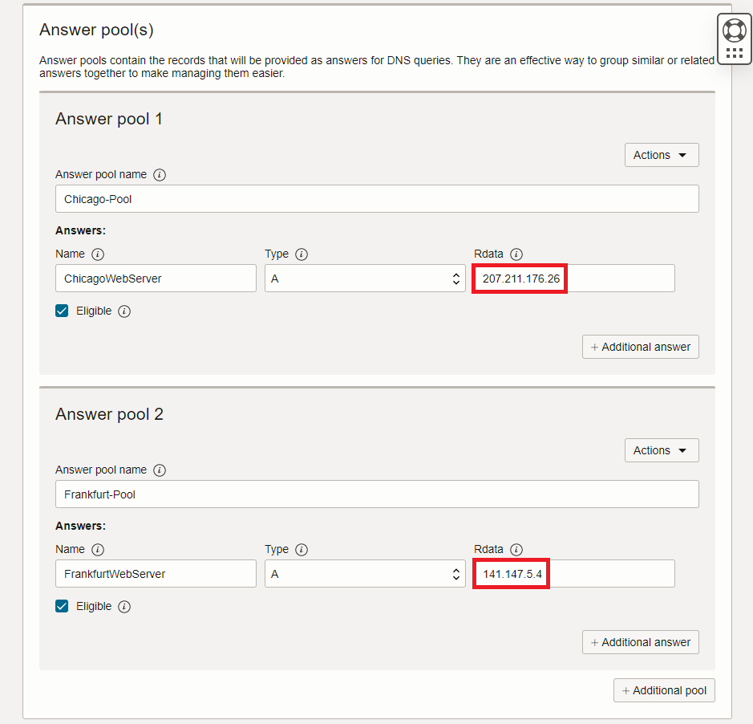
  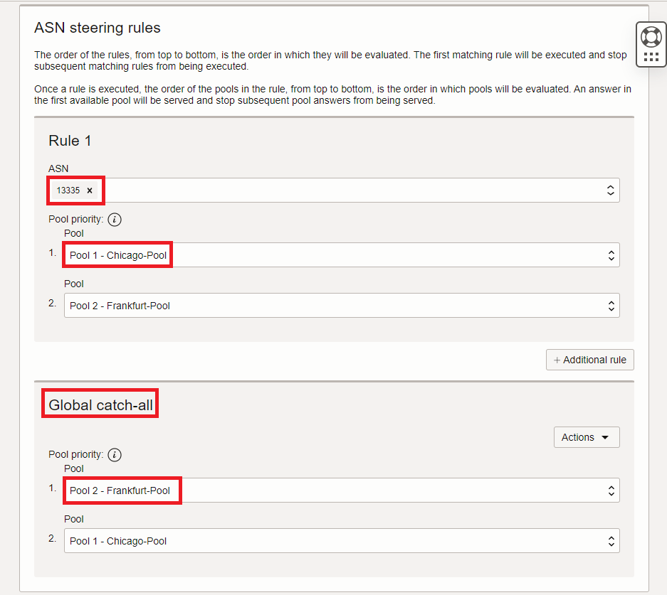
  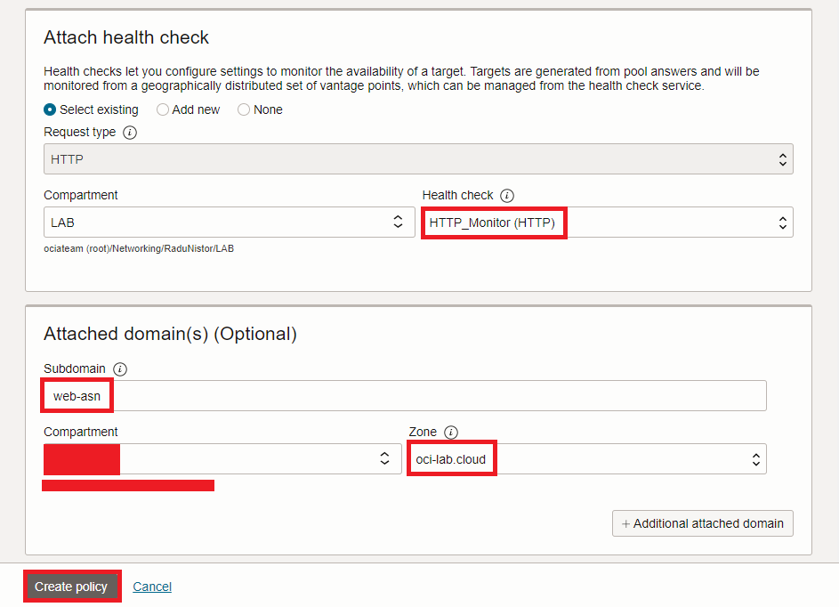
  
## Task 2: Test the ASN steering policy

1. After the policy is deployed you should see a status page, like below:
  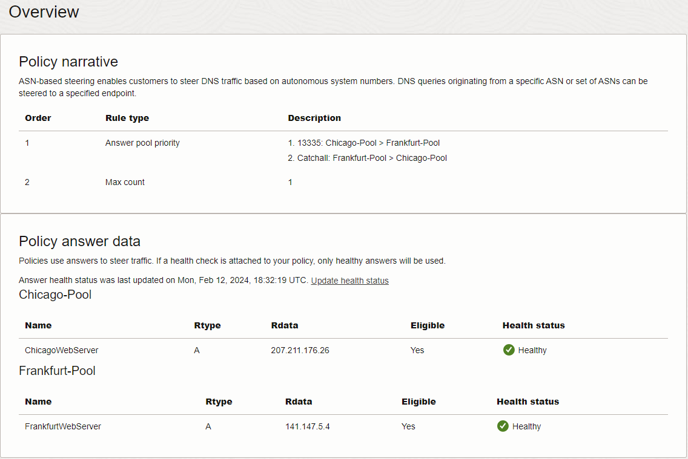

2. Now let's test the policy. If I try to connect to *http://web-asn.oci-lab.cloud* while using a DNS server from ASN 13335, such as 1.1.1.1, I should be redirected to Chicago. 

  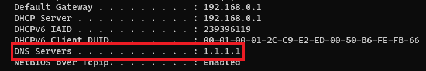

  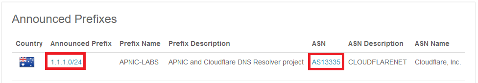

  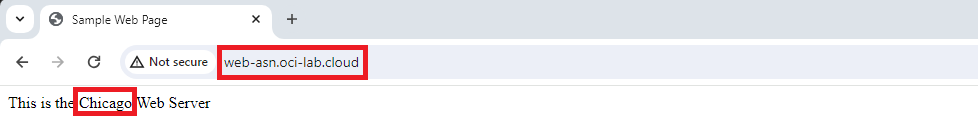

  Similarly, if I try to connect to *http://web-asn.oci-lab.cloud* while using Google's 8.8.8.8 DNS, which is outside of ASN 13335, I should be redirected to Frankfurt.

  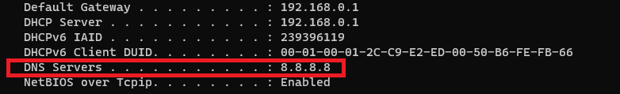

  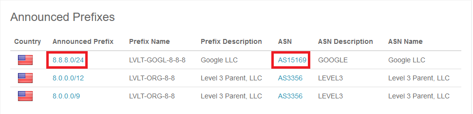

  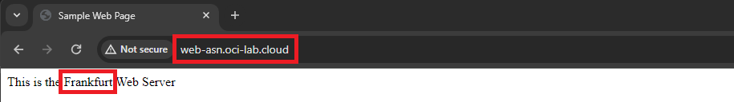
  
3. Let's see what happens if the Chicago web server stops responding to health checks. Go to the Chicago compute management page. Shut down the web server.
  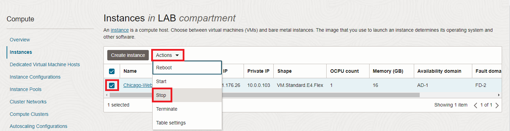

  Now go back to the traffic steering policy details page and check the status. 
  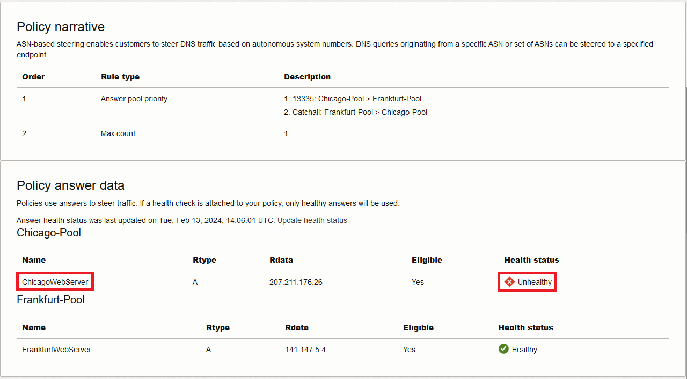

  Now, while using the 1.1.1.1 DNS server, I will get directed to the Frankfurt Web Server instead of Chicago. 

  

  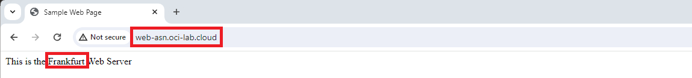

  Before moving on, start the Chicago Web Server as we will need it in the other labs.

**Congratulations!** You have successfully completed this lab. You may now **proceed to the next lab**.

## Acknowledgements

* **Author** - Radu Nistor, Principal Cloud Architect, OCI Networking
* **Last Updated By/Date** - Radu Nistor, February 2024