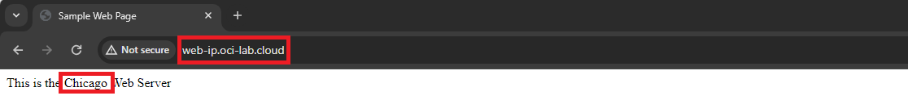

# IP prefix steering policy

### Introduction

Estimated Time: 15 minutes

### About the IP prefix steering policy

The IP prefix steering policy will direct users to a site based on the user's DNS server IP. Each rule allows for a backup site so users are redirected in case the main site goes down. In this lab, I will create a rule with the following:
* users using Cloudflare's recursive DNS server (1.1.1.1) will go to the Chicago site. If Chicago goes down, they will be redirected to Frankfurt.
* users using Oracle Cloud's recursive DNS server (216.146.35.35) will go to the Frankfurt site. If Frankfurt goes down, they will be redirected to Chicago.
* no *global catch-all rule* which means that users using any other DNS server will get a random response.

### Objectives

In this lab, you will:

* Deploy an IP prefix DNS steering policy
* Test the IP prefix DNS steering policy

## Task 1: Deploy an IP prefix steering policy

1. Log into the Oracle Cloud console. On the Oracle Cloud Infrastructure Console Home page, go to the Burger menu (on top left), select Networking and click on **Traffic management steering policies**, under **DNS Management**. Press **Create Traffic management steering policy**. 
  
 
2. In the policy creation menu we need to input various information.

    * Type is: IP prefix steering.
    * Give it a name.
    * Policy TTL: you can choose any value you like; with a high TTL value there will be less DNS traffic but more time to failover in case a server has issues.
    * Maximum answer count: this type will always have one.
    * Answer pools: create a pool for Chicago with the Web Server there as an answer and one for Frankfurt.
    * ASN steering rules: I will create a rule that directs clients that use the Cloudflare recursive DNS 1.1.1.1 (I will use the full BGP advertised subnet 1.1.1.0/24) to Chicago and a rule that directs clients that use the Oracle recursive DNS 216.146.35.35 (I will use the full BGP advertised subnet 216.146.35.0/24) to Frankfurt.
    * Attach the HTTP health check created in lab 2.
    * Attach the subdomain of the DNS Zone. In my case I will use **web-ip** from **oci-lab.cloud** so the final FQDN is **web-ip.oci-lab.cloud**.
    
  
  
  
  
  
## Task 2: Test the ip steering policy

1. After the policy is deployed you should see a status page, like below:
  

2. Now let's test the policy. If I try to connect to *http://web-ip.oci-lab.cloud* while using a DNS server 1.1.1.1, I should be redirected to Chicago. 

  

  

  Similarly, if I try to connect to *http://web-ip.oci-lab.cloud* while using Oracle's recursive DNS 216.146.35.35, I should be redirected to Frankfurt.

  

  
  
3. Let's see what happens if the Chicago web server stops responding to health checks. Go to the Chicago compute management page. Shut down the web server.
  

  Now go back to the traffic steering policy details page and check the status. 
  

  Now, while using the 1.1.1.1 DNS server, I will get directed to the Frankfurt Web Server instead of Chicago. 

  

  

  Before moving on, start the Chicago Web Server as we will need it in the other labs.

**Congratulations!** You have successfully completed this lab.

## Acknowledgements

* **Author** - Radu Nistor, Principal Cloud Architect, OCI Networking
* **Last Updated By/Date** - Radu Nistor, February 2024