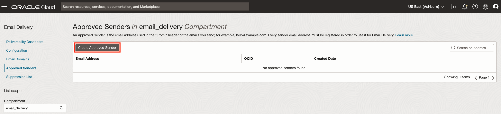
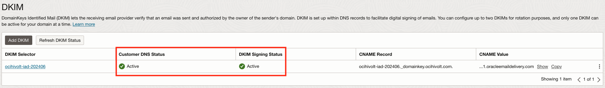

# Setting up an Approved Sender

## Introduction

You must set up an approved sender for each email address you wish to send email from Oracle Cloud. In this lab, we will walk through the process of creating an approved sender and the necessary DNS changes to work with Sender Policy Framework(SPF). We will then publish the DNS changes from this lab and the next one to our DNS provider.

Estimated Time: 10 minutes

### About Approved Sender & SPF
The approved sender email address will be the email address used in the "From:" in an email header. Sender Policy Framework lets domain owners identify servers they have approved to send emails on behalf of their domain.

### Objectives

In this lab, you will:
* Create an Approved Sender
* Get SPF Information and Update DNS
* Verify DKIM and SPF Configured Correctly

### Prerequisites

This lab assumes you have:
* Oracle Cloud account
* Domain you control and have access to DNS Management
* Previous lab successfully completed

## Task 1: Created Approved Sender

1. Navigate to Email Delivery in the OCI Console. Select **Approved Senders**.

2. Click the **Create Approved Sender** button.

3. Enter the sender email address you plan to use for your domain. Then click the **Create Approved Sender** button.

4. While on the Approved Senders screen, click on the **vertical ellipsis** on the right side of the approved sender email address. A menu will appear. Click on **View SPF**.

5. Copy the SPF information for your region and save it for use in the next task. Click the **Close** button when complete.

## Task 2: Add Sender Policy Framework(SPF) to DNS
1. Return to your DNS Zone by clicking the **Navigation menu** in the upper left, navigate to **Networking** then select **DNS Management - Zones**.

2. Open the zone that you created earlier and click on **Records**.

3. Click on the **Manage Records** button.

4. Click on the **Add Record** button.

5. Retrieve the DKIM Record information you saved from the previous lab.
   Update:
    - Name (Optional)
    - Change the **Type** to **TXT**
    - Update the RDATA/Answer Target with the SPF Information you saved earlier.

    When complete click the **Add Record**button

6. Stay on the Manage Records screen and move onto the next task when you are ready to publish your DNS Changes.

## Task 3: Publish DNS. Verify DKIM & SPF Configured Correctly

1. While on the Manage Records screen for DNS Management within the OCI Console click on the **Publish Changes** button.

2. Next, click on the **Confirm publish changes** button to publish your DNS Records.

3. As noted earlier, DNS updates may take time to take effect depending on your DNS Provider. When ready, confirm that email delivery and DNS are configured correctly. Click the **Navigation menu** in the upper left, navigate to **Developer Services** then select **Application Integration - Email Delivery**.

4. Once in email delivery, click on the **Email Domains** link on the left-hand side of the screen. Then select the Email Domain you created.

5. Within that email domain, you will now be able to see that DNS and DKIM are successfully configured as indicated by their *Active* Status. You also should see that SPF is configured. Proceed to the next lab when ready.

## Learn More

* [Creating an Approved Sender](https://docs.oracle.com/en-us/iaas/Content/Email/Reference/gettingstarted_topic-Create_an_approved_sender.htm)
* [Managing Approved Sender](https://docs.oracle.com/en-us/iaas/Content/Email/Tasks/managingapprovedsenders.htm)

## Acknowledgements
* **Author** - Kevin McCoy, Cloud Architect
* **Contributors** -  Germain Vargas, Cloud Architect
* **Last Updated By/Date** - Kevin McCoy, July 2024
