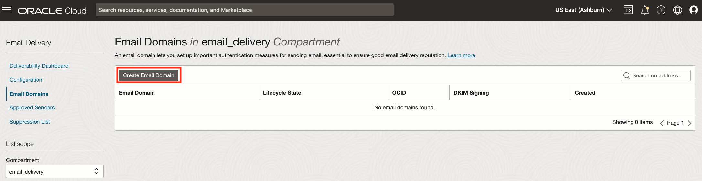
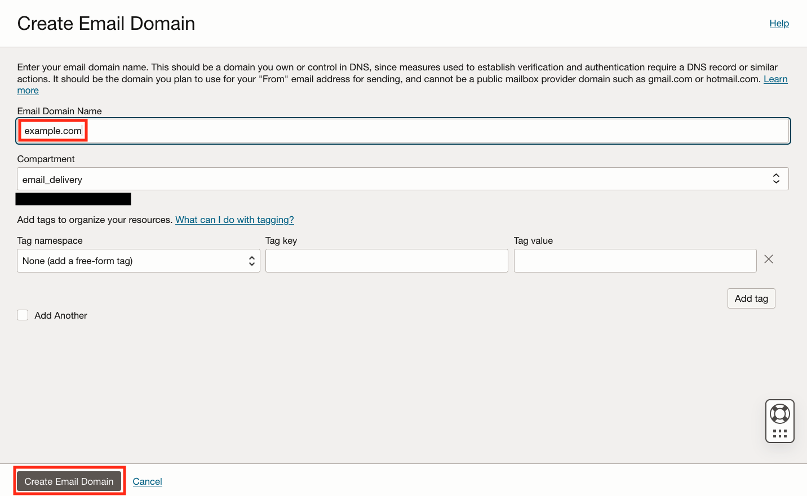
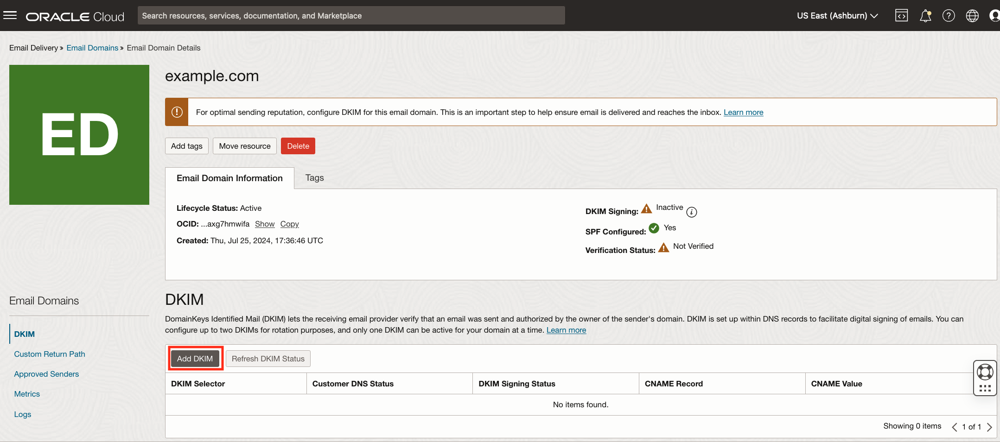
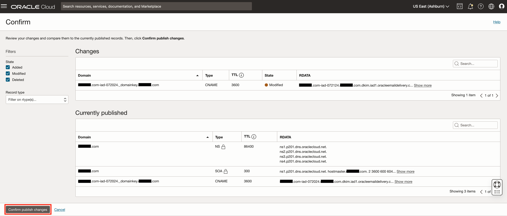

# Email Domain Creation and Configuration

## Introduction

This lab will show the setup of your domain in the Oracle Email Delivery Service. In order to complete this lab, you will need a domain that you mange and control. This can be a personal domain as we use for demonstration purposes in this lab. In the later DNS Lab, you will need to make DNS changes so it's important that you own and control this domain.

Estimated Time: 15 minutes

### About OCI Email Delivery
The Oracle Cloud Infrastructure Email Delivery service provides a fast and reliable managed solution for sending secured, high-volume marketing and transactional emails.

### Objectives

In this lab, you will:
* Create a Domain within Email Delivery
* Create a DKIM Record
* Create a DNS Zone for your Domain
* Create CNAME Record

### Prerequisites

This lab assumes you have:
* Oracle Cloud account
* Domain you control and have access to DNS Management

## Task 1: Create a Domain in the Email Delivery Service

1. Click the **Navigation menu** in the upper left, navigate to **Developer Services** then select **Application Integration** then  **Email Delivery**.
 

2. This will take you to  the Email Deliverability and Reputation Governance Dashboard were you may monitor your usage.

   Click on **Email Domains**.
 
3. Click the **Create Email Domain** button.
  

4. Within email domain, verify you are in the correct compartment and specify an **Email Domain Name** and then click the **Create Email Domain** button.
 

5. After a brief time, your domain will become *active* and you may move onto the next task.

## Task 2: Create DKIM for your Email Domain

1. DKIM (Domain Keys Identified Mail) is used to verify an email is sent an authorized by the owner of the sender's domain. While in your newly setup email domain, click on the **Add DKIM** button.

 

    The DKIM Selector is made up of a prefix, the OCI short region code and the date in this format **prefix - shortregioncode - yyyymm**. In this example we will use our domain as the prefix, IAD (Ashburn VA) as the short region code and today's date. We include the date because it is best practice to rotate you DKIM record on a regular basis.

2. Use your domain information, region and date in a similar fashion and enter in the **DKIM Selector** field and then click the **Generate DKIM Record** button.

3. Click the **Generate DKIM Record** button. This will create a CNAME Record and CNAME Value for DNS. Please *copy and save* for use in the next lab. Click the **Create DKIM** button when complete.

## Task 3: Create DNS Zone and Add DKIM Record

1. Click the **Navigation menu** in the upper left, navigate to **Networking** then select **DNS Management** then **Zones**.

2. Next click the **Create Zone** button under Public Zones.

3. Verify you are in the correct compartment and enter your domain name in the zone name field. Click the **Create** button when complete.

4. Open your newly created zone and click on **Records**.

5. Click on the **Manage Records** button.

6. Click on the **Add Record** button

7. Retrieve the DKIM Record information you saved earlier.

   Update the
    - Name using the domainkey information from the DKIM Record. Please note the OCI Console appends the domain so you may remove that domain from the record you copied earlier.
    - Change the **Type** to **CNAME**.
    - Update the RDATA/Answer Target with the CNAME information from the DKIM Record created earlier.

  When complete click the **Add Record** Button.

8. While on the Manage Records screen for DNS Management, click on the **Publish Changes** button.

9. Next, click on the **Confirm publish changes** button to publish your DNS Records.

10. It may take some time for your DNS changes to take affect depending on your DNS provider. This may take as long as 24-72 hours. You will be making one more DNS change in the next lab. Please proceed to the next lab when ready.

## Learn More

* [Email Delivery Overview](https://docs.oracle.com/en-us/iaas/Content/Email/Concepts/overview.htm)
* [Configuring DKIM](https://docs.oracle.com/en-us/iaas/Content/Email/Tasks/configure-dkim-using-the-console.htm)
* [Managing DKIM](https://docs.oracle.com/en-us/iaas/Content/Email/Tasks/configuredkim.htm)
* [Setting up an Email Domain with DKIM](https://docs.oracle.com/en-us/iaas/Content/Email/Tasks/managing_dkim-setup_email_domain_with_dkim.htm)
* [DNS Management Overview](https://docs.oracle.com/en-us/iaas/Content/DNS/Tasks/consoleoverview.htm)

## Acknowledgements
* **Author** - Kevin McCoy, Cloud Architect
* **Contributors** -  Germain Vargas, Cloud Architect
* **Last Updated By/Date** - Kevin McCoy, July 2024