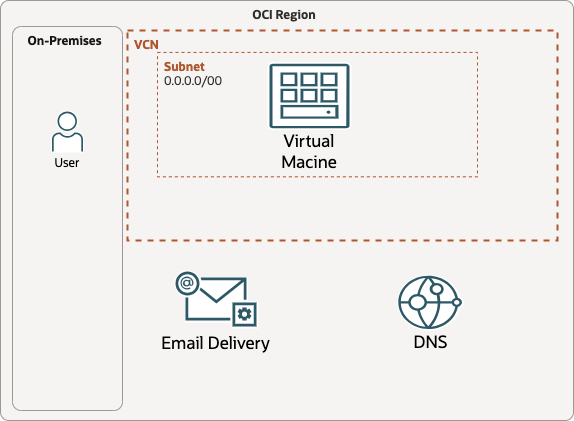

# Getting Started with OCI Email Delivery with Postfix

## About this Workshop

This workshop will walk you through the setup of OCI Email Delivery. Postfix and Mailx will be used in the last lab to test the setup. Email Delivery can be used throughout OCI so you may choose to test it elsewhere and use the last lab as optional. This workshop is a good starting point to get a basic configuration of OCI Email Delivery that you can later customize for your specific needs. The lab will utilize OCI Email Delivery, OCI DNS Management and OCI Compute for the Postfix components.

Estimated Workshop Time: 1 hour

### Objectives

In this workshop, you will learn how to:
* Set up a domain in OCI Email Delivery Services
* Configure DNS for your Email Delivery domain using OCI DNS Management
* Create an approved sender to be used with emails sent from OCI
* Install and configure Postfix to work with OCI Email Delivery. Test setup with Mailx.

### Prerequisites

This lab assumes you have:
* Oracle Cloud tenancy
* A domain you have access to DNS Management
* OCI Compute Instance for the Postfix Portion

## Learn More

* [Overview of Email Delivery](https://docs.oracle.com/en-us/iaas/Content/Email/Concepts/overview.htm)
* [Email Delivery FAQ](https://www.oracle.com/application-development/email-delivery/faq/)

## Acknowledgements
* **Author** - Kevin McCoy, Cloud Architect
* **Contributors** -  Germain Vargas, Cloud Architect
* **Last Updated By/Date** - Kevin McCoy, July 2024
