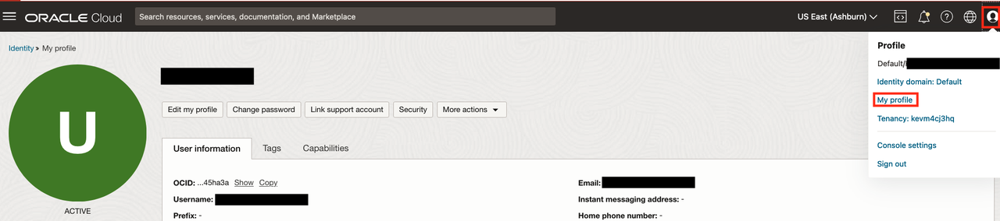
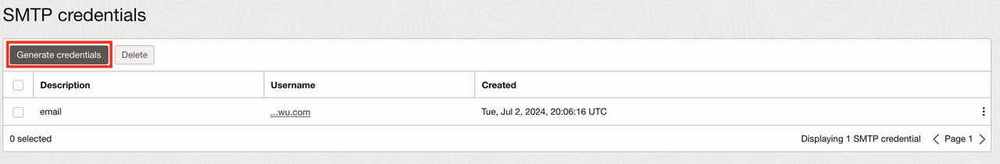
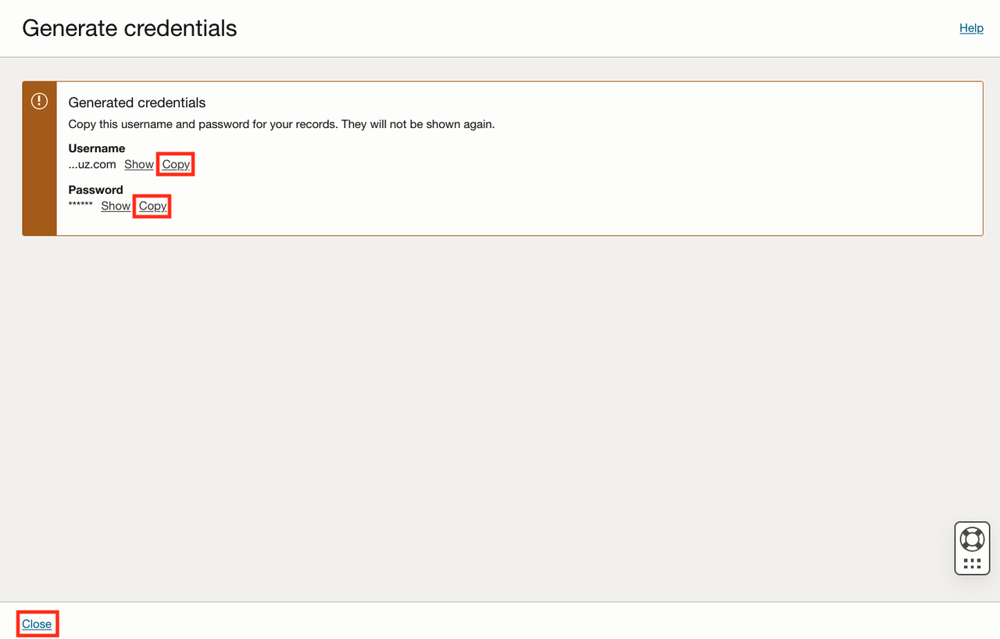
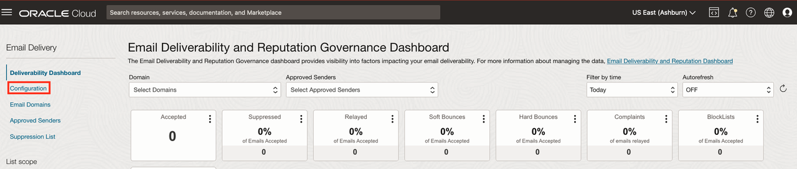
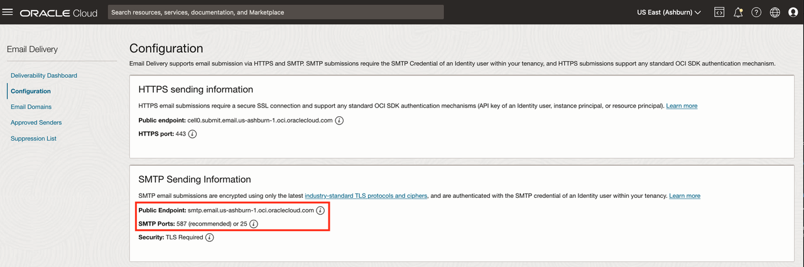
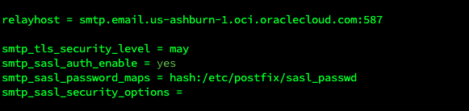
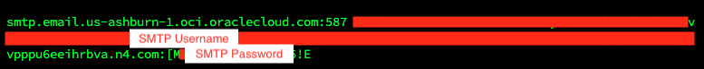

# Install & Configure Postfix

## Introduction

Once you have email delivery properly configured, you can use it with a wide variety of OCI services. For this lab, we will install and configure Postfix and Mailx on an existing virtual machine to test our email delivery setup.

Estimated Lab Time: 20 minutes

### About <Product/Technology>
Postfix is an open source email server and Mailx is an email client. In this lab, we are using them as a simple means to test our configuration of Email Delivery and DNS.

### Objectives

In this lab, you will:
* Generate SMTP Credentials
* Install Postfix
* Configure Postfix
* Send Test Email

### Prerequisites

This lab assumes you have:
* Oracle Cloud account
* All previous labs successfully completed
* Linux Virtual Machine previously created
* A Virtual Machine setup within OCI


## Task 1: Generate SMTP Credentials

1. While in the OCI Console, Click on your **Profile** which can be found in the upper-right corner of any screen in the OCI console. Select **My Profile**.


2. Click on **SMTP credentials** on the left-hand side of your profile under **Resources**.

3. Click on the **Generate SMTP Credentials** button.


4. Enter a description for the credentials and then click on the **Generate credentials** button.

5. Copy the Username and Password. Save them to a secure location for use in the next task. **Close** the Generate credentials window when complete.


6. There is one more piece of information we need for our Postfix configuration. Before you leave the console, click the **Navigation menu** in the upper left, navigate to **Developer Services** then select **Application Integration - Email Delivery**. Click **Configuration** in the left-hand screen under Email delivery.


6. Copy the Relay Host Public Endpoint and SMTP Ports for use in the next task. Save to a secure location.


## Task 2: Install Postfix
Log into an existing OCI virtual machine. If you do not have one already, please create one for your testing. If you are unfamiliar with the process of creating a virtual machine, there are several links in the "Other LiveLabs" section to take you through that process. Once you have a VM, please use SSH to connect to that VM and then begin the instructions below.
1. Install Postfix
    ```
    <copy>sudo dnf install -y postfix</copy>
    ```
2. Allow SMTP traffic through the firewall
    ```
    <copy>sudo firewall-cmd --zone=public --add-service=smtp --permanent</copy>
    ```
3. Reload firewall
    ```
    <copy> sudo firewall-cmd --reload</copy>
    ```
4. Remove sendmail package if present
    ```
    <copy>sudo dnf remove -y sendmail</copy>
    ```
5. Set Postfix as the default Mail Transfer Agent
    ```
    <copy>sudo alternatives --set mta /usr/sbin/sendmail.postfix</copy>
    ```
6. Enable and start Postfix service
    ```
    <copy>sudo systemctl enable --now postfix</copy>
    ```
7. Make a copy of the Postfix configuration file as a backup
    ```
    <copy>sudo cp /etc/postfix/main.cf /etc/postfix/main.bak</copy>
    ```
8. Edit your Postfix configuration file
    ```
    <copy>sudo vi /etc/postfix/main.cf</copy>
    ```
9.  Retrieve the relay host server and Port your saved from Task 1. We will need to add the following entries to end of the main.cf file and then save it:
    ```
    <copy>
    smtp_tls_security_level = may
    smtp_sasl_auth_enable = yes
    smtp_sasl_password_maps = hash:/etc/postfix/sasl_passwd
    smtp_sasl_security_options =
    </copy>
    ```
We will also need to add an entry for our relay host and port. Here's an example of what one looks like but please use the information from Task 1 to complete yours.
    ```
    <copy>relayhost = smtp.email.us-ashburn-1.oci.oraclecloud.com:587</copy>
    ```
This is what the entries look like in an example main.cf Postfix configuration file.


## Task 3: Configure Postfix
1. The next step is to generate your sasl_passwd file. This file uses the relay host, SMTP Port, SMTP Username and SMTP Password information you saved in Task 1 of this lab. The SASL Passwd file uses this format.
server:port user:pass
    ```
    <copy>sudo vi sasl_passwd</copy>
    ```
Enter the relay host:port number username:password and then *save* the sasl_passd file. Here is an example of what one looks like with the username and password obscured:


2. Change the permissions on the sasl_passwd file
    ```
    <copy>sudo chown root:root /etc/postfix/sasl_passwd && sudo chmod 600 /etc/postfix/sasl_passwd</copy>
    ```
3. Generate the SASL Hash
    ```
    <copy>sudo postmap hash:/etc/postfix/sasl_passwd</copy>
    ```
4. Reload Postfix
    ```
    <copy>sudo postfix reload</copy>
    ```
5. Install MailX
    ```
    <copy>sudo dnf install -y mailx</copy>
    ```
6. You are now ready to test everything. Use the command below and substitute in your *Approved Sender* email and *Recepient Email* Address
    ```
    <copy>echo "This is a test message." | mailx -s "Test" -r APPROVEDSENDER@YOURDOMAIN.com RECEPIENTEMAIL@DOMAIN.com</copy>
    ```
7. If you need to troubleshoot, please check the Postfix logs to see what may have gone wrong. You are complete the workshop when you successfully receive an email.
    ```
    <copy>sudo tail -f /var/log/maillog</copy>
    ```
## Learn More

* [Installing Postfix with OCI Email Delivery](https://docs.oracle.com/en-us/iaas/Content/Email/Reference/postfix.htm)

## Acknowledgements
* **Author** - Kevin McCoy, Cloud Architect
* **Contributors** -  Germain Vargas, Cloud Architect
* **Last Updated By/Date** - Kevin McCoy, July 2024
