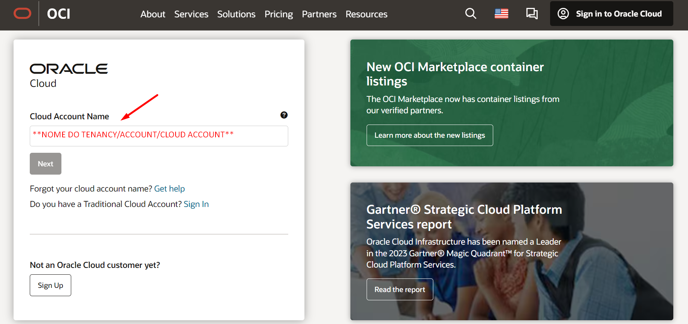
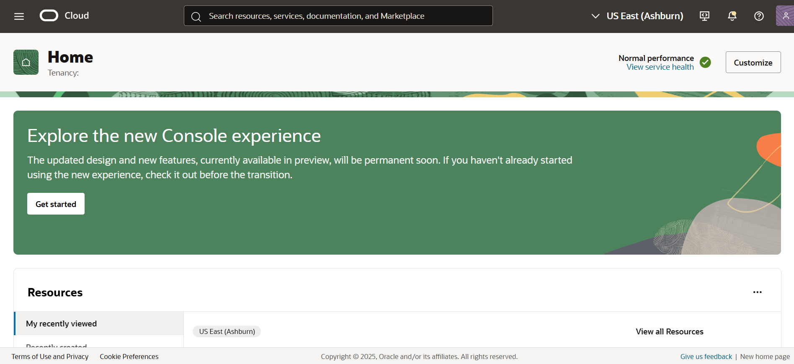

# Criar um Compartimento

## Introdução

***Regiões (Regions)***

O Oracle Cloud Infrastructure é hospedado em regiões e domínios de disponibilidade. Uma região é uma área geográfica localizada. Uma região é composta por um ou mais domínios de disponibilidade. A maioria dos recursos do Oracle Cloud Infrastructure são específicos da região, como uma rede de nuvem virtual (VCN), ou específicos do domínio de disponibilidade, como uma instância de computação.

As regiões são completamente independentes de outras regiões e podem ser separadas por grandes distâncias - entre países ou mesmo continentes. Geralmente, você implantaria um aplicativo na região onde ele é mais usado, uma vez que usar recursos próximos é mais rápido do que usar recursos distantes. No entanto, você também pode implantar aplicativos em diferentes regiões para:

* Mitigar o risco de eventos em toda a região, como grandes sistemas climáticos ou terremotos
* Atender a diversos requisitos para jurisdições legais, domínios fiscais e outros critérios comerciais ou sociais

***Domínios de disponibilidade (Availability Domains - AD)***

Em uma região, você pode ter até três domínios de disponibilidade (ADs).

Os domínios de disponibilidade na mesma região são conectados uns aos outros por uma rede de baixa latência e alta largura de banda, o que torna possível fornecer conectividade de alta disponibilidade para a Internet e instalações do cliente e construir sistemas replicados em vários domínios de disponibilidade para alta disponibilidade e recuperação de desastres.

Os domínios de disponibilidade são isolados uns dos outros, tolerantes a falhas e muito improváveis de falharem simultaneamente. Como os domínios de disponibilidade não compartilham infraestrutura, como energia ou resfriamento, ou a rede de domínio de
disponibilidade interna, uma falha em um domínio de disponibilidade dentro de uma região provavelmente não afetará a disponibilidade de outros na mesma região

***Trabalhar com compartimentos (Compartments)***

Ao começar a trabalhar com o Oracle Cloud Infrastructure, você precisa pensar cuidadosamente sobre como deseja usar os compartimentos para organizar e isolar seus recursos de nuvem. Os compartimentos são fundamentais para esse processo. Depois de colocar um recurso em um compartimento, você pode movê-lo entre compartimentos.

Ao criar um novo compartimento, você deve fornecer um nome para ele (máximo de 100 caracteres, incluindo letras, números, pontos, hifens e sublinhados) que seja exclusivo em sua hierarquia de compartimentos. Você também deve fornecer uma descrição, que é uma descrição não única e mutável para o compartimento, entre 1 e 400 caracteres. A Oracle também atribuirá ao compartimento um ID exclusivo denominado Oracle Cloud ID (OCID).

Depois que um recurso é criado em um compartimento, você pode movê-lo para outro.

O Console é projetado para exibir seus recursos por compartimento na região atual. Ao trabalhar com seus recursos no Console, você deve escolher em qual compartimento trabalhar em uma lista na página.

Essa lista é filtrada para mostrar apenas os compartimentos na locação que você tem permissão para acessar. Se você for um administrador, terá permissão para visualizar todos os compartimentos e trabalhar com os recursos de qualquer compartimento, mas se for um usuário com acesso limitado, provavelmente não.

Os compartimentos são globais, em todas as regiões, quando você cria um compartimento, ele está disponível em todas as regiões em que o seu aluguel está inscrito.

Neste Lab você vai aprender a criar um Compartimento dentro da Oracle Cloud Infrastructure

*Tempo estimado para o Lab:* 10 Minutos

### Objetivos

* Acesse a Oracle Cloud Console
* Familiarize-se com a interface OCI
* Criar um Compartimento

## Task 1: Acesse a Console da Oracle Cloud

1.	No navegador de sua preferência, digite: [https://cloud.oracle.com ](https://cloud.oracle.com )

2.	Digite o nome da sua conta (Tenancy) e em seguida clique em "Next":

3.	Clique em "Next" e depois insira seu usuário e senha.

4.  Depois de autenticado explore a tela inicial da Oracle Cloud e também nosso "Menu Principal", onde você pode encontrar todos os serviços disponíveis em nossa console.

## Task 2: Criando Compartimentos

1.	No menu principal, clique em "Identity & Security" e escolha "Compartments"

2.	Clique em "Create Compartment" e preencha com as informações:

* Name: Compartimento-Trial
* Description: Compartimento para recursos de testes
* Parent Compartment: root

Em seguida clique no botão "Create Compartment"

Você pode **seguir para o próximo Lab**.

## Conclusão

Nesta sessão você aprendeu a acessar a console da Oracle Cloud, explorar a tela inicial e o "Action Menu", além de criar seu próprio compartimento.

## Autoria

- **Autores** - Arthur Vianna, Luiz de Oliveira, Thais Henrique
- **Último Updated Por/Data** - Arthur Vianna, Jul/2025