# Criar Máquinas Virtuais (VM)

## Introdução

O Oracle Cloud Infrastructure permite provisionar e gerenciar hosts de computação, conhecidos como instâncias. Você pode criar instâncias conforme necessário para atender aos seus requisitos de computação e aplicativo. Depois de criar uma instância, você pode acessá-la de forma segura pelo seu computador, reiniciá-la, anexar e desanexar volumes e encerrá-la quando terminar de usá-la.

Nesse Lab você vai aprender a criar 2 máquinas virtuais Linux e uma máquina virtual com Windows.

*Tempo estimado para o Lab:* 35 Minutos

### Objetivos

* Criar um par de chaves SSH no OCI Cloud Shell
* Criar 2 máquinas virtuais (VM) Linux
* Criar 1 máquina virtuais (VM) Windows
* Acessar as instâncias


## Task 1: Criar um par de chaves SSH

1.	Acesse o OCI Cloud Shell clicando no botão do menu superior direito. A OCI irá provisionar um terminal Linux no web browser


2.	Crie um par de chaves RSA com o comando:

```
ssh-keygen -t rsa
```

* Mantenha o nome original (id_rsa) apertando enter
* O campo “Key Passphrase” é opcional
* Aperte "ENTER" novamente até finalizar a criação


3. Exiba o conteúdo da chave pública que você criou utilizando o comando:

```
cat ~/.ssh/id_rsa.pub
```

* Selecione e Copie o conteúdo dessa chave, pois a usaremos para a criação das máquinas virtuais Linux. Guarde em um bloco de notas se possível, para uso posterior.


Para a criação da VM, usaremos a chave pública. A chave privada será usada apenas para conexão.

4. Baixe as duas chaves também no seu computador. Salve as chaves privadas e públicas em um local seguro.

Para isso, basta clicar no menu do Cloud Shell e solicitar o Download:


* Para baixar a chave pública, o caminho é: “.ssh/id_rsa.pub”


* Para baixar a chave privada, o caminho é: “.ssh/id_rsa”


## Task 2: Criar 2 máquinas virtuais Oracle Linux

1.	No Menu Principal, clique em : Compute > Instances, então “Create Instance”:


* Name of your instance: VM-OracleLinux-AD1
* Availability Domain: AD 1
* Operating System: Oracle Linux 8
* Instance Type: Virtual Machine
* Instance Shape: AMD VM.Standard.E3.Flex (Caso necessitar usar outro shape, procure utilizar os shapes AMD ou Intel. Ex: VM.Standard.E4.Flex ou VM.Standard3.Flex)
* Choose SSH Key File: Insira a chave SSH pública (.pub)
* Virtual Cloud Network Compartment: "Compartimento-Trial"
* Virtual Cloud Network: "VCN-TRIAL"
* Subnet Compartment: "Compartimento-Trial"
* Subnet: Public Subnet
* Assign Public IP Address
* Lembre-se de escolher o AD certo e seu Compartimento

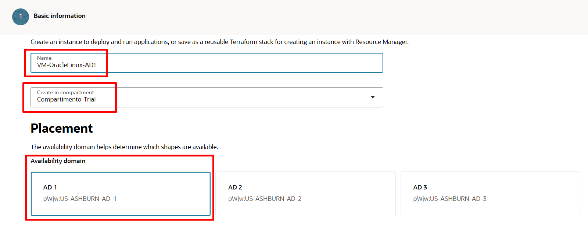

2. Depois de expandir as opções de Shapes e Network, insira os dados necessários para concluir o processo de criação:


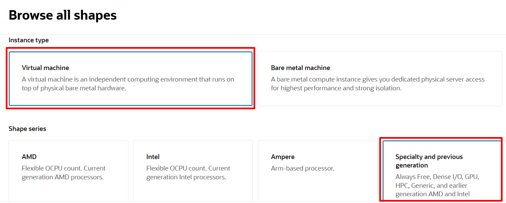

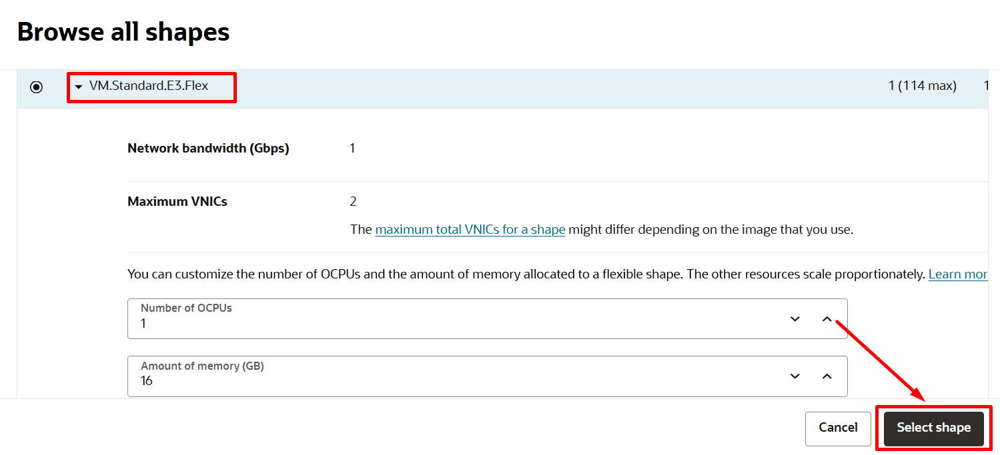


3. Ao inserir as informações de rede, lembre-se de escolher a opção “Assign a Public IP address” para Atribuir um endereço IP público à instância de computação.

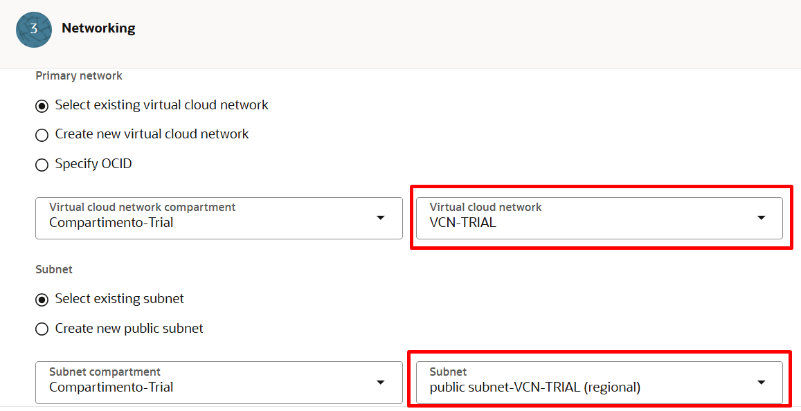


4. Clique em PASTE Public Key e cole a chave pública SSH criada por você no passo 3 da Task 1. Após isso clique no botão “Create”.

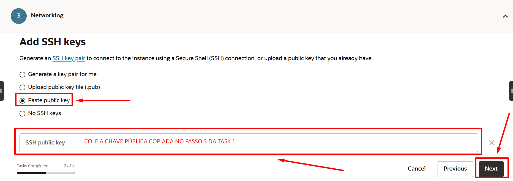


Você provavelmente terá a nova instância devidamente criada em alguns minutos. Depois de terminar o processo de criação, a tela principal ficará assim:


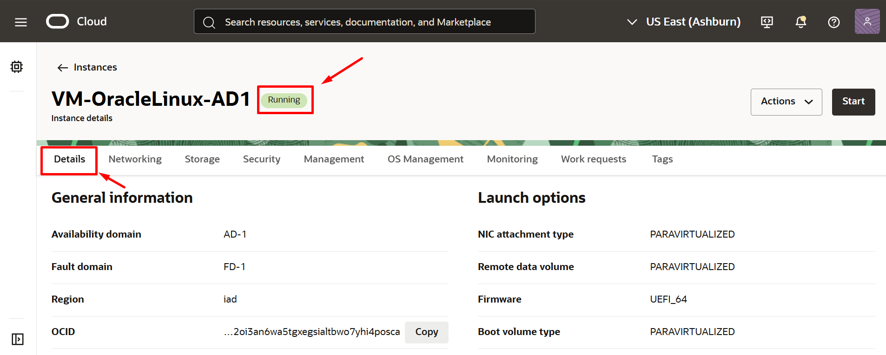

5. Repita os passos acima para criar a Máquina Virtual (VM) Linux 2, porém desta vez com os dados abaixo:

* Name of your instance: VM-OracleLinux-AD2
* Availability Domain: AD 2
* Operating System: Oracle Linux 8
* Instance Type: Virtual Machine
* Instance Shape: AMD VM.Standard.E3.Flex (Caso necessitar usar outro shape, procure utilizar os shapes AMD ou Intel. Ex: VM.Standard.E4.Flex ou VM.Standard3.Flex)
* Choose SSH Key File: Insira a chave SSH pública (.pub)
* Virtual Cloud Network Compartment: "Compartimento-Trial"
* Virtual Cloud Network: "VCN-TRIAL"
* Subnet Compartment: "Compartimento-Trial"
* Subnet: Public Subnet
* Assign Public IP Address

> **Note:** Utilize a MESMA chave pública da VM-OracleLinux-AD1 para a VM-OracleLinux-AD2.

## Task 3: Acessar a VM Linux pelo OCI Cloud Shell

1. Navegue até Compute -> Instances e colete o IP público da instância


2. No OCI Cloud Shell, faça conexão com a máquina criada com o comando:

````
<copy>
ssh opc@<ip publico da VM>
</copy>
````

* O usuário default nas instâncias Oracle Linux é opc


## Task 4: Criar uma Máquina Virtual Windows

1. Para criar vá no Menu Principal e clique em Menu > Compute > Instances. Clique em "Create Instance".


Dados para criação da VM Windows:

* Name of your instance: VM-Windows-AD3
* Availability Domain: AD 3
* Operating System: Windows Server 2022 Standard
* Instance Type: Virtual Machine
* Instance Shape: AMD VM.Standard.E3.Flex (Caso necessitar usar outro shape, procure utilizar os shapes AMD ou Intel. Ex: VM.Standard.E4.Flex ou VM.Standard3.Flex)
* Virtual Cloud Network Compartment: "Compartimento-Trial"
* Virtual Cloud Network: "VCN-TRIAL"
* Subnet Compartment: "Compartimento-Trial"
* Subnet: Public Subnet
* Assign Public IP Address

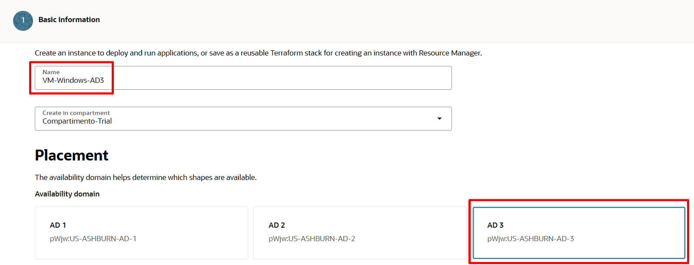
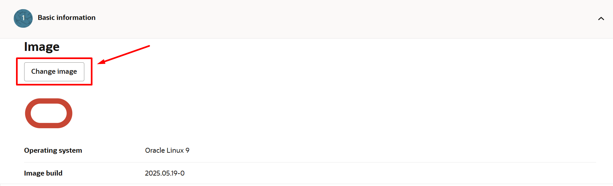
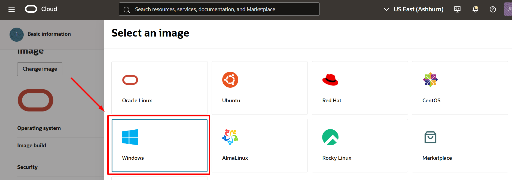


2. Ao inserir as informações de rede, lembre-se de escolher a opção “Assign a Public IP address” para Atribuir um endereço IP público à instância de computação.


*A criação leva geralmente 5 minutos.*

Uma vez criada, siga os passos anteriores para encontar o IP público da VM Windows e abra o "Remote Desktop Connection" no Menu Principal do seu computador. Para acessar o Windows VM, no Menu Principal do seu computador escolha “run”, digite “mstsc”, depois clique em “OK”.


3. Use o IP público da instância e clique em "Connect"


> **Note:** Você receberá um ERRO ao tentar se conectar, o que é normal, uma vez que precisamos configurar as "Regras de Acesso" do firewall.

Você provavelmente notou que a VM Linux pode ser acessada pela chave SSH logo após sua criação, mas a instância do Windows não pode ser acessada por RDP.
Para acessar o Windows Compute, precisamos configurar algumas regras de firewall.
As regras de firewall são definidas dentro de um objeto chamado “Security List”, que pode ser acessado dentro de uma sub-rede.
As regras de segurança estão dentro da lista de segurança, a partir dela podemos configurar quais portas e protocolos têm permissão para tráfego dentro de uma sub-rede.


4. Clique no menu lateral em: Networking -> Virtual Cloud Networks -> VCN-Trial

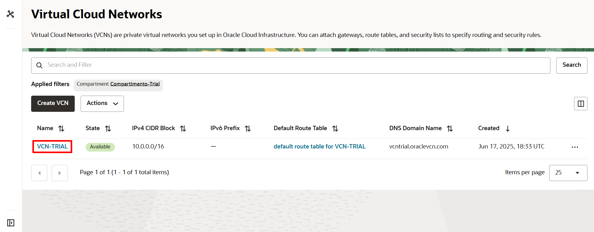

5. Clique em: Security List -> Default Security List for VCN-Trial

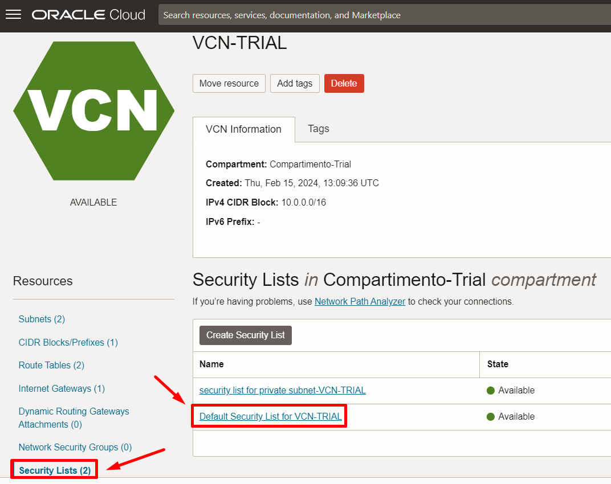

Para acessar as regras de firewall do VCN, escolha a Security List que deseja configurar. Em nosso exemplo, você encontrará a “Default Security List” já criada em nosso VCN. Clique na lista de segurança “Default Security List” e então o console de regras de acesso aparecerá.

6. Dentro de Security List, clique em “Add Ingress Rules”.


* Source Type: CIDR 
* Source CIDR: 0.0.0.0/0 
* IP Protocol: RDP (TCP/3389) 
* Source Port Range: All 
* Destination Port Range: 3389

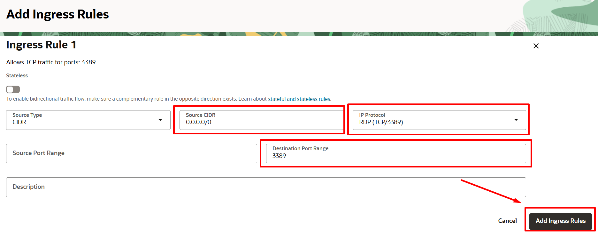

7. Para acessar o Windows VM, no Menu Principal do seu computador escolha “run”, digite “mstsc”, depois clique em “OK”.


8. Use o IP Público da instância e clique em “Connect”.


9. Se tudo estiver configurado corretamente, você será transportado para a página de login do Windows, onde precisará alterar a senha OPC no primeiro acesso.

Veja onde encontrar a senha do Windows:


10. Concluindo esta tarefa, você verá que agora temos 3 instâncias de computação, cada uma em seu próprio Domínio de Disponibilidade (AD).


Você pode **seguir para o próximo Lab**.

## Conclusão

Nesta sessão você aprendeu a criar Máquina Virtuais Linux e Windows e aprendeu como acessá-las.

## Autoria

- **Autores** - Arthur Vianna, Luiz de Oliveira, Thais Henrique
- **Último Updated Por/Data** - Arthur Vianna, Jul/2025