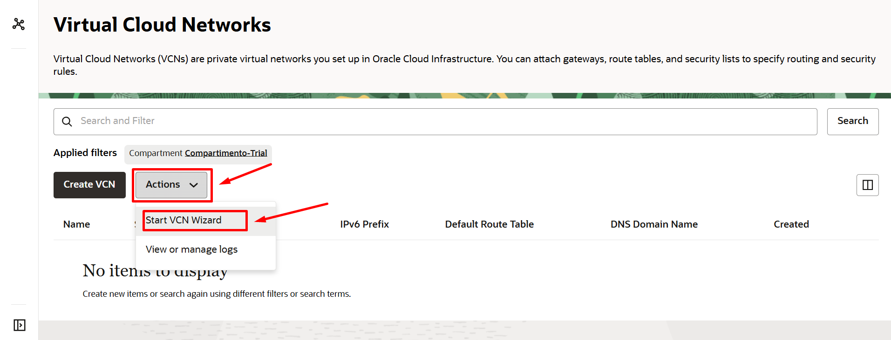
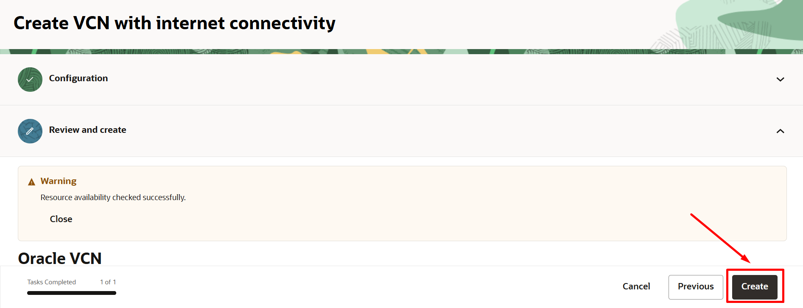
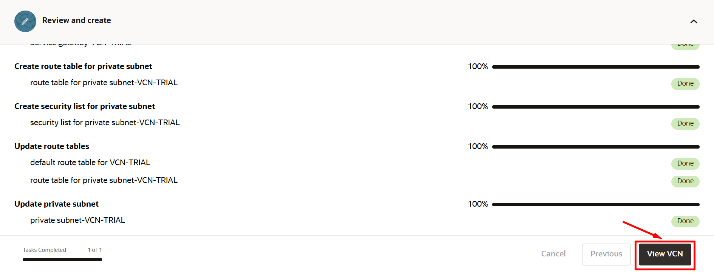
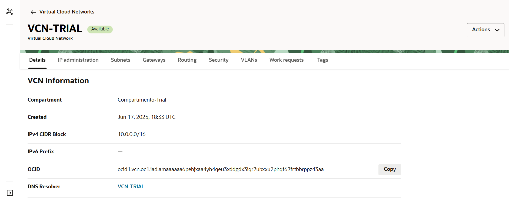

# Criar uma Virtual Cloud Network (VCN)

## Introdução

**Networking, Virtual Cloud Network e Recursos de Rede**

Uma VCN é uma rede definida por software que você configura nos data centers do Oracle Cloud Infrastructure em determinada região. Uma sub-rede é uma subdivisão de uma VCN. Para obter uma visão geral de VCNs, tamanho permitido, componentes padrão da VCN e cenários para uso de uma VCN, consulte [Visão Geral do Serviço Networking.](https://docs.oracle.com/pt-br/iaas/Content/Network/Concepts/overview.htm#network_landing)

Neste Lab você vai aprender a provisiona uma Virtual Cloud Network (VCN) com acesso a internet.

*Tempo estimado para o Lab:* 15 Minutos

### Objetivos

* Criar uma Virtual Cloud Network (VCN)

## Task 1: Criar uma VCN (Virtual Cloud Network)

1.	No menu principal, clique em "Networking" e escolha "Virtual Cloud Networks"

2.	Escolha o compartimento criado no Lab 1: "Compartimento-Trial"

3. Clique em "Start VCN Wizard"

> **Note:** Usando a opção "Start VCN Wizard" você deixa toda a estrutura de rede pronta em menos de 5 minutos.

4. Escolha a primeira opção: "VCN with Internet Connectivity"

5. Configure os parâmetros básicos da VCN e depois clique em "Next"

* Nome: VCN-TRIAL
* Compartimento: Compartimento-Trial
* VCN CIDR Block: 10.0.0.0/16 
* Sub-rede Pública (Public Subnet): 10.0.0.0/24 
* Sub-rede Privada (Private Subnet): 10.0.1.0/24

6. Revise os componentes de rede que serão criados e clique em "Create"

7. Acompanhe o status dos recursos sendo criados e depois clique em "View VCN":

8. Veja que sua VCN foi criada muito rapidamente. Aproveite agora para explorar sua VCN e conferir os recursos que foram criados.

9. Volte um nível para também ver sua VCN em "Virtual Cloud Networks".

10. Acesse novamente sua VCN.

Ao final você deve ter: 1 VCN, 2 sub-redes regionais (pública e privada), 1 Internet Gateway, 1 NAT Gateway e 1 Service Gateway, todos prontos para uso.

Você pode **seguir para o próximo Lab**.

## Conclusão

Nesta sessão você aprendeu a criar uma Virtual Cloud Network (VCN) na prática.

## Autoria

- **Autores** - Arthur Vianna, Luiz de Oliveira, Thais Henrique
- **Último Updated Por/Data** - Arthur Vianna, Jul/2025