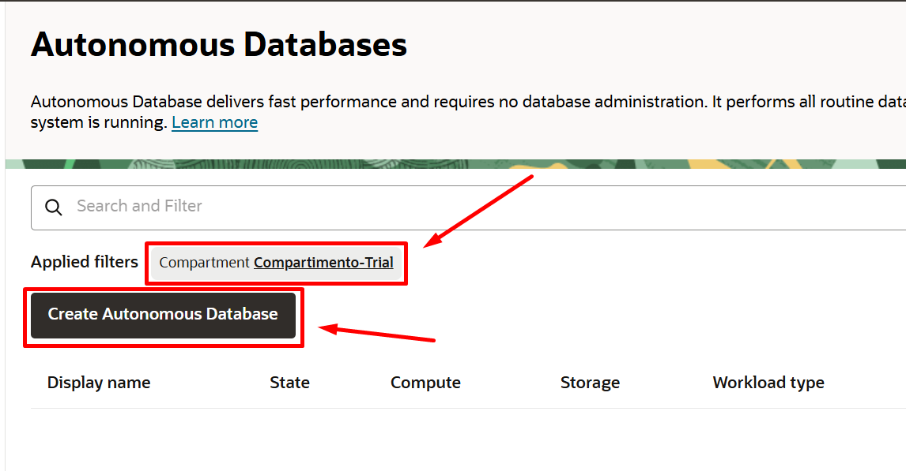
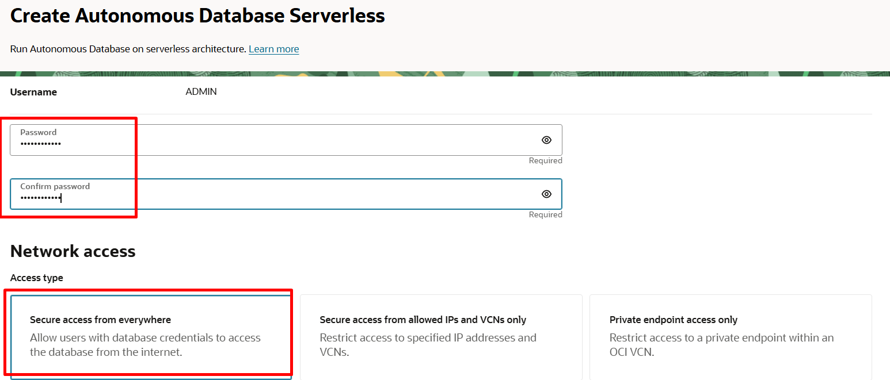
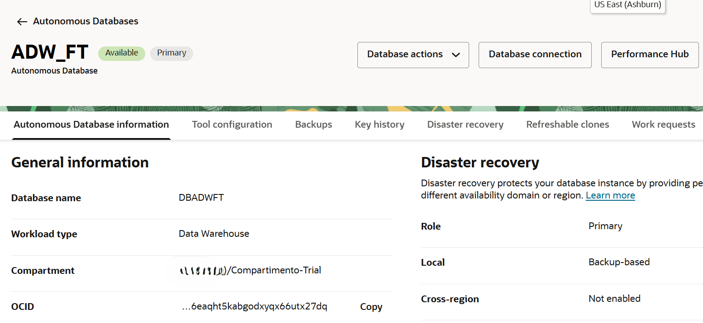
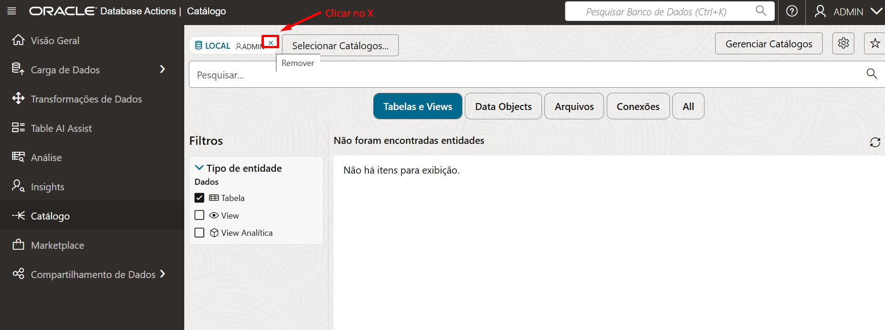
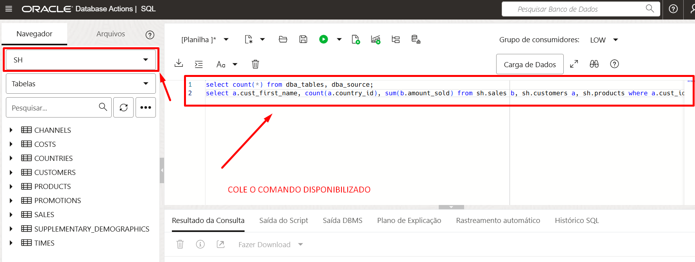
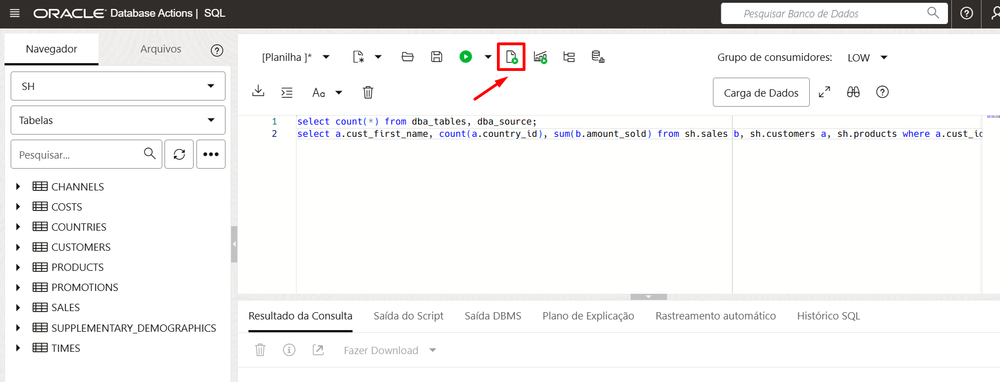
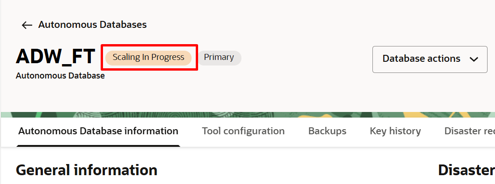
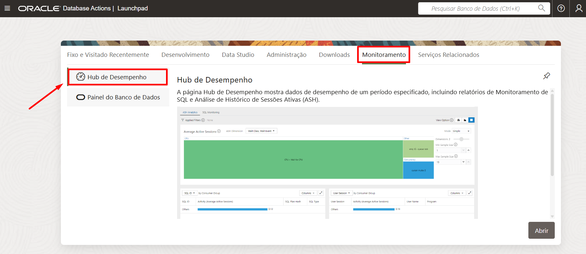
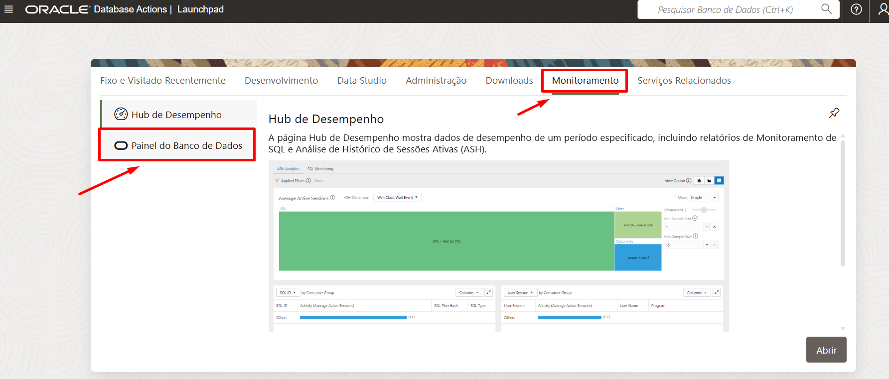
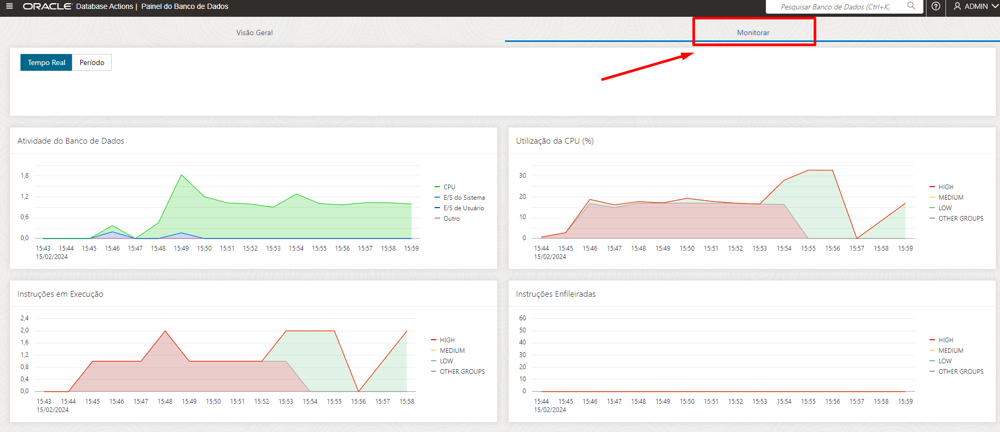

# Criar um Autonomous Database

## Introdução

Neste Lab você vai aprender a provisionar um Autonomous Database na Oracle Cloud Infrastructure

***Overview***

Oracle Cloud Infrastructure Autonomous Database é um ambiente de banco de dados totalmente gerenciado e pré-configurado com três tipos de carga de trabalho disponíveis, Autonomous Transaction Processing, Autonomous Data Warehouse e Autonomous JSON. Você não precisa configurar ou gerenciar nenhum hardware ou instalar nenhum software. Após o provisionamento, você pode dimensionar o número de núcleos de CPU ou a capacidade de armazenamento do banco de dados a qualquer momento, sem afetar a disponibilidade ou o desempenho. O Banco de Dados Autônomo cuida da criação do banco de dados, bem como das seguintes tarefas de manutenção:
* Backup do Banco de dados
* Patching do Banco de dados
* Upgrading do Banco de dados
* Tuning do Banco de dados


***Tipos de cargas de trabalho disponíveis***

Autonomous Database oferece três tipos de workloads:
* Autonomous Transaction Processing - configura o banco de dados para uma carga de trabalho transacional, com uma tendência para altos volumes de acesso a dados aleatórios.
* Autonomous Data Warehouse - configura o banco de dados para um suporte de decisão ou carga de trabalho de data warehouse, com uma tendência para grandes operações de digitalização de dados.
* Oracle Autonomous JSON - é um serviço de banco de dados de documentos em nuvem que simplifica o desenvolvimento de aplicativos centrados em JSON.

*Tempo estimado para o Lab:* 25 Minutos

### Objetivos

Neste Laboratório você vai:
* Provisionar um Autonomous Database (Oracle Autonomous Data Warehouse)
* Explorar os recursos disponíveis de forma nativa dentro do Banco de Dados (Data Tools)
* Conhecer ECPU scaling
* Explorar o Performance Hub


## Task 1: Processo de criação do Autonomous Database

Para iniciar o processo de criação do Autonomous Database:

1.	Clique no menu no lado esquerdo da tela principal, escolha Oracle Database, e depois “Autonomous Database"


2.	Clique em "Create Autonomous Database" e você será redirecionado para a criação do Autonomous Database.



3.	Preencha os campo necessários para a criação do seu Autonomous Database conforme mostrado abaixo:


* Display Name: **Dê um nome para seu banco**
* Database name: **Dê um nome para seu banco**
* Choose a workload type : Para este Workshop, por favor selecione **Data Warehouse**
* Choose a deployment type: **Serverless**


* Choose database version: **19c**
* ECPU count: **2**
* Storage (TB): **1**



* Create administrator credentials: **Crie um password para o usuário ADMIN**
* Choose network access: **Secure access from everywhere**

> **Note:** Password must be 12 to 30 characters and contain at least one uppercase letter, one lowercase letter, and one number. The password cannot contain the double quote (") character or the username "admin".*


* Coloque um e-mail para contato: **Seu e-mail**
* Agora finalize a criação clicando no  botão **"Create Autonomous Database"**

Agora basta aguardar alguns minutos e em seguida você verá a tela:



*Seu Banco de Dado Autonomous foi provisionado com sucesso!*

## Task 2: Usar os recursos nativos do Autonomous Database

A maioria das operações do banco de dados autônomo podem ser feitas nos botões superiores principais da tela:


1.	Clique no botão **“Database Actions”** e depois em **"View all database actions"**. Você será redirecionado para uma nova aba


2. Faça login **(se necessário)** no banco com o usuário ADMIN e a senha que você criou na Task 1


3. Selecione a opção "Catalog"
   


Use a página Catalog para obter informações sobre as entidades disponíveis no Oracle Autonomous Database. Você pode ver os dados em uma entidade, as fontes desses dados, os objetos derivados da entidade e o impacto nos objetos derivados das alterações nas fontes.

*Atenção: Clique no **X** conforme a imagem*



4. Selecione o schema SH digitando: **owner=SH AND type=TABLE** e selecione a tabela **SALES**


5. Explore os campos de visualização, linhagem, impacto e estatísticas. Quando finalizar a exploração clique no botão **Close**


6. Clique no logo da Oracle no topo da página para voltar a tela principal.


## Task 3: Scaling de ECPUs e Monitoramento de SQL Statements

1. Na tela principal selecione **SQL**


Execute queries e scripts, e crie objetos no Banco de dados através do SQL Worksheet

2. Selecione o schema SH, copie o comando abaixo e cole no SQL Worksheet e em seguida clique no botão 'Run Script'

```
select count(*) from dba_tables, dba_source;
select a.cust_first_name, count(a.country_id), sum(b.amount_sold) from sh.sales b, sh.customers a, sh.products where a.cust_id = b.cust_id group by a.cust_first_name;
```





3.  Volte para a tela de 'Autonomous Database Details', clique no botão **Manage resource allocation**


4. Aumente para **4** ECPUs e clique no botão **Apply**


5. Após confirmar o scale, o ADW na console mostrará a frase **"SCALING IN PROGRESS"** e o banco continuará online.



*Observação: Volte a tela do SQL e verifique se as querys continuam em execução, caso queira execute um novo select.*
```
select count(*) from (select * from dba_source, v$sqltext);
```

5. Volte para a tela principal clicando no logo Oracle no topo da página e em seguida selecione **HUB DE DESEMPENHO**




Use a ferramenta Hub de Desempenho para analisar e ajustar o desempenho de um Autonomous Database selecionado.
Com esta ferramenta, você pode visualizar dados de desempenho históricos e em tempo real. Ao visualizar dados históricos no Hub de Desempenho, você está visualizando estatísticas coletadas como parte dos instantâneos de hora em hora de seu banco de dados.

6.  Selecione **SQL Monitoring** e você verá a lista dos SQl Statements


7. Clique no **SQL ID** da Query que você quer explorar:


8. Explore as outras abas como SQL Text, Atividades e Métricas. Podemos obter informações muito importantes como CPU utilizada ou quanto de memória estamos utilizando para determinada execução.


Outra maneira de consultar as atividades do banco de dados é durante a execução de comandos, você pode mudar para a visualização de atividades em Database Dashboard dentro de Database Actions na console do OCI e acompanhar a atividade do banco de dados.

9.  Volte para a tela de 'Autonomous Database Details' e clique no botão **Database Actions** e depois em **"View all database actions"**


10.  Selecione **Painel do Banco de Dados**

 

11.  Selecione **Monitor**

 


## Conclusão

Nesta sessão você aprendeu a provisionar um Oracle Autonomous Data Warehouse. Explorou a ferramenta de Catalog nativa desse Autonomous Database e  aprendeu a monitorar o desempenho e os SQL statements que são executados no banco de dados.

## Autoria

- **Autores** - Arthur Vianna, Luiz de Oliveira, Thais Henrique
- **Último Update Por/Data** - Arthur Vianna, Jul/2025