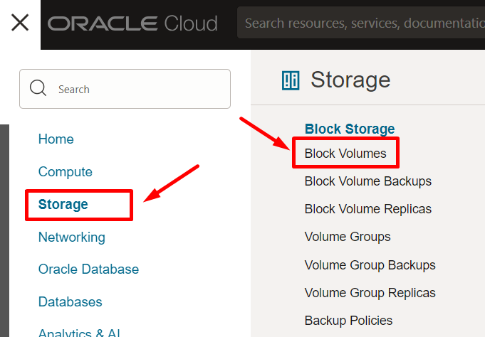
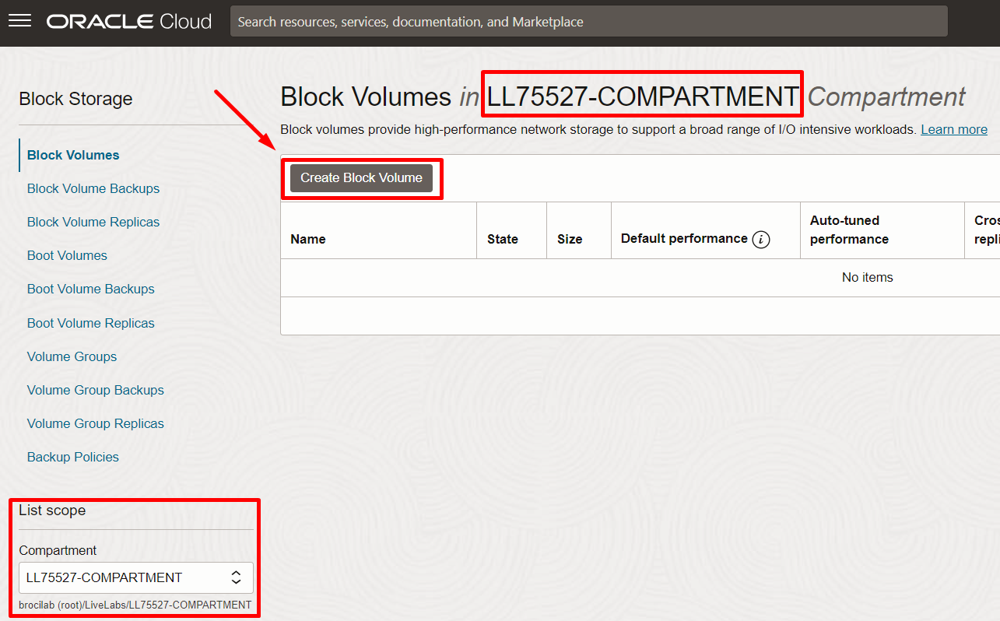
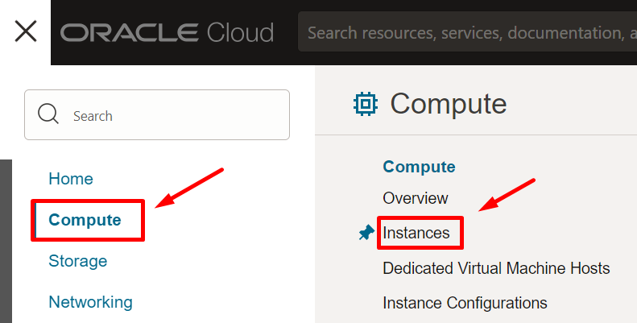
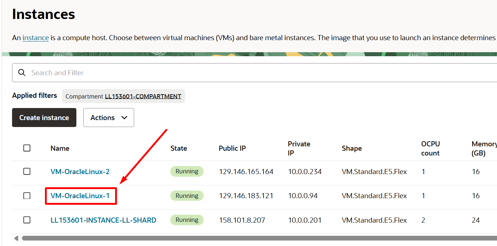
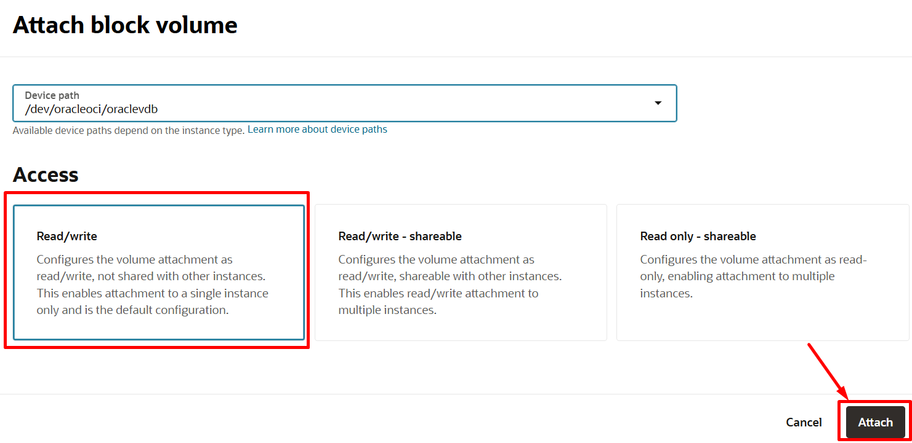
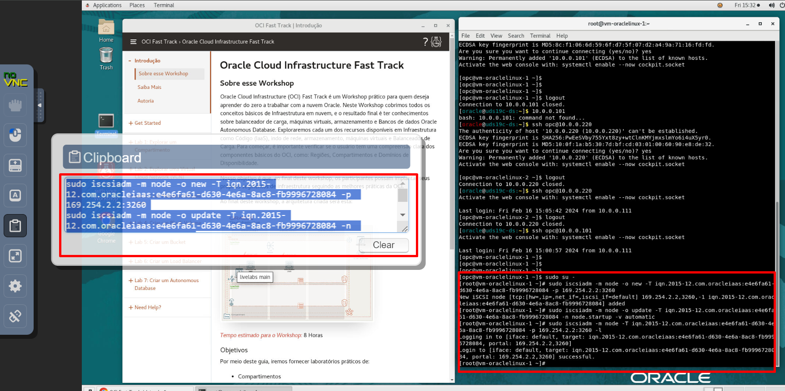

# Criar um Block Volume

## Introdução

O serviço Oracle Cloud Infrastructure Block Volume permite provisionar e gerenciar dinamicamente os volumes de armazenamento em blocos . Você pode criar, anexar, conectar e mover volumes, bem como alterar o desempenho do volume, conforme necessário, para atender aos requisitos de armazenamento, de desempenho e do aplicativo. Depois de anexar e conectar um volume a uma instância, você pode usar o volume como disco rígido comum. Também é possível desconectar um volume e anexá-lo a outra instância sem perda de dados.

Neste Lab você vai aprender a trabalhar com Block Storage dentro da Oracle Cloud Infrastructure

*Tempo estimado para o Lab:* 20 Minutos

### Objetivos

* Criar um volume de Block Storage de 500 GB.
* Anexar o Block Storage a uma instância de computação.

## Task 1: Criar volume de Block Storage

1.	No menu principal, clique em **Storage** e em **Block Volumes**.



2. Então, clique em **Create Block Volume**, preencha o formulário como abaixo e clique em **Create Block Volume**.

- **Name**: block_vol500GB
- **Create in Compartment**: `<seu-compartment>`
- **Availability Domain**: AD 1
- **Size**: 500 GB
- **Volume Performance**: Balanced

*Selecione o Availability Domain (AD) do block volume como sendo o mesmo da instância **VM-OracleLinux-1***

Relembre como verificar o AD das VMs.





## Task 2: Conectar o block volume a uma instância de computação

1.	No menu principal, clique em **Compute** e em **Instances** para acessar sua instância previamente provisionada.



2. Uma vez clicando na instância correspondente, desça a página e, no menu 'Resources', clique em **Attached block volumes** e **Attach block volume**.




3. Preencha o formulário como abaixo e clique em **Attach**.

- **Device path**: /dev/oracleoci/oraclevdb
- **Attachment type**: ISCSI




4. No lado direito, clique no ícone de três pontos e em **iSCSI Commands & Information**.


5. Copie o comando para 'Connect' e clique em **Close**.


6. No Terminal, inicialmente, se conecte à instância de computação utilizando o **IP PRIVADO** **(VM-OracleLinux-1)** e execute o comando copiado.

**Relembre como encontrar o IP privado.**


``` shell
<copy>
ssh opc@<ip-privado-da-máquina>
sudo su -
<comando-connect>
</copy>
```

*Neste ponto, estamos acessando a máquina, utilizando o usuário root e executando o comando de 'attach'.*



Apenas mais um exemplo do comando ISCSI com zoom.


7. Execute o comando abaixo para detectar o novo dispositivo:

``` shell
fdisk -l
```


## Task 3: Formatar block volume e montar na instância

1. Ainda conectado na máquina VM-OracleLinux-1, agora formate o disco com o comando abaixo:

``` shell
mkfs /dev/sdb
```


2. Crie um diretório a ser utilizado como um ponto de montagem para o novo volume de disco com o comando abaixo:

``` shell
mkdir /vol500g
```


3. Monte o novo volume de disco e cheque se o disco está disponível com os comandos abaixo:

``` shell
mount /dev/sdb /vol500g
df -h
```


Você pode **seguir para o próximo Lab**.

## Conclusão

Nesta sessão você aprendeu sobre Block Volumes na prática.

## Autoria

- **Autores** - Arthur Vianna, Lucas de Almeida, Luiz de Oliveira, Thais Henrique
- **Último Update Por/Date** - Arthur Vianna, Jul/2025