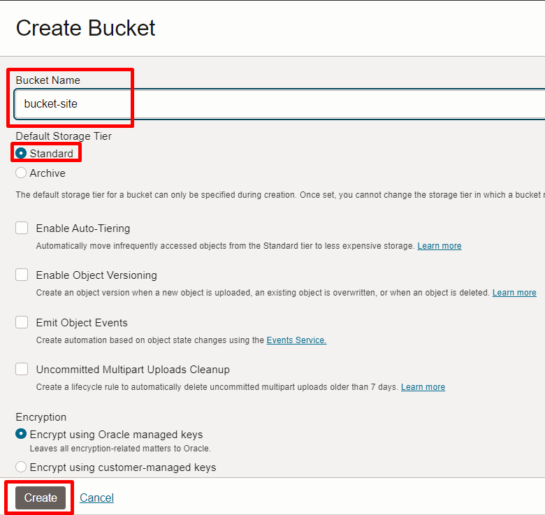
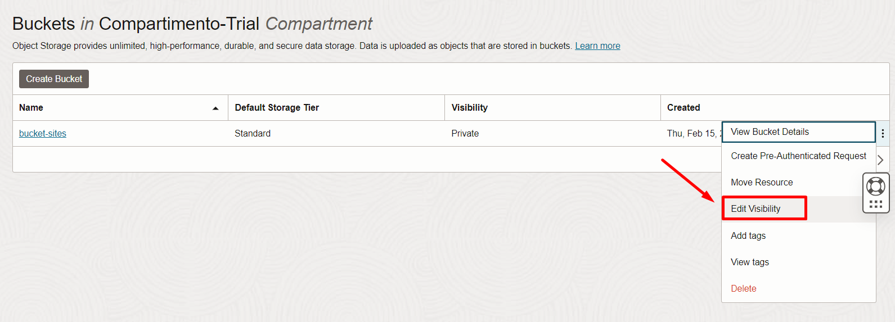
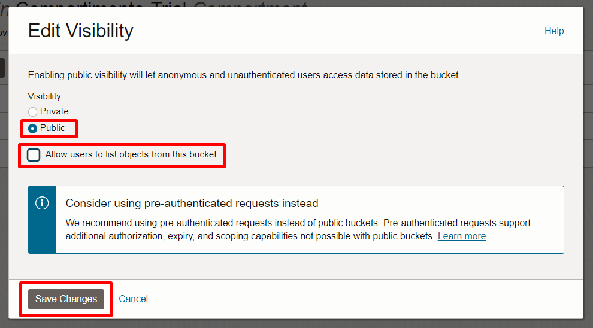
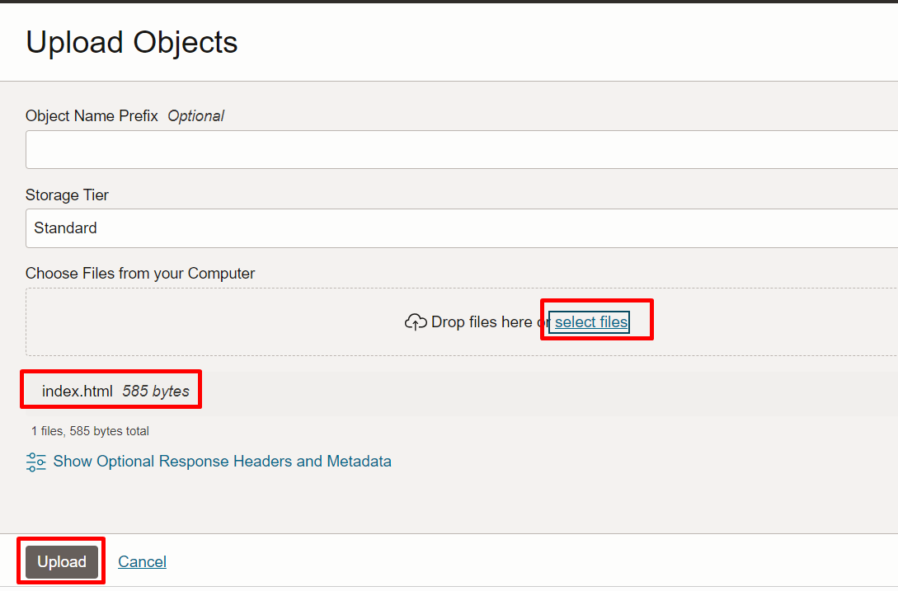
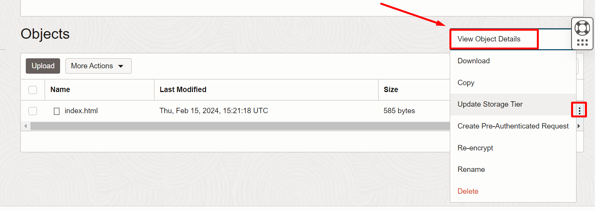

# Criar um Bucket

## Introdução

O serviço Oracle Cloud Infrastructure Object Storage é uma plataforma de armazenamento de alto desempenho em escala de internet que oferece durabilidade de dados confiável e econômica. O serviço Object Storage pode armazenar uma quantidade ilimitada de dados não estruturados de qualquer tipo de conteúdo, incluindo dados analíticos e conteúdo avançado, como imagens e vídeos..

Neste Lab você vai aprender a trabalhar com Object Storage dentro da Oracle Cloud Infrastructure

*Tempo estimado para o Lab:* 10 Minutos

### Objetivos

* Criar um bucket na OCI.
* Criar um site estático utilizando um bucket.

## Task 1: Criar um bucket

1.	No menu principal, clique em **Storage** e em **Buckets**.


2. Então, clique em **Create Bucket**.


3. Preencha o formulário como abaixo e clique em **Create**.

- **Bucket Name**: "Dê um nome para seu bucket"
- **Default Storage Tier**: Standard



## Task 2: Configurar o bucket

1.	Para o seu bucket, clique no ícone dos três pontos e em **Edit Visibility**.



2. Altere a visibilidade para 'Public', desmarque a opção 'Allow users to list objects from this bucket' e clique em **Save Changes**.



## Task 3: Disponibilizar o site estático a partir do bucket criado

1. Acesse o seu bucket.

2. Clique em **Objects**, no menu do lado esquerdo, e em **Upload**.


3. Copie o html abaixo e crie o arquivo index.html através de algum editor de texto (notepad)

> **Note:** Lembre-se de salvar o arquivo com a extensão ".html"

``` shell
<copy>
<!DOCTYPE html>
<html lang="pt-br">
<head>
    <meta charset="UTF-8">
    <meta name="viewport" content="width=device-width, initial-scale=1.0">
    <title>LAB: OCI FAST TRACK</title>
</head>
<body>
    <center> 
            <h1>Site estático no Object Storage</h1> 
               
</body>
</html>
</copy>
```

4. Feito isto, arraste e solte para o campo indicado do bucket e clique em **Upload**.



5. Para o objeto, clique no ícone de três pontos e em **View Object Details**.



6. Clique na URI indicada e confira se o site está disponível.


## Conclusão

Nesta sessão você aprendeu sobre Object Storage na prática.

## Autoria

- **Autores** - Arthur Vianna, Lucas de Almeida, Luiz de Oliveira, Thais Henrique
- **Último Update Por/Date** - Arthur Vianna, Jul/2025