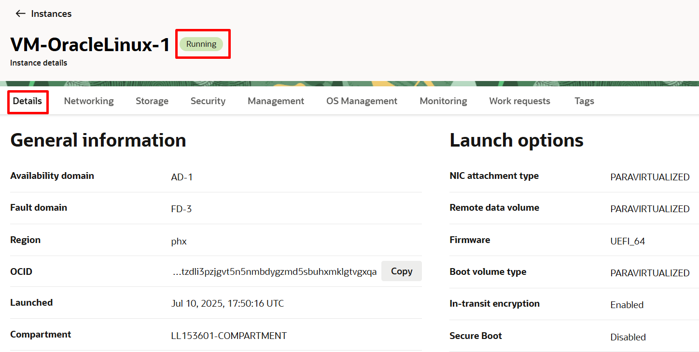

# Criar Máquinas Virtuais (VM)

## Introdução

O Oracle Cloud Infrastructure permite provisionar e gerenciar hosts de computação, conhecidos como instâncias. Você pode criar instâncias conforme necessário para atender aos seus requisitos de computação e aplicativo. Depois de criar uma instância, você pode acessá-la de forma segura pelo seu computador, reiniciá-la, anexar e desanexar volumes e encerrá-la quando terminar de usá-la.

Nesse Lab você vai aprender a criar 2 máquinas virtuais Linux.

*Tempo estimado para o Lab:* 35 Minutos

### Objetivos

* Criar um par de chaves SSH no OCI Cloud Shell
* Criar 2 máquinas virtuais (VM) Linux
* Acessar as instâncias


## Task 1: Criar um par de chaves SSH

1.	Acesse a máquina do NoVNC clicando em **Launch Remote Desktop** ou apenas acesse a aba do NoVNC caso já esteja aberta.


Caso o **Terminal** não esteja aberto você pode abri-lo novamente.


> **Note:** Utilize a Área de Transferencia/Clipboard do NoVNC para facilitar o processo de colar dentro e fora do Terminal. A partir de agora sempre que precisar copiar/colar algo no Terminal e também do Terminal para fora dele utilize a Área de Transferência


2.	Crie um par de chaves RSA com o comando:

```
ssh-keygen -t rsa
```

* Mantenha o nome original (id_rsa) apertando enter
* O campo “Key Passphrase” é opcional
* Aperte "ENTER" novamente até finalizar a criação


3. Exiba o conteúdo da chave pública que você criou utilizando o comando:

```
cat ~/.ssh/id_rsa.pub
```
Utilize o Clipboard para colar o comando e depois copie do Clipboard e cole utilizando o botão direito do mouse no terminal em "Paste". Feito isso execute o comando apertando "Enter".


Selecione o conteúdo no terminal e utilize o botão direito do mouse para copiar em "Copy".


* Selecione, copie e cole o conteúdo dessa chave na Área de Transferencia/Clipboard conforme imagem abaixo, **e se possível guarde em um bloco de notas**, pois a usaremos para a criação das máquinas virtuais Linux.


Para a criação da VM, usaremos a chave pública. A chave privada será usada apenas para conexão.

## Task 2: Criar 2 máquinas virtuais Oracle Linux

1.	Retornando agora para a console da OCI. No Menu Principal, clique em : Compute > Instances, então “Create Instance”:

> **Note:** Verifique se o seu compartimento está selecionado antes de criar a Instância. Caso não esteja, selecione.


> **Note:** Antes de criar as Instâncias, verifique em qual AD sua máquina do NoNVC foi criada e então utilize os outros 2 ADs para criação das VMs.

**Exemplo: Na imagem abaixo percebe-se que a máquina do NoVNC foi criada no AD-2. Isso significa que você ainda pode utilizar os ADs 1 e 3 para criação de cada uma das máquinas. Caso a máquina do NoVNC tivesse sido criada no AD-1, você ainda teria os ADs 2 e 3 para utilizar e assim por diante. Essa esquematização se aplica apenas ao ambiente sandbox de laboratório do workshop no LiveLabs. Em ambiente reais você pode criar recursos em qualquer AD, desde que os limites e policies necessárias existam.**


* Name of your instance: VM-OracleLinux-1
* Availability Domain: Escolha um que não esteja sendo utilizado pela máquina do NoVNC
* Operating System: Oracle Linux 8
* Instance Type: Virtual Machine
* Instance Shape: AMD VM.Standard.E4.Flex
* Choose SSH Key File: Insira a chave SSH pública (.pub)
* Virtual Cloud Network Compartment: "Seu Compartimento"
* Virtual Cloud Network: "Sua VCN"
* Subnet Compartment: "Seu Compartimento"
* Subnet: Public Subnet
* Lembre-se de escolher o AD certo e seu Compartimento


2. Depois de expandir as opções de Shapes e Network, insira os dados necessários para concluir o processo de criação:


3. Ao inserir as informações de rede, lembre-se de escolher sua VCN (conhecida no Lab 2), sua Subnet Publica (Também Lab 2) e a opção "Automatically assign a public IPv4 address"


4. Copie da Área de Transferência/Clipboard e cole a chave pública SSH criada por você na Task 1 no campo conforme imagem abaixo e clique no botão “Create”.


Você provavelmente terá a nova instância devidamente criada em alguns minutos. Depois de terminar o processo de criação, a tela principal ficará assim:



5. Repita os passos acima para criar a Máquina Virtual (VM) Linux 2, porém desta vez com os dados abaixo:

* Name of your instance: VM-OracleLinux-2
* Availability Domain: Escolha o AD faltante, ou seja, o que não está sendo utilizado pela máquina do NoVNC e nem pela VM-OracleLinux-1
* Operating System: Oracle Linux 8
* Instance Type: Virtual Machine
* Instance Shape: AMD VM.Standard.E4.Flex
* Choose SSH Key File: Insira a chave SSH pública (.pub) **(MESMA CHAVE DA VM-OracleLinux1)**
* Virtual Cloud Network Compartment: "Seu Compartimento"
* Virtual Cloud Network: "Sua VCN"
* Subnet Compartment: "Seu Compartimento"
* Subnet: Public Subnet

> **Note:** Utilize a MESMA chave pública da VM-OracleLinux-1 para a VM-OracleLinux-2.

## Task 3: Acessar a VM Linux pelo Terminal

1. Navegue até Compute -> Instances e colete o IP privado da instância


2. No Terminal da máquina NoVNC, faça a conexão com a máquina criada **(VM-OracleLinux1)** com o comando:

````
<copy>
ssh opc@<ip privado da VM>
</copy>
````

* O usuário default nas instâncias Oracle Linux é opc.
* Teste também o acesso na VM-OracleLinux2 posteriormente.


> **Note:** Para desconectar da VM e voltar ao terminal do NoVNC utilize o comando **logout**.

3. Concluindo esta tarefa, você verá que agora temos 2 instâncias de computação criadas juntamente com a instância do NoVNC, cada uma em seu próprio Domínio de Disponibilidade (AD).


Você pode **seguir para o próximo Lab**.

## Conclusão

Nesta sessão você aprendeu a criar Máquinas Virtuais Linux e como acessá-las.

## Autoria

- **Autores** - Arthur Vianna, Luiz de Oliveira, Thais Henrique
- **Último Updated Por/Data** - Arthur Vianna, Jul/2025