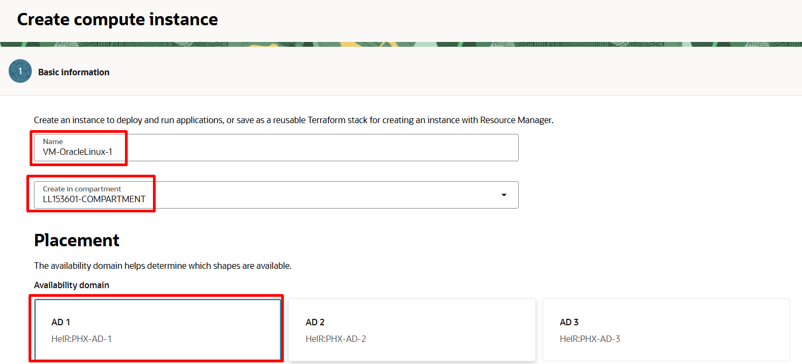

# Criar Máquinas Virtuais (VM)

## Introdução

O Oracle Cloud Infrastructure permite provisionar e gerenciar hosts de computação, conhecidos como instâncias. Você pode criar instâncias conforme necessário para atender aos seus requisitos de computação e aplicativo. Depois de criar uma instância, você pode acessá-la de forma segura pelo seu computador, reiniciá-la, anexar e desanexar volumes e encerrá-la quando terminar de usá-la.

Nesse Lab você vai aprender a criar 2 máquinas virtuais Linux.

*Tempo estimado para o Lab:* 35 Minutos

### Objetivos

* Criar um par de chaves SSH no OCI Cloud Shell
* Criar 2 máquinas virtuais (VM) Linux
* Acessar as instâncias


## Task 1: Criar um par de chaves SSH

1.	Acesse o Terminal


2.	Crie um par de chaves RSA com o comando:

```
ssh-keygen -t rsa
```

* Mantenha o nome original (id_rsa) apertando enter
* O campo “Key Passphrase” é opcional


> **Note:** No NoVNC ative a função "Mostrar Teclado" para que seja possível digitar o caracter "~" no próximo passo


3. Exiba o conteúdo da chave pública que você criou utilizando o comando:

```
cat ~/.ssh/id_rsa.pub
```

* Selecione e Copie o conteúdo dessa chave, pois a usaremos para a criação das máquinas virtuais Linux


Para a criação da VM, usaremos a chave pública. A chave privada será usada apenas para conexão.

> **Note:** Cole esse conteúdo na Área de Transferencia do NoVNC para facilitar o processo de colar dentro do Terminal. A partir de agora sempre que precisar copiar/colar algo no Terminal utilize a Área de Transferência


## Task 2: Criar 2 máquinas virtuais Oracle Linux

1.	No Menu Principal, clique em : Compute > Instances, então “Create Instance” (Botão Azul) :


* Name of your instance: VM-OracleLinux-AD1
* Availability Domain: AD 1
* Operating System: Oracle Linux 7.9
* Instance Type: Virtual Machine
* Instance Shape: AMD VM.Standard.E4.Flex
* Choose SSH Key File: Insira a chave SSH pública (.pub)
* Virtual Cloud Network Compartment: "Compartimento-Trial"
* Virtual Cloud Network: "VCN-TRIAL"
* Subnet Compartment: "Compartimento-Trial"
* Subnet: Public Subnet
* Lembre-se de escolher o AD certo e seu Compartimento



2. Depois de expandir as opções de Shapes e Network, insira os dados necessários para concluir o processo de criação:


3. Ao inserir as informações de rede, lembre-se de escolher a Subnet Publica e a opção "Assign a public IPv4 address"


4. Cole a chave pública SSH criada por você no exercício 3A e clique no botão “Create”.


Você provavelmente terá a nova instância devidamente criada em alguns minutos. Depois de terminar o processo de criação, a tela principal ficará assim:


5. Repita os passos acima para criar a Máquina Virtual (VM) Linux 2, porém desta vez com os dados abaixo:

* Name of your instance: VM-OracleLinux-AD2
* Availability Domain: AD 2
* Operating System: Oracle Linux 7.9
* Instance Type: Virtual Machine
* Instance Shape: AMD VM.Standard.E4.Flex
* Choose SSH Key File: Insira a chave SSH pública (.pub)
* Virtual Cloud Network Compartment: "Compartimento-Trial"
* Virtual Cloud Network: "VCN-TRIAL"
* Subnet Compartment: "Compartimento-Trial"
* Subnet: Public Subnet

## Task 3: Acessar a VM Linux pelo Terminal

1. Pegue o IP privado da instância


2. No Terminal, faça conexão com a máquina criada com o comando:

````
<copy>
ssh opc@<ip privado da VM>
</copy>
````

* O usuário default nas instâncias Oracle Linux é opc


3. Concluindo esta tarefa, você verá que agora temos 2 instâncias de computação, cada uma em seu próprio Domínio de Disponibilidade (AD).


Você pode **seguir para o próximo Lab**.

## Conclusão

Nesta sessão você aprendeu a criar Máquinas Virtuais Linux e como acessá-las.

## Autoria

- **Autores** - Arthur Vianna, Luiz de Oliveira, Thais Henrique
- **Último Updated Por/Data** - Arthur Vianna, Jun/2022