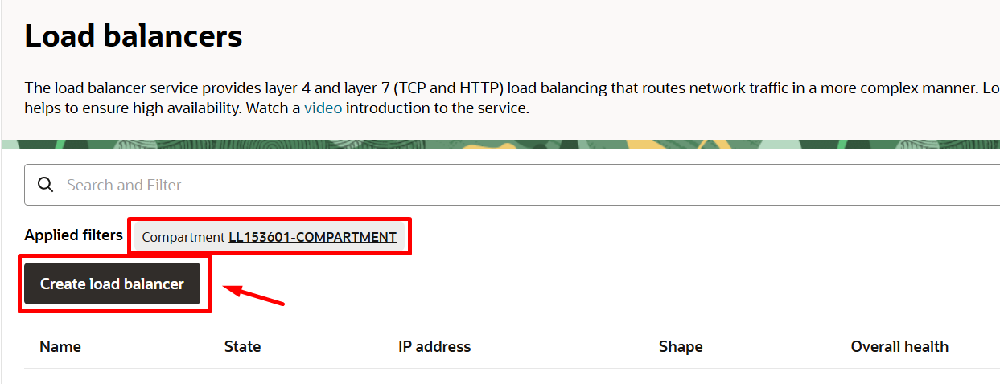
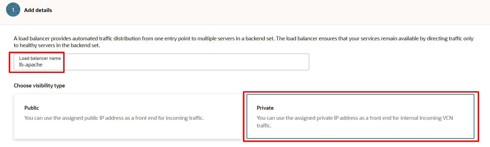

# Criar um Load Balancer

## Introdução

***Overview***

O serviço Oracle Cloud Infrastructure Load Balancing fornece distribuição automatizada de tráfego de um ponto de entrada para vários servidores acessíveis a partir de sua rede de nuvem virtual (VCN). O serviço oferece um balanceador de carga (Load Balancer) com sua escolha de endereço IP público ou privado e largura de banda provisionada.

O serviço de Load Balancer permite que você crie um balanceador de carga público ou privado em seu VCN. Um balanceador de carga público tem um endereço IP público que pode ser acessado pela Internet. Um balanceador de carga privado tem um endereço IP da sub-rede de hospedagem, que é visível apenas em seu VCN. Você pode configurar vários para um endereço IP para balancear a carga do tráfego de Layer 4 e Layer 7 (TCP e HTTP). Os Load Balancers públicos e privados podem rotear o tráfego de dados para qualquer servidor de back-end que seja acessível a partir do VCN.

Seu Load Balancer tem um back-end definido para rotear o tráfego de entrada para suas instâncias de computação. O back-end set é uma entidade lógica que inclui:

- Uma política de load balancing.

- Uma política de health check.

-   SSL handling opcional.

-   Configurações opcionais de persistência de sessão.


### Conceitos de Load Balancing

**Backend Server**

Um servidor de aplicativos responsável por gerar conteúdo em resposta ao tráfego TCP ou HTTP de entrada. Normalmente, você identifica os servidores de aplicativos com uma combinação única de endereço e porta IPv4 de overlay (privado), por exemplo, 10.10.10.1:8080 e 10.10.10.2:8080.

**Backend Set**

Uma entidade lógica definida por uma lista de back-end servers, uma política de load balancing e uma política de health check. A configuração SSL é opcional. O back-end set determina como o Load Balancer direciona o tráfego para a coleção de back-end servers.

**Certificates**

Se você usar HTTPS ou SSL para seu Listener, deverá associar um certificado de servidor SSL (X.509) ao seu Load Balancer. Um certificado permite que o Load Balancer encerre a conexão e descriptografe as solicitações de entrada antes de passá-las para os back-end servers.

**Health Check (verificação de integridade)**

Um teste para confirmar a disponibilidade de back-end servers. Um health check pode ser uma solicitação ou uma tentativa de conexão. Com base em um intervalo de tempo que você especifica, o Load Balancer aplica a política de Health Check para monitorar continuamente os back-end servers. Se um servidor falhar no health check, o Load Balancer tirará o servidor temporariamente da rotação. Se o servidor subsequentemente passar no health check, o Load Balancer o retornará para a rotação.


Neste Lab você vai aprender a trabalhar com Load Balancer dentro da Oracle Cloud Infrastructure

*Tempo estimado para o Lab:* 25 Minutos

### Objetivos 

 * Criar um serviço de Load Balancer privado, com 2 back-end servers executando o aplicativos Apache.

Antes de começarmos a criar o serviço Load Balancer, observe que há algumas tarefas importantes a serem concluídas. Para que algum “serviço” seja testado pelo Load Balancer, é necessário instalar um aplicativo (Apache) nos servidores Linux.

## Task 1: Instalar o aplicativo Apache em servidores Linux


1. Instalar Apache Application Server em cada servidor
	1. Conecte-se no host Linux usando o usuário opc  
	2. Uma vez conectado, mude seu usuário para **ROOT** com o comando: ***`"sudo su – "`***
	3. Instale o pacote Apache no sistema operacional: ***`"sudo yum install httpd -y"`***
	4. Inicie o aplicativo Apache : ***`"sudo apachectl start"`***
	5. Configure o firewall do host local para permitir o tráfego do Apache, para isso use os comandos abaixo no Linux:
		- ***`sudo systemctl enable httpd`***
		- ***`sudo apachectl configtest`***
		- ***`sudo firewall-cmd --permanent --zone=public --add-service=http`***
		- ***`sudo firewall-cmd --reload`***


	6. Para identificar **a primeira instância** de computação usada na interface web (Linux -  AD1), personalize o arquivo ***“index.html”*** Use o seguinte comando como usuário **ROOT**:

> **Note:** Primeiro copie a 1ª linha do código e cole. Depois copie o corpo do código até < / html> e cole. Por último copie a última linha e cole.

```
<copy>
cat <<EOF > /var/www/html/index.html
<!DOCTYPE html>
<html lang="pt-br">
<head>
<meta charset="UTF-8">
<meta name="viewport" content="width=device-width, initial-scale=1.0">
<title>OCI FAST TRACK: Webserver 1</title>
</head>
<body>
<center> 
<h1>Load Balancer Webservers</h1>
<center> 
</body>
</html>
EOF
</copy>
```

2. Na **segunda instância** você repetirá as etapas acima, de **1** a **5**, para identificarmos a segunda instância de computação (Linux – AD2) personalize o arquivo **“index.html”** usando o seguinte comando com usuário **ROOT**:

> **Note:** Primeiro copie a 1ª linha do código e cole. Depois copie o corpo do código até < / html> e cole. Por último copie a última linha e cole.	

```
<copy>
cat <<EOF > /var/www/html/index.html  
<!DOCTYPE html>
<html lang="pt-br">
<head>
<meta charset="UTF-8">
<meta name="viewport" content="width=device-width, initial-scale=1.0">
<title>OCI FAST TRACK: Webserver 2</title>
</head>
<body>
<center> 
<h1>Load Balancer Webservers</h1>
<center> 
</body>
</html>
EOF
</copy>
```

3. Teste o comportamento do Apache, tudo que você precisa fazer, é usar o **IP privado da instância** (VM-OracleLinux-AD1) do Compute no navegador web do noVNC para verificar se a página principal do Apache aparecerá.


Se tudo estiver OK, você pode testar a instalação do Apache na segunda VM (VM-OracleLinux-AD2). Tudo o que você precisa fazer é usar o endereço IP privado da segunda instância no navegador do noVNC e provavelmente obterá uma saída semelhante a da imagem anterior.

**IMPORTANTE:** Certifique-se de iniciar a criação do Load Balancer somente depois que ambas as chamadas no apache estiverem funcionando.

Isso é importante porque se você criar o Load Balancer sem um serviço disponível, o balanceador de carga será criado no estado de “Erro”.

O Load Balancer geralmente leva 5 minutos para "calibrar" seu status.

Nosso objetivo é criar o serviço de Load Balancer somente depois que os dois servidores Apache estiverem em execução, para que o serviço Load Balancer tenha o estado "pronto" e esteja pronto para ser testado.

## Task 2: Criar uma aplicação em Alta Disponibilidade (HA) com Load Balancer e 2 Webservers

1. Para acessar a interface do Load Balancer, mais uma vez, vamos começar a partir do “Menu Principal > Load Balancers”


Clique no botão “Create Load Balancer”:



2. A tela de criação do Load Balancer é um modelo baseado em assistente, onde você será guiado no processo pela interface. Na tela principal, você fornecerá as informações abaixo:
- Name: **lb-apache**
- Visibility Type: **Private** 
- Bandwidth: **10 Mbps**
- VCN: **< Selecione sua VCN >**
- Subnet: **< Selecione sua sub-rede privada >**
- (escolha a sub-rede, mesma sub-rede onde suas instâncias de computação foram criadas)




3. Defina a política do Load Balancer e adicione os servidores de back-end. 
Para adicionar servidores de back-end, clique no botão azul “Add Backends”


4. Insira os Backend Set servers (suas duas VM’s Linux):


5. Como última etapa, defina o tipo de tráfego que será tratado


Assim que o processo de criação for concluído, você terá as seguintes informações:


**Testando o Load Balancer**

6. Para simular um ambiente de aplicativo, precisamos iniciar um serviço da web em ambas as instâncias de Computação.

Para obter saídas diferentes nas chamadas do Load Balancer, adicione conteúdos diferentes ao arquivo Index.html em cada cálculo.


6. Utilize o IP Privado do Load Balancer no navegador do no VNC para visualizar sua aplicação sendo direcionada para os 2 servidores com respostas diferentes no arquivo Index.html

## Conclusão

Nesta sessão você aprendeu a criar uma aplicação em Alta Disponibilidade (HA) com Load Balancer e 2 Webservers.

## Autoria

- **Autores** - Arthur Vianna, Gustavo Sant'ana, Luiz de Oliveira, Thais Henrique
- **Último Update Por/Date** - Arthur Vianna, Jun/2022
