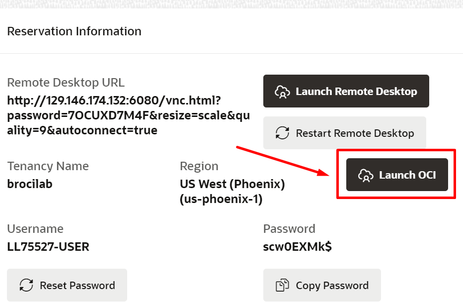
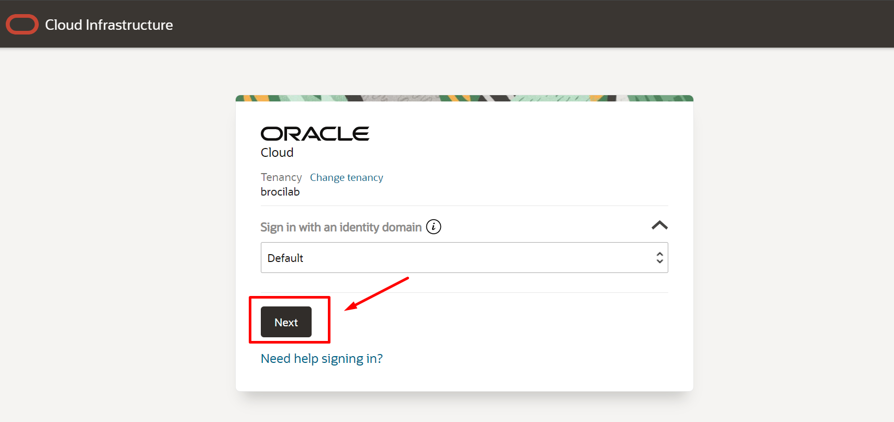
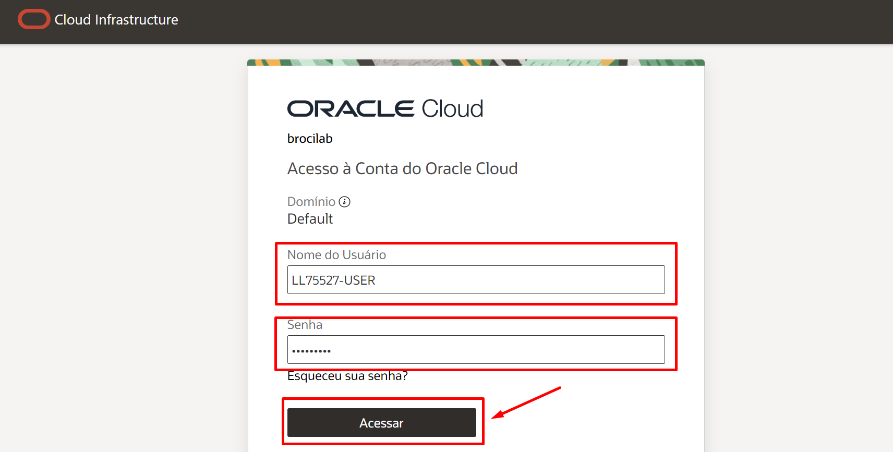
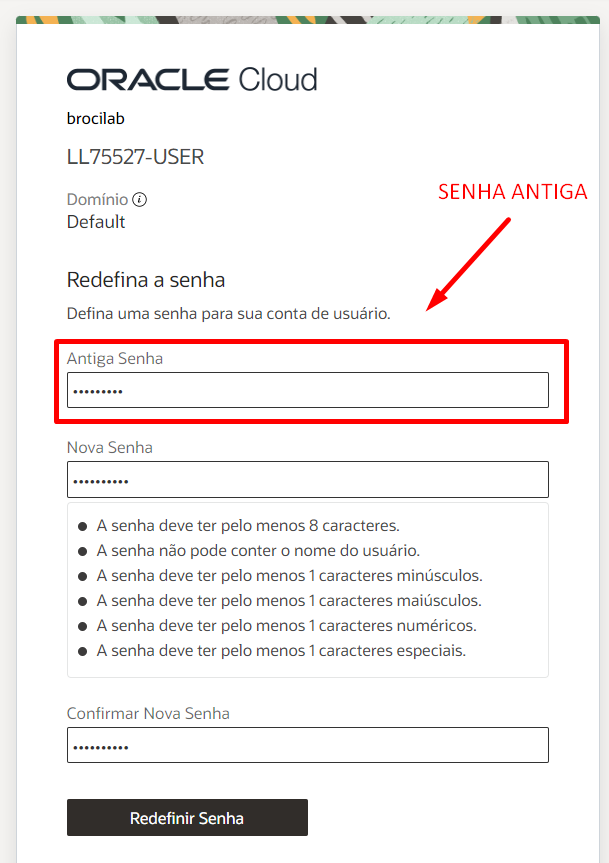
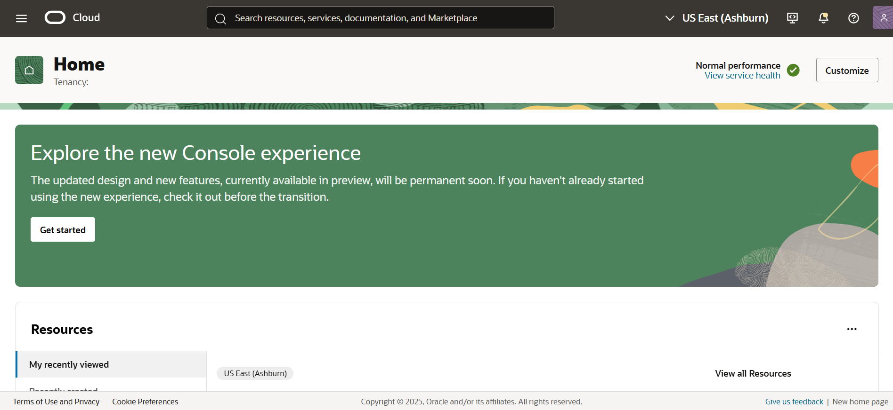
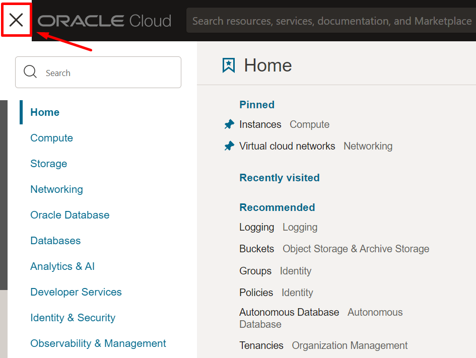
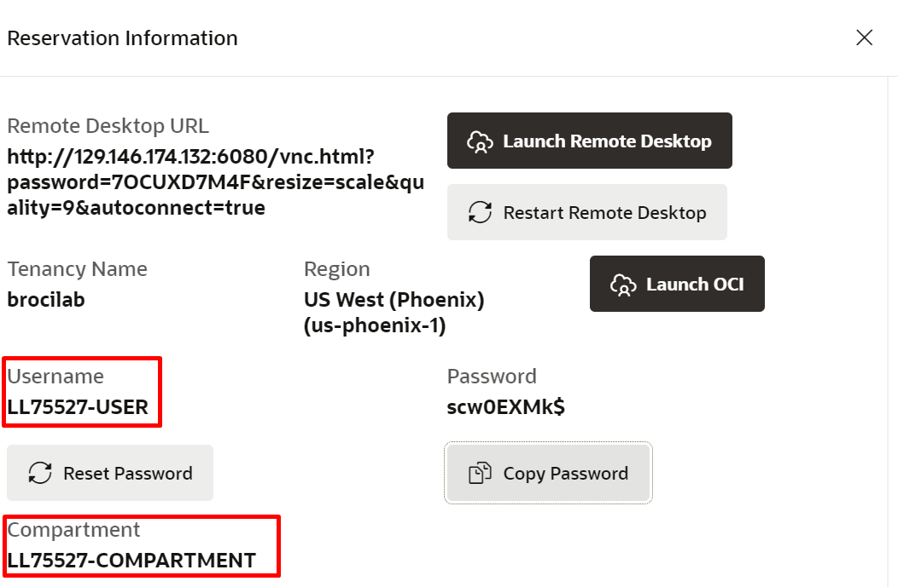

# Explorar um Compartimento

## Introdução

***Regiões (Regions)***

O Oracle Cloud Infrastructure é hospedado em regiões e domínios de disponibilidade. Uma região é uma área geográfica localizada. Uma região é composta por um ou mais domínios de disponibilidade. A maioria dos recursos do Oracle Cloud Infrastructure são específicos da região, como uma rede de nuvem virtual (VCN), ou específicos do domínio de disponibilidade, como uma instância de computação.

As regiões são completamente independentes de outras regiões e podem ser separadas por grandes distâncias - entre países ou mesmo continentes. Geralmente, você implantaria um aplicativo na região onde ele é mais usado, uma vez que usar recursos próximos é mais rápido do que usar recursos distantes. No entanto, você também pode implantar aplicativos em diferentes regiões para:

* Mitigar o risco de eventos em toda a região, como grandes sistemas climáticos ou terremotos
* Atender a diversos requisitos para jurisdições legais, domínios fiscais e outros critérios comerciais ou sociais

***Domínios de disponibilidade (Availability Domains - AD)***

Em uma região, você pode ter até três domínios de disponibilidade (ADs).

Os domínios de disponibilidade na mesma região são conectados uns aos outros por uma rede de baixa latência e alta largura de banda, o que torna possível fornecer conectividade de alta disponibilidade para a Internet e instalações do cliente e construir sistemas replicados em vários domínios de disponibilidade para alta disponibilidade e recuperação de desastres.

Os domínios de disponibilidade são isolados uns dos outros, tolerantes a falhas e muito improváveis de falharem simultaneamente. Como os domínios de disponibilidade não compartilham infraestrutura, como energia ou resfriamento, ou a rede de domínio de
disponibilidade interna, uma falha em um domínio de disponibilidade dentro de uma região provavelmente não afetará a disponibilidade de outros na mesma região

***Trabalhar com compartimentos (Compartments)***

Ao começar a trabalhar com o Oracle Cloud Infrastructure, você precisa pensar cuidadosamente sobre como deseja usar os compartimentos para organizar e isolar seus recursos de nuvem. Os compartimentos são fundamentais para esse processo. Depois de colocar um recurso em um compartimento, você pode movê-lo entre compartimentos.

Ao criar um novo compartimento, você deve fornecer um nome para ele (máximo de 100 caracteres, incluindo letras, números, pontos, hifens e sublinhados) que seja exclusivo em sua hierarquia de compartimentos. Você também deve fornecer uma descrição, que é uma descrição não única e mutável para o compartimento, entre 1 e 400 caracteres. A Oracle também atribuirá ao compartimento um ID exclusivo denominado Oracle Cloud ID (OCID).

Depois que um recurso é criado em um compartimento, você pode movê-lo para outro.

O Console é projetado para exibir seus recursos por compartimento na região atual. Ao trabalhar com seus recursos no Console, você deve escolher em qual compartimento trabalhar em uma lista na página.

Essa lista é filtrada para mostrar apenas os compartimentos na locação que você tem permissão para acessar. Se você for um administrador, terá permissão para visualizar todos os compartimentos e trabalhar com os recursos de qualquer compartimento, mas se for um usuário com acesso limitado, provavelmente não.

Os compartimentos são globais, em todas as regiões, quando você cria um compartimento, ele está disponível em todas as regiões em que o seu aluguel está inscrito.

Neste Lab você vai explorar o recurso Compartimento dentro da Oracle Cloud Infrastructure

*Tempo estimado para o Lab:* 10 Minutos

### Objetivos

* Acesse a Oracle Cloud Console
* Familiarize-se com a interface OCI
* Explore o Compartimento

## Task 0: Conheça os recursos do LiveLabs

1.	Clique em "View Login Info" para conhecermos cada uma das informações.

2.	Vamos explorar cada informação/botões:

* **Launch Remote Desktop**: Você será direcionado para uma máquina virtual pronta (NoVNC) para realizar os próximos Labs a partir desta máquina. A URL **Remote Desktop URL** leva você para o mesmo lugar.
* **Tenancy Name**: Nome do tenancy onde serão executados os Labs.
* **Region**: Região do tenancy onde serão feitos os Labs.
* **Launch OCI**: Você será direcionado para a console da OCI, onde os Labs serão executados em conjunto com a máquina NoVNC do **Launch Remote Desktop**.
* **Username**: Usuário utilizado para fazer o login na OCI.
* **Password**: Senha utilizada para o login na OCI. **SERÁ NECESSÁRIO ALTERAR A SENHA NO PRIMEIRO LOGIN**.
* **Compartment**: Compartimento exclusivo do usuário onde serão criados os recursos. Perceba que: o usuário **LL75527-USER** possui o compartimento **LL75527-COMPARTMENT**, ou seja, o usuário só consegue criar/gerenciar recursos em seu próprio compartimento. Caso tente acessar outro, uma mensagem será exibida informando que a permissão não existe.

## Task 1: Acesse a Console da Oracle Cloud e a máquina NoVNC

1.	Primeiro clique no botão **Launch Remote Desktop** para abrir a máquina NoVNC.

Fazendo isso, uma página irá abrir em seu navegador com a máquina NoVNC. Apenas abra o **Terminal** e siga para o próximo passo.

2.	Agora clique em **Launch OCI**:

3.	Clique em **Next** e insira seu usuário e senha **(que fica na parte de View Login Info)** e clique em "Acessar".

**Será necessário trocar a senha no primeiro login. Para facilitar você pode usar a mesma senha com apenas um caracter diferente na frente e depois clique em "Redefinir Senha". Ex (adicionando um "!"):**

* Senha antiga: scw0EXMk$
* Senha nova: scw0EXMk$**!**

4.  Depois de autenticado explore a tela inicial da Oracle Cloud e também nosso "Menu principal", onde você pode encontrar todos os serviços disponíveis em nosso console

## Task 2: Explorando Compartimentos

1.	No menu principal, clique em "Identity & Security" e escolha "Compartments"

2.	Visualize os Compartments disponíveis.

3.	No menu principal, clique em "Compute" e escolha "Instances"

4.	Identifique seu usuário e seu compartimento novamente em **View Login Info**:

Copie o nome de seu compartimento e se necessário utilize o atalho **CTRL + F** em seu teclado para encontrá-lo após abrir a lista de compartimentos. Após isso clique em seu compartimento.

Após clicar em seu compartimento você verá uma Instância criada conforme imagem abaixo. Essa Instância nada mais é do que a máquina do NoVNC que será utilizada ao longo do Workshop e que foi acessada no Passo 1 da Task 1 .

> **Note:** **ESSA INSTÂNCIA NÃO DEVE SER APAGADA EM NENHUM MOMENTO. CASO ISSO SEJA FEITO, SUA EXPERIÊNCIA EM NOSSO WORKSHOP ESTARÁ PREJUDICADA.**

Você pode **seguir para o próximo Lab**.

## Conclusão

Nesta sessão você aprendeu a acessar a console da Oracle Cloud, explorar a tela inicial e o "Action Menu", além de explorar um compartimento.

## Autoria

- **Autores** - Arthur Vianna, Luiz de Oliveira, Thais Henrique
- **Último Updated Por/Data** - Arthur Vianna, Fev/2024