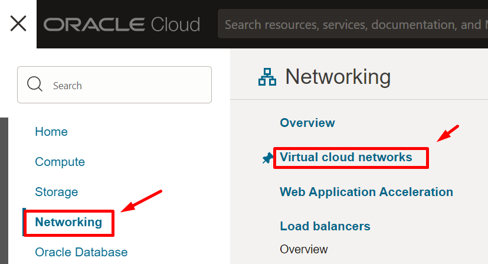
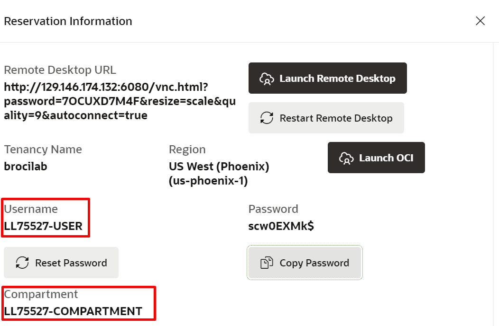
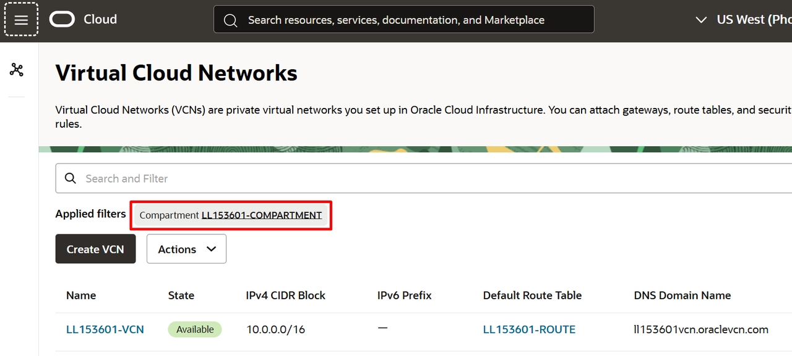
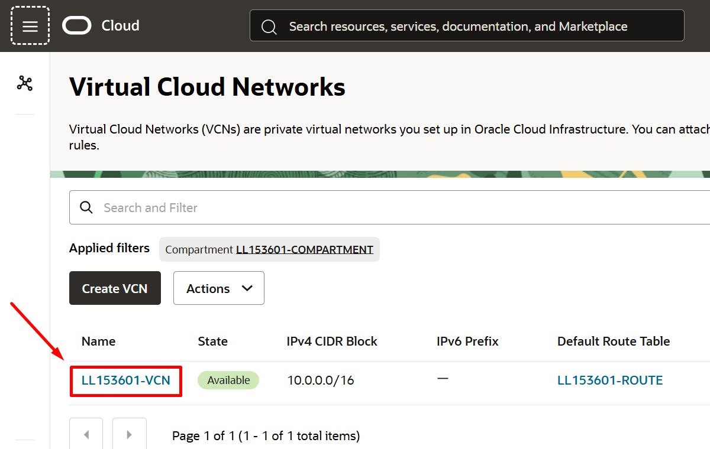
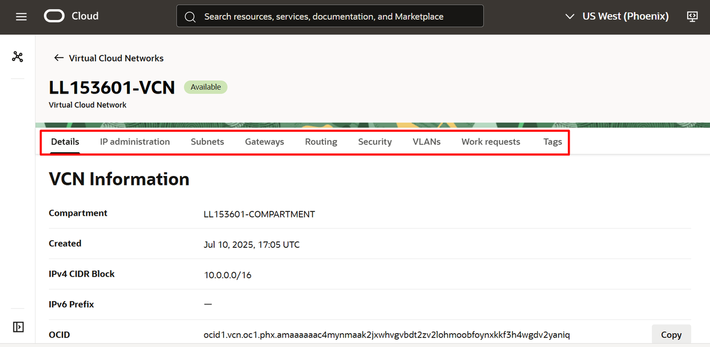

# Explorar uma Virtual Cloud Network (VCN)

## Introdução

**Networking, Virtual Cloud Network e Recursos de Rede**

Uma VCN é uma rede definida por software que você configura nos data centers do Oracle Cloud Infrastructure em determinada região. Uma sub-rede é uma subdivisão de uma VCN. Para obter uma visão geral de VCNs, tamanho permitido, componentes padrão da VCN e cenários para uso de uma VCN, consulte [Visão Geral do Serviço Networking.](https://docs.oracle.com/pt-br/iaas/Content/Network/Concepts/overview.htm#network_landing)

Neste Lab você vai aprender a explorar uma Virtual Cloud Network (VCN) e seus recursos.

*Tempo estimado para o Lab:* 15 Minutos

### Objetivos

* Explorar uma Virtual Cloud Network (VCN)

## Task 1: Explorar uma VCN (Virtual Cloud Network)

1.	No menu principal, clique em "Networking" e escolha "Virtual Cloud Networks"

2.	Relembre seu compartimento (que fica na parte de **View Login Info**) e selecione (caso ainda não esteja selecionado) para visualizar sua VCN:

3. Selecione sua VCN"

4. Explore os recursos de sua VCN

Você pode **seguir para o próximo Lab**.

## Conclusão

Nesta sessão você aprendeu sobre os recursos de uma Virtual Cloud Network (VCN) na prática.

## Autoria

- **Autores** - Arthur Vianna, Luiz de Oliveira, Thais Henrique
- **Último Updated Por/Data** - Arthur Vianna, Jul/2025