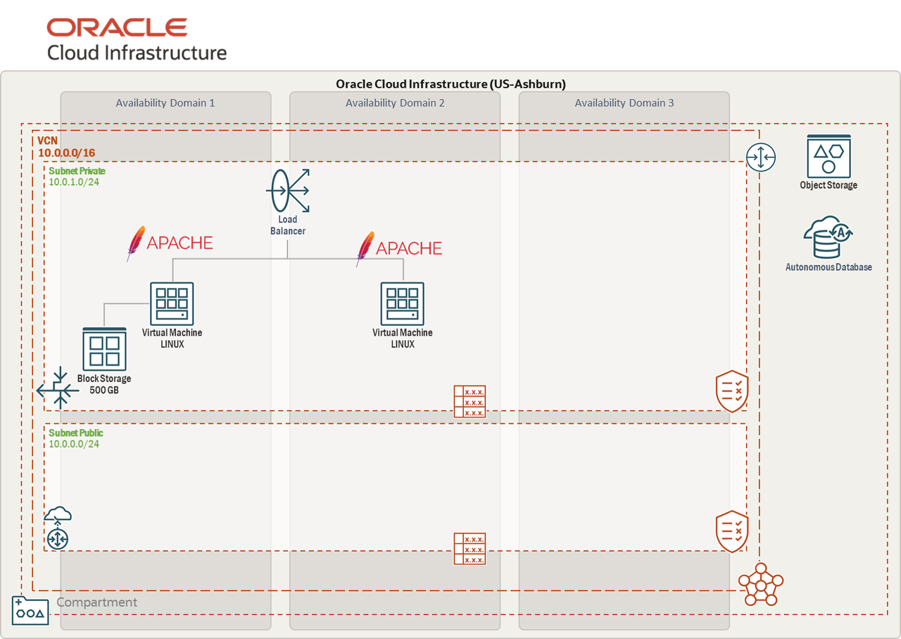

# Oracle Cloud Infrastructure Fast Track

## Sobre esse Workshop

Oracle Cloud Infrastructure (OCI) Fast Track é um Workshop prático para quem deseja aprender do zero a trabalhar com a nuvem Oracle. Neste Workshop cobrimos todos os conceitos básicos de Infraestrutura em nuvem, e o resultado final é ter conhecimentos sobre balanceador de carga, máquinas virtuais, armazenamento e Bancos de dados Oracle Autonomous Database.
Exploraremos cada um dos recursos disponíveis em Infraestrutura como Código (IaaS), indo de rede, armazenamento, máquinas virtuais e Balanceador de Carga. Para começar, é importante verificar se o usuário tem uma compreensão clara dos componentes básicos do OCI, como: Regiões, Compartimentos e Domínios de Disponibilidade.

Nosso objetivo é que, ao final deste workshop, os participantes possam implantar seus próprios segmentos de infraestrutura seguindo as melhores práticas da OCI.

Ao final deste workshop, a arquitetura criada será esta:

*Tempo estimado para o Workshop:* 8 Horas

### Objetivos

Por meio deste guia, iremos fornecer laboratórios práticos de:

- Compartimentos
- Rede (VCN e subnets)
- Instâncias de computação (Linux)
- Armazenamento em bloco (Block Storage)
- Armazenamento de objetos (Object Storage)
- Balanceador de carga (Load Balancer)
- Banco de dados Oracle Autonomous Database

## Saiba Mais

[Documentação do Oracle Cloud Infrastructure](https://docs.oracle.com/pt-br/iaas/Content/home.htm).

## Autoria

- **Autores**- Raphael Campelo, Luiz de Oliveira, Arthur Vianna e Thais Henrique
- **Último Updated Por/Data** - Arthur Vianna, Jul/2025
