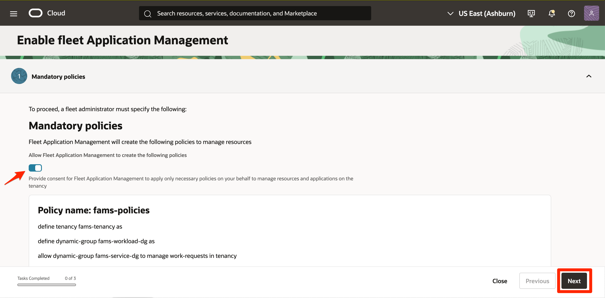
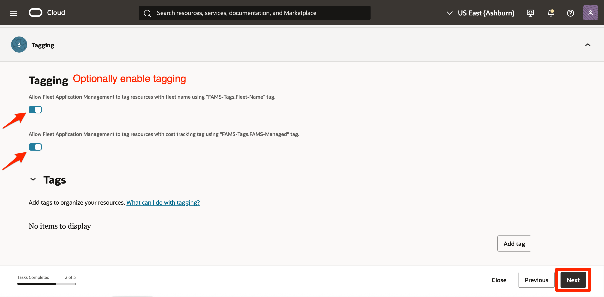
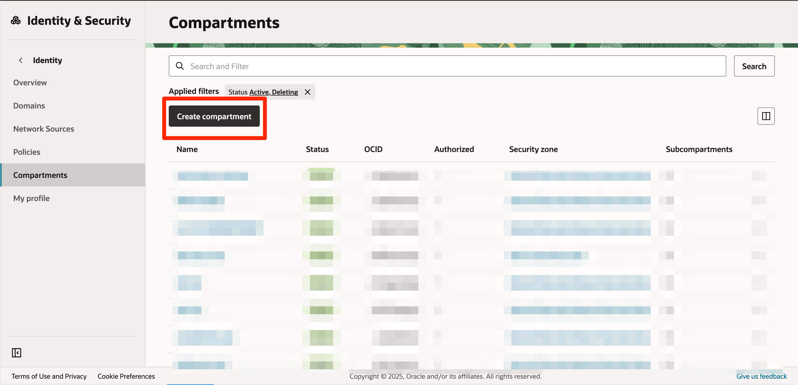

# Onboard to Fleet Application Management

## Introduction

In this lab, you will onboard the Fleet Application Management service in your OCI tenancy. The onboarding process creates the required policies, preparing your environment to use Fleet Application Management and its features.

Estimated Time: 15 minutes

### Objectives

In this lab, you will:

* Learn how to onboard to Fleet Application Management, including accessing the service, configuring initial settings, and verifying successful onboarding.

### Prerequisites

This lab assumes you have:

* An Oracle Cloud account (free tier or paid)
* Tenancy administrator privileges

    >Note: A **tenancy administrator** is a user with permissions to manage all resources in your OCI tenancy, typically assigned through policies by your organization. Tenancy administrator privileges are required to onboard Fleet Application Management, as this process creates necessary policies in your OCI tenancy. For more information about tenancy administrators and managing permissions, see [Managing Users, Groups and Policies](https://docs.oracle.com/en-us/iaas/Content/Identity/Tasks/managingusers.htm).

## Task 1: Navigate to Fleet Application Management in OCI Console

1. Login to OCI Console (see **Get Started** section). Open the **Navigation menu** (hamburger icon).

    

2. Under **Observability & Management**, click **Fleet Application Management**.

    

## Task 2: Initiate Onboarding to Fleet Application Management

1. On the **Overview** page, click on **Initiate Onboarding**.

    

2. A panel opens. In the **Mandatory policies** section, enable the toggle to allow Fleet Application Management to create the necessary policies on your behalf for managing resources and applications in your tenancy. Review the listed policies, then click **Next**.

    

3. Skip the **Optional policies** section and click **Next**.

    

4. Optionally enable **Tagging** and click **Next**.

    

5. **Review** the details and click **Create**. The **Onboarding** process will begin and may take a few minutes to complete.

    

    

6. After Onboarding is complete, navigate to **Identity & Security** &rarr; **Policies** and confirm that the *fams-policies* policy has been created. Next, go to **Domains**, select your domain, and open the **Dynamic groups** tab. Verify that the *fams-customer-dg* and *fams-service-dg* dynamic groups have been created as part of the onboarding process.

    

    

7. For the purpose of this workshop, you can create a new compartment to help isolate and manage your resources within your tenancy. Navigate to **Identity & Security** &rarr; **Compartments** &rarr; **Create compartment**.

    

8. Next, navigate to the *fams-customer-dg* dynamic group and edit the matching rules so that instances in your compartments become members of the group. To do this, include each compartment’s OCID in the dynamic group’s rules. A sample rule is shown below:

    


    ```
    All {instance.compartment.id = 'ocid1.instance1.oc1.iad:sampleuniqueid1', instance.compartment.id ='ocid1.compartmentA.oc1:sampleuniqueid2'}
    ```

9. Next, ensure that you add the appropriate policies to grant your tenancy users or groups to perform this workshop in the target compartment. Below are some sample policies for using FAM and other OCI resources. You can further refine these policies to suit your specific requirements.

    ```
    Allow group <user-group> to manage fams-family in compartment <compartment-name>
    Allow group <user-group> to manage instance-family in compartment <compartment-name>
    Allow group <user-group> to manage object-family in compartment <compartment-name>
    Allow group <user-group> to manage os-management-hub-family in compartment <compartment-name>
    ```

Congratulations! You have successfully completed the lab.

You may now **proceed to the next lab**.

## Learn More

* [Learn About Fleet Application Management](https://docs.oracle.com/en-us/iaas/Content/fleet-management/home.htm)
* [Onboarding Fleet Application Management](https://docs.oracle.com/en-us/iaas/Content/fleet-management/onboard.htm)
* [Fleet Application Management Policies and Permissions](https://docs.oracle.com/en-us/iaas/Content/fleet-management/policies-permissions.htm)

## Acknowledgements

* **Author** - Bhumika Bhagia, Senior Member of Technical Staff, OCI
* **Last Updated By/Date** - Bhumika Bhagia, September 2025
