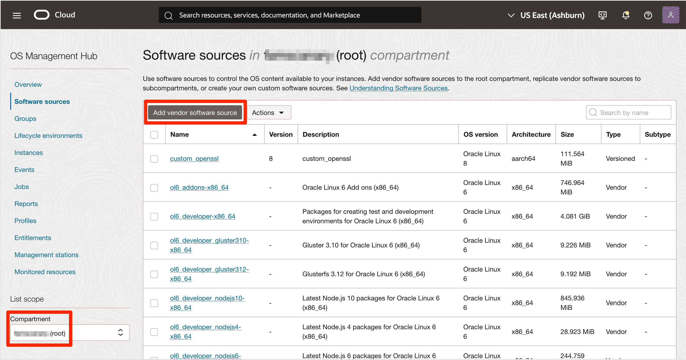
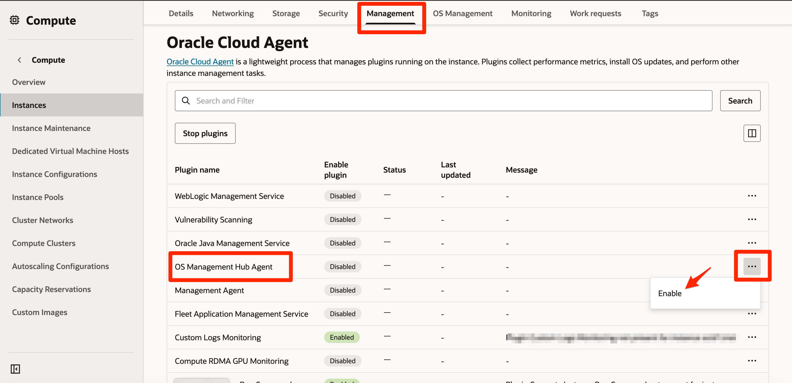
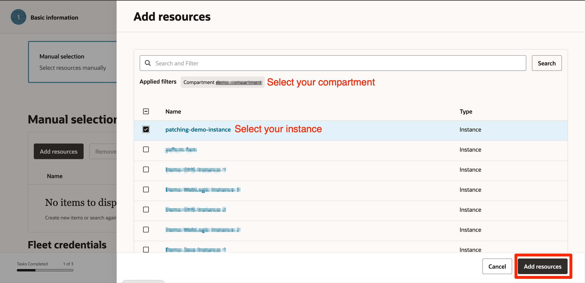
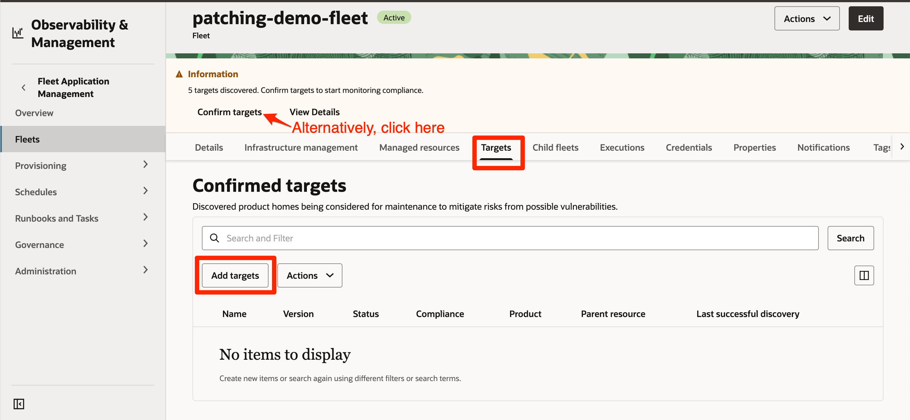
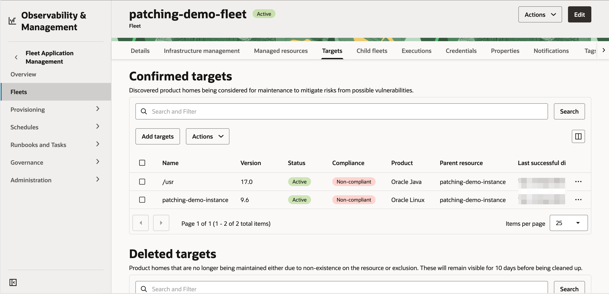
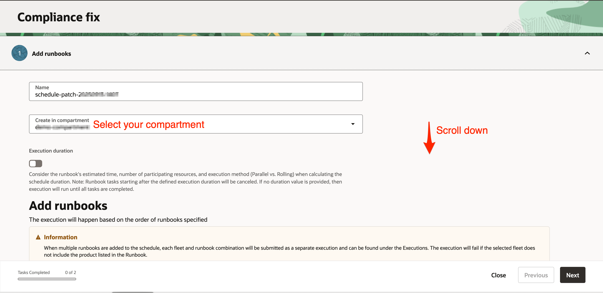
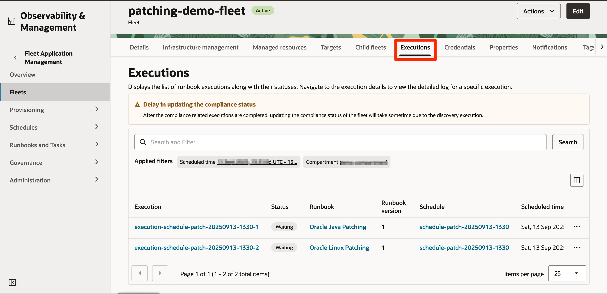
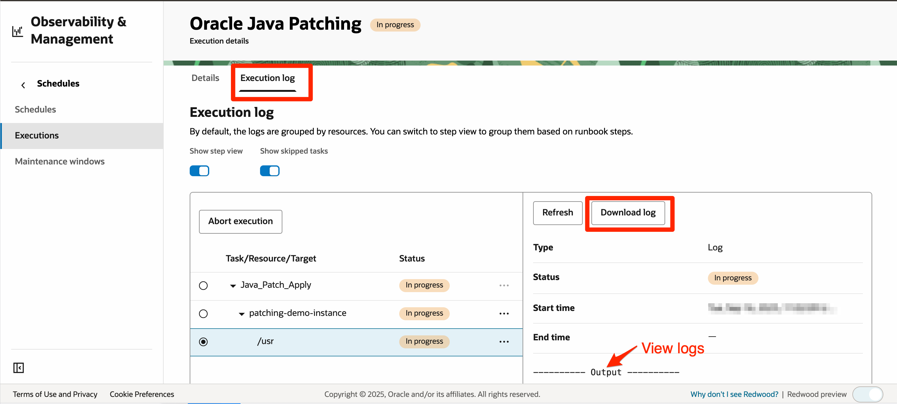

# Patch an Oracle Fusion Middleware Deployment with FAM

## Introduction

This lab guides you through automating the patch management process for an Oracle Fusion Middleware deployment using OCI Fleet Application Management (FAM). You’ll learn how to create and manage Fleets, remediate compliance issues efficiently using Oracle-defined Runbooks, and streamline routine maintenance tasks. You’ll also gain visibility into patch operations and troubleshoot issues to maintain consistent and automated patching across your fleet.

Before you initiate patching, Fleet Application Management runs a series of preparation steps to ensure your resources and products are ready for automation:

* Validation: Makes sure the Fleet Application Management plugin is active on each managed instance. If it isn’t enabled, FAM automatically starts it, ensuring the instance is ready for Fleet management operations.
* Discovery: Automatically detects eligible targets such as Oracle Linux, WebLogic Server and Java installations on each instance and adds them to the Fleet for centralized management.
* Compliance Evaluation: Checks each target’s patch status against its baseline and identifies any updates needed to keep resources secure and up to date.

Estimated Lab Time: 1 hour 15 minutes

### Objectives

In this lab, you will:

* Enable [OS Management Hub (OSMH)](https://docs.oracle.com/en-us/iaas/osmh/doc/home.htm) for OS patching
* Create Fleet to Manage Middleware and Platform Resources
* Fix compliance issues using Oracle-defined Runbooks
* Monitor patch execution logs

### Prerequisites

* Tenancy administrator privileges are required to add vendor software sources to the root compartment when enabling OSMH in the tenancy.
* This lab requires completion of all previous labs.

> Note: Please reuse the instance provisioned in **Lab 2: Provision Infrastructure Resources with Fleet Application Management**, as it comes with Java 17 pre-installed.

## Task 1: Enable OS Management Hub (OSMH)

Fleet Application Management uses OS Management Hub (OSMH) to manage and monitor operating system updates, such as those for Oracle Linux. Tenancy administrators must first add software sources in the root compartment for each region. Creation of OSMH profiles and enabling OSMH on instances can also be performed by users or groups with the necessary manage permissions on the os-management-hub-family and instance resources in target compartments.

1. In the OCI Console, navigate to **Observability & Management** &rarr; **OS Management Hub**. Under the **Software Sources** tab in the **root compartment**, click **Add Vendor Software Source**.

    

2. Select *Oracle* as the **OS vendor**, choose *Oracle Linux 9* for the **OS version**, and *aarch64* as the **Architecture**. Then select the **Available software sources** as per [Guidelines for Adding Vendor Sources](https://docs.oracle.com/en-us/iaas/osmh/doc/vendor-software-source.htm) and click **Add**.

    >Note: Since all available software sources have already been added, the table in the screenshot below is empty.

    

3. Next, go to **Profiles** in the root compartment and click **Create**.

    

4. Enter the profile **Name** and select *Oracle Cloud Infrastructure* as the Profile instance type. Choose *Oracle* as the **OS vendor**, *Oracle Linux 9* as the **OS version**, and *aarch64* as the **Architecture**. Set this as the **default profile**, select *Software source* as the Type, choose the software sources added in **Step 2**, and click **Create**.

    

    

5. Next, go to **Compute** and select **Instances**. Click on your instance, then open the **Management** tab from the compute details page. In the **Oracle Cloud Agent** section, click the three dots next to **OS Management Hub Agent** and select **Enable**.

    

    

6. Choose the appropriate OSMH **profile** and click **Set profile**.

    

    >Note: Ensure that outbound traffic from your instance to OSMH endpoints (Oracle services) is permitted by the security list associated with your subnet. For more information, please refer to the Networking Requirements section of [OS Management Hub Documentation](https://docs.oracle.com/en-us/iaas/osmh/doc/getstarted.htm).

## Task 2: Create Fleet to Manage Middleware and Platform Resources

In this task, you will create a **Fleet** to centrally group and manage middleware products, such as **Oracle Java**, as well as platform resources like **Oracle Linux**. Fleets enable you to organize related resources and initiate all lifecycle operations—such as compliance checks, patching, and monitoring—from a single, unified view.

1. Navigate to **Fleets** under **Fleet Application Management**, select your compartment, and then click **Create fleet**.

    

2. Enter a **Name** and ensure the **Create in Compartment** field shows your compartment.

    

3. Scroll down to the **Add Resources** section. Select **Manual selection**, then click on the **Add resources** button located on the table header.

    

4. In the panel that opens, ensure your compartment is selected. Select your compute instance, then click **Add resources** at the bottom of the panel. The panel closes, and the resource appears in the table. Click **Next**.

    

    

5. Click on **Add products/product stacks**. A panel opens. In the **Applied Filters** section, set **Type** to *Product* and **Publisher** to *Oracle Defined*. From the table, select **Oracle Java** and **Oracle Linux** Products, then click **Add product/product stack**.

    

    

6. After the panel closes, the selected products appear in the table. Click **Next**.

    >Note: For the purpose of this lab, keep the Auto confirm of targets toggle option **disabled**. We will manually confirm the targets later.

    

7. Skip the **Notifications** section by clicking **Next** until you reach the **Review** step. Review all the details, then click **Create**.

    

## Task 3: Validation, Discovery, and Compliance Evaluation of Targets

In the previous task, you created a Fleet to manage your middleware and platform resources. After the Fleet is created, the first step you’ll see is **Resource addition**. Once resources are added, FAM automatically triggers **Validation**, **Discovery**, and **Compliance Evaluation** in sequence. In this task, you will monitor these phases and verify that each completes successfully.

1. On the **Fleet Details** page, confirm that the Fleet reaches the *Active* state and shows the message *Resource addition in progress*. Once this phase completes, verify the added resources under the **Managed resources** tab.

    

    

2. Next, the resource *Validation* phase begins. Click **View Details** to monitor progress and review validation logs.

    

    

    >Note: When the FAM plugin is successfully enabled (which can take up to **10 minutes** to reflect), validation completes successfully. However, validation may occasionally fail if the plugin is not enabled on the target instance. In such cases, first retry validation. If the issue persists, enable the FAM plugin manually from the Compute Instance details page (Management tab) and then retry validation.

3. After *Validation* completes successfully, the *Discovery* of targets begins. Click **View Details** to monitor the discovery process and review its logs.

    

    

4. Once *Discovery* completes successfully, go to the **Targets** tab and click **Add Targets**. When the panel opens, select the targets shown below and click **Add targets**. Alternatively, you can click on the **Confirm Targets** prompt to do the same.

    >Note: For this lab, do not add the sub-paths under the /usr directory. This is to avoid potential "sub-path not found" errors during patching in this test instance.

    

    

    

    

## Task 4: Fix Compliance Issues with Runbooks

Once validation, discovery, and compliance evaluation are complete, you can remediate any non-compliant targets. In this task, you will use Oracle-defined Runbooks to apply the necessary patches and bring all targets into compliance. This process simplifies patching by automating the required steps with minimal manual intervention.

1. On the Fleet Details page, review the **Compliance Status** section to check patch compliance. If any discovered targets are non-compliant, the Fix Now option will appear. Click **Fix Now** to start remediation and bring the targets into compliance.

    

2. A panel opens for compliance fix. Ensure that your compartment is selected.

    

3. In the **Add runbooks** section, you will see the recommended Oracle-defined Runbooks based on the products associated with the Fleet. If needed, click the three dots next to a Runbook to change its execution order or remove it. After reviewing, click **Next**.

    

    >Note: The execution time displayed next to each Runbook represents the maximum estimated duration for patching. For this lab, the estimated lab time provided at the beginning should be sufficient to complete the process, as the setup is relatively simpler than a production environment.

4. The listed Runbooks do not require any input parameters. Click **Next** to proceed.

    

5. Review the information and click **Create**. The panel will close, and you will be redirected to the **Executions** tab on the Fleet Details page. A separate execution job will be created for each Runbook, and the executions will run in the defined order.

    

    

## Task 5: Monitor Patch Execution Logs

In this task, you will monitor the execution of the patching Runbook, review detailed logs for each step, and verify whether the patch operations completed successfully.

1. On the **Executions** tab, click each execution job to view more details.

    

    

2. Click the **Execution Log** tab to view the Runbook execution steps. Expand each step to see more details. The execution logs appear on the right, and you also have the option to download them.

    

## (Optional) Task 6: Patch Oracle Weblogic

1. If you have a WebLogic installation, you can patch it using Fleet Application Management. Due to licensing requirements, you need to provide your own WebLogic patches. Download the required patches from My Oracle Support and upload them to your OCI Object Storage bucket. Once the patches are uploaded, you can follow the same patching procedures demonstrated in the earlier tasks.

2. For step-by-step instructions, see the [OCI Fleet Application Management Documentation](https://docs.oracle.com/en-us/iaas/Content/fleet-management/manage-oracle-patches-weblogic.htm) for WebLogic patching.

Congratulations! You have successfully completed the lab.

## Learn More

* [Learn About Fleet Application Management](https://docs.oracle.com/en-us/iaas/Content/fleet-management/home.htm)
* [Patching Oracle-Defined Products](https://docs.oracle.com/en-us/iaas/Content/fleet-management/patch-supported-product.htm#patch-supported-product)

## Acknowledgements

* **Author** - Bhumika Bhagia, Senior Member of Technical Staff, OCI
* **Last Updated By/Date** - Bhumika Bhagia, September 2025
