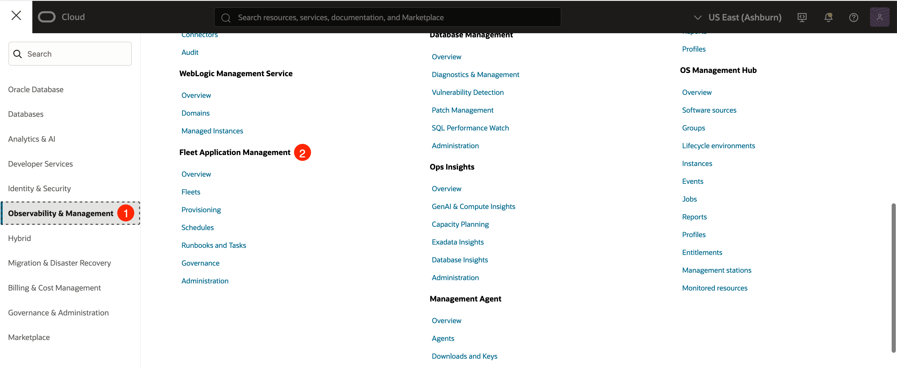
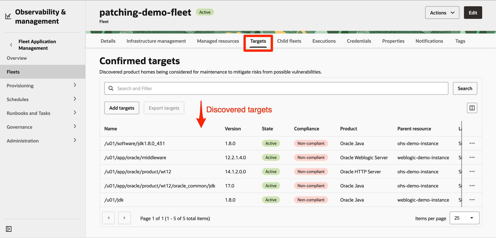
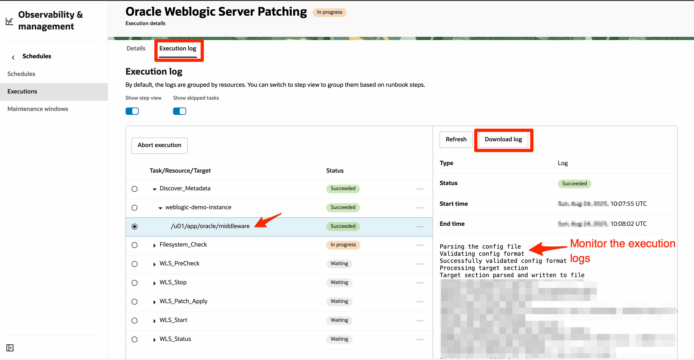

# Patch an Oracle Fusion Middleware Deployment with FAM

## Introduction

This lab guides you through automating the patch management process for an Oracle Fusion Middleware deployment using OCI Fleet Application Management (FAM). You’ll learn how to create and manage Fleets, remediate compliance issues efficiently using Oracle-defined Runbooks, and streamline routine maintenance tasks. You’ll also gain visibility into patch operations and troubleshoot issues to maintain consistent and automated patching across your fleet.

Before you initiate patching, Fleet Application Management runs a series of preparation steps to ensure your resources and products are ready for automation:

* Validation: Makes sure the Fleet Application Management plugin is active on each managed instance. If it isn’t enabled, FAM automatically starts it, ensuring the instance is ready for Fleet management operations.
* Discovery: Automatically detects eligible targets such as Oracle HTTP Server (OHS), WebLogic Server and Java installations on each instance and adds them to the Fleet for centralized management.
* Compliance Evaluation: Checks each target’s patch status against its baseline and identifies any updates needed to keep resources secure and up to date.

Estimated Lab Time: 1 hour 30 minutes

### Objectives

In this lab, you will:

* Create Fleet to manage Oracle Fusion Middleware resources
* Fix compliance issues using Oracle-defined Runbooks
* Monitor patch execution logs

### Prerequisites

* This lab requires completion of the **Get Started** section in the **Contents** menu on the left.

## Task 1: Navigate to Fleet Application Management in OCI Console

1. Login to OCI Console (see **Get Started** section). Open the **Navigation menu** (hamburger icon).

    

2. Under **Observability & Management**, click **Fleet Application Management**.

    

    

## Task 2: Create Fleet to Manage Oracle Fusion Middleware resources

In this task, you will create a Fleet for centralized grouping and management of middleware resources such as Oracle HTTP Server (OHS) and WebLogic Server. Fleets enable you to easily organize related resources and initiate all lifecycle operations, such as compliance checks, patching, and monitoring, from a single, unified view.

1. Navigate to **Fleets** under **Fleet Application Management**, select your assigned compartment  (refer to the sandbox **Reservation Information** page), and then click **Create fleet**.

    

2. Enter a **Name** and ensure the **Create in Compartment** field shows your assigned compartment.

    

3. Scroll down to the **Add Resources** section. Select **Manual selection**, then click on the **Add resources** button located on the table header.

    

4. In the panel that opens, ensure your assigned compartment is selected. Select both compute instances (**Oracle HTTP Server** and **WebLogic Server**), then click **Add resources** at the bottom of the panel. The panel closes, and the resources appear in the table. Click **Next**.

    >Note: The compute instances are **pre-provisioned** in your assigned compartment with OHS and WebLogic pre-installed. You only need to select them from your assigned compartment.

    

    

5. Click on **Add products/product stacks**. A panel opens. In the **Applied Filters** section, set **Type** to *Product* and **Publisher** to *Oracle Defined*. From the table, select **Oracle HTTP Server**, **Oracle WebLogic Server**, and **Oracle Java** Products, then click **Add product/product stack**.

    

    

6. After the panel closes, the selected products appear in the table. Enable the **Auto confirm of targets** toggle, then click **Next**.

    

7. Skip the **Notifications** section by clicking **Next** until you reach the **Review** step. Review all the details, then click **Create**.

    

## Task 3: Validation, Discovery, and Compliance Evaluation of Targets

In the previous task, you created a Fleet to manage your middleware resources. After the Fleet is created, the first step you’ll see is **Resource addition**. Once resources are added, FAM automatically triggers **Validation**, **Discovery**, and **Compliance Evaluation** in sequence. In this task, you will monitor these phases and verify that each completes successfully.

1. On the **Fleet Details** page, confirm that the Fleet reaches the *Active* state and shows the message *Resource addition in progress*. Once this phase completes, verify the added resources under the **Managed resources** tab.

    

    

2. Next, the resource *Validation* phase begins. Click **View Details** to monitor progress and review validation logs.

    

    

    >Note: When the FAM plugin is successfully enabled (which can take up to **10 minutes** to reflect), validation completes successfully. However, validation may occasionally fail if the plugin is not enabled on the target instance. In such cases, first retry validation. If the issue persists, enable the FAM plugin manually from the Compute Instance details page (Management tab) and then retry validation.

3. After *Validation* completes successfully, the *Discovery* of middleware targets begins. Click **View Details** to monitor the discovery process and review its logs.

    

    

4. Once *Discovery* completes successfully, review the discovered targets and their compliance status on the **Targets** tab.

    >Note: Because the **Auto confirm of targets** option was enabled during Fleet creation, the discovered targets are automatically added to the Fleet for management. If this option was not selected, you’ll see a message prompting you to manually confirm the targets.

    

    

## Task 4: Fix Compliance Issues with Runbooks

Once validation, discovery, and compliance evaluation are complete, you can remediate any non-compliant targets. In this task, you will use Oracle-defined Runbooks to apply the necessary patches and bring all targets into compliance. This process simplifies patching by automating the required steps with minimal manual intervention.

1. On the Fleet Details page, review the **Compliance Status** section to check patch compliance. If any discovered targets are non-compliant, the Fix Now option will appear. Click **Fix Now** to start remediation and bring the targets into compliance.

    

2. A panel opens for compliance fix. Ensure that your assigned compartment is selected.

    

3. In the **Add runbooks** section, you will see the recommended Oracle-defined Runbooks based on the products associated with the Fleet. If needed, click the three dots next to a Runbook to change its execution order or remove it. After reviewing, click **Next**.

    

    >Note: The execution time displayed next to each Runbook represents the maximum estimated duration for patching. For this lab, the estimated lab time provided at the beginning should be sufficient to complete the process, as the setup is relatively simpler than a production environment.

4. The listed Runbooks do not require any input parameters. Click **Next** to proceed.

    

5. Review the information and click **Create**. The panel will close, and you will be redirected to the **Executions** tab on the Fleet Details page. A separate execution job will be created for each Runbook, and the executions will run in the defined order.

    

    

## Task 5: Monitor Patch Execution Logs

In this task, you will monitor the execution of the patching Runbook, review detailed logs for each step, and verify whether the patch operations completed successfully.

1. On the **Executions** tab, click each execution job to view more details.

    

    

2. Click the **Execution Log** tab to view the Runbook execution steps. Expand each step to see more details. The execution logs appear on the right, and you also have the option to download them.

    

Congratulations! You have successfully completed the lab.

## Learn More

* [Learn About Fleet Application Management](https://docs.oracle.com/en-us/iaas/Content/fleet-management/home.htm)
* [Patching Oracle-Defined Products](https://docs.oracle.com/en-us/iaas/Content/fleet-management/patch-supported-product.htm#patch-supported-product)

## Acknowledgements

* **Author** - Bhumika Bhagia, Senior Member of Technical Staff, OCI
* **Last Updated By/Date** - Bhumika Bhagia, August 2025
