# Provision Infrastructure Resources with Fleet Application Management

## Introduction

This lab walks you through the steps to define and provision infrastructure resources such as Compute, Networking, and Storage using Fleet Application Management. You will learn how to use Catalog Items, Runbooks, and Fleets to organize resources and streamline infrastructure provisioning workflows.

Estimated Time: 30 minutes

### Objectives

In this lab, you will:

* Create an Object Storage bucket to upload your Terraform configuration files
* Create private Catalog Items for Terraform configurations and parameters
* Build a Runbook by adding Catalog Items as tasks to define provisioning steps
* Create a Fleet to serve as the execution target for the Runbook
* Execute the Runbook on the Fleet and track the deployment progress

### Prerequisites

* This lab requires completion of **Lab 1: Onboard to Fleet Application Management**.

>Note: This lab guides you through provisioning a compute instance via Fleet Application Management using a Terraform configuration. You can use the same process to provision other types of infrastructure resources. For more information on Terraform configurations, refer to the [Oracle Cloud Infrastructure Provider](https://registry.terraform.io/providers/oracle/oci/latest/docs) documentation.

## Task 1: Create Object Storage Bucket and Upload Terraform Configurations

Create an Oracle Cloud Object Storage bucket. Upload your Terraform configuration *.zip* and *config.json* files containing variable values. Storing these files in Object Storage provides centralized, secure, and easily accessible storage, enabling streamlined and automated provisioning workflows.

1. Download the [instance-provisioning-terraform.zip](https://objectstorage.us-ashburn-1.oraclecloud.com/p/F4CUHkkbcvvYKF9gOT_KDQ7NTi6Cv8dY0Akm4N2vCcm5iCB-QXiv_PHBmiIW59pb/n/c4u02/b/hosted_workshops/o/stacks/oci-fleet-application-management.zip) file, which contains the Terraform code to create a compute instance.

2. Download the [config.json](../provisioning/files/config.json?download=1) file, update it with variable values specific to your environment, and save your changes.

3. In the OCI Console, open the **Navigation menu** (hamburger icon) and navigate to **Storage** &rarr; **Buckets**.

    

4. Select your compartment and click **Create bucket**.

    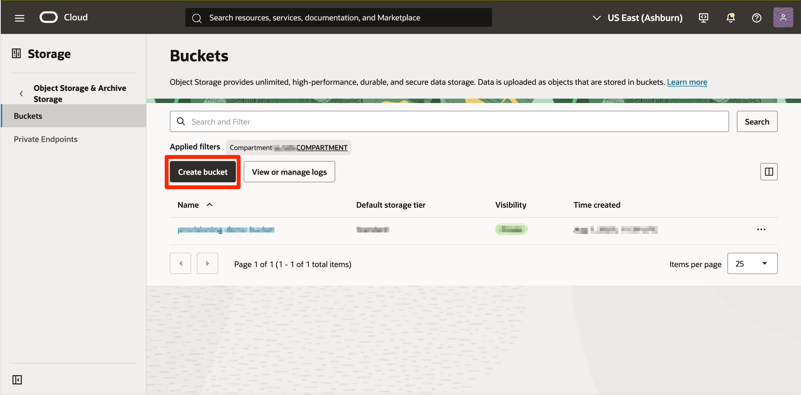

5. Enter a **Bucket name** and click **Create bucket**.

    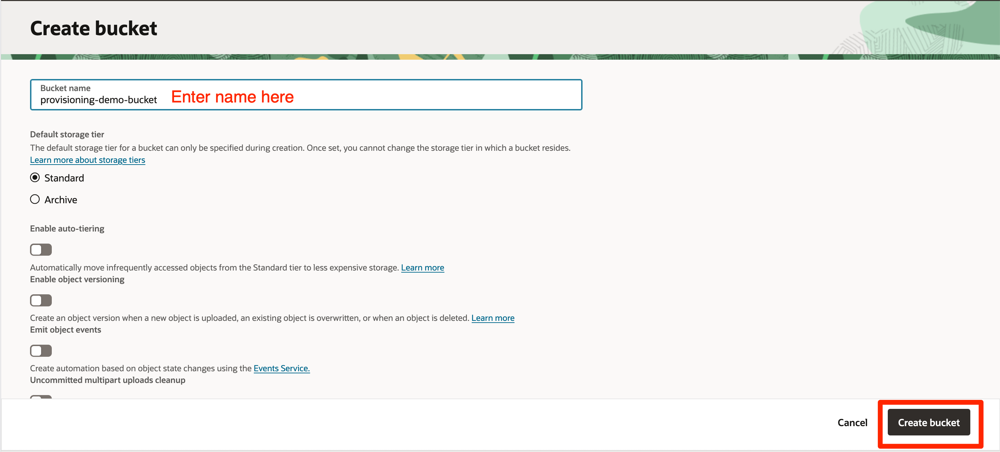

6. On the bucket details page, click **Upload objects**. Select the *.zip* Terraform package and the modified *config.json* from your computer, then follow the prompts to complete the upload.

    

    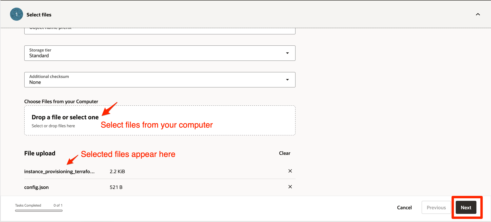

    

## Task 2: Create a Private Terraform Catalog Item

Create a Private Terraform Catalog Item in Fleet Application Management using your configurations stored in Object Storage. This enables you to securely standardize and automate resource provisioning across your cloud environment by reusing Terraform configurations.

1. From the **Navigation menu**, go to **Observability & Management** &rarr; **Fleet Application Management** &rarr; **Provisioning** &rarr; **Catalogs** &rarr; **Private catalog**. Select your compartment and click **Add catalog item**.

    

    

2. Enter a **Name**, **Short description**, **Long description**, **Version** (e.g., 1.0.0), **Version description** and **Type** as *Terraform package*.

    

3. Ensure the **Create in compartment** field shows your compartment. In the **Add resource** section, choose **Select from Object Storage bucket**.

    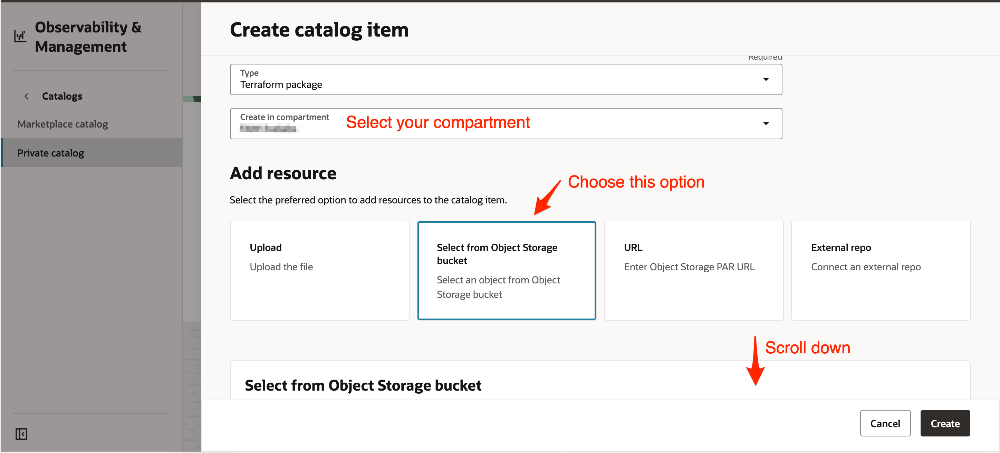

4. Select your compartment, then choose the bucket you created along with the *Terraform package (.zip file)*, and click **Create** to finish.

    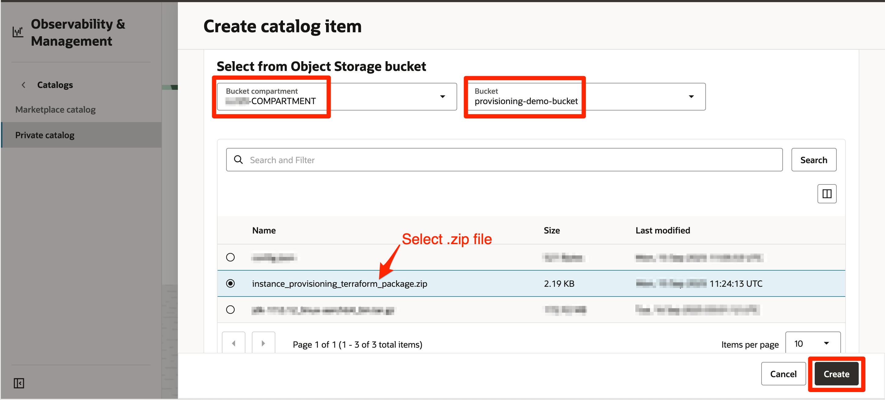

    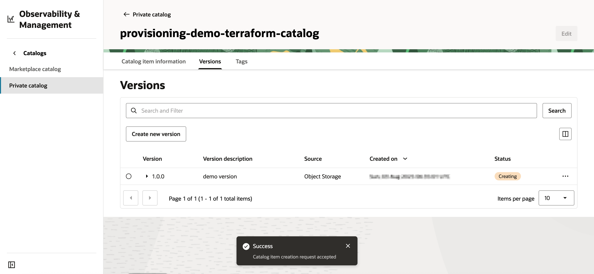

## Task 3: Create a Private Configuration Catalog Item

Create a Private Configuration Catalog Item in Fleet Application Management by referencing your existing *config.json* stored in Object Storage. This approach allows you to provide variable values for your Terraform package while keeping configuration data separate from code, promoting flexibility and best practices in Terraform provisioning.

1. Return to the **Private catalog** listing page and click **Add catalog item**.

    

2. Enter a **Name**, **Short description**, **Long description**, **Version** (e.g., 1.0.0), and **Version description**.

    

3. For **Type**, select *Configuration file* and ensure the **Create in compartment** field displays your compartment. In the **Add resource** section, choose **Select from Object Storage bucket**.

    

4. Select your compartment, bucket, and *config.json* file from the available objects, then click **Create** to finish.

    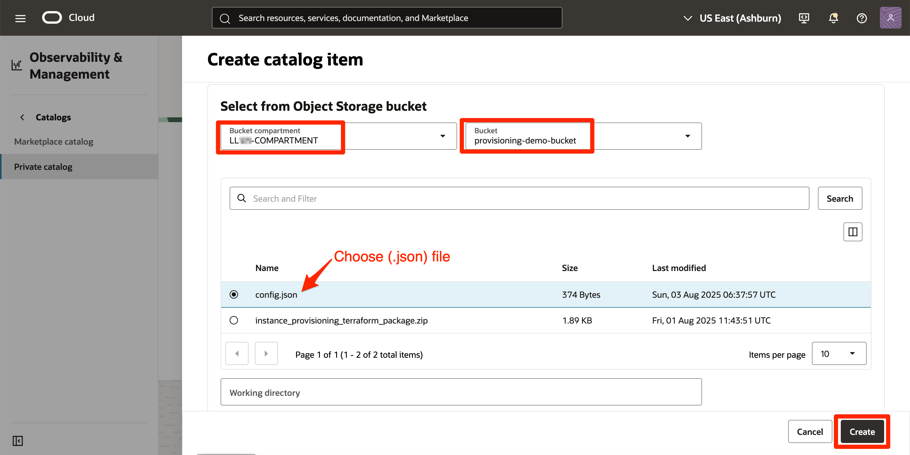

    

## Task 4: Build a Runbook and Add Catalog Items as Tasks

In this task, you'll create a Runbook, which is a predefined set of automated steps essential for efficiently provisioning and managing infrastructure resources. Runbooks ensure consistency, reduce manual errors, and streamline complex operational workflows.

1. Navigate to **Runbooks and Tasks** &rarr; **Runbooks** under **Fleet Application Management**. In the Applied filters section, select your compartment and set **Publisher** to *User defined*. Click **Create runbook**.

    

2. In the Basic information section, enter the **Name** and **Description** for your Runbook, and verify that **Create in compartment** field displays your compartment.

    

3. Set the Lifecycle operation compartment, choose **Provision** for the **Lifecycle operation**, and set the Estimated time (hours) to 0.5. Click **Next**.

    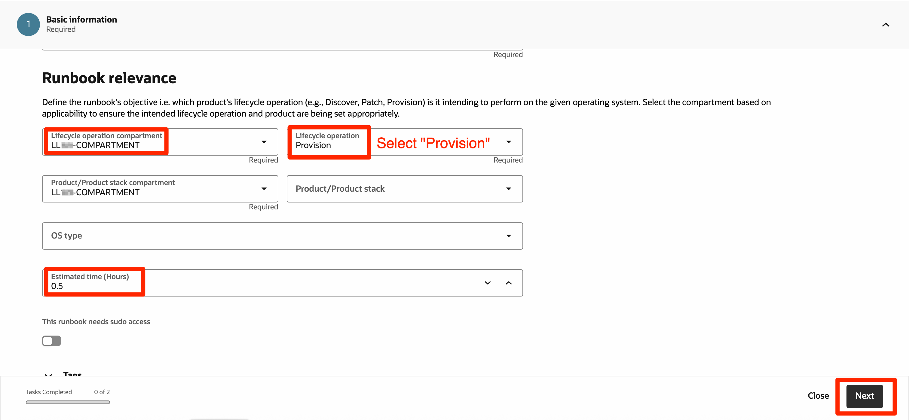

4. In the Streamline (Design runbook) section, select **Design view**. Drag and drop a **Rolling resource group** (Tasks are executed sequentially) from the **Components** tab into the **Tasks** section. Then, drag a **New task** into the resource group. A panel will open to configure the new task.

    

5. Enter a **Name** and **Description** for your task, and set the **Action Type** to **Run a terraform**.

    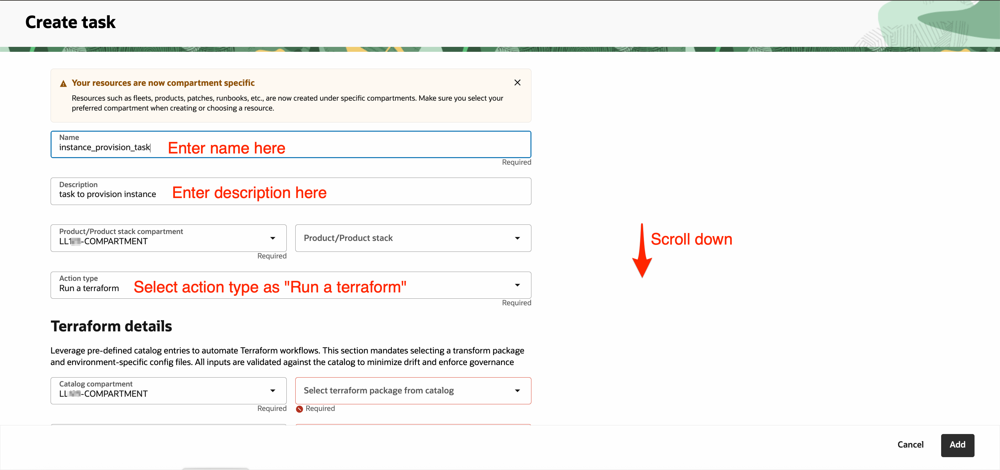

6. For Terraform details, select the appropriate Catalog and target compartment. Choose the **Terraform package catalog** and **config file catalog** created in Tasks 2 & 3. Leave the task properties as default and click **Add**.

    

7. After the panel closes and the task appears under your resource group, click **Next**. Review the Runbook details, then click **Save as draft**.

    

    

8. On the Runbook details page, your Runbook will be in *Inactive* state. Click **Actions** and select **Publish latest version**. The Runbook status will change from *Inactive* &rarr; *Updating* &rarr; *Active*. Your Runbook is now ready for provisioning instances in upcoming tasks.

    

    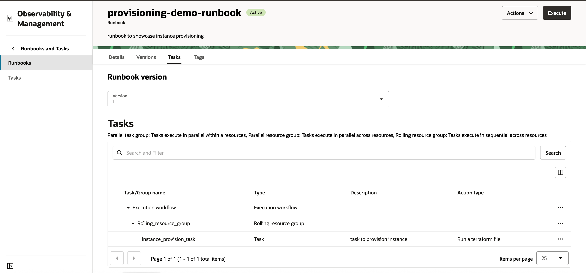

## Task 5: Create a Fleet

A Fleet in Fleet Application Management is a logical group used to manage and monitor deployments across infrastructure resources. In this task, you'll create a new Fleet, which will serve as the execution target for Runbooks and a central point for monitoring deployments.

1. Navigate to **Fleets** under **Fleet Application Management**, select your compartment, and then click **Create fleet**.

    

2. Enter a **Name** and ensure the **Create in Compartment** field displays your compartment. Click **Next**.

    

3. Leave all optional steps as default and keep clicking **Next** until you reach the review step.

4. Review your configuration, then click **Create** to finish.

    

    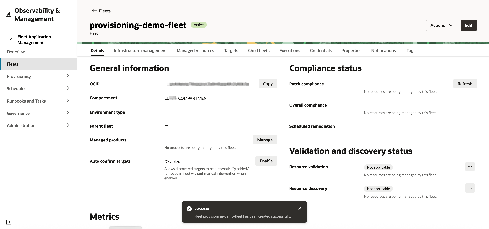

## Task 6: Execute the Runbook and Monitor Deployments

1. On **Fleet Details** page, go to **Infrastructure management** tab and click on **Provision infrastructure**.

    >Note: Provisioned resources are not automatically added to Fleet management. To enable resource governance in future, you need to manually add them to the *Managed Resources* section.

    

2. A panel opens up. Ensure **Create in compartment** displays your compartment.

    

3. Click on **Add runbook** below, select the **Runbook** and **Runbook version** created in Task 4, click on **Add runbook**, and once the panel closes, click on **Next**.

    

    

4. Review the information and click **Create**; an execution job will be created in a *Waiting* state and, within a few minutes, will transition through *Accepted* and *In progress* to *Succeeded*. You can click on the execution to view more details and logs, download logs, and see deployment details.

    

    

    

5. Alternatively, you can view and monitor deployments from the **Infrastructure Management** tab on the **Fleet Details** page. Click on a specific deployment to see more details, view detailed deployment logs, and access information about provisioned resources.

    

    

Congratulations! You have successfully completed the lab.

You may now **proceed to the next lab**.

## Learn More

* [Learn About Fleet Application Management](https://docs.oracle.com/en-us/iaas/Content/fleet-management/home.htm)
* [Provisioning Resources Using Fleet Application Management](https://docs.oracle.com/en-us/iaas/Content/fleet-management/provision-resources.htm)

## Acknowledgements

* **Author** - Bhumika Bhagia, Senior Member of Technical Staff, OCI
* **Last Updated By/Date** - Bhumika Bhagia, September 2025
