# Provision Infrastructure Resources Using Fleet Application Management

## Introduction

This lab walks you through the steps to define and provision infrastructure resources such as Compute, Networking, and Storage using Fleet Application Management. You will learn how to use Catalog Items, Runbooks, and Fleets to organize resources and streamline infrastructure provisioning workflows.

Estimated Time: 30 minutes

### Objectives

In this lab, you will:

* Create private Catalog Items for Terraform configurations and parameters
* Build a Runbook by adding Catalog Items as tasks to define provisioning steps
* Create a Fleet to serve as the execution target for the runbook
* Execute the Runbook on the Fleet and track the deployment progress

### Prerequisites

* This lab requires completion of the **Get Started** section in the **Contents** menu on the left.

## Task 1: Navigate to Fleet Application Management in OCI Console

1. Login to OCI Console (see **Get Started** section). Open the **Navigation menu** (hamburger icon).

    

2. Under **Observability & Management**, click **Fleet Application Management**.

    

    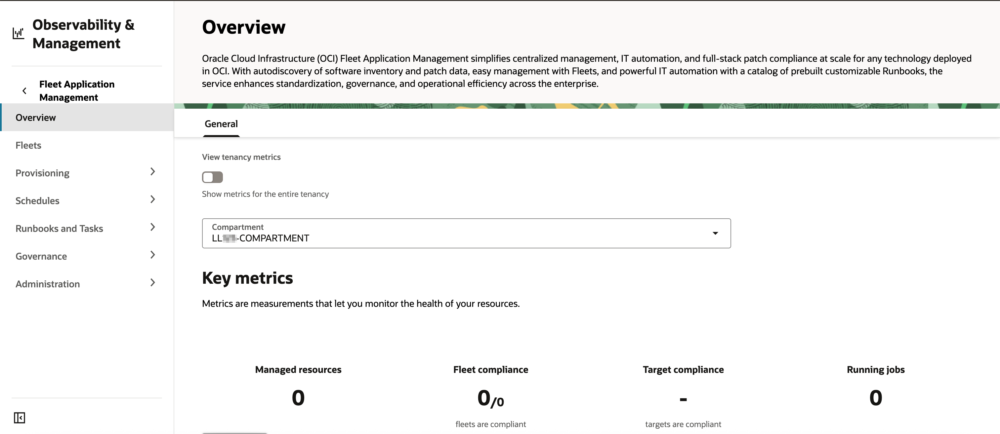

## Task 2: Create a Private Terraform Catalog Item

In this task, you will learn how to create a Private Terraform Catalog Item in Fleet Application Management, enabling you to securely reuse and standardize Terraform configurations for automated resource provisioning in your cloud environment.

1. From the left-side menu, navigate to **Provisioning** &rarr; **Catalogs** &rarr; **Private catalog**. Select your assigned compartment (refer to the sandbox **Reservation Information** page), then click **Add catalog item**.

    

    

2. Enter a **Name**, **Short description**, **Long description**, **Version** (e.g., 1.0.0), **Version description** and **Type** as *Terraform package*.

    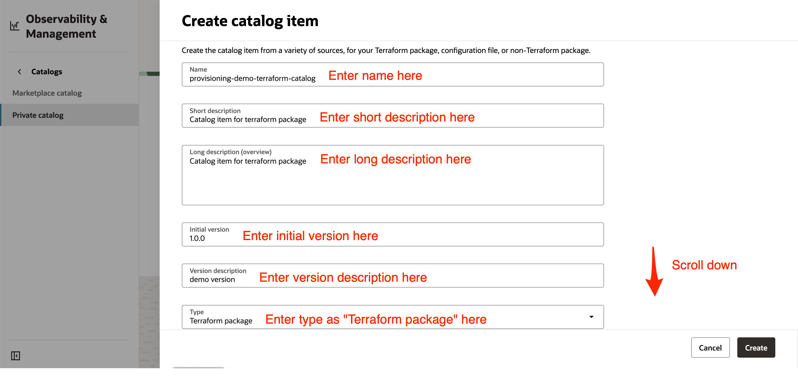

3. Ensure the **Create in compartment** field shows your assigned compartment. In the **Add resource** section, choose **Select from Object Storage bucket**.

    

4. Select your assigned compartment, then choose the bucket available in it along with the *Terraform package (.zip file)*, and click **Create** to finish.

    >Note: A pre-provisioned bucket containing the required Terraform package (.zip file) has been provided. You only need to select the appropriate objects.

    

    

## Task 3: Create a Private Configuration Catalog Item

In this task, you will learn how to create a Private Configuration Catalog Item in Fleet Application Management. The *config.json* file you upload provides values for the variables defined in the Terraform package's *variables.tf*, allowing you to keep configuration data separate from code and avoid hardcoding values directly in your Terraform modules.

1. Download the sample [config.json](files/config.json) file.

2. Modify the file with the appropriate values found in the **Terraform Values** section of the sandbox **Reservation Information** page.

3. From the **Navigation menu** (hamburger icon), go to **Storage** &rarr; **Buckets**.

    

4. Select your assigned compartment (see the sandbox **Reservation Information** page). Locate the pre-provisioned Object Storage bucket, click on it, go to the **Objects** tab, and choose **Upload objects**. Select the modified *config.json* from your computer and proceed through the prompts to complete the upload.

    

    

    

    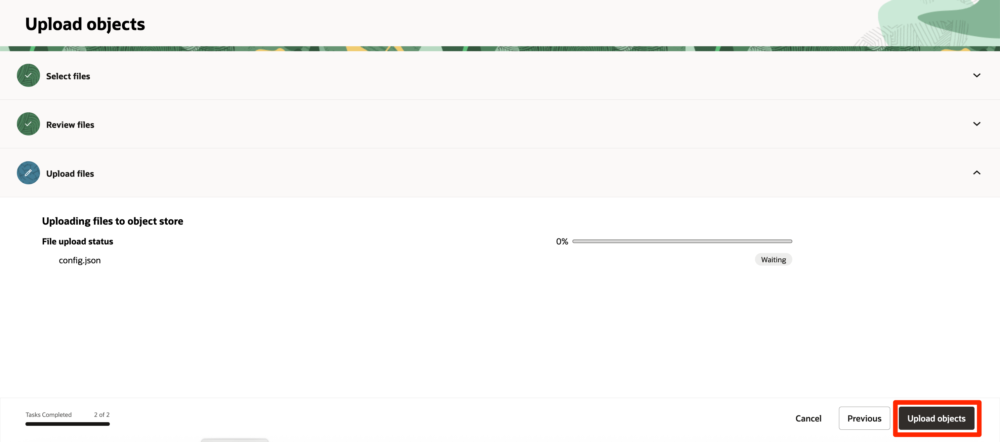

5. From the navigation menu, go to **Observability & Management** &rarr; under **Fleet Application Management** &rarr; **Provisioning** &rarr; **Catalogs** &rarr; **Private catalog**. Select your assigned compartment, then click **Add catalog item**.

    

6. Enter a **Name**, **Short description**, **Long description**, **Version** (e.g., 1.0.0), and **Version description**.

    

7. For **Type**, select **Configuration file**, and ensure the **Create in compartment** field shows your assigned compartment.In the **Add resource** section, choose **Select from Object Storage bucket**.

    

8. Select your assigned compartment, bucket, and *config.json* file from the available objects, then click **Create** to finish.

    

    

## Task 4: Build a Runbook and Add Catalog Items as Tasks

In this task, you'll create a runbook, which is a predefined set of automated steps essential for efficiently provisioning and managing infrastructure resources. Runbooks ensure consistency, reduce manual errors, and streamline complex operational workflows.

1. Navigate to **Runbooks and Tasks** &rarr; **Runbooks** under **Fleet Application Management**. In the Applied filters section, select your assigned compartment and set Publisher to User defined. Click **Create runbook**.

    

2. In the Basic information section, enter the **Name** and **Description** for your runbook, and verify that **Create in compartment** is set to your assigned compartment.

    

3. Set the Lifecycle operation compartment to your assigned compartment, choose **Provision** for the **Lifecycle operation**, and set the Estimated time (hours) to 0.5. Click **Next**.

    

4. In the Streamline (Design runbook) section, select **Design view**. Drag and drop a **Rolling resource group** (Tasks are executed sequentially) from the **Components** tab into the **Tasks** section. Then, drag a **New task** into the resource group. A panel will open to configure the new task.

    

5. Enter a **Name** and **Description** for your task, and set the **Action Type** to **Run a terraform**.

    

6. For Terraform details, select the appropriate catalog and target compartment (your assigned compartment). Choose the **Terraform package catalog** and **config file catalog** created in Tasks 2 & 3. Leave the task properties as default and click **Add**.

    

7. After the panel closes and the task appears under your resource group, click **Next**. Review the runbook details, then click **Save as draft**.

    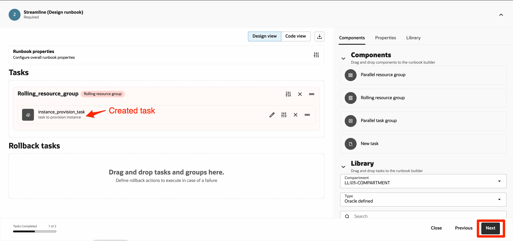

    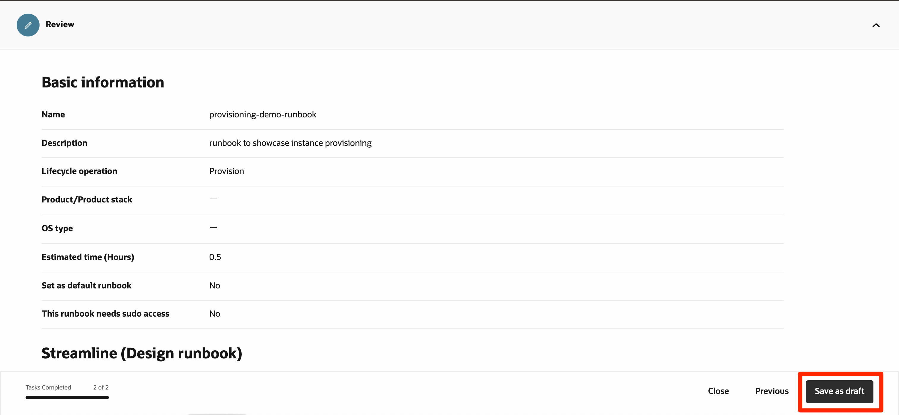

8. On the runbook details page, your runbook will be in *Inactive* state. Click **Actions** and select **Publish latest version**. The runbook status will change from *Inactive* &rarr; *Updating* &rarr; *Active*. Your runbook is now ready for provisioning instances in upcoming tasks.

    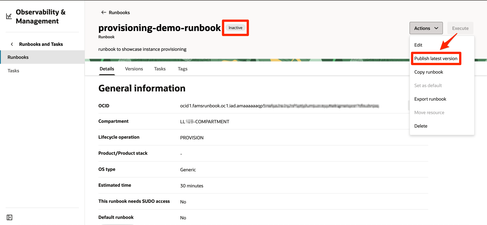

    

## Task 5: Create a Fleet

A Fleet in Fleet Application Management is a logical group used to manage and monitor deployments across infrastructure resources. In this task, you'll create a new Fleet, which will serve as the execution target for runbooks and a central point for monitoring deployments.

1. Navigate to **Fleets** under **Fleet Application Management**, select your assigned compartment, and then click **Create fleet**.

    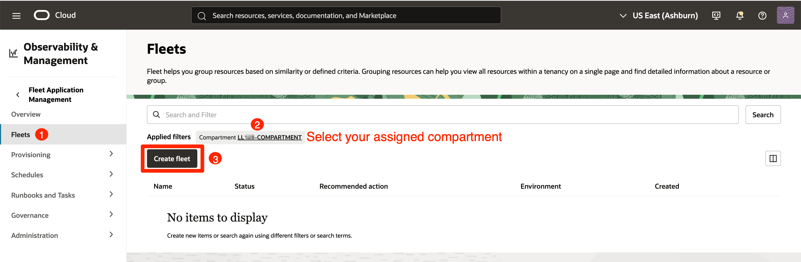

2. Enter a **Name** and ensure the **Create in Compartment** field shows your assigned compartment. Click **Next**.

    

3. Leave all optional steps as default and keep clicking **Next** until you reach the review step.

4. Review your configuration, then click **Create** to finish.

    

    

## Task 6: Execute the Runbook and Monitor Deployments

1. On **Fleet Details** page, go to **Infrastructure management** tab and click on **Provision infrastructure**.

    >Note: Provisioned resources are not automatically added to fleet management. To enable resource governance in future, you need to manually add them to the *Managed Resources* section.

    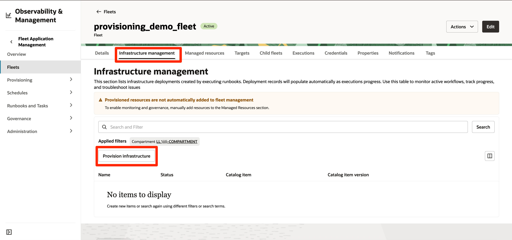

2. A panel opens up. Ensure **Create in compartment** shows your assigned compartment.

    

3. Click on **Add runbook** below, select the **Runbook** and **Runbook version** created in Task 4, click on **Add runbook**, and once the panel closes, click on **Next**.

    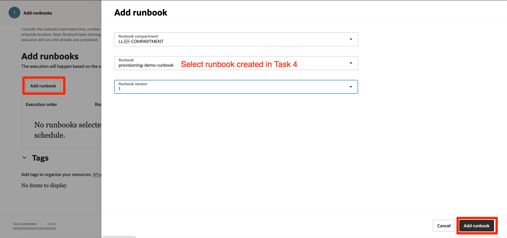

    

4. Review the information and click **Create**; an execution job will be created in a *Waiting* state and, within a few minutes, will transition through *Accepted* and *In progress* to *Succeeded*. You can click on the execution to view more details and logs, download logs, and see deployment details.

    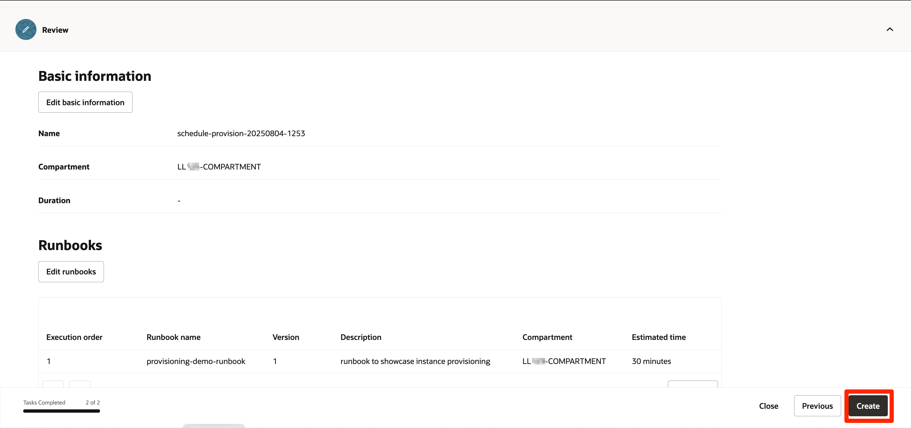

    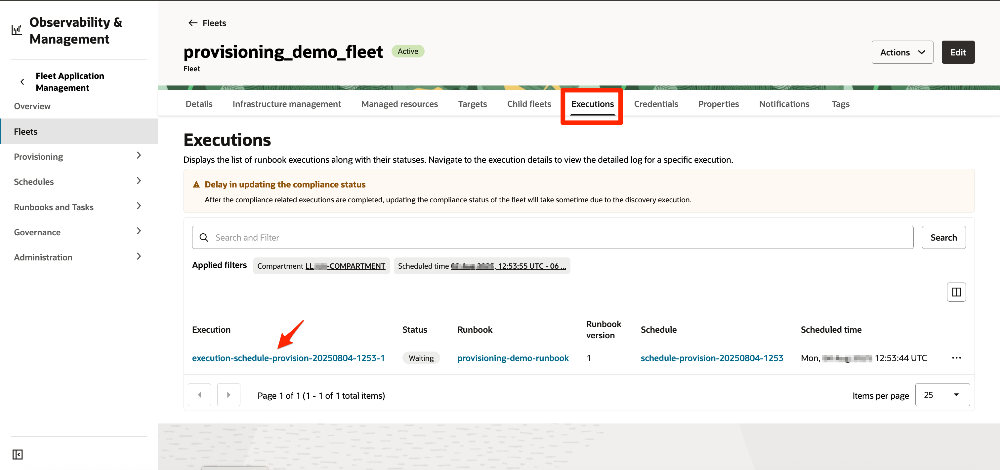

    

5. Alternatively, you can view and monitor deployments from the **Infrastructure Management** tab on the **Fleet Details** page. Click on a specific deployment to see more details, view detailed deployment logs, and access information about provisioned resources.

    

    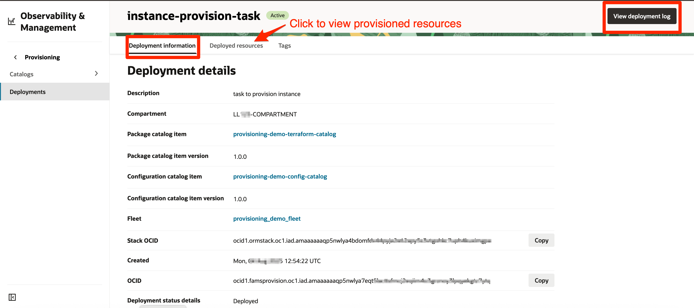

## Learn More

* [Provisioning Resources Using Fleet Application Management](https://docs.oracle.com/en-us/iaas/Content/fleet-management/provision-resources.htm)

## Acknowledgements

* **Author** - Bhumika Bhagia, Senior Member of Technical Staff, OCI
* **Last Updated By/Date** - Bhumika Bhagia, August 2025
