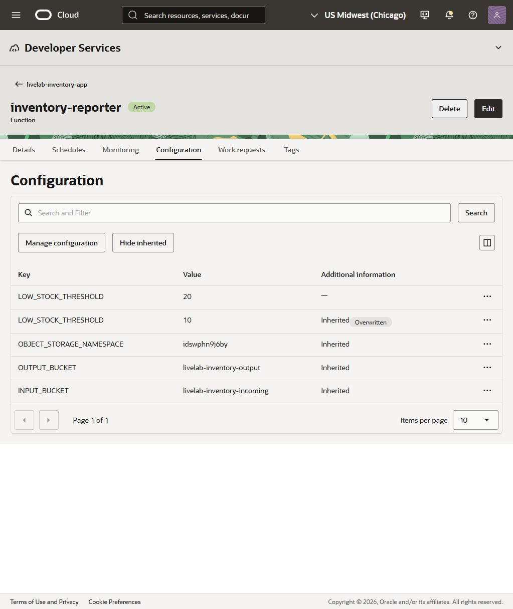
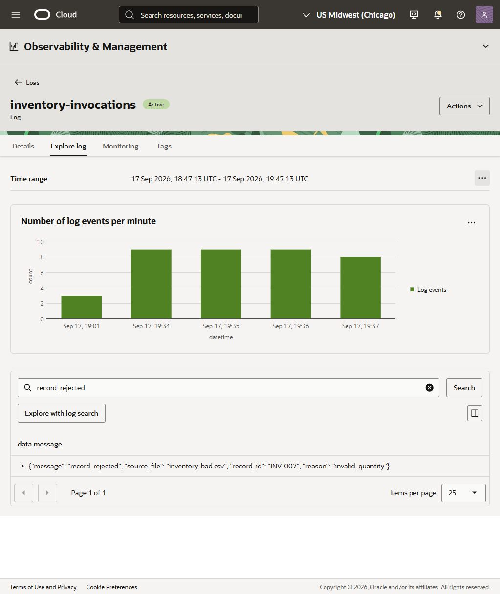

# Configure and Troubleshoot Your Function (Optional)

## Introduction

Extend the working inventory workflow by changing its stock threshold and tracing an invalid record through reports and invocation logs. This lab is optional; Lab 1 completes the core workshop.

Estimated Lab Time: 10-15 minutes.

### Objectives

- Change a business rule through function configuration without editing code.
- Diagnose an invalid inventory quantity using the rejected-record report and logs.
- Upload corrected data and verify the results.

### Prerequisites

- A working function and enabled Events rule from Lab 1.
- Permission to change function configuration, upload CSVs, read reports, and inspect logs.
- Complete Task 1 below before Task 2: the expected counts in Task 2 require threshold **20**.

## Task 1: change the restocking threshold

**Time:** 5 minutes. Complete this after the core lab.

Operations wants earlier warning. Raise the threshold from 10 to 20.

1. Open **inventory-reporter**, select **Configuration**, then **Manage configuration**. Select **Add configuration** if there is no function-level row yet. Set the key to **LOW_STOCK_THRESHOLD** and its value to **20**. A function-level setting overrides the application value.

2. Select **Save changes** and wait until the function update is complete. This extension changes configuration; it does not require editing the processing module.



3. Upload [inventory-run2.csv](files/inventory-run2.csv) to the incoming bucket. It contains the same rows as the first file, under a new filename.

4. Download the reports under **inventory-run2/**. Expect **11** restock rows and **0** rejected rows. INV-007, with quantity 12, now appears in the restock report. A quantity of exactly 20 is still excluded.

> **Checkpoint:** A configuration change altered the business rule while keeping the Python code unchanged.

## Task 2: diagnose a bad row

**Time:** 5-10 minutes. Use a threshold of **20** for the counts below.

1. Upload [inventory-bad.csv](files/inventory-bad.csv). Only INV-007 differs from the good file: its quantity is the word `twelve`.

2. Download the reports under **inventory-bad/**. Expect **10** restock rows and **1** rejected row.

3. Open **rejected-records.csv** and confirm this entry:

```csv
record_id,reason
INV-007,invalid_quantity
```

4. Search for **Logs** in the Console and select **Logs** under **Logging**. Choose log group **livelab-functions-logs**, open **inventory-invocations**, and select **Explore log**. Beside **Time range**, open the actions menu, select **Edit**, choose **Past hour**, and select **Update**. The default five-minute window can miss an earlier run.

Enter `record_rejected` in **Search and Filter**, then select **Search**. Find the message containing `inventory-bad.csv`, `INV-007`, and `invalid_quantity`. Allow time for log ingestion. Expand the row or scroll horizontally to read the full message. For the compact view shown below, use **Manage Columns** to display only **data.message**.



5. Correct the quantity to **12** and save the CSV as **inventory-fixed.csv**, or use the [supplied corrected file](files/inventory-fixed.csv). Upload it to the incoming bucket.

6. Inspect **inventory-fixed/**. Expect **11** restock rows and a header-only rejected-records report.

7. Restore the function's **LOW_STOCK_THRESHOLD** value to **10** and save the change after finishing both extensions.

> **Checkpoint:** One bad row did not prevent valid rows from producing a useful report. The rejected record had an explicit reason and could be traced back to its input file.

## Task 3: Recap and finish

You used an OCI Functions application to host Python business logic, connected an Object Storage event to the function, and verified a useful result. The same pattern can validate incoming files, normalize records, or automate other short processing tasks.

1. Explain the workflow to a partner: what caused the function to run, where it read data, and where it wrote the result.

2. If you changed the threshold, restore it to **10**. Follow your facilitator's environment cleanup guidance. Only clean up resources assigned to your lab; do not delete shared or unrelated resources.
