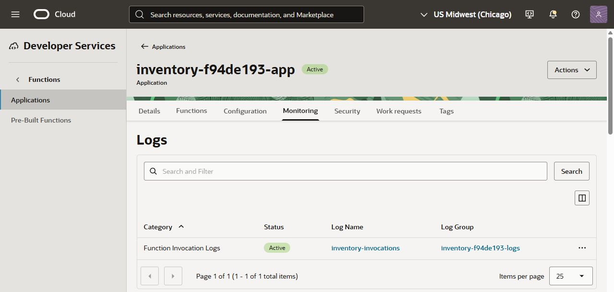
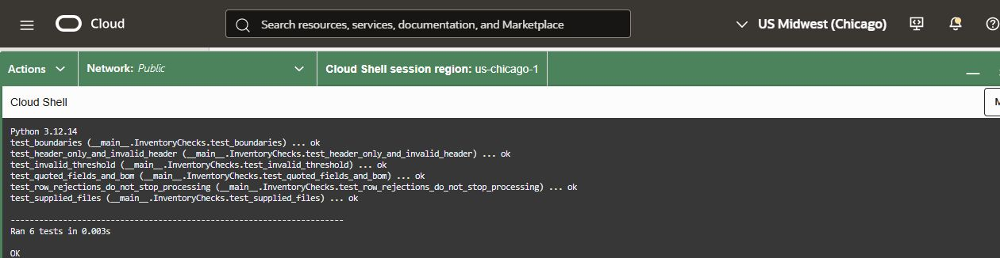
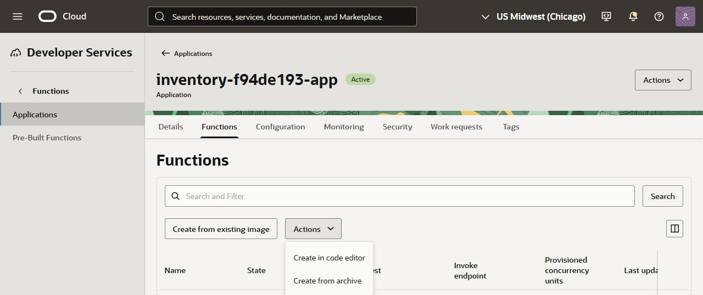
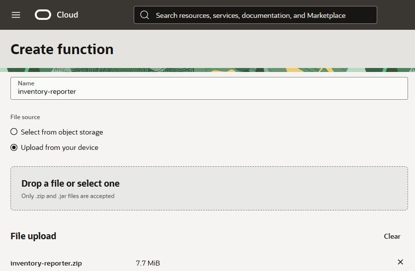
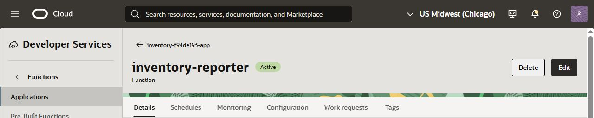
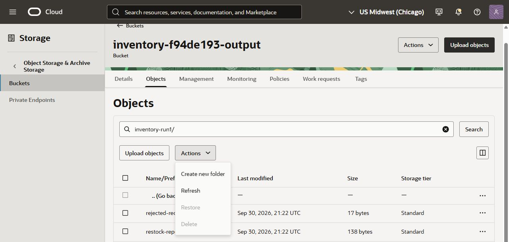
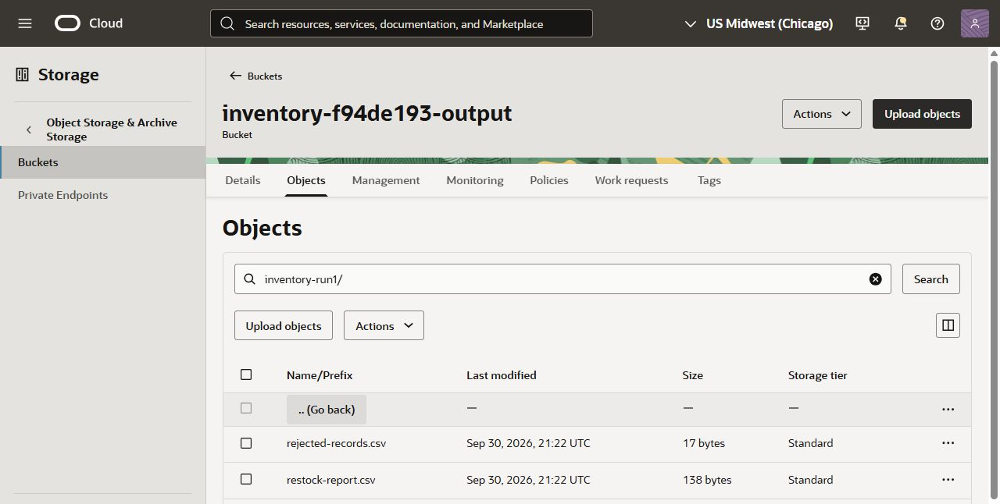

# Deploy and Trigger an Inventory-Processing Function

## Introduction

Create the buckets and Functions application, then deploy a Python function from a ZIP archive and connect it to an Object Storage upload event. Verify that an inventory CSV automatically produces restock and rejected-record reports.

**Estimated Time:** 45–55 minutes.

### Objectives

- Review or generate the processing module and run the supplied checks in Cloud Shell.
- Create and configure the buckets and application, then deploy a code-only function.
- Connect an Object Storage event and verify the resulting reports.

### Prerequisites

- Complete **Get Started** using the sandbox or own-tenancy instructions.
- Have access to the prepared private network, log group, runtime IAM, learner permissions, and resource sheet. You create the buckets and application below.
- Use the assigned resource names if they differ from the examples.
- Optional: access to an AI coding assistant; the tested reference code is also provided.

## Task 1: Create the incoming and output buckets

**Time:** 5-7 minutes.

1. Open **Storage > Object Storage & Archive Storage > Buckets** and select `LAB_COMPARTMENT` from your resource sheet.

2. Select **Create bucket**. Enter `INCOMING_BUCKET_NAME` exactly as supplied. Keep **Namespace** scope, **Standard** storage, and Oracle-managed encryption. Leave optional auto-tiering, versioning, and event emission disabled, then create the bucket. Its visibility should be **Private** after creation; do not make it public.

3. Open the incoming bucket's **Details > Features**. Beside **Emit object events**, select **Enable**, then confirm **Enable**. Verify that the setting is **Enabled**.

4. Create a second private Standard bucket using `OUTPUT_BUCKET_NAME`. Leave **Emit object events disabled** on this bucket.

5. Verify that both buckets are empty and their names exactly match the resource sheet. Bucket-scoped runtime policies use these names; choosing different names can prevent the function from reading inputs or writing reports.

    > **Checkpoint:** You created two separate private buckets. Only the incoming bucket emits events, so report writes will not start the workflow again.

## Task 2: Create and configure the Functions application

**Time:** 8-10 minutes.

1. Open **Developer Services > Functions > Applications** and select `LAB_COMPARTMENT`.

2. Select **Create application**. Enter `APPLICATION_NAME` from the resource sheet.

3. Select the supplied `VCN_NAME` and `SUBNET_NAME`. Use the x86 architecture/shape (`GENERIC_X86`), not Arm: the supplied deployment archive contains x86-64 dependencies. Leave other optional settings at their defaults and create the application.

4. Open the application's **Configuration** tab and select **Manage configuration**. Select **Add configuration** for each of the following four rows. Enter each key exactly, including underscores, and copy the values from your resource sheet.

    | Key | Value |
    | --- | --- |
    | `INPUT_BUCKET` | Your `incoming_bucket_name` value |
    | `OUTPUT_BUCKET` | Your `output_bucket_name` value |
    | `OBJECT_STORAGE_NAMESPACE` | Your `object_storage_namespace` value |
    | `LOW_STOCK_THRESHOLD` | `10` |

5. Select **Save changes**. Check spelling, bucket names, and namespace. The namespace is not your compartment name or bucket name. If needed, find it in the tenancy's Object Storage information.

    > **Checkpoint:** The application groups your function with its private network and shared configuration. It contains no function yet.

## Task 3: Enable application invocation logging

**Time:** 2-3 minutes.

1. Open the application's **Monitoring** tab and find **Logs**.

2. In the **Function Invocation Logs** row, open **Actions > Enable log**. Select `LAB_COMPARTMENT` and the prepared `LOG_GROUP_NAME`.

3. Name the log `inventory-invocations`. Under **Show advanced options > Log retention**, keep **1 month (default) (30 days)**, then enable the log.

4. Verify that the log status is **Active**. It may be empty until you invoke the function later.

    

    Do not enable Object Storage access logging for this exercise; the troubleshooting steps use the Functions application invocation log. If you cannot select the log group or enable the log, ask your tenancy administrator to check your permissions, or use **Need Help?** for sandbox assistance.

    > **Checkpoint:** The application's invocation log is ready before the first CSV upload.

## Task 4: Prepare and check the Python code

**Time:** 8 minutes. **Outcome:** Your inventory-processing code passes the supplied checks.

1. Download the [source and sample data bundle](files/inventory-lab-source.zip). It includes the reference code, four input CSVs, expected reports, a checker, and the reference function ZIP. Extract the bundle before deploying; the outer source bundle is not itself a function archive.

2. Open **Cloud Shell** from the Console's **Developer tools** menu and wait for the terminal prompt. Run every command in this task in **Cloud Shell**, not a terminal on your own computer. In the Cloud Shell panel, select **Menu > Upload**, select `inventory-lab-source.zip`, and select **Upload**. Wait for **Completed**, then close the transfer dialog. The file is uploaded to your Cloud Shell home directory.

3. Confirm Python 3.12 is available, then extract the bundle into a new directory and open it:

    ```bash
    python3.12 --version
    cd ~
    mkdir inventory-lab && unzip inventory-lab-source.zip -d inventory-lab && cd inventory-lab
    ```

    The first command should print `Python 3.12.x`. Use `python3.12` explicitly: the default `python3` can be a different version. If the command is unavailable, use **Need Help?**; do not silently switch to another Python version. If `inventory-lab` already exists from an earlier attempt, use a new directory name throughout this task instead of overwriting it.

    > **No dependency installation is needed:** The supplied checker, reference processing module, and repackaging script use only Python's standard library. Do not run `pip install` or install `requirements.txt` for this task. The function's OCI libraries are already inside the supplied deployment ZIP; Cloud Shell does not need to install or load them.

4. Review the supplied module and keep a copy before making changes:

    ```bash
    cp -n function/inventory.py function/inventory-reference.py
    cat function/inventory.py
    ```

    For the reference-code path, keep the supplied module and continue to step 5. For the optional AI path, open the [AI prompt](files/ai-prompt.txt) and submit it to your assistant. On your computer, paste only the returned Python code (without Markdown fences) into a plain-text editor and save it as `inventory.py`, not `inventory.py.txt`. Use **Cloud Shell Menu > Upload** to upload that file to your home directory. From the `inventory-lab` directory, replace only the processing module:

    ```bash
    cp ~/inventory.py function/inventory.py
    ```

    The function `process_inventory(csv_text, threshold=10)` returns two CSV strings. It trims values, uppercases product and warehouse codes, checks quantities, and selects valid rows with `quantity < threshold`.

    > **Note:** Generate only the inventory-processing module. The supplied `func.py` handles OCI event parsing, Object Storage reads and writes, and logs. No AI service is called when the deployed function runs.

5. Run the checker from the `inventory-lab` directory:

    ```bash
    python3.12 verify_inventory.py
    ```

6. Confirm that the output says **Ran 6 tests** and ends with **OK**. The tests cover all four sample files, normalization, threshold boundaries, and invalid input. If a generated implementation fails, read the failed assertion, correct the module, and run the checker again. Keep generated code limited to the standard library as the prompt requests; restore the saved reference module if you get stuck, then run the checker again:

    ```bash
    cp function/inventory-reference.py function/inventory.py
    python3.12 verify_inventory.py
    ```

    

7. Display the header and first six records:

    ```bash
    head -n 7 inventory-run1.csv
    ```

    Find the first five quantities: **2, 4, 5, 7, 9**. These are the five products expected in the initial restock report. The next quantity, exactly **10**, does not qualify.

8. If you changed `function/inventory.py`, repackage your code with the supplied dependencies:

    ```bash
    python3.12 package_logic.py
    ```

    This creates **inventory-reporter-custom.zip**, keeping the tested Linux dependencies from the reference archive. You can also run this command with the unchanged reference module to practice packaging.

9. To download your custom archive, select **Menu > Download** in the Cloud Shell panel. Enter the path below, relative to your **home directory**, and select **Download**. Do not add a leading `/` or `~/` in the dialog; it already supplies `~/`.

    ```text
    inventory-lab/inventory-reporter-custom.zip
    ```

    Check your browser's downloads list and confirm that the ZIP was saved before continuing. If a transfer says Completed but no file is saved, retry in your regular browser and check its download notification. If using the unchanged reference implementation, you can instead use **inventory-reporter.zip** from the bundle extracted on your computer. Either way, you need the function ZIP on your computer for Task 5, not the outer `inventory-lab-source.zip`.

    > **Checkpoint:** All checks pass. You can explain why the default rule selects five rows from the 20-row sample.

## Task 5: Create the function in your application

**Time:** 10 minutes. **Outcome:** The `inventory-reporter` function is active in `APPLICATION_NAME`.

1. Open **Functions**, select `LAB_COMPARTMENT`, and open `APPLICATION_NAME`.

2. Select the **Functions** tab. Open the **Actions** menu beside **Create from existing image**, not the Actions menu in the application banner. Select **Create from archive**.

    

3. Enter **inventory-reporter** as the name. Under **File source**, select **Upload from your device**.

4. Select the reference **inventory-reporter.zip**, or the **inventory-reporter-custom.zip** you generated and checked in Task 4. Upload the function archive itself, not the outer source bundle.

    

5. Enter the settings below. The handler value means: load `func.py` from the archive's `function/` directory and call its `handler` function. The reference archive includes the OCI SDK and its Linux dependencies; the managed runtime supplies FDK. Do not rely on `requirements.txt` being installed during deployment.

    Enter these values in the **Create function** form:

    | Setting | Lab value |
    | --- | --- |
    | Function name | `inventory-reporter` |
    | Runtime | `python312.ol9` |
    | Handler | `func.handler` |
    | Memory | 256 MB (change the default 128 MB) |
    | Synchronous invocation timeout | 60 seconds |
    | Runtime version management | Function update |

    These form settings are separate from the configuration you saved in Task 2. The application supplies `INPUT_BUCKET`, `OUTPUT_BUCKET`, `OBJECT_STORAGE_NAMESPACE`, and `LOW_STOCK_THRESHOLD` (initially `10`). Check those four inherited values on the function's **Configuration** tab after creation. The function uses its OCI resource identity to access the buckets; there are no personal credentials in the code.

6. Leave provisioned concurrency disabled and the destination settings at their defaults. Select **Create** and wait until the function is **Active**.

    

    **Function update** means that OCI adopts a newer managed runtime version when the function is modified. The Python source and dependencies are in your archive; OCI manages the execution runtime.

    > **Checkpoint:** Do not continue until the deployed function is **Active** and the application configuration matches the lab environment.

## Task 6: Connect the upload event

**Time:** 7 minutes. **Outcome:** An Events rule targets your function when a new object is created in the incoming bucket.

1. Search for **Events** in the Console and select **Rules** under **Events Service**, not the OS Management or Autonomous Linux results. Select `LAB_COMPARTMENT`.

2. Select **Create rule**, name the rule `EVENT_RULE_NAME`, and use a description such as `Process new supplier inventory CSV files`.

3. Configure the event condition:

    | Field | Value |
    | --- | --- |
    | Condition | Event Type |
    | Service | Object Storage |
    | Event type | Object - Create |

4. Click the **Description** field to leave the event-type dropdown. Select **Add condition > Attribute**, then choose `bucketName`. Type `INCOMING_BUCKET_NAME` from your resource sheet and press **Enter** to add the value. Click **Description** again to leave the dropdown. Avoid Escape while editing: it can close the whole draft. This condition restricts the rule to your incoming bucket.

5. Add a **Functions** action and select the `LAB_COMPARTMENT` compartment, `APPLICATION_NAME` application, and **inventory-reporter** function.

6. Select **Preview rule logic** and confirm the rule matches only `com.oraclecloud.objectstorage.createobject` **and** your incoming `bucketName`. Remove any unintended event selections. Create the rule and confirm it is **Active** and its Functions action is **Enabled**.

    > **Note:** The function must exist before it can be selected as a rule action. Use a new object name for each exercise; replacing an existing object is an update, while this lab listens for object creation.

    > **Checkpoint:** The enabled rule matches **Object - Create** for the incoming bucket and names your function as its action.

## Task 7: Upload inventory and inspect the reports

**Time:** 7-10 minutes. **Outcome:** You see five restock rows and an empty rejected-records report.

1. Download [inventory-run1.csv](files/inventory-run1.csv) to your computer. If your browser displays the CSV, save it as a file with that name.

2. In Object Storage, open `INCOMING_BUCKET_NAME` and select **Upload objects**.

3. Leave **Object name prefix** blank and choose `inventory-run1.csv`. Keep **Standard** storage tier, select **Next**, review the file, and select **Upload objects**. Wait for **Done**, then select **Close**.

4. Open `OUTPUT_BUCKET_NAME`, then its **Objects** tab. Use **Actions > Refresh** above the objects table until you see the `inventory-run1/` prefix. Simply returning to the page or using Search does not necessarily refresh the list. Event delivery and execution are asynchronous; allow a few minutes for the first invocation.

    

5. Open that prefix. For each report, use its row **Actions > Download** to save `restock-report.csv` and `rejected-records.csv`. The object filename itself is not a download link. Confirm the files appear in your browser's downloads list, then open them in a text editor or spreadsheet application.

    

    Your first upload uses `inventory-run1.csv` and produces `inventory-run1/`. A different new filename changes only the output prefix.

6. Compare the reports with the expected result:

    | Report | Expected data rows | What to look for |
    | --- | --- | --- |
    | `restock-report.csv` | 5 | INV-001 through INV-005; normalized SKU and warehouse codes |
    | `rejected-records.csv` | 0 | Only the `record_id,reason` header |

7. Check that the product with a quantity of **10** is absent from the restock report. The condition is **less than 10**, not less than or equal to 10.

    > **Checkpoint:** Uploading a CSV produced two reports without a manual function invocation. You created an event-driven workflow: upload, match event, run code, write results.

    If reports have not appeared after a few minutes, verify the region, input bucket, new filename, enabled rule, and function target. Then inspect the application's invocation logs. A `reports_written` message includes the source filename and report counts. For help, use **Need Help?** in the workshop menu. In your own tenancy, ask your administrator to investigate a permissions error; do not expand IAM permissions yourself.

## Task 8: Recap and choose your next step

You created an event-driven workflow: upload an inventory CSV, match an event, run Python code, and write two reports.

1. Explain what caused the function to run, where it read data, and where it wrote its results.

2. To explore configuration changes and rejected-row diagnosis, proceed to **Lab 2: Configure and Troubleshoot Your Function (Optional)** using the workshop navigation. Keep your resources for that lab.

3. If you are finishing here, follow the [cleanup instructions](../get-started/cleanup.md). Keep all resources if you intend to complete Lab 2 first.

You may now **proceed to the next lab** for the optional exercises, or finish using the cleanup instructions above.

## Acknowledgements

- **Author** - Graham Shroyer
- **Last Updated By/Date** - Graham Shroyer, September 2026
