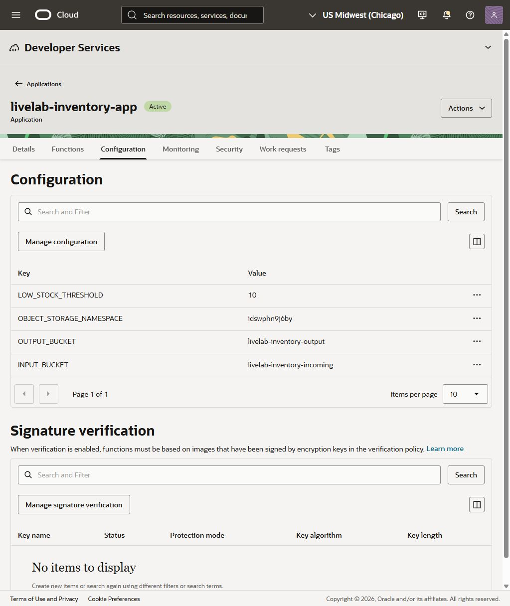
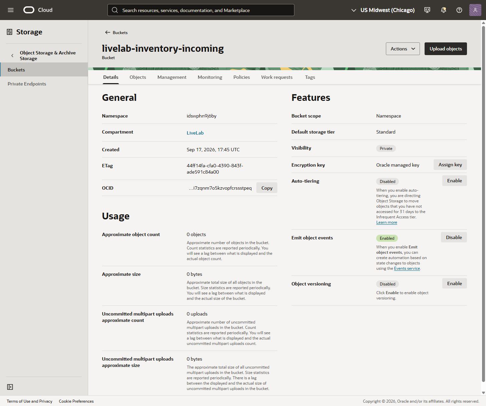

# Get Started

## Introduction

**Description**

A supplier sends an inventory CSV. Your operations team needs to know which products need restocking. In this lab, you create a Python function and connect it to an Object Storage upload event. Upload a file and the function writes two reports: products below the stock threshold and records that need correction.

**Lab Objectives**

- Explain how an application, a function, and an event work together.
- Review Python logic, using a supplied AI prompt or the tested reference implementation.
- Deploy a function and connect an Object Storage event to it.
- Upload a CSV and verify the resulting reports.

**Intended Audience**

Beginner technical learners. No previous OCI Functions experience is required.

**Estimated Workshop Time**

35-40 minutes. Optional extensions take another 10-15 minutes. 

**Prerequisites**

- Access to the prepared lab compartment and OCI Console.
- The application, network, two buckets, and logging prepared by the workshop host.
- A browser and access to OCI Cloud Shell for checking the supplied Python code.
- Optional: an AI coding assistant you already have access to. The reference code lets you complete the lab without one.

**What OCI Functions does**

OCI Functions runs your code when it is invoked, without requiring you to administer a server. An **application** groups functions that share networking and configuration. A **function** contains the code for one task. An **event rule** decides when a change in another OCI service should invoke that function.

In this lab, an upload creates an object in the incoming bucket. OCI Events matches that event and invokes your function. The function reads the CSV and writes reports to a separate output bucket.

```text
Upload inventory CSV -> Incoming bucket -> OCI Events -> Python function -> Output bucket
```

The reports are stored under a prefix named after the input file. For example, `inventory-run1.csv` produces `inventory-run1/restock-report.csv` and `inventory-run1/rejected-records.csv`.

**Resources**

- [OCI Functions overview](https://docs.oracle.com/en-us/iaas/Content/Functions/Concepts/functionsoverview.htm)
- [Creating Functions using Code Editor](https://docs.oracle.com/en-us/iaas/Content/Functions/Tasks/functionscreatingfunctions-usingcodeeditor.htm)
- [Creating an Events rule](https://docs.oracle.com/en-us/iaas/Content/Events/Task/create-events-rule.htm)
- [Function logging](https://docs.oracle.com/en-us/iaas/Content/Logging/Reference/details_for_functions.htm)

**Contact us**

For help during the workshop, contact your instructor or lab facilitator.

> **Author review edition:** The reference archive and all four CSV exercises passed in Chicago on September 17, 2026. Lab 1's upload, checks, repackaging, and download were also verified in OCI Cloud Shell. A fresh learner-role dry run, beginner timing test, and green-button integration remain before publication.

## Task 1: Access your reserved sandbox

1. Open your workshop reservation and use its supplied OCI Console sign-in details. Use the sandbox credentials, not credentials for your personal tenancy.

2. Wait for the reservation's environment preparation to finish. Select the assigned region and compartment. This workshop was validated in **US Midwest (Chicago)**.

3. Find the prepared Functions application, private network, incoming/output buckets, invocation log, and runtime permissions. The sandbox administrator prepares these resources; you create the function and Events rule in Lab 1.

4. Confirm that you can open **Cloud Shell** from the Console's **Developer tools** menu. Download the source bundle when instructed in Lab 1.

> **Author review edition:** Green-button provisioning is not yet integrated. These sandbox instructions describe the intended reservation handoff. Do not begin Lab 1 unless your facilitator confirms that the supporting resources and learner permissions are ready.


Use the compartment and resource names assigned to you. The screenshots use the author's example names in Chicago; if your reservation or administrator provides different names, substitute them throughout both labs. Do not use another participant's resources.

## Task 2: Explore your prepared environment

**Time:** 5 minutes. **Outcome:** You can identify the resources in the upload-to-report workflow.

1. Sign in to the OCI Console and select **US Midwest (Chicago)** in the region selector.

2. Search for **Functions**, open **Applications**, and set the compartment filter to **LiveLab**.

3. Open **livelab-inventory-app**. This application provides the network and shared settings for your function. You will add a function to it in Lab 1, Task 2.

Open **Configuration** to find the input/output buckets, namespace, and default threshold of 10. Your namespace will be specific to your lab tenancy.



4. Search for **Buckets**, keep the **LiveLab** compartment selected, and open **livelab-inventory-incoming**.

5. On the **Details** tab, confirm that **Emit object events** is **Enabled**. This setting lets Object Storage announce new uploads to OCI Events.



6. Return to the bucket list and locate **livelab-inventory-output**. Your reports will appear here after the function runs.

> **Checkpoint:** You found one Functions application and two buckets. The incoming bucket emits object events. The output bucket is separate, so writing a report does not trigger the same workflow again.


You may now **proceed to Lab 1** using the workshop navigation.
