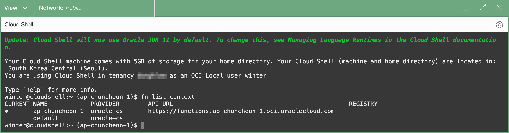
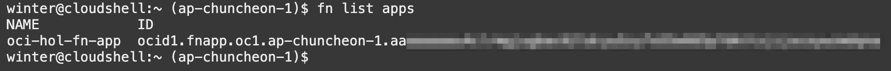

# Deploy Hell World, Functions

## Introduction

Oracle Functions을 실행하는 데에 대한 기본 사항을 알아봅니다. 본 실습에서는 관련 CLI가 이미 구성되어 있는 Cloud Shell에서 Function을 생성하여 배포하는 방법을 수행합니다.

예상 시간: 20분

### 목표

- Functions 개발을 위한 개발 환경 구성하기
- 첫 Function으로 Hello World 배포하기

### 전제 조건

- Oracle Cloud Trial Account 또는 Paid Account
- Lab 1 실습 완료


## Task 1: Function Application 만들기

1. 왼쪽 상단의 **Navigation Menu**를 클릭하고 **Developer Services**으로 이동한 다음 **Functions**하위의 **Applications** 을 선택합니다.

	

2. 사용할 Compartment를 선택합니다.

3. **Create Application**을 클릭하고, 아래 내용을 작성하여 생성합니다.

    - **Name**: oci-hol-fn-app
    - **VCN** : 사용할 VCN 선택
    - **Subnets** : 사용할 *Public* 서브넷 선택

    

3. 아래로 스크롤하여 **Resources** >> **Getting started**로 이동합니다.

    - 두 가지 환경에서 시작하는 방법이 있는데, 여기서는 Cloud Shell에서 진행하도록 하겠습니다.
    
        * Cloud Shell setup: fn CLI을 포함하여 필요한 구성이 이미 설정되어 있습니다.
        * Local setup: 공식 문서에 따라 별도로 fn CLI 설치를 포함하여 관련 툴 설치 작업이 필요합니다.

        

   
## Task 2: Cloud Shell에서 시작하기

**Getting Started**의 **Cloud Shell setup** > **Setup fn CLI on Cloud Shell** 에 있는 아래 절차대로 실행하면 됩니다. 그림 아래 내용은 각 순서에 대한 추가 설명입니다.


1. **Launch Cloud Shell**을 클릭하여 Cloud Shell을 실행합니다.

2. fn CLI의 컨텍스트를 현재 작업중인 Region으로 설정합니다.

    - Cloud Shell에는 아래 명령 결과에서 보듯이 fn cli가 사전에 설치되어 있고, Cloud Shell 시작시의 Region이 fn CLI에서 사용할 수 있게 context가 자동으로 설정되어 있습니다.

    ```
    <copy>
    fn list context
    fn use context <region-context>
    </copy>
    ```

    

3. fn CLI의 컨텐스트를 작업할 Compartment로 설정합니다.

    ```
    <copy>
    fn update context oracle.compartment-id [compartment-ocid]
    </copy>
    ```

4. Function이 배포되면서 만들어질 컨테이너 이미지를 저장할 Registry 저장소(여기서는 OCI Registry)를 설정합니다. 여기서는 `[repo-name-prefix]`을 {compartment-name}/{function-application-name} 이름으로 합니다. 

    ```
    <copy>
    fn update context registry <region-key>.ocir.io/[tenancy-namespace]/[repo-name-prefix]
    </copy>
    ```

    

5. OCI Registry에 이미지를 저장하기 위해 패스워드로 사용할 Auth Token을 생성합니다.
    - **Generate an Auth Token** 링크를 클릭합니다.
    - **Generate token**을 클릭합니다.
    - Description을 입력(예, auth-token-for-fn)하고 다시 **Generate an Auth Token**을 클릭합니다.
    - 생성된 Auth Token을 복사둡니다. *창을 닫으후 다시 확인이 불가하므로 안전한 곳에 보관합니다.*

    
    
6. Getting Started 화면으로 다시 이동하여, docker cli로 OCI Registry에 로그인합니다. 패스워드는 Auth Token입니다.

    *노트: 사용중인 테넌시가 IDCS를 통해 페더레이션을 하는 경우, username은 oracleidentitycloudservice/[USERNAME] 포맷입니다.*

    ```
    <copy>
    docker login -u '<tenancy-namespace>/<user-name>' <region-key>.ocir.io
    </copy>
    ```

7. fn CLI 설정이 정상적으로 되면, 아래 명령으로 앞서 콘솔에서는 만든 Function Application을 조회할 수 있습니다.

    ```
    <copy>
    fn list apps
    </copy>
    ```

    

## Task 3: Hello World *Java* Function 생성, 배포, 호출하기

**Getting Started**의 **Cloud Shell setup** > **Setup fn CLI on Cloud Shell** 에 있는 아래 절차대로 실행하면 됩니다. 그림 애래 내용은 해당 해당 내용을 설명한 작업 순서는 동일한 내용입니다.


8. Function 템플릿을 통해 Hello World Function을 생성합니다.

    ```
    <copy>
    fn init --runtime java hello-java
    </copy>
    ```
    
    - OCI Functions은 여러가지 언어를 제공합니다. Function 생성시 --runtime 옵션으로 언어를 지정합니다. 현재 지원하는 언어는 다음과 같습니다.
        * [Languages Supported by OCI Functions](https://docs.oracle.com/en-us/iaas/Content/Functions/Tasks/languagessupportedbyfunctions.htm)


            | FDK Language | Default | Supported          | Deprecated |
            | :----------- | :------ | :----------------- | :--------- |
            | Java         | 17      | 17, 11, 8          | n/a        |
            | Python       | 3.9     | 3.9, 3.8, 3.7, 3.6 | n/a        |
            | Ruby         | 2.7     | 2.7                | 2.5        |
            | Go           | 1.15    | 1.15               | 1.11       |
            | Node.js      | 14      | 14                 | 11         |
            | C# (.NET)    | 6.0     | 6.0, 3.1           | n/a        |
            {: title="Languages Supported by OCI Functions"}

9. 생성된 폴더로 이동하고, 기본 생성된 Function을 확인합니다.

    ```
    <copy>
    cd hello-java
    </copy>
    ```

    - java를 사용하는 hello-java는 아래와 같이 구성됩니다.
    ```
    .
    ├── func.yaml
    ├── pom.xml
    └── src
        ├── main
        │   └── java
        │       └── com
        │           └── example
        │               └── fn
        │                   └── HelloFunction.java
        └── test
            └── java
                └── com
                    └── example
                        └── fn
                            └── HelloFunctionTest.java
    ```          
        * src 폴더: 아래와 같은 자바 파일이 자동생성되어 있습니다. Function 호출시 handleRequest() 메서드가 호출됩니다. 기본 생성된 코드를 필요한 코드로 변경하여 사용하면 됩니다.
        ```
        $ cat src/main/java/com/example/fn/HelloFunction.java 
        package com.example.fn;
        
        public class HelloFunction {
        
            public String handleRequest(String input) {
                String name = (input == null || input.isEmpty()) ? "world"  : input;
        
                System.out.println("Inside Java Hello World function"); 
                return "Hello, " + name + "!";
            }
        ```        
        * pom.xml: Function을 컴파일하기 위해 필요한 Dependencies가 정의된 Maven 설정 파일
        * func.yaml: Function 정의 파일입니다. [Changing Default Memory and Timeout Settings](https://docs.oracle.com/en-us/iaas/Content/Functions/Tasks/functionscustomizing.htm)에 따라 기본 메모리(128MB), 타임아웃(30초)을 변경할 수 있습니다. 
        ```
        $ cat func.yaml 
        schema_version: 20180708
        name: hello-java
        version: 0.0.1
        runtime: java
        build_image: fnproject/fn-java-fdk-build:jdk17-1.0.162
        run_image: fnproject/fn-java-fdk:jre17-1.0.162
        ```

10. Function을 배포합니다.

    ```
    <copy>
    fn -v deploy --app <app-name>
    </copy>
    ```


    결과 확인 - *처음 배포하게 되면 Maven Repository에서 라이브러리를 다운받게 되어 배포 시간이 좀 걸립니다.*

    ```
    $ fn -v deploy --app oci-hol-fn-app
    Deploying hello-java to app: oci-hol-fn-app
    ...
    51c82b74fabc: Mounted from xxxxxxxxxxxx/jdoe/hello-java 
    0.0.2: digest: sha256:6a6fb3d214a8fdfac3aa2d4048ad5c338fe4d789c05d113cd290e5817af2925d size: 2001
    Updating function hello-java using image yny.ocir.io/xxxxxxxxxxxx/oci-hol/oci-hol-fn-app/hello-java:0.0.2...
    ```

11. 배포된 Function을 fn CLI로 호출해봅니다.

    > 시간도 함께 체크해 보면 첫 호출은 Cold Start로 내부 프로비저닝이 발생하여 시간이 좀 걸리며, 두번째 호출에서는 빠른 응답을 보입니다.

    ```
    <copy>
    fn invoke <app-name> hello-java
    </copy>
    ```

    호출결과
    ```
    $ time fn invoke oci-hol-fn-app hello-java
    Hello, world!
    
    real    0m34.813s
    user    0m0.501s
    sys     0m0.037s
    $ time fn invoke oci-hol-fn-app hello-java
    Hello, world!
    
    real    0m0.685s
    user    0m0.306s
    sys     0m0.040s
    ```    

## Task 4: Hello World *Python* Function 생성, 배포, 호출하기

Function에서 많이 사용하는 Python으로 동일한 과정을 수행해 봅니다. 앞선 hello-java 폴더내부가 아닌지 확인후 적절한 위치로 이동합니다.

8. Function 템플릿을 통해 Hello World Function을 생성합니다.

    ```
    <copy>
    fn init --runtime python hello-python
    </copy>
    ```

2. 생성된 폴더로 이동하고, 기본 생성된 Function을 확인합니다.

    ```
    <copy>
    cd hello-python
    </copy>
    ```

    - hello-python는 아래와 같이 구성됩니다.
    ```
    .
    ├── func.py
    ├── func.yaml
    └── requirements.txt
    ```          
        * func.py: 아래와 같은 파이썬 파일이 자동생성되어 있습니다. Function 호출시 handler() 메서드가 호출됩니다. 기본 생성된 코드를 필요한 코드로 변경하여 사용하면 됩니다.
        ```
        $ cat func.py 
        import io
        import json
        import logging
        
        from fdk import response
        
        
        def handler(ctx, data: io.BytesIO = None):
            name = "World"
            try:
                body = json.loads(data.getvalue())
                name = body.get("name")
            except (Exception, ValueError) as ex:
                logging.getLogger().info('error parsing json payload: ' + str(ex))
        
            logging.getLogger().info("Inside Python Hello World function")
            return response.Response(
                ctx, response_data=json.dumps(
                    {"message": "Hello {0}".format(name)}),
                headers={"Content-Type": "application/json"}
            )
        ```        
        * requirements.txt: func.py에서 추가적으로 사용되는 패키지 의존성을 여기에 추가합니다.
        ```
        $ cat requirements.txt 
        fdk>=0.1.50
        ```

        * func.yaml: Function 정의 파일입니다. 자바때와 동일한 형식입니다.
        ```
        $ cat func.yaml 
        schema_version: 20180708
        name: hello-python
        version: 0.0.1
        runtime: python
        build_image: fnproject/python:3.9-dev
        run_image: fnproject/python:3.9
        entrypoint: /python/bin/fdk /function/func.py handler
        memory: 256        
        ```

3. Function을 배포합니다.

    ```
    <copy>
    fn -v deploy --app <app-name>
    </copy>
    ```

    결과 확인

    ```
    $ fn -v deploy --app oci-hol-fn-app
    Deploying hello-python to app: oci-hol-fn-app
    ...
    0.0.2: digest: sha256:065d7b2aa4be22fceeca0c3e2ca0f3ea197bc6841c8c0a2ebf1a4b84cc5ed727 size: 1779
    Updating function hello-python using image yny.ocir.io/xxxxxxxxxxxx/oci-hol/oci-hol-fn-app/hello-python:0.0.2...
    Successfully created function: hello-python with yny.ocir.io/xxxxxxxxxxxx/oci-hol/oci-hol-fn-app/hello-python:0.0.2
    ```

4. 배포된 Function을 fn CLI로 호출해봅니다. 첫 호출이라 시간이 약간 걸립니다.

    ```
    <copy>
    fn invoke <app-name> hello-python
    </copy>
    ```

    호출 결과
    ```
    $ fn invoke oci-hol-fn-app hello-python
    {"message": "Hello World"}
    ```    

5. Java Function 때와 기본적으로 동일한 구성 및 절차인 것을 알 수 있습니다. 추가적인 샘플은 [Oracle Functions Samples @GitHub](https://github.com/oracle-samples/oracle-functions-samples)을 참조하세요.

## Task 5. Function 로그 활성화

1. 생성한 Functions Application(예, oci-hol-fn-app) 상세화면에서 아래로 스크롤하여 **Resources** >> **Logs**로 이동합니다.

2. **Function Invocation Logs**를 활성화하기 위해 슬라이딩 버튼을 클릭 합니다.

3. 창이 뜨면 기본 설정값으로 로그를 활성화합니다.

     

4. 로그가 활성이 완료되면, 로그 이름을 클릭합니다.

    

5. 테스트를 위해 Cloud Shell에서 Function을 다시 한번 호출합니다.
    ```
    $ fn invoke oci-hol-fn-app hello-python
    {"message": "Hello World"}
    ```    

6. 로그 화면에서 우측 **Actions**에서 **Wrap lines**를 클릭합니다.

7. 아래와 같이 Function이 실행된 로그를 볼 수 있습니다.

    *Function 코드에서 발생하는 로그는 OCI Logging에 보이기 까지 약간의 시간차가 발생할 수 있습니다.*

    


## Task 6. Code Editor에서 개발하기

1. Code Editor를 실행합니다. Code Editor는 Eclipse Theia를 기반으로 만들어진 툴입니다.

    

2. 왼쪽 메뉴에서 Explorer를 선택하면, 기본 설정된 사용자의 워크스페이스로 홈 디렉토리가 등록되어 있습니다.

3. 개발툴에서 제공하는 기본 기능을 통해 생성된 Function을 개발하면 됩니다. Code Editor는 Cloud Shell과 동일한 환경이므로 JDK 등 기본툴을 사전에 설치되어 있습니다.

    

4. 앞서 만든 Python Function의 경우, 처음엔 다음과 같이 경고가 뜹니다.

    

5. Terminal을 엽니다. 여러개를 탭으로 실행하는 것도 지원합니다.

    

6. 열린 터미널에서 Function Development Kits (FDKs) Python 라이브러리를 설치합니다.

    ```
    <copy>
    pip3 install --user fdk
    </copy>
    ```

7. func.py를 다시 열면, 패키지가 없다는 경고가 없어지고, 잘 동작하는 것을 알 수 있습니다.

    

8. 이후 실습에서는 선호도에 따라 Cloud Shell에서 VI를 사용하거나, Code Editor를 사용합니다.


이제 **다음 실습을 진행**하시면 됩니다.

## Learn More

* [Oracle Functions Samples @GitHub](https://github.com/oracle-samples/oracle-functions-samples)


## Acknowledgements

* **Author** - DongHee Lee
* **Last Updated By/Date** - DongHee Lee, January 2023