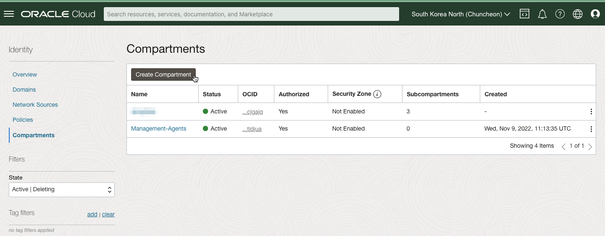
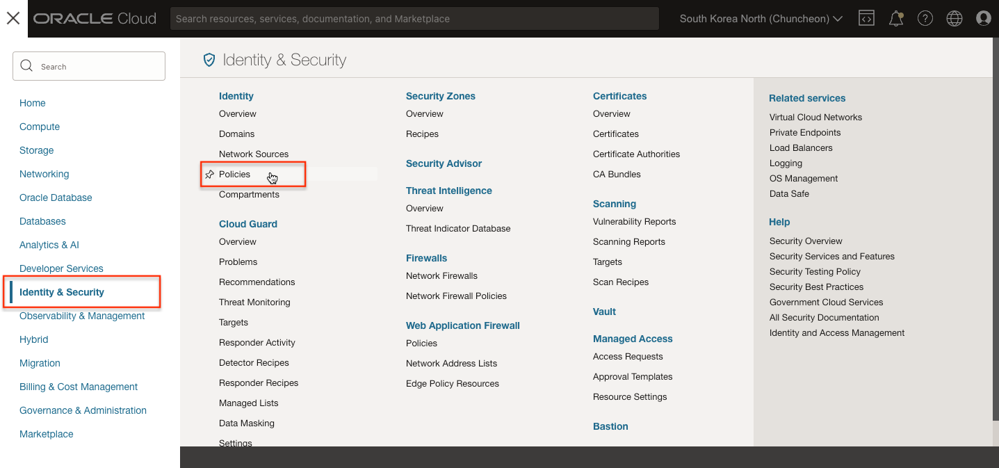
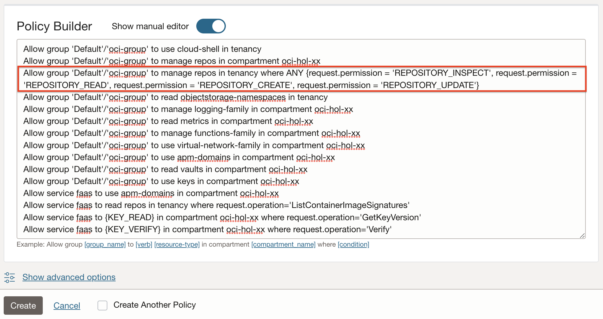

# Setup Cloud Environment

## Introduction

Functions 서비스에 대한 실습을 하기 위해 환경 구성을 위해 필요한 사전 작업을 수행하는 실습입니다. Policy를 설정하는 Task 4까지는 관리자 또는 관련 권한이 있는 유저로 수행해야 합니다.

예상 시간: 10분

### 목표

- 사용자가 Functions 개발을 위한 개발 환경 구성하기
- Functions 서비스를 사용하기 위한 지원 및 Policy 설정

**필요한 모든 자격 증명을 기록하는 메모 페이지를 만드는 것을 권장합니다.**

### 전제 조건

- Oracle Cloud Trial Account 또는 Paid Account
- *관리자 권한 필요 - Compartment를 생성하고, Task 3에서 Policy를 설정합니다. 테넌시 기준의 Policy를 포함하고 있기 때문에 관리자로 로그인하여 수행하여야 합니다.*

## Task 1: OCI 테넌시 로그인

OCI 대시보드에 로그인하여 리소스 생성에 필요한 정보를 확인합니다.

1. 로그인을 하시면 아래와 같은 페이지를 보실 수 있습니다.

  


## Task 2: Compartment 생성

1. 왼쪽 상단의 **Navigation Menu**를 클릭하고 **Identity & Security**으로 이동한 다음 **Compartments** 을 선택합니다.

  

2. 이 화면에서 compartments 목록이 표시되면 **Create Compartment**를 클릭합니다.

  

3. 다음을 입력:

    - Name: **oci-hol***-xx* 입력합니다.
    - Description: 설명을 입력합니다(예: oci-hol for user *xx*)
    - Parent Compartment: 이 Compartment가 속할 상위 Compartment를 선택합니다. 기본값은 루트 Compartment
    - **Create Compartment** 클릭 합니다.

      


## Task 3: Functions 서비스 사용을 위한 Policy 생성

*서비스를 사용하기 위한 권한을 설정합니다. 테넌시 기준의 Policy를 포함하고 있기 때문에 관리자로 로그인하여 수행하여야 합니다.*

> Policy 구문은 유저가 아닌 그룹에 대해 적용할 수 있습니다. 원하는 사용자가 속한 그룹이 없는 경우 [Create a group](https://docs.cloud.oracle.com/en-us/iaas/Content/Identity/Tasks/managinggroups.htm#To)을 참조하여 먼저 그룹을 만들어 유저를 할당합니다.

1. 왼쪽 상단의 **Navigation Menu**를 클릭하고 **Identity & Security**으로 이동한 다음 **Identity** > **Policies** 을 선택합니다.

  

2. **Create Policy** 클릭

3. 생성할 Policy를 다음과 같이 설정합니다.

    - Name: faas-policy*-xx* 입력합니다.
    - Description: Policy for Functions for oci-hol-*xx* compartment
    - Compartment: **root compartment**를 선택
    - Policy Builder:

        * **Policy Use Cases**에서 사전 정의된 Policy 중에서 **Functions**으로 선택
        * **Common policy templates**는 기본값인 `Let users create, deploy and manage functions and applications using Cloud Shell` 선택
        * Policy를 적용할 사용자 그룹을 선택합니다. 예) `oci-group`
        * Policy가 적용될 Compartment를 앞서 만든 Compartment로 선택합니다. 예) oci-hol*-xx*

             

4. Policy 구문들을 확인합니다. Functions 서비스 사용을 위해서 필요한 Policy 구문들을 확인할 수 있습니다.
  

5. **Show manual editor** 슬라이딩 버튼을 눌러 매뉴얼 편집 모드로 변경한 다음, 아래 규칙을 추가합니다.

    - 특정 Compartment에 이미지를 Push 하기 위해서는 Push 되기 전에 OCIR에 Repository가 만들어져 있어야 합니다. 없는 경우 Root Compartment(테넌시)에 자동으로 Repository 생성을 시도합니다. 이때 권한 문제가 발생하지 않도록, 편의상 아래 규칙을 추가합니다.
    - `<group-name>`을 이전규칙을 참고하여 적용할 사용자 그룹으로 변경합니다. 예, 'Default'/'oci-group'

      ```
      <copy>
      Allow group <group-name> to manage repos in tenancy where ANY {request.permission = 'REPOSITORY_INSPECT', request.permission = 'REPOSITORY_READ', request.permission = 'REPOSITORY_CREATE', request.permission = 'REPOSITORY_UPDATE'}
      </copy>
    ```

      

6. **Create**를 클릭하여 생성합니다.


## Task 4: VCN 및 서브넷 생성

네트워크 자원을 만들만한 VCN이 없는 경우, 아래와 같이 새 VCN을 만듭니다.

1. 왼쪽 상단의 **Navigation Menu**를 클릭하고 **Networking**으로 이동한 다음 **Virtual Cloud Networks** 을 선택합니다.

  

2. 이전 단계에서 만든 compartment를 선택합니다.

3. **Start VCN Wizard**을 선택합니다.

4. **Create VCN with Internet Connectivity**를 선택하고, **Start VCN Wizard**를 클릭합니다. 인터넷 연결이 되는 관련 자원들을 포함하여 VCN이 만들어지게 됩니다.

    

5. 새 VCN의 이름(예, oci-hol-vcn)하고, **Next**을 클릭합니다.

  

6. 생성될 VCN과 관련 네트워크 자원들을 리뷰하고, **Create**을 클릭합니다.

7. 인터넷 연결이 되는 관련 자원들을 포함하여 VCN이 만들어지게 됩니다.

  


이제 **다음 실습을 진행**하시면 됩니다.

## Acknowledgements

* **Author** - DongHee Lee
* **Last Updated By/Date** - DongHee Lee, January 2023