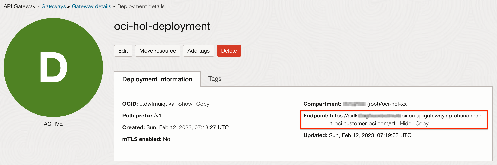
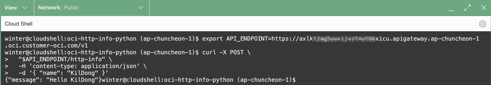

# Usecase #3 - Function as API Backend

## Introduction

OCI Functions의 사용사례로 API Backend로 사용하는 사례입니다. 모바일 클라이언트 등에서 사용할 API로 오픈하는 것이라, 보안 등을 위해 API Gateway를 거치도록 구성하여, *Client > API Gateway > Function - API Backend* 로 구성합니다. 실제 Function에서는 요건에 따라 대상시스템(예, OCI API 또는 ADB, MySQL)에 대한 API를 구현하게 됩니다. 해당 사항은 개발 영역으로 여기서는 API Gateway를 통한 API 노출시 Function 쪽에서 알아야 하는 꼭 알아야 항목에 대해서만 다룹니다.


예상 시간: 50분

### 목표

- Python Function 직접 구현하기
- API Gateway을 통해 Function을 API로 노출하기

### 전제 조건

- Oracle Cloud Trial Account 또는 Paid Account
- Lab 2 실습 완료


## Task 1. API Backend용 Function 만들기

Backend API로서 Function이 역할을 수행할때, 즉 HTTP로 호출되었을 때 호출 정보들을 가져오는 부분에 우선 살펴봅니다. 일단은 hello-world 버전을 그대로 사용합니다.
API의 내부 로직은 이후 요건에 따라 각 개발언어로 구현하면 될 것입니다.

1. Cloud Shell을 실행합니다.

2. python Function을 생성합니다.

    ```
    <copy>
    fn init --runtime python oci-http-info-python
    </copy>
    ```

3. 생성된 폴더로 이동하고, 기본 생성된 Function을 확인합니다.

    ```
    <copy>
    cd oci-http-info-python
    </copy>
    ```

4. 지금은 Function을 변경하지 않습니다.

5. 앞선 실습에서 만든 Function Application과 Context를 그대로 사용하여 배포합니다.

    ```
    <copy>
    fn -v deploy --app oci-hol-fn-app
    </copy>        
    ```

6. 호출 테스트

    ```
    $ <copy>echo '{ "name": "KilDong" }' | fn invoke oci-hol-fn-app oci-http-info-python</copy>
    {"message": "Hello KilDong"}
    ```

## Task 2. API Gateway 생성

1. 왼쪽 상단의 **Navigation Menu**를 클릭하고 **Developer Services**으로 이동한 다음 **API Management** 하위의 **Gateway** 를 선택합니다.

2. **Create Gateway**를 클릭합니다.

3. 생성할 게이트웨이 정보를 입력하고, 생성합니다.

    - Name: 예, oci-hol-gateway
    - Type: Public
    - Compartment: oci-hol
    - Network
        * Virtual Cloud Network: 앞서 만든 VCN, 예, oci-hol-vcn
        * Subnet: Public Subnet, 예, Public Subnet-oci-hol-vcn
    - 나머지는 기본값 그대로

    

4. 게이트웨이가 생성되면 **Resources** >> **Deployment**로 이동합니다.

5. **Create Deployment**를 클릭합니다.

6. **From scratch** 유형을 선택하여, 기본 정보를 입력합니다.

    - Name: 예, oci-hol-deployment
    - Path prefix: 게이트웨이 주소 다음에 이 Deployment 내에서 공통으로 가져갈 URL Path Prefix로, 아래값을 사용합니다.
        * /v1
        
    - API request policies: API Gateway에서 제공하는 정책들을 설정할 수 있습니다. 지금은 설정하지 않습니다.
    - API logging policies: 기본값, Information

    

7. Authentication 졍보를 입력합니다.
    - 여기서는 No Authentication을 선택합니다.
    - OAuth, Token, Function을 통한 인증 등을 지원합니다.

    

8. Route 정보를 입력합니다. 게이트웨이로 요청이 오면, Backend 어디로 분배할지는 설정하는 항목입니다.

    - Path: /http-info
    - Method: 처리할 HTTP Method를 추가합니다. 여기서는 GET, POST
    - **Single Backend**를 선택합니다.
        * **Oracle function**을 선택
        * 방금 배포해둔 **oci-http-info-python**을 선택
    - Route Policy는 따로 추가하지 않습니다.

    

9. 하나의 Deployment 안에 Route 여러개를 추가할 수 있지만, 여기서는 더 추가하지 않습니다.

10. 설정한 내용을 리뷰하고, **Create**를 클릭하여 생성합니다.

11. 게이트웨이에 한개의 배포 규칙을 추가했습니다.

12. 생성된 Deployment를 클릭합니다.

13. Endpoint를 확인합니다. 게이트웨이 주소에 Path Prefix가 추가된 형태입니다.

    

14. 배포한 규칙은 {Endpoint}/http-info로 요청이 오면, oci-http-info-python로 라우팅하는 간단한 설정이었습니다.


## Task 3. Security Rule 추가

Deployment의 Endpoint로 요청을 수신하기 위해 보안규칙에서 https(443 포트) 개방이 필요합니다.

1. Gateway 화면으로 돌아갑니다.

2. Gateway 정보에서 속한 Subnet을 클릭합니다.

3. Subnet이 사용하는 Security List를 선택합니다. 예, Default Security List를 선택합니다.

4. **Add Ingress Rules**을 클릭하여 Ingress Rule을 추가합니다. 인터넷상으로 443 포트를 개방하는 예시입니다.

   
   


## Task 4. API Gateway를 위한 Policy 추가

API Gateway로 요청이 오면, Functions을 호출하는 것은 앞선 Task에서 설정하였습니다. API Gateway가 Function 호출시 할 수 있도록 아래와 같이 Policy를 설정합니다.
본 실습에서는 동일한 Compartment를 계속 사용하고 있으며, 아래 정책은 API Gateway가 속한 compartment id와 Function이 속한 compartment name이 필요합니다.

1. 왼쪽 상단의 **Navigation Menu**를 클릭하고 **Identity & Security**으로 이동한 다음 **Compartments** 을 선택합니다.

2. API Gateway가 속한 Compartment의 OCID를 복사해 둡니다.

    

3. 왼쪽 메뉴에서 **Identity** > **Policies** 을 선택합니다.

4. **Create Policy** 클릭

5. 아래 값으로 Policy를 설정하고 생성합니다.

    - Name: `api-gateway-policy`
    - Description: `Policy for API Gateway`
    - Compartment: 계속 사용하던 Compartment 선택, **oci-hol**를 선택
    - Policy Builder: **Show manual editor** 슬라이딩 버튼을 클릭하여 직접 입력합니다.
        * *[compartment-name]는 Function이 있는 Compartment 이름으로 대체합니다.*
        * *[compartment-id]는 API Gateway가 있는 Compartment OCID로 대체합니다.*        

    ```
    <copy>
    allow any-user to use functions-family in compartment [compartment-name] where all {request.principal.type='ApiGateway', request.resource.compartment.id='[compartment-id]'}
    </copy>
    ```

    예시
    ```
    allow any-user to use functions-family in compartment oci-hol-xx where all {request.principal.type='ApiGateway', request.resource.compartment.id='ocid1.compartment.oc1..aaaaaaaaxxxxxxxxxxxxxxxxxxxxxxxxxxxoasgnfgbgs4jk2ltpgqnnna'}
    ```

## Task 5. API Gateway를 통한 호출 테스트

1. Cloud Shell을 실행합니다.

2. 앞선 Task 2에서 확인한 API Deployment의 Endpoint와 Route Path(/http-info)를 이용하여 호출을 테스트합니다.

    ```
    <copy>
    export API_ENDPOINT=https://axlkt2ag5uuvijvztnutbbxicu.apigateway.ap-chuncheon-1.oci.customer-oci.com/v1
    curl -X POST \
      "$API_ENDPOINT/http-info" \
      -H 'content-type: application/json' \
      -d '{ "name": "KilDong" }'
    </copy>  
    ```

    예시) 

    

3. API Gateway를 통해서 Backend API로 Function이 호출되는 것을 확인하였습니다.


## Task 6. HTTP 요청시 Context 정보 확인

HTTP 기반 Web API(REST API)를 사용하는 경우, HTTP Body 전문외에 Request URL, Query Parameter, HTTP Header 등 API 처리를 위한 추가적인 정보가 필요합니다. OCI Function에서 해당 정보를 가져오는 방법을 확인해 봅니다.

1. Function 초기화후 만들어지는 handler 함수의 파라미터를 보면, ctx, data 두 변수가 있습니다. data는 Request Body가 들어있으면, ctx는 Function의 Context 정보가 들어 있고, HTTP 요청의 경우, HTTP 관련 추가 데이터가 들어 있게 됩니다.

    ```
    # Ex) Python Function
    def handler(ctx, data: io.BytesIO = None):
        ...
        return response.Response(
            ...
        )
    ```

2. Context ctx에서 가져올 수 있는 값

    - Python FDK 참조 - https://github.com/fnproject/fdk-python

    | Attribute      | Type           | Comment                                        |
    | :------------- | :------------- | :--------------------------------------------- |
    | AppID          | str            | Application OCID                               |
    | AppName        | str            | Application 이름                                |
    | FnID           | str            | Function OCID                                  |
    | FnName         | str            | Function 이름                                   |
    | CallID         | str            | 해당 요청에 할당된 ID                               |
    | Config         | os._Environ    | Function과 속한 Application의 Configuration 데이타 |
    | Headers        | dict           | Function 호출시 전달된 Header 값                   |
    | HTTPHeaders    | dict           | Header 값들중 HTTP Header 값만 6.0, 3.1           |
    | Format         | str            | Function의 호출 형식                              |
    | Deadline       | str            | Timeout을 고려한 Function 실행 마감시간              |
    | RequestURL     | str            | Function 호출시의 Request URL                    |
    | Method         | str            | Function 호출시의 HTTP Method                    |
    {: title="Python FDK Request Context"}

3. func.py를 업데이트 합니다.

    ```
    <copy>
    import io
    import json
    import logging
    
    from fdk import response
    
    
    def handler(ctx, data: io.BytesIO = None):
        name = "World"
        try:
            body = json.loads(data.getvalue())
            name = body.get("name")
        except (Exception, ValueError) as ex:
            logging.getLogger().info('error parsing json payload: ' + str(ex))
    
        logging.getLogger().info("Inside Python Hello World function")
        return response.Response(
            ctx, response_data=json.dumps(
                {"Message": "Hello {0}".format(name),
                "ctx": {
                    "AppID" : ctx.AppID(),
                    "AppName" : ctx.AppName(),
                    "FnID" : ctx.FnID(),
                    "FnName" : ctx.FnName(),
                    "CallID" : ctx.CallID(),
                    "Config" : dict(ctx.Config()),
                    "Headers" : ctx.Headers(),
                    "HTTPHeaders" : ctx.HTTPHeaders(),
                    "Format" : ctx.Format(),
                    "Deadline" : ctx.Deadline(),
                    "RequestURL": ctx.RequestURL(),
                    "Method": ctx.Method()
                }},
                sort_keys=True, indent=4),
            headers={"Content-Type": "application/json"}
        )
    </copy>    
    ```

4. Function을 재배포합니다.

    ```
    <copy>
    fn -v deploy --app oci-hol-fn-app
    </copy>        
    ```

5. API Gateway를 통해 호출합니다.

    - API Deployment의 Endpoint를 사용합니다.
    - 테스트를 위해 HTTP header에 x-device-id를, Query Parameter에 device-id를, Body에 name을 추가하였습니다.

    ```
    <copy>
    API_ENDPOINT=https://axlkt2ag5uuvijvztnutbbxicu.apigateway.ap-chuncheon-1.oci.customer-oci.com/v1
    curl -X POST \
      "$API_ENDPOINT/http-info?device-id=device-yyyy&device-id=device-zzzz" \
      -H 'content-type: application/json' \
      -H 'x-device-id: device-xxxx' \
      -d '{ "name": "KilDong" }'
    </copy>
    ```
    
    - 호출결과: Headers, HTTPHeaders에서 x-device-id를 Query Parameter는 RequestURL에서 확인할 수 있습니다.

    

6. 위에서 확인한 정보를 바탕으로 API 구현시 사용하면 됩니다. 아래와 같이 HTTP Headers, Query String, Method 등을 가져올 수 있습니다.

    - func.py를 업데이트 합니다.

    ```
    <copy>
    import io
    import json
    import logging
    
    from fdk import response
    
    from urllib.parse import urlparse, parse_qs  
    
    
    def handler(ctx, data: io.BytesIO = None):
        name = "World"
        try:
            body = json.loads(data.getvalue())
    
            # Headers
            headers = ctx.Headers()
            x_device_id = headers["x-device-id"]
    
            # Body
            name = body.get("name")
    
            # Request URL, e.g. "/v1/http-info"
            requesturl = ctx.RequestURL()
            logging.getLogger().info("Request URL: " + requesturl)
        
            # Query string from the Request URL, e.g. {"param1":["value"]}
            parsed_url = urlparse(requesturl)
            url_path = parsed_url.path
    
            query_string = parse_qs(parsed_url.query)
            logging.getLogger().info("Query string: " + json.dumps(query_string))
    
            device_id_list = query_string["device-id"]
            logging.getLogger().info("Query string - device-id: " + ','.join(device_id_list))
            device_id = device_id_list[0]
        
            # Request method, e.g. "POST", "GET"...
            method = ctx.Method()
            logging.getLogger().info("Request Method: " + method)
    
        except (Exception, ValueError) as ex:
            logging.getLogger().info('error parsing json payload: ' + str(ex))
    
        logging.getLogger().info("Inside Python Hello World function")
        return response.Response(
            ctx, response_data=json.dumps(
                {"Message": "Hello {0}".format(name),
                "x-device-id": x_device_id,
                "url_path": url_path,
                "device-id": device_id,
                "method": method
                },
                sort_keys=True, indent=4),
            headers={"Content-Type": "application/json"}
        )
    </copy>
    ```        

7. Function을 재배포합니다.

8. API Gateway를 통해 호출합니다.

    - API Deployment의 Endpoint를 사용합니다.
    - 테스트를 위해 HTTP header에 x-device-id를, Query Parameter에 device-id를, Body에 name을 추가하였습니다.

    ```
    <copy>
    API_ENDPOINT=https://axlkt2ag5uuvijvztnutbbxicu.apigateway.ap-chuncheon-1.oci.customer-oci.com/v1
    curl -X POST \
      "$API_ENDPOINT/http-info?device-id=device-yyyy" \
      -H 'content-type: application/json' \
      -H 'x-device-id: device-xxxx' \
      -d '{ "name": "KilDong" }'
    </copy>
    ```
    
    - 호출결과: Headers, HTTPHeaders에서 x-device-id를 Query Parameter는 RequestURL에서 확인할 수 있습니다.

    ```
    {
        "Message": "Hello KilDong",
        "device-id": "device-yyyy",
        "method": "POST",
        "url_path": "/v1/http-info",
        "x-device-id": "device-xxxx"
    }
    ```

9. 위와 같이 Context에서 가져오는 정보와 data에 있는 메시지를 통해 실제 API의 로직을 구현하면 됩니다.


## Task 7. Provisioned Concurrency - 콜드 스타드(Cold Start) 줄이기

> Cold Start: 함수를 배포후 처음으로 호출하거나 일정 시간 동안 사용하지 않을 때, 또는 더 많은 동시 호출을 얻거나 함수를 업데이트할 때 Function 서비스는 새로운 인프라를 프로비저닝합니다. 이 새로운 인프라 프로비저닝은 풀에서 Runner VM 가져오기, 고객 네트워크에 연결, 함수 이미지 다운로드 및 함수 컨테이너 시작과 같은 여러 단계가 포함됩니다. 이러한 단계에서 소요되는 시간으로 응답지연이 발생하며, 이것을 Cold Start라고 합니다.<br>

*하나의 Application내의 Function들은 Runner VM을 공유합니다. 테스트를 위한 완전한 Cold Start 환경을 만들기 위해 Usecase #2의 Service Connector이 Active 상태인 경우, 실행중인 Service Connector들을 비활성화하고 이번 Task를 진행합니다.*

**고객 접점이 있는 API Backend로 사용하는 경우, 매 호출에 대해 빠른 응답 속도를 제공해야 합니다. Cold Start로 인해 응답지연 발생하는 것은 문제가 됩니다. 서버리스 Function으로써 사용할 때만 자원을 할당받아 비용을 아끼는 장점을 가지면서도, Cold Start 문제는 줄이기는 원합니다. 이를 위해 OCI Function에서는 Provisioned Concurrency 기능을 제공합니다. 사용이 없어라도 사전 예열된 환경을 일부 유지하여 갑작스런 요청에도 응답지연없이 응답하도록 최소 자원을 준비해 두는 기능입니다.**

1. 적용할 Function의 ID를 확인합니다.

    ```
    <copy>
    fn list functions oci-hol-fn-app
    </copy>
    ```

    실행결과 예시

    ```
    $ fn list functions oci-hol-fn-app
    NAME                            IMAGE            ID
    oci-http-info-python            ...              ocid1.fnfunc.oc1.ap-chuncheon-1.aaaaaaaal_____jz4q
    ...
    ```    

2. 해당 Function에 Provisioned Concurrency를 활성화합니다. count는 10의 배수이며, 예시는 Function에 대한 동시요청 40개까지는 처리할 수 있도록 예열해 둔다는 의미입니다. *{function-id}를 적용한 Function ID로 변경하여 실행합니다.*

    ```
    <copy>
    oci fn function update --function-id {function-id} --provisioned-concurrency "{\"strategy\": \"CONSTANT\", \"count\": 40}"
    </copy>
    ```

    실행결과 예시

    ```
    $ oci fn function update --function-id ocid1.fnfunc.oc1.ap-chuncheon-1.aaaaaaaal_____jz4q --provisioned-concurrency "{\"strategy\": \"CONSTANT\", \"count\": 40}"
    WARNING: Updates to config and provisioned-concurrency-config and trace-config and freeform-tags and defined-tags will replace any existing values. Are you sure you want to continue? [y/N]: y
    {
      "data": {
        ...
        "id": "ocid1.fnfunc.oc1.ap-chuncheon-1.aaaaaaaal_____jz4q",
        ...
        "lifecycle-state": "ACTIVE",
        "memory-in-mbs": 256,
        "provisioned-concurrency-config": {
          "count": 40,
          "strategy": "CONSTANT"
        },
        ...
      },
      ...
    }
    ```

4. Provisioned Concurrency을 설정하면, 비동기적으로 실행되어 실제 반영되기 때문에, **적용후 1분정도 이후**에 테스트하기 바랍니다.
3. API Gateway를 통해 다시 호출합니다. time을 추가하여 시간을 확인합니다.

    ```
    <copy>
    time curl -X POST \
      "$API_ENDPOINT/http-info?device-id=device-yyyy" \      
      -H 'content-type: application/json' \
      -H 'x-device-id: device-xxxx' \
      -d '{ "name": "KilDong" }'
    </copy>
    ```

4. 호출결과 빠른 응답을 보입니다. 

    *Cloud Shell이 실행되는 Home Region과 APIGateway와 Function이 배포된 Region이 다른 경우, 아래 예시보다는 응답속도가 느릴수 있습니다.*

    ```
    $ time curl -X POST \
    >   'https://puee____oj5u.apigateway.ap-chuncheon-1.oci.customer-oci.com/v1/http-info?device-id=device-yyyy' \
    >   -H 'content-type: application/json' \
    >   -H 'x-device-id: device-xxxx' \
    >   -d '{ "name": "KilDong" }'
    {
        "Message": "Hello KilDong",
        "device-id": "device-yyyy",
        "method": "POST",
        "url_path": "/v1/http-info",
        "x-device-id": "device-xxxx"
    }
    real    0m0.178s
    user    0m0.031s
    sys     0m0.014s
    ```

5. OCI Function 문서 [How OCI Functions Works](https://docs.oracle.com/en-us/iaas/Content/Functions/Concepts/functionshowitworks.htm)에서 일정시간 사용량이 없으면, 컨테이너가 삭제된다고 설명하고 있습니다. 그 이후 요청이 들어오면 Cold Start로 인해 응답지연이 발생합니다. 지금은 Provisioned Concurrency를 설정하였기 때문에, 이후에 다시 요청하여도 빠른 응답을 확인할 수 있습니다.

    > When the function has finished executing and after *a period being idle*, the Docker container is removed.


이제 **다음 실습을 진행**하시면 됩니다.

## Learn More

* [Working with HTTP in Oracle Functions using the Fn Project Python FDK](https://blogs.oracle.com/developers/post/working-with-http-in-oracle-functions-using-the-fn-project-python-fdk)
* [Oracle Functions–Mental Picture vs. Physical Reality](https://technology.amis.nl/oracle-cloud/oracle-functions-mental-picture-vs-physical-reality/)


## Acknowledgements

* **Author** - DongHee Lee
* **Last Updated By/Date** - DongHee Lee, February 2023