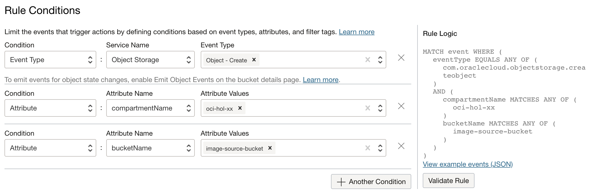

# Usecase #1 - Event Trigger to Create Thumbnail Images

## Introduction

OCI Functions의 사용사례로 Events 서비스와 연동하여, OCI 자원에 이벤트가 발생시 Function을 호출하여 처리하는 패턴을 실습합니다. **Object Storage > Event > Function > Object Storage - 썸네일 이미지 만들기** 구성으로 Object Storage에 이미지가 될때 발생하는 이벤트를 기반으로, Function으로 해당 이미지의 썸네일 이미지를 만들어 Object Storage에 다시 업로드하는 사례를 실습합니다.


예상 시간: 50분

### 목표

- Python Function 직접 구현하기
- OCI Event 서비스를 사용하여 Cloud Event 발생시 Function 트리거 하기
- Function 내에서 OCI Python SDK를 사용하기

### 전제 조건

- Oracle Cloud Trial Account 또는 Paid Account
- Lab 2 실습 완료


## Task 1. Object Storage 버킷 만들기

1. 왼쪽 상단의 **Navigation Menu**를 클릭하고 **Storage**에서 **Object Storage & Archive Storage** 하위메뉴인 **Bucket**을 선택합니다.

2. 원본 이미지를 업로드할 때 사용할 source 버킷과 처리된 이미지를 업로드할 때 사용할 버킷을 준비합니다.

3. **Create Bucket**을 클릭하여, 원본 이미지를 업로드할 때 사용할 source 버킷을 생성합니다. 

    - Bucket Name: image-source-bucket
    - **Emit Object Events**: OCI Event 서비스에서 발생한 오브젝트 이벤트를 수신할 수 있도록 반드시 체크합니다. 이 이벤트를 수신하여, Function을 호출하여 원하는 작업을 수행할 수 있도록 할 예정입니다.
    - 나머지 항목은 디폴트 설정 사용

    

4. 처리된 이미지를 업로드할 때 사용할 버킷을 생성합니다. 

    - Bucket Name: image-source-resized-bucket
    - 나머지 항목은 디폴트 설정 사용

## Task 2. Function을 위한 Policy 설정하기

Function에서 Object Storage에 있는 오브젝트에 접근하기 위해서는 권한이 필요합니다. 권한을 설정하기 위해 Function이 속한 compartment id를 확인하고 관련권한을 설정합니다.

1. 왼쪽 상단의 **Navigation Menu**를 클릭하고 **Identity & Security**으로 이동한 다음 **Compartments** 을 선택합니다.

2. Function이 속한 Compartment의 OCID를 복사해 둡니다.

    

3. 왼쪽 메뉴에서 **Identity** > **Policies** 을 선택합니다.

4. **Create Policy** 클릭

5. 아래 값으로 개발할 Functions에 오브젝트 스토리지 버킷 2개에 대한 권한을 부여합니다.

    - Name: `functions-buckets-policy`.
    - Description: `Policy that allows functions dynamic group to manage objects in the bucket`.
    - Compartment: 계속 사용하던 Compartment 선택, **oci-hol-xx**를 선택
    - Policy Builder: **Show manual editor** 슬라이딩 버튼을 클릭하여 직접 입력합니다.
        * [compartment-name]은 오브젝트 스토리지 버킷이 있는 Compartment 이름으로 대체합니다. 예, oci-hol
        * [compartment-id]는 방금 복사해둔 Function이 속한 Compartment의 OCID
    ```
    <copy> 
    Allow any-user to manage objects in compartment [compartment-name] where all {request.principal.type='fnfunc', request.principal.compartment.id='[compartment-id]', target.bucket.name='image-source-bucket'}
    Allow any-user to manage objects in compartment [compartment-name] where all {request.principal.type='fnfunc', request.principal.compartment.id='[compartment-id]', target.bucket.name='image-source-resized-bucket'}
    </copy> 
    ``` 


## Task 3. Function 개발

1. Cloud Shell을 실행합니다.

     

2. python Function을 생성합니다.

    ```
    <copy>
    fn init --runtime python oci-create-thumbnails-python
    </copy> 
    ```

3. 생성된 폴더로 이동하고, 기본 생성된 Function을 확인합니다.

    ```
    <copy>
    cd oci-create-thumbnails-python
    </copy> 
    ```

4. 기본 생성된 func.py를 아래 내용으로 업데이트 합니다.

    - Event Service를 통해 전달되는 Cloud Event 메시지 형식을 알아보기 위해 현재 func.py에 아래 출력문을 추가합니다.
    ```
    <copy>
    print("body : " + json.dumps(body, separators=(',', ':')), flush=True)
    </copy>
    ```

    - 추가 결과
    ```
    <copy>
    import io
    import json
    import logging
    
    from fdk import response
    
    
    def handler(ctx, data: io.BytesIO = None):
        name = "World"
        try:
            body = json.loads(data.getvalue())
            name = body.get("name")   
        except (Exception, ValueError) as ex:
            logging.getLogger().info('error parsing json payload: ' + str(ex))
    
        logging.getLogger().info("Inside Python Hello World function")

        # Print Body
        print(json.dumps(body, separators=(',', ':')), flush=True)

        return response.Response(
            ctx, response_data=json.dumps(
                {"message": "Hello {0}".format(name)}),
            headers={"Content-Type": "application/json"}
        )
    </copy> 
    ```

5. 앞선 실습에서 만든 Function Application과 Context를 그대로 사용하여 배포합니다.

    ```
    <copy>
    fn list contexts
    fn -v deploy --app oci-hol-fn-app
    </copy>        
    ```

## Task 4. Event 서비스 Rule 설정

앞서 생성한 image-source-bucket 버킷에 이미지 파일이 업로드 되면 배포한 Function이 호출되도록 Event Service를 구성하는 과정입니다.

1. 왼쪽 상단의 **Navigation Menu**를 클릭하고 **Observability & Management**에서 **Events Service** 하위메뉴인 **Rules**를 선택합니다.

2. **Create Rule**을 클릭합니다.

3. Display Name을 입력합니다. (예, image-source-bucket-to-create-thumbnails-rule)

4. Description을 입력합니다. (예, Create Thumbnails Rule)

5. 이벤트가 트리거되는 조건(Rule Conditions)를 추가합니다. *compartment와 bucket의 이름이 아래와 다른 경우, 본인이 사용하는 것으로 수정합니다.*

    | Condition Type      | Service/Attribute Name | Event Type / Attribute Value | 
    | ------------------- | ---------------------- | ---------------------------- | 
    | Event Type          | Object Storage         | Object - Create              |
    | Attribute           | compartmentName        | *oci-hol-xx*                    |
    | Attribute           | bucketName             | *image-source-bucket*        |
    {: title="Rule Conditions"}

    

6. 오른쪽 Rule Logic 아래에 있는 **View example events (JSON)**을 클릭합니다.

     

7. Cloud Event 샘플 메시지를 볼 수 있습니다. Function 개발시 테스트 메시지로 JSON Query 작성시 참고할 수 있습니다. 복사해서 example-event.json 파일로 저장해 둡니다.

    

8. 트리거되었을 때 실행한 조치(Actions)를 지정합니다. 앞서 배포한 Function을 추가합니다.

    - Event Service는 Action Type으로 현재 아래 3개의 OCI 서비스를 지원합니다.
        * Streaming
        * Notification
        * Function
    
    - 앞서 배포한 Function으로 Action을 추가합니다.
    

8. **Create Rule**을 클릭하여 룰을 생성합니다.

## Task 5. Event 및 Function 테스트

1. 왼쪽 상단의 **Navigation Menu**를 클릭하고 **Storage**에서 **Object Storage & Archive Storage** 하위메뉴인 **Bucket**을 선택합니다.

2. 소스로 사용하는 image-source-bucket으로 이동합니다.

3. 아래쪽으로 스크롤하여 **Upload** 버튼을 클릭하여, 이미지 파일을 업로드 합니다.

    

4. 다시 Function Application 화면으로 이동합니다. **Resources** >> **Logs**로 이동하여, 활성화한 로그 이름을 클릭합니다.

    

5. 로그 화면에서 우측 **Actions**에서 **Wrap lines**를 클릭합니다.

    

6. 아래와 같이 Function이 실행된 로그를 볼 수 있습니다.

    

7. Object 스토리지에 이미지 업로드 > 생성 Cloud Event 생성 > Function 호출까지 설정한 룰에 따라 동작하는 것을 확인했습니다.

## Task 6. Function 개발 완료 및 테스트

1. Cloud Shell을 실행합니다.

2. 파이썬에서 다른 파이썬 파일에 있는 메서드를 호출할 수 있습니다. 개발 테스트의 편의를 위해 func.py외에 추가 파이썬 파일에 OCI SDK 관련 부분을 따로 만들고, func.py에서 호출하는 방법을 사용해 보겠습니다.

3. 아래 코드를 복사하여 sub_func.py 파일을 생성합니다.

    - `create_thumbnail()` : Object Storage에 있는 `resource_name`의 이미지 파일을 다운로드 받아, 썸네일 파일을 만든후 다시 업로드하는 메서드입니다.
    - main() : 로컬 환경에서 create_thumbnail()을 테스트하기 위해 만든 메인 함수입니다.

    ```
    <copy>
    import io
    import json
    import logging
    
    import os
    import oci
    from PIL import Image
    
    
    def download_file(object_storage_client, namespace, bucket_name, object_name, download_filepath):
        get_obj = object_storage_client.get_object(namespace, bucket_name, object_name)
    
        with open(download_filepath, 'wb') as f:
            for chunk in get_obj.data.raw.stream(1024 * 1024, decode_content=False):
                f.write(chunk)
    
    def upload_file(object_storage_client, namespace, bucket_name, object_name, upload_filepath):
        with open(upload_filepath, 'rb') as f:
            obj = object_storage_client.put_object(namespace, bucket_name, object_name, f)
    
    def resize_image(image_path, resized_path, size = (128,128)):
        with Image.open(image_path) as image:
            image.thumbnail(size)
            image.save(resized_path)
    
    def create_thumbnail(object_storage_client, namespace, bucket_name, resource_name, target_bucket_name):
        logging.getLogger('PIL').setLevel(logging.WARNING)
    
        split_tup = os.path.splitext(resource_name)
    
        # extract the file name and extension
        file_name = split_tup[0]
        file_extension = split_tup[1]
        tmp_filename = file_name.replace('/', '')
    
        download_filepath = '/tmp/{}{}'.format(tmp_filename, file_extension)
        upload_filepath = '/tmp/{}-thumbnail{}'.format(tmp_filename, file_extension)
    
        new_resource_name = '{}-thumbnail{}'.format(file_name, file_extension)
    
        download_file(object_storage_client, namespace, bucket_name, resource_name, download_filepath)
        resize_image(download_filepath, upload_filepath)
        upload_file(object_storage_client, namespace, target_bucket_name, new_resource_name, upload_filepath)
    
        return new_resource_name
    
    def main():
        logging.basicConfig(level=logging.INFO)
    
        # Default config file and profile
        config = oci.config.from_file()
        # Non-Home Region
        config['region'] = 'ap-chuncheon-1'
    
        object_storage_client = oci.object_storage.ObjectStorageClient(config)
    
        namespace = object_storage_client.get_namespace().data
        bucket_name = 'image-source-bucket'
        resource_name = 'iceberg.png'
        target_bucket_name = 'image-source-resized-bucket'
    
        new_resource_name = create_thumbnail(object_storage_client, namespace, bucket_name, resource_name, target_bucket_name)
    
        print(new_resource_name)
    
    if __name__ == "__main__":
        main()
    </copy>    
    ```    

    - 간단한 설명
    
        * Object Storage에 있는 `resource_name`의 이미지 파일을 다운로드 받아, 썸네일 파일을 만든후 다시 업로드하는 메서드입니다. 이후 func.py에서 이 메서드를 호출합니다.   
        ```
        def create_thumbnail(object_storage_client, namespace, bucket_name, resource_name, target_bucket_name):     
        ```
    
        * 빠른 테스트를 위해 로컬(Cloud Shell)에 직접 테스트를 위해 만든 main() 메서드입니다. Function 호출시에는 실행되지 않습니다.
        * Cloud Shell 및 OCI CLI를 설치한 작업환경에서는 OCI CLI가 사용하는 config 파일을 사용하여 인증합니다. 그것을 사용해 OCI SDK Client을 만듭니다. config 상의 유저의 권한으로 OCI에 접근합니다.
        ```
        def main():
            logging.basicConfig(level=logging.INFO)
        
            # Default config file and profile
            config = oci.config.from_file()        
            # Non-Home Region
            config['region'] = 'ap-chuncheon-1'
        
            object_storage_client = oci.object_storage.ObjectStorageClient(config)     
            ...
        
        if __name__ == "__main__":
            main()     
        ```

4. `sub_func.py`을 Cloud Shell에서 직접 실행하기 위해 sub_func.py에서 추가 사용하는 이미지 처리용 패키지인 pillow를 설치합니다.

    ```
    <copy>
    pip3 install --user pillow
    </copy>
    ```

5. `sub_func.py`의 main()에 `region`, `bucket_name`, `resource_name`, `target_bucket_name`은 필요시 환경에 맞게 변경합니다. 

    - 예제는 춘천 리전에 있는 `image-source-bucket` 버킷에 업로드된  iceberg.png 파일의 썸네일을 만들어 `image-source-resized-bucket` 버킷에 저장하는 것입니다.

    ```
    # sub_func.py
    def main():
        ...
    
        config['region'] = 'ap-chuncheon-1'
    
        ...
        bucket_name = 'image-source-bucket'
        resource_name = 'iceberg.png'
        target_bucket_name = 'image-source-resized-bucket'
    ```

6. Cloud Shell에서 테스트 합니다.

    ```
    <copy>
    python3 sub_func.py
    </copy>
    ```

    실행예시

    

7. 테스트가 성공하면, 메인 func.py에서 썸네일 메서드를 호출하도록 아래와 같이 func.py를 수정합니다.

    ```
    <copy>
    import io
    import json
    import logging
    
    from fdk import response
    
    import oci
    from sub_func import create_thumbnail
    
    
    def handler(ctx, data: io.BytesIO = None):
        logging.getLogger().info("Inside oci-create-thumbnails-python function")
    
        signer = oci.auth.signers.get_resource_principals_signer()
        object_storage_client = oci.object_storage.ObjectStorageClient(config={}, signer=signer)
    
        try:
            body = json.loads(data.getvalue())
    
            namespace = body["data"]["additionalDetails"]["namespace"]
            bucket_name = body["data"]["additionalDetails"]["bucketName"]
            resource_name = body["data"]["resourceName"]
            target_bucket_name = ""
    
            if bucket_name.find("-bucket") == -1:
                target_bucket_name = bucket_name + "-resized"
            else:
                target_bucket_name = bucket_name.replace("-bucket", "-resized-bucket")
    
            print("bucket_name : " + bucket_name,flush=True)
            print("resource_name : " + resource_name,flush=True)
    
            new_resource_name = create_thumbnail(object_storage_client, namespace, bucket_name, resource_name, target_bucket_name)
    
        except (Exception, ValueError) as ex:
            logging.getLogger().info('Failed: ' + str(ex))
    
        return response.Response(
            ctx,
            response_data=json.dumps({"imageName": resource_name, "thumbnailName": new_resource_name}),
            headers={"Content-Type": "application/json"}
        )
    </copy>
    ```

    - 간단한 설명
    
        * 호출을 위해 `sub_func.py`에 있는 메서드 임포트
        ```
        from sub_func import create_thumbnail
        ```
    
        * OCI Function에서 컨테이너로 실행되는 Function은 Resource Principals로 자동 인증되며, 앞서 Policy를 통해 fnfunc에 부여한 권한을 사용합니다. 그것을 사용해 OCI SDK Client을 만듭니다.
        ```   
            signer = oci.auth.signers.get_resource_principals_signer()
            object_storage_client = oci.object_storage.ObjectStorageClient(config={}, signer=signer)
        ```
    
        * Events에서 파싱된 이미지 오브젝트에 대한 정보를 가지고 썸네인 생성 메서드 호출 
        ```    
                new_resource_name = create_thumbnail(object_storage_client, namespace, bucket_name, resource_name, target_bucket_name)
        ```   

8. requirements.txt 파일을 업데이트 합니다. 추가로 사용 oci, pillow 라이브러리가 OCI Function이 컨테이너 이미지를 만들때 함께 설치되도록 알려줍니다.

    ```
    <copy>
    fdk>=0.1.57
    oci
    pillow    
    </copy> 
    ```

9. Function을 재배포합니다.

    ```
    <copy>
    fn -v deploy --app oci-hol-fn-app
    </copy>        
    ```

10. 앞서 저장해둔 example-event.json 파일을 테스트를 위해 수정합니다.

    - data.resourceName: iceberg.png
    - data.additionalDetails.namespace: 모를 경우 Cloud Shell에서 *`oci os ns get`* 명령으로 확인
    - data.additionalDetails.bucketName: image-source-bucket

        ```
        <copy>
        {
          "cloudEventsVersion": "0.1",
          "eventID": "unique_ID",
          "eventType": "com.oraclecloud.objectstorage.createobject",
          "source": "objectstorage",
          "eventTypeVersion": "2.0",
          "eventTime": "2019-01-10T21:19:24.000Z",
          "contentType": "application/json",
          "extensions": {
            "compartmentId": "ocid1.compartment.oc1..unique_ID"
          },
          "data": {
            "compartmentId": "ocid1.compartment.oc1..unique_ID",
            "compartmentName": "example_name",
            "resourceName": "iceberg.png",
            "resourceId": "/n/example_namespace/b/my_bucket/o/my_object",
            "availabilityDomain": "all",
            "additionalDetails": {
              "eTag": "f8ffb6e9-f602-460f-a6c0-00b5abfa24c7",
              "namespace": "cn________gq",
              "bucketName": "image-source-bucket",
              "bucketId": "ocid1.bucket.oc1.phx.unique_id",
              "archivalState": "Available"
            }
          }
        }
        </copy> 
        ```   

10. 수정한 테스트 Cloud Event 파일로 다음과 같이 테스트 합니다.

    ```
    <copy>
    cat example-event.json | fn invoke oci-hol-fn-app oci-create-thumbnails-python
    </copy> 
    ```

    테스트 결과
    ```
    $ cat event_sample.json | fn invoke oci-hol-fn-app oci-create-thumbnails-python
    {"imageName": "iceberg.png", "thumbnailName": "iceberg-thumbnail.png"
    ```

## Task 7. Object Storage 이벤트기반 테스트

1. 왼쪽 상단의 **Navigation Menu**를 클릭하고 **Storage**에서 **Object Storage & Archive Storage** 하위메뉴인 **Bucket**을 선택합니다.

2. 소스로 사용하는 image-source-bucket으로 이동합니다.

3. 아래쪽으로 스크롤하여 **Upload** 버튼을 클릭하여, 이미지 파일을 업로드 합니다.

    

4. 썸네일 파일이 생성되는 버킷(image-source-resized-bucket)으로 이동하여, 썸네일이 만들어졌는지 확인합니다. 파일 사이즈가 줄어든 것을 볼수 있으면, 실제 다운로드 받아 보면, Function에 의해 이미지가 줄어든것을 확인할 수 있습니다.

    

    


이제 **다음 실습을 진행**하시면 됩니다.

## Acknowledgements

* **Author** - DongHee Lee
* **Last Updated By/Date** - DongHee Lee, May 2023
