# Usecase #2 - Ingest Logs to Other Systems

## Introduction

OCI Functions의 사용사례로 Logging 서비스와 연동하여, OCI 자원의 로그를 Function을 호출하여 타 시스템으로 전달하는 패턴을 실습합니다. **Logging > Service Connector Hub > Function > Dummy System - 3rd Party 시스템** 구성을 통해 OCI 로그를 사용자가 원하는 시스템으로 전달하는 내용을 실습합니다. 3rd Party 시스템을 대신해 인터넷에 개방되어 있는 REST API기반 서비스를 호출하는 것으로 대체합니다. 


예상 시간: 50분

### 목표

- Python Function 직접 구현하기
- Service Connector Hub를 사용하여 수집된 OCI 로그로 Function 트리거 하기

### 전제 조건

- Oracle Cloud Trial Account 또는 Paid Account
- Lab 2 실습 완료

### Service Connector Hub 소개

[](youtube:KlJphPGpQQk)


## Task 1. 테스트용 Compute 인스턴스 준비

Audit Log, Service Log를 발생시킬 대상으로 편의상 Compute 인스턴스를 준비하는 과정입니다. Service Log 중에서 VCN Flow Logs에 대해서는 Function으로 인한 것과 혼선을 방지하기 위해서 Compute 인스턴스용 **Public Subnet**을 따로 만들어 사용합니다. (Function이 사용하는 Subnet을 함께 사용하는 경우, 로그 발생과 Function 호출의 무한 반복이 발생할 소지가 있습니다.)

1. 왼쪽 상단의 **Navigation Menu**를 클릭하고 **Compute**으로 이동한 다음 **Instances** 을 선택합니다.

2. **Create Instance**를 클릭합니다.

3. Name: 원하는 이름을 입력합니다. *이후 테스트를 위해 기억해둡니다.*

    - 예, compute-for-log-test

4. Networking 부분만 아래와 같이 새 Public Subnet으로 할당합니다.
    - **Create new public subnet** 선택
    - New subnet name: 예, public-subnet-for-compute
    - CIDR block: 예, 10.0.2.0/24
    - Public IPv4 address: Assign a public IPv4 address 선택

    
    
5. 다른 항목들은 기본값을 이용해 최소 사이즈하고 인스턴스를 생성합니다.

## Task 2. Function 개발 - 외부 시스템에 로그 전달용

1. Cloud Shell을 실행합니다.

2. python Function을 생성합니다.

    ```
    <copy>
    fn init --runtime python oci-logs-to-something-python
    </copy>
    ```

3. 생성된 폴더로 이동하고, 기본 생성된 Function을 확인합니다.

    ```
    <copy>
    cd oci-logs-to-something-python
    </copy>
    ```

4. 기본 생성된 func.py을 가지고 외부 시스템에 맞게 가공하고, 외부시스템에서 제공하는 API를 통해 전달하도록 구현이 필요합니다.

5. *예시*, Datadog 으로 전달하는 경우 아래과 같이 구현하여 사용할 수 있습니다. 
    - 참조
        * [Oracle Functions Samples > Monitor Oracle Cloud Infrastructure with Datadog](https://github.com/oracle-samples/oracle-functions-samples/tree/master/samples/oci-logs-datadog)
        * [Oracle Help Center Learn > Monitor Oracle Cloud Infrastructure with Datadog](https://docs.oracle.com/en/learn/logs_oci_datadog/)

    - func.py
    ```
    import io
    import os
    import json
    import requests
    import logging
    from fdk import response
    
    
    def handler(ctx, data: io.BytesIO=None):
        try:
            logs = json.loads(data.getvalue())
    
            for item in logs:
           
                # Datadog endpoint URL and token to call the REST interface. These values are defined in func.yaml
                datadoghost = os.environ['DATADOG_HOST']
                datadogtoken = os.environ['DATADOG_TOKEN']
    
                # Call the Datadog with the payload.
                headers = {'Content-type': 'application/json', 'DD-API-KEY': datadogtoken}
                response = requests.post(datadoghost, data = json.dumps(item), headers=headers)
                logging.getLogger().info(reponse.text)
           
        except (Exception, ValueError) as ex:
            logging.getLogger().error(str(ex))
            return
    ```

    - func.yaml
    ```
    schema_version: 20180708
    name: oci-logs-to-datadog-python
    version: 0.0.48
    runtime: python
    entrypoint: /python/bin/fdk /function/func.py handler
    config:
      DATADOG_HOST: https://http-intake.logs.datadoghq.com/v1/input
      DATADOG_TOKEN: ZZZZZzzzzz
    ```
        * config의 값은 Function 구현시 os.environ['DATADOG_HOST']와 같이 가져와서 사용할 수 있으며, 클라우드 콘솔에서 Function의 상세 페이지에서 동적으로 변경할 수 있습니다.
        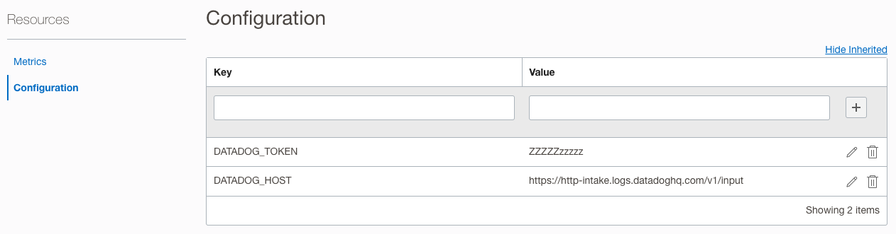

6. 본 실습에서는 테스트를 위해 외부 시스템을 대신하여 단순 호출 테스트용으로 Free fake API 서버인 {JSON} Placeholder을 사용합니다.
    - Function에서 수신하는 OCI 로그메시지의 포맷을 다음 문서를 참조합니다.
        * https://docs.oracle.com/en-us/iaas/Content/Logging/Reference/top_level_logging_format.htm#top_level_logging_format


    - func.py 를 아래와 같이 변경합니다.
    ```
    <copy>   
    import io
    import os
    import json
    import logging
    from fdk import response
    
    import requests

    def handler(ctx, data: io.BytesIO=None):
        try:
            logs = json.loads(data.getvalue())
    
            for item in logs:
                type = item["type"]
                source = item.get("source")
                time = item.get("time")
                
                logging.getLogger().info("type: " + type)
                logging.getLogger().info("source: " + source)
                logging.getLogger().info("time: " + time)
           
                # {JSON} Placeholder: Free fake API for testing and prototyping.
                api_url = "https://jsonplaceholder.typicode.com/todos"
                #item = {"userId": 1, "title": "Buy milk", "completed": False}
                item = {"userId": 1, "title": source, "completed": False}
                headers =  {"Content-Type":"application/json"}
                response = requests.post(api_url, data=json.dumps(item), headers=headers)
                logging.getLogger().info(response.json())
                logging.getLogger().info("status_code: " + str(response.status_code))
           
        except (Exception, ValueError) as ex:
            logging.getLogger().error(str(ex))
            return
    </copy>
    ```

    - requirements.txt을 아래와 같이 변경합니다.
    ```
    <copy>
    fdk>=0.1.51
    requests
    </copy>
    ```

7. 앞선 실습에서 만든 Function Application과 Context를 그대로 사용하여 배포합니다.

    ```
    <copy>
    fn -v deploy --app oci-hol-fn-app
    </copy>        
    ```

## Task 3. Audit Log -> Service Connector -> Function 구성하기

1. 왼쪽 상단의 **Navigation Menu**를 클릭하고 **Observability & Management**에서 **Logging** 하위메뉴인 **Service Connectors**를 선택합니다.

2. **Create Service Connector**를 클릭합니다.

3. 이름을 입력하고, Audit Log -> Function의 구성을 위해 Source를 Logging, Target을 Function으로 선택합니다.

    - Name: 예, svc-connector-audit-logs-to-function

    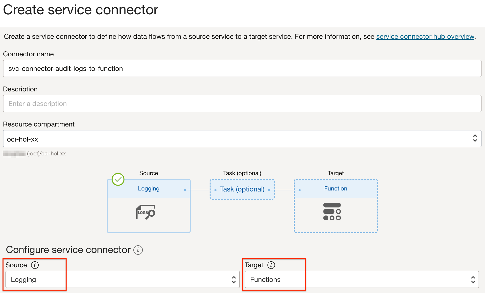

4. Source에서 Log Group을 앞서 생성한 Compute 인스턴스가 있는 Compartment의 _Audit로 선택합니다. Compartment내 많은 Audit 로그 중 걸러내기 위해 Compute 인스턴스의 이름을 source Attribute로 추가합니다.

     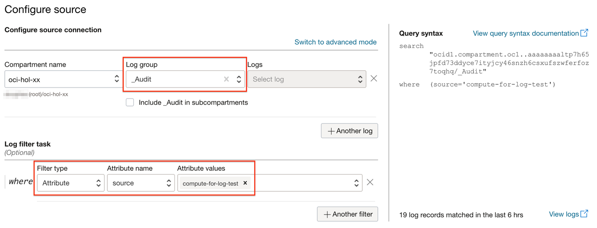

5. Target은 앞서 배포한 Function으로 선택합니다.

    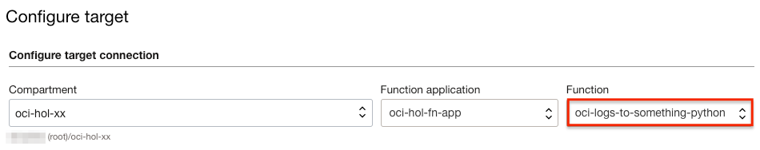

6. Service Connector에서 대상 Function을 호출할 수 있는 권한이 없는 경우 추가 정보가 뜹니다. **Create**를 클릭하여 Policy를 생성합니다. Policy는 Service Connector와 동일한 Compartment내에 만들어 집니다.

    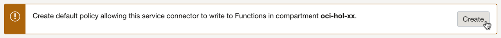
    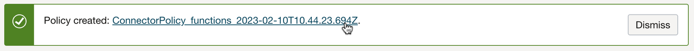
    

7. Service Connector 생성화면에서 **Create**를 클릭하여 생성합니다.


## Task 4. Audit Log 전달 테스트

1. 왼쪽 상단의 **Navigation Menu**를 클릭하고 **Compute**으로 이동한 다음 **Instances** 을 선택합니다.

2. 해당 Compute 인스턴스를 클릭합니다.

3. **Reboot**를 클릭하여 Audit Log를 발생시킵니다.

    

4. 왼쪽 상단의 **Navigation Menu**를 클릭하고 **Observability & Management**에서 **Logging** 하위메뉴인 **Audit**를 선택합니다.

5. Resource를 해당 Compute 인스턴스로 지정해 검색하면, 발생한 Audit 로그를 볼 수 있습니다.

     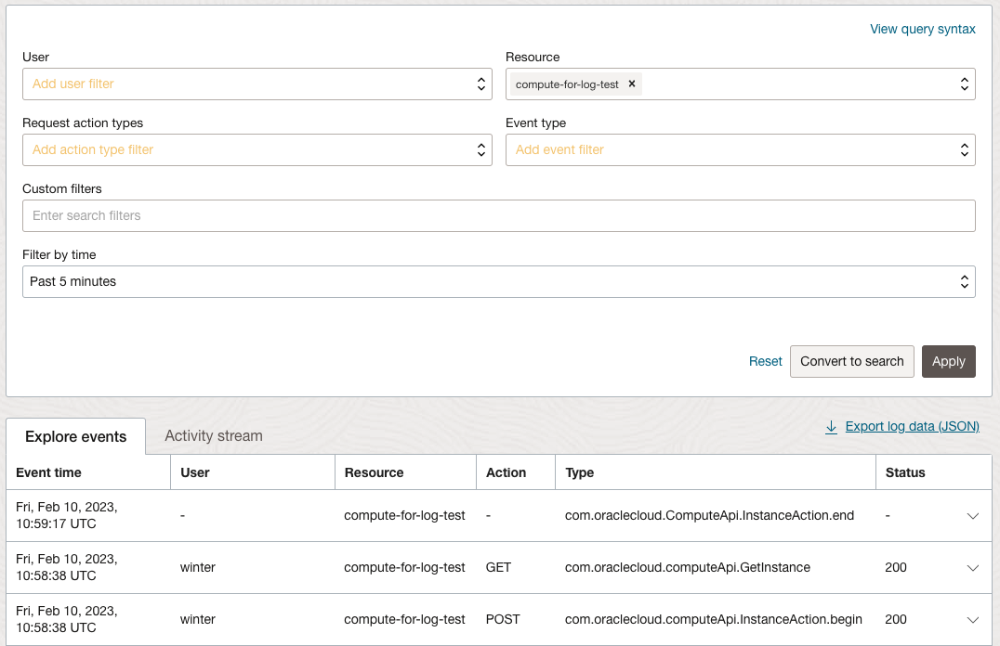

6. 만든 Service Connector(svc-connector-audit-logs-to-function) 화면으로 돌아갑니다.

7. Metric 정보를 통해 실행된 것을 볼 수 있습니다.

    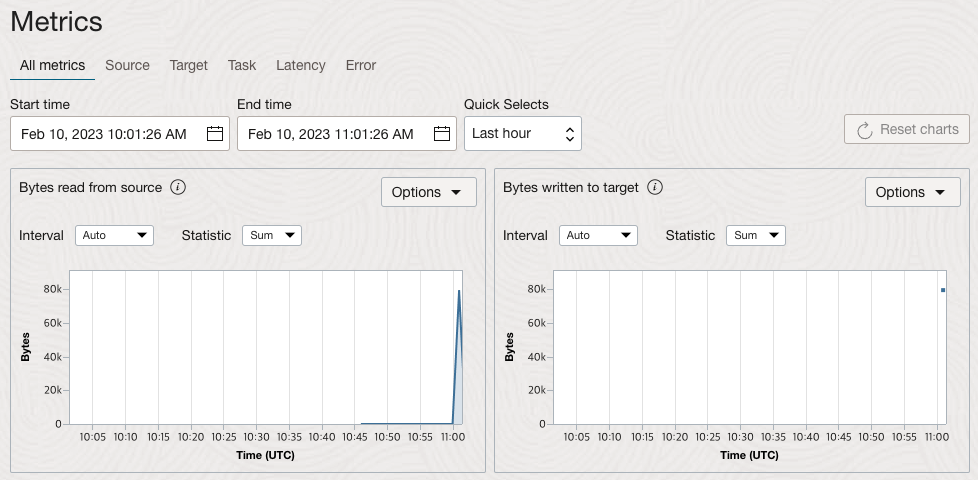

8. Function Application 화면으로 이동합니다. **Resources** >> **Logs**로 이동합니다. 로그 이름을 클릭합니다. (로그가 활성화되지 않은 경우 활성화합니다.)

    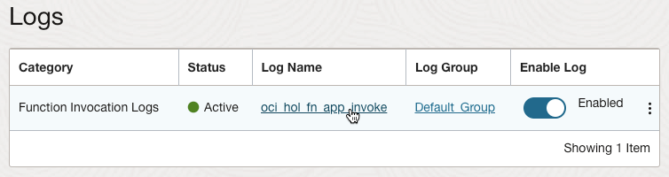

9. 로그 화면에서 우측 **Actions**에서 **Wrap lines**를 클릭합니다.

10. 아래와 같이 Function이 실행된 로그를 볼 수 있습니다. Compute 인스턴스의 Audit Log를 외부 시스템에 전달된 것을 볼 수 있습니다.

    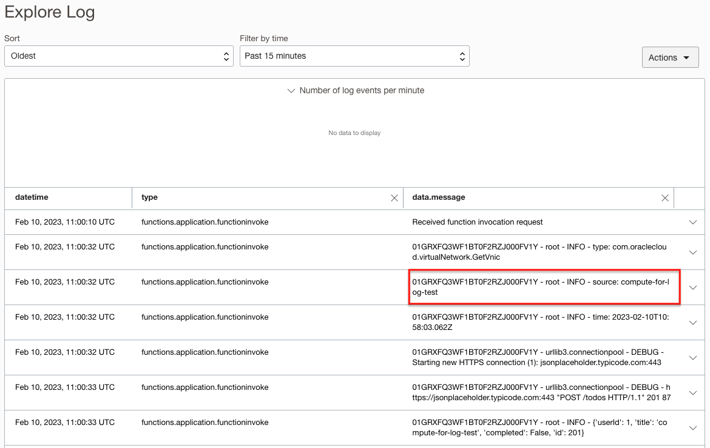    

## Task 5. VCN Flow Log 활성화 하기

Service Log를 활성화하는 기능을 제공합니다. 그 중에서 보안관련사항이 있는 VCN Flow Log를 가지고 실습을 진행해봅니다.

1. 왼쪽 상단의 **Navigation Menu**를 클릭하고 **Observability & Management**에서 **Logging** 하위메뉴인 **Log Groups**를 선택합니다.

2. Default_Group을 선택합니다.

3. **Resources** >> **Logs**로 이동합니다.

4. **Enable service log**를 클릭합니다.

    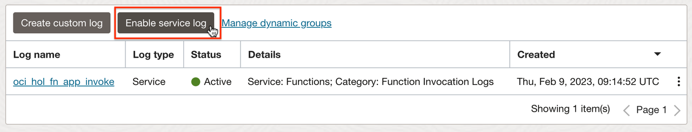

5. 서비스 수준에서 로그를 활성화할 수 있는 서비스 중에서 VCN - subnet을 선택합니다.

    

6. 대상 Compute 인스턴스가 있는 서브넷을 선택합니다. 예, public-subnet-for-compute

7. Flow Logs 유형을 선택하고, Log 이름을 입력합니다. 예, public-subnet-for-compute-flow-logs

    

8. Enable Log를 클릭합니다.

## Task 6. Function 수정 - Flow Logs 파싱 예시를 위한 수정

1. Cloud Shell을 실행합니다.

2. oci-logs-to-something-python Function을 수정합니다.

    - func.py 를 아래와 같이 변경합니다. **# Flow Logs**이하 if 하위 부분만 추가되었습니다.
    ```
    <copy>   
    import io
    import os
    import json
    import logging
    from fdk import response
    
    import requests

    def handler(ctx, data: io.BytesIO=None):
        try:
            logs = json.loads(data.getvalue())
    
            for item in logs:
                type = item["type"]
                source = item.get("source")
                time = item.get("time")
                
                logging.getLogger().info("type: " + type)
                logging.getLogger().info("source: " + source)
                logging.getLogger().info("time: " + time)

                # Flow Logs
                if type == "com.oraclecloud.vcn.flowlogs.DataEvent":
                    flowlog = item["data"]["action"]
                    flowlog += " " + item["data"]["protocolName"]
                    flowlog += " " + item["data"]["sourceAddress"]
                    flowlog += ":" + str(item["data"]["sourcePort"])
                    flowlog += " -> " + item["data"]["destinationAddress"]
                    flowlog += ":" + str(item["data"]["destinationPort"])
                    logging.getLogger().info("flowlog: " + flowlog)

                # {JSON} Placeholder: Free fake API for testing and prototyping.
                api_url = "https://jsonplaceholder.typicode.com/todos"
                #item = {"userId": 1, "title": "Buy milk", "completed": False}
                item = {"userId": 1, "title": source, "completed": False}
                headers =  {"Content-Type":"application/json"}
                response = requests.post(api_url, data=json.dumps(item), headers=headers)
                logging.getLogger().info(response.json())
                logging.getLogger().info("status_code: " + str(response.status_code))
           
        except (Exception, ValueError) as ex:
            logging.getLogger().error(str(ex))
            return
    </copy>
    ```

3. 다시 배포합니다.

    ```
    <copy>
    fn -v deploy --app oci-hol-fn-app
    </copy>        
    ```

## Task 7. Flow Log -> Service Connector -> Function 구성하기

1. 왼쪽 상단의 **Navigation Menu**를 클릭하고 **Observability & Management**에서 **Logging** 하위메뉴인 **Service Connectors**를 선택합니다.

2. **Create Service Connector**를 클릭합니다.

3. 이름을 입력하고, Audit Log -> Function을 위해 Source를 Logging, Target을 Function으로 선택합니다.

    - Name: 예, svc-connector-flow-logs-to-function

    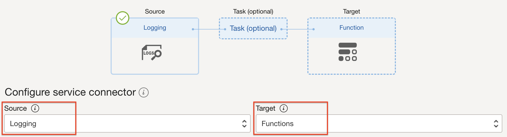

4. Source에서 Log를 Default Group내의 public-subnet-for-compute-flow-logs를 선택합니다.

     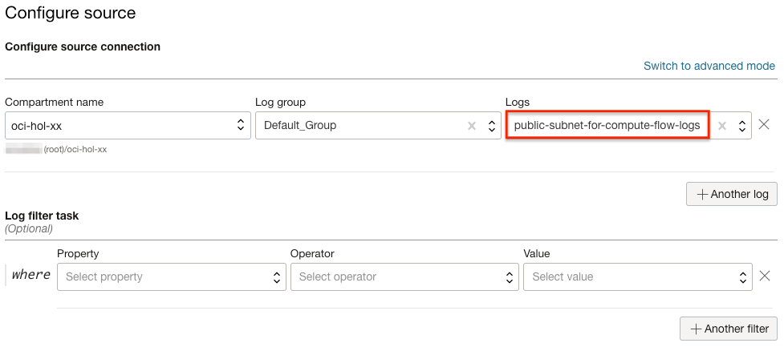

5. Target은 앞서 배포한 Function으로 선택합니다.

    

6. **Create**를 클릭하여 생성합니다.

## Task 8. Flow Log 전달 테스트

1. 왼쪽 상단의 **Navigation Menu**를 클릭하고 **Compute**으로 이동한 다음 **Instances** 을 선택합니다.

2. 해당 Compute 인스턴스의 Public IP를 확인합니다.

3. Cloud Shell을 실행합니다.

4. Cloud Shell 세션의 Public IP를 확인합니다. (Cloud Shell에서 나갈 때 쓰는 NAT Gateway 주소입니다. Cloud Shell VM의 Public IP가 아닙니다.)

    - [Getting the Public IP Address for a Cloud Shell Session](https://docs.oracle.com/en-us/iaas/Content/API/Concepts/devcloudshellgettingstarted.htm#cloudshellgettingstarted_topic_getting_public_ip_address)

    ```
    $ <copy>curl -s checkip.dyndns.org | sed -e 's/.*Current IP Address: //' -e 's/<.*$//'</copy>
    132.145.xxx.xxx
    ```

5. SSH로 Compute(예, compute-for-log-test) 인스턴스의 Public IP로 접속을 시도합니다. Flow Log 발생을 위해 시도만 하면 됩니다.

    ```
    $ ssh opc@144.24.xx.xxx
    ```

6. 왼쪽 상단의 **Navigation Menu**를 클릭하고 **Observability & Management**에서 **Logging** 하위메뉴인 **Logs**를 선택합니다.

7. public-subnet-for-compute-flow-logs 로그를 클릭합니다.

8. *Flow Log*에서 아래와 같이 접속시도한 로그를 확인할 수 있습니다.

    - Cloud Shell 세션의 Public IP: 132.145.x.x
    - Compute 인스턴스의 Private IP(10.0.2.121)의 Port 22로 접속

    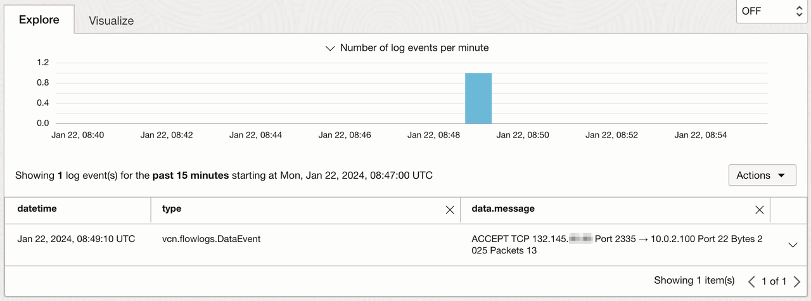

9. 만든 Service Connector(svc-connector-flow-logs-to-function) 화면으로 돌아갑니다.

10. Metric 정보를 통해 실행된 것을 볼 수 있습니다.

    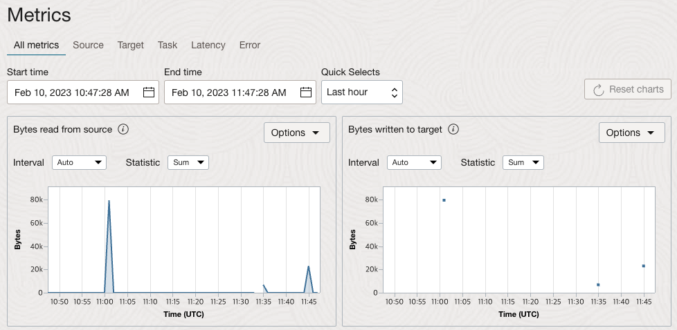

11. Function Application 화면으로 이동합니다. **Resources** >> **Logs**로 이동합니다. 로그 이름을 클릭합니다. (로그가 활성화되지 않은 경우 활성화합니다.)

    

12. 로그 검색을 위해서 로그 화면에서 우측 **Actions**에서 **Explore with Log Search**를 하여 이동합니다.

    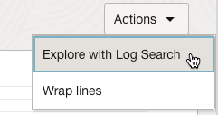

13. Custom filters에 조회할 Cloud Shell의 Public IP를 입력합니다. 필요하면 조회 시간을 늘립니다.

    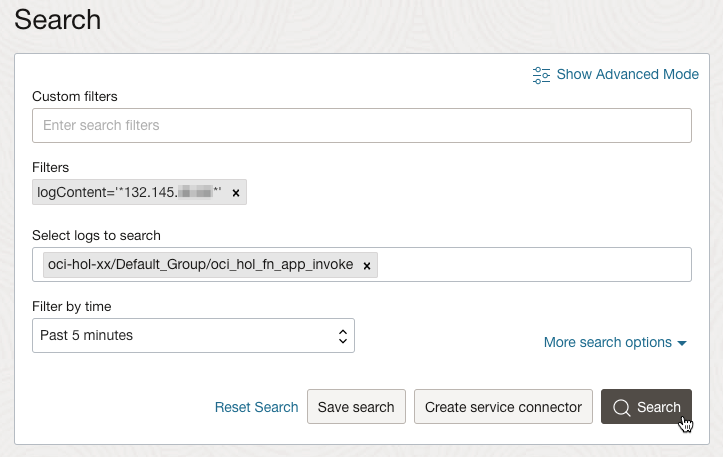

14. 로그 화면에서 우측 **Actions**에서 **Wrap lines**를 클릭합니다.

15. 아래와 같이 *Function이 실행된 로그*를 볼 수 있습니다. Compute 인스턴스가 속한 서브넷의 Flow Logs가 외부 시스템에 전달된 것을 볼 수 있습니다.

    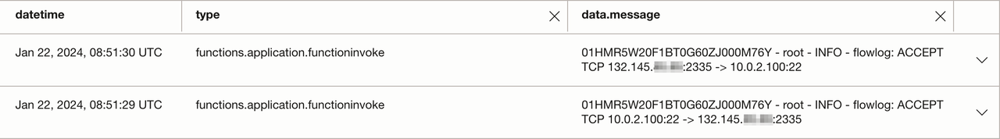  


## Task 9. Service Connector 중지

*Audit Log와 Flow Log는 지속적으로 발생하여, 이로 인해 Function 들이 지속적으로 실행됩니다. 다른 Usecase 실습을 위해 만든 Service Connector들을 비활성화하여 중지시킵니다.*

1. 왼쪽 상단의 **Navigation Menu**를 클릭하고 **Observability & Management**에서 **Logging** 하위메뉴인 **Service Connectors**를 선택합니다.

2. 각 Service Connector의 오른쪽 액션 메뉴를 클릭하여 둘다 Deactivate 시킵니다.

    

3. 비활성화 완료    

    

이제 **다음 실습을 진행**하시면 됩니다.

## Learn More

* [Oracle Functions Samples > Monitor Oracle Cloud Infrastructure with Datadog](https://github.com/oracle-samples/oracle-functions-samples/tree/master/samples/oci-logs-datadog)
* [Oracle Help Center Learn > Monitor Oracle Cloud Infrastructure with Datadog](https://docs.oracle.com/en/learn/logs_oci_datadog/)
* [Python and REST APIs: Interacting With Web Services](https://realpython.com/api-integration-in-python/)


## Acknowledgements

* **Author** - DongHee Lee
* **Last Updated By/Date** - DongHee Lee, February 2023

