# Configure Auto Scaling

## Introduction

이 실습에서는 CPU 사용률과 메모리 사용률에 따라 자동으로 확장(Scale Out)/축소(Scale In)할 수 있는 인스턴스 Auto Scaling을 실습합니다.

Auto Scaling을 사용하면 인스턴스 풀의 컴퓨팅 인스턴스 수를 자동으로 조정할 수 있습니다. 이를 통해 수요가 많은 기간 동안 최종 사용자에게 일관된 성능을 제공하고 수요가 적은 기간 동안 비용을 절감할 수 있습니다.

다음 유형의 자동 확장을 인스턴스 풀에 적용할 수 있습니다.

- **메트릭 기반 자동 크기 조정(Metric-based autoscaling)**: 성능 메트릭이 임계값에 대한 조건을 충족하면 자동 조정 작업이 트리거되어 확장 또는 축소됩니다.
- **일정 기반 자동 크기 조정(Schedule-based autoscaling)**: 자동 크기 조정 이벤트는 예약한 특정 시간에 발생하여, 지정한 조치에 따라 인스턴수 갯수 변경 또는 인스턴스의 라이프사이클을 변경합니다.

예상 시간: 1시간

### 목표

이 실습에서는 다음을 수행합니다:

- Auto Scaling을 구성

### 전제조건
- Oracle Cloud Trial Account 또는 Paid Account
- [Lab 6: Deploy HA Application using Load Balancers](../workshops/tenancy/index.html?lab=deploy-ha-lb) 완료

## Task 1: 템플릿 Compute 인스턴스 생성 

앞서와 비슷한 방식으로 템플릿으로 사용할 인스턴스를 생성합니다.

1. 왼쪽 상단의 **Navigation Menu**를 클릭하고 **Compute**으로 이동한 다음 **Instances**를 선택합니다.

2. 새 Compute Instance를 생성합니다.

    Name: **Web-Server-Template**으로 입력합니다

    

3. Image & Shape - 사용할 이미지와 Shape(CPU, Memory 크기)를 선택합니다.

    - Image: Oracle Linux 9
    - Shape: VM.Standard.E5.Flex - 1 OCPU, _4 GB memory_

4. 화면 제일 아래에 있는 **Advanced options**를 클릭합니다.

5. **Initialization script**에서 cloud-init 스크립트로 다음을 추가합니다. 

    VM 생성시 설치되어야 하는 툴들은 cloud-init를 통해 실행할 수 있습니다.

     ```shell
     <copy>
     #!/bin/bash
     sudo yum -y install httpd
     sudo firewall-offline-cmd --add-port=80/tcp
     MY_IP=$(hostname -I)
     sudo bash -c "echo 'Hello Apache on '$MY_IP >> /var/www/html/index.html"
     sudo systemctl start httpd
     sudo systemctl enable httpd
     sudo systemctl restart firewalld
     </copy>
     ```

    

6. **Oracle Cloud Agent** 탭을 확인합니다. 오토 스케일링을 위해서는 Metric이 수집되어야 하며, 이를 위해서는 **Compute Instance Monitoring**이 활성화되어야 합니다. 기본적으로 활성화되어 있습니다.

    

7. Networking

    - 앞선 실습에서 만든 VCN내에 Public Subnet을 선택합니다. _SSH로 접속해서 부하발생을 하기 위해 편의상 Public Subnet을 사용합니다._
    - 생성될 인스턴스에 대한 접속을 위해 **Assign a public IPv4 address**을 선택하여 Public IP를 할당합니다.

8. Add SSH Keys - SSH 접속을 위한 키를 등록하는 부분입니다.

    - Paste public keys를 선택하고, Web-Server-1 생성시 자동 생성한 public key 내용을 복사합니다.

         ```
         $ cat ssh-key-2025-12-07.key.pub
         ssh-rsa AAAAB____________7EbhLV ssh-key-2025-12-07
         ```

        

9. Create를 클릭하여 인스턴스를 생성합니다.


## Task 2: 인스턴스 풀 및 오토 스케일 구성

### 인스턴스를 생성할 기본 구성 만들기

1. 생성된 컴퓨트 인스턴스 상세정보에서 **More Actions**에서 **Create Instance Configuration**을 클릭합니다.
    
    

2. 다음 생성 정보를 입력합니다:

    - **Name** : 예, web-server-instance-config
    - **Create in compartment**: 사용중인 Compartment

    

3. **Create Instance Configuration**을 클릭하여 구성정보를 생성합니다.

### 인스턴스 구성을 기반한 풀 만들기

1. Instance Configuration 화면에서 **Create Instance Pool**을 클릭합니다.

    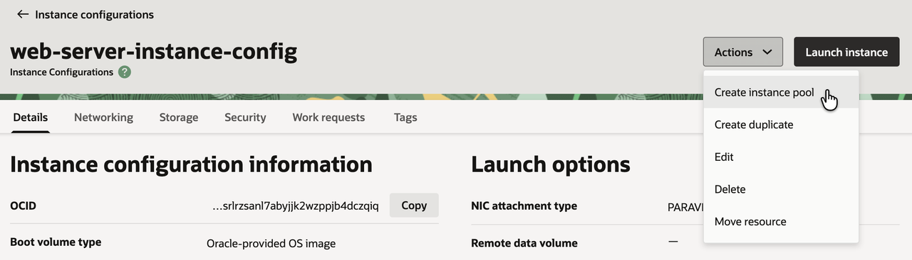

2. 생성될 컴퓨트 인스턴스가 속할 풀의 기본 배치 정보(VCN, AD 등)의 초기값을 입력합니다. 다음 생성 정보를 입력합니다:

    - **Name**: 예, web-server-instance-pool
    - **Create in compartment**: 사용중인 Compartment
    - **Number of instances**: 0
    
        * 인스턴스 풀이 만들어 졌을 때, 만들어지는 컴퓨트 인스턴스 수입니다. 여기서는 기본값인 0으로 합니다.

        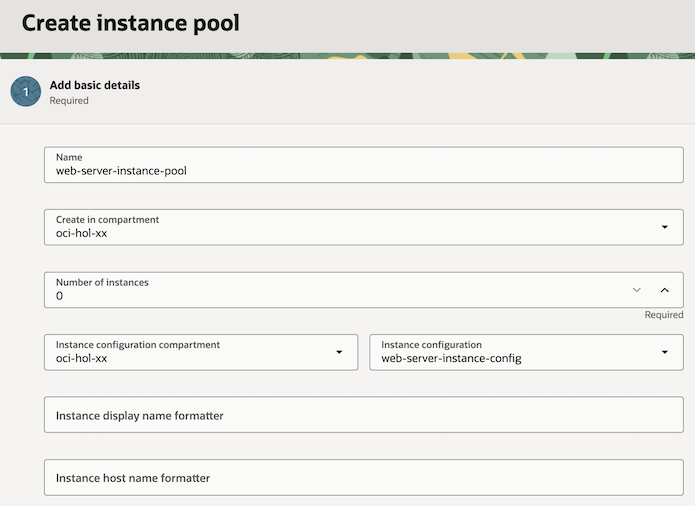
    
    - **Next** 클릭

3. **Configure Pool Placement** - Availability Domain

    - **Availability domain**: 기본값 사용
    - **Fault domains**: 기본값 사용
    - **virtual cloud network**: 사용중인 VCN, 예, oci-hol-vcn
    - **subnet**: 컴퓨트 인스턴스가 위치할 서브넷, 예, public subnet

        

4. **Attach a load balancer**을 체크합니다.

5. **Configure Pool Placement** - Load Balancer

    생성된 인스턴스가 백엔드로 추가될 로드밸랜서를 지정합니다.

    - **Load balancer**: 앞선 실습에서 만든 로드밸런서 선택, 예, public-lb-for-webserver
    - **Backend set**: 앞선 실습에서 만든 백엔드 셋 선택
    - **Port**: 컴퓨트 인스턴스의 서비스 포트, 웹서버 포트인 80 선택
    - **VNIC**: 기본값 선택

        

    - **Next** 클릭

6. 설정한 내용을 리뷰하고 **Submit** 클릭하여 생성합니다.

### 오토 스케일링 규칙 설정

1. Instance Pool 상세페이지에서 **More Actions** 하위의 **Create Autoscaling Configuration**을 클릭합니다.

    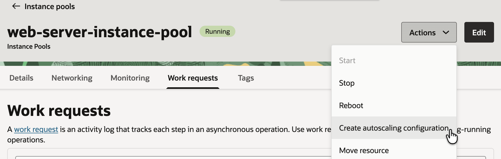

2. 기본 구성페이지에서 이름을 설정합니다.:

    - **Name**: 예, web-server-autoscaling-config
    - **Create in compartment**: 사용중인 Compartment

        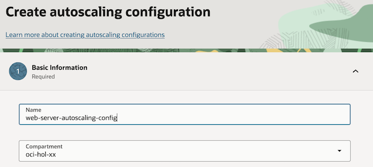

3. **Configure autoscaling policy**

    - **Metric-based Autoscaling** 선택
    - **Autoscaling policy name** : 예, web-server-autoscaling-policy
    - **Cooldown in seconds**: 기본값 300초 사용(스케일링 작업간에 최소 간격)

        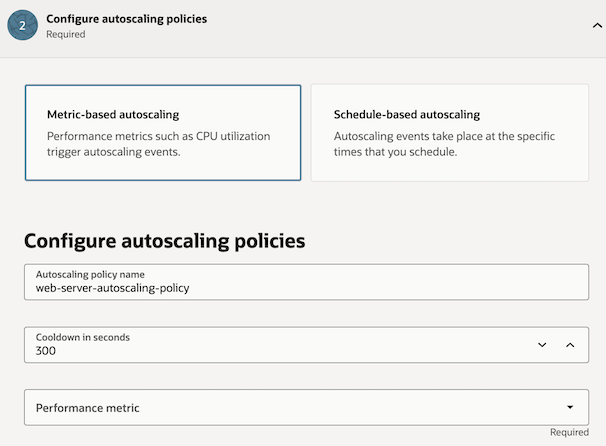

    - **Performance metric**: CPU와 메모리 중에 여기서는 CPU 선택하겠습니다.
    - **Scale in/out rule**: 확장 조건을 평균 CPU 50% 초과시, 축소 조건을 평균 10% 미만으로 설정하겠습니다. 확장, 축소가 반복해서 일어나지 않도록 잘 설정할 필요가 있습니다.
    - **Scaling limits**: 최소 인스턴스 수와 최대 인스턴수를 각각 1과 2로 설정합니다. 그리고 초기 인스턴스를 1개로 설정합니다.
    - **Next** 클릭

4. 설정한 내용을 리뷰하고 **Create** 클릭하여 생성합니다.

5. 컴퓨트 인스턴스 1개에서 시작하는 오토 스케일 정책을 만들었습니다. CPU 사용률이 최소 300초 동안 50% 이상인 것으로 확인되면 다른 컴퓨트 인스턴스가 자동으로 생성됩니다. CPU 사용률이 300초 동안 10% 미만인 것으로 확인되면 컴퓨팅 인스턴스 하나가 종료됩니다. 풀에는 항상 최소 1개의 컴퓨트 인스턴스가 있습니다.

    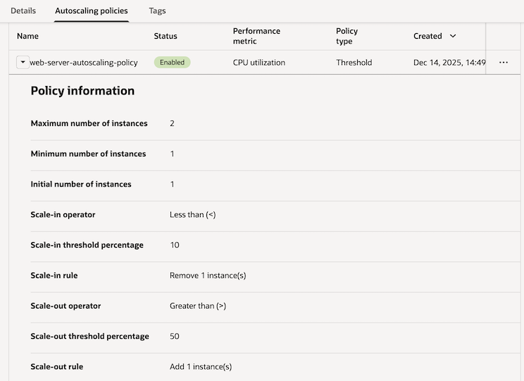

## Task 3: 테스트

1. 왼쪽 상단의 **Navigation Menu**를 클릭하고 **Compute**으로 이동한 다음 **Instance Pools**를 선택합니다.

2. 앞서 만든 Instance Pool을 클릭합니다.

3. **Details** 하위에 **Attached Instances**를 클릭합니다.

4. 설정한 오토 스케일 정책에 따라 초기, 최소 구성인 1개 인스턴스가 만들어 진 걸 볼 수 있습니다.

    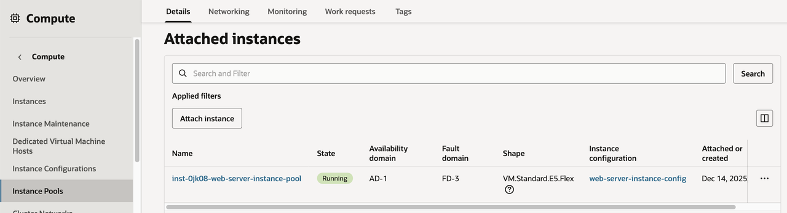

5. 해당 인스턴스를 클릭하여 Private IP와 Public IP를 확인합니다.

6. 브라우저로 로드밸런서 IP로 접속해 봅니다. 로드밸런서에도 잘 등록되어 서비스 되는 것을 알 수 있습니다.

    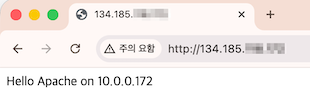

7. Cloud Shell에서 방금 확인한 컴퓨트 인스턴스의 Public IP로 SSH로 접속합니다.

    ```shell
    <copy>
    ssh -i <private_key> opc@<PUBLIC_IP_OF_COMPUTE>
    </copy>
    ```

8. 테스트 툴을 설치합니다.

    ```shell
    <copy>
    # EPEL(Extra Packages for Enterprise Linux) 활성화
    sudo yum-config-manager --enable ol9_developer_EPEL
    # 테스트 툴 설치
    sudo yum install -y stress
    </copy>
    ```

9. CPU 부하를 발생시킵니다.

    ```shell
    <copy>
    sudo stress --cpu 4
    </copy>
    ```

10. 다시, 클라우드 콘솔에서 Instance Pools 상세화면으로 이동합니다.

11. **Monitoring** 탭의 **Metrics**에서 인스턴스 풀 내에 있는 인스턴스들에서 수집된 메트릭을 볼 수 있습니다. CPU 부하가 올라가는 것 확인할 수 있습니다.

12. Cooldown 타임인 300초(5분)이 지나면, 스케일 아웃이 발생합니다. 인스턴스가 2개가 되어 CPU 평균이 반으로 줄어든 것을 볼 수 있습니다.

    *CPU utilization > 50% 조건이 만족했기 때문에 스케일 아웃이 발생하였습니다.*

    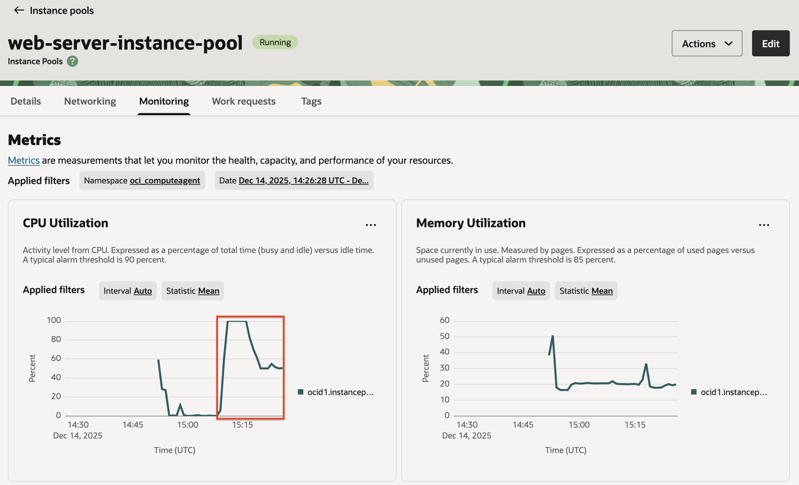

13. **Details** 탭의 **Attached Instances**에서 보면, 인스턴스가 2개가 된 것을 볼 수 있습니다.

    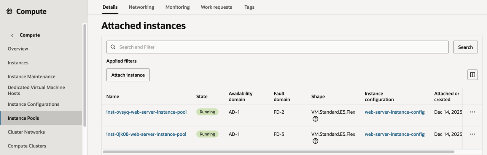

14. 브라우저로 로드밸런서 IP로 접속해 봅니다. 리프레쉬를 여러번 해봅니다. 두 개 인스턴스로 분배되는 것을 확인할 수 있습니다.

    
    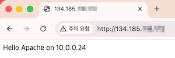    

15. 부하를 발생시킨 Cloud Shell로 돌아가서 Ctrl + C를 눌러 부하 발생을 중지합니다.

16. Cooldown 타임인 300초(5분)을 다시 기다립니다.

17. 부하 감소로 인해 스케일 인이 발생하는 것을 확인할 수 있습니다. 인스턴스 하나가 종료(Terminate) 됩니다.

    *CPU utilization <10% 조건이 만족했기 때문에 스케일 인이 발생하였습니다.*

    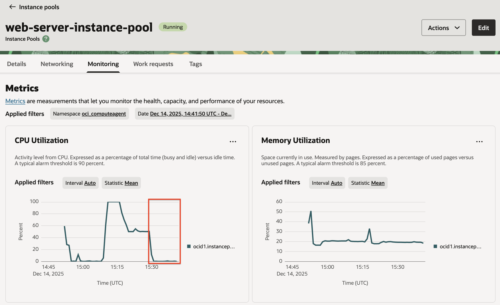
    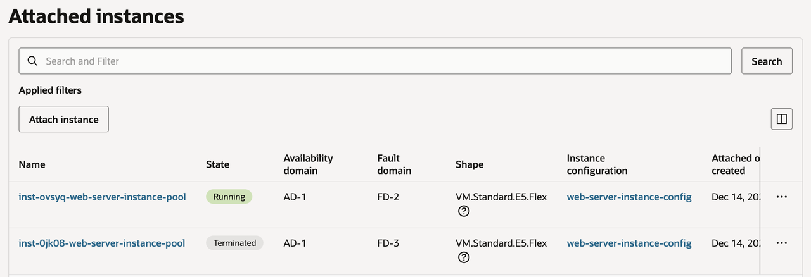

18. 브라우저로 로드밸런서 IP로 접속해 봅니다. 리프레쉬를 여러번 해봅니다. 남아 있는 1개 인스턴스로 분배되는 것을 확인할 수 있습니다.

            

이제 **다음 실습을 진행**하시면 됩니다.

## Acknowledgements

- **Author** - DongHee Lee, March 2023
- **Last Updated By/Date** - DongHee Lee, December 2025
