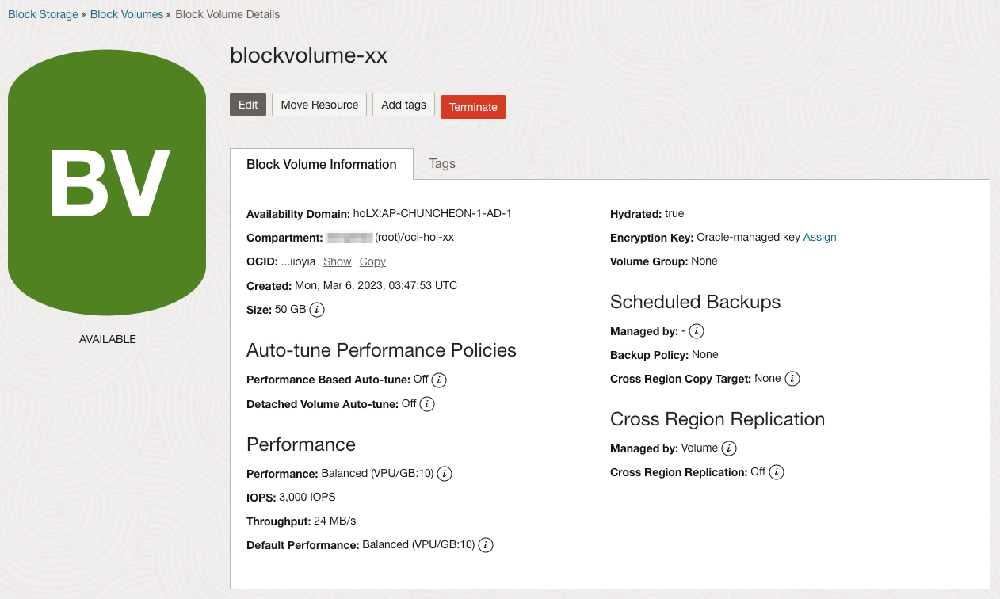
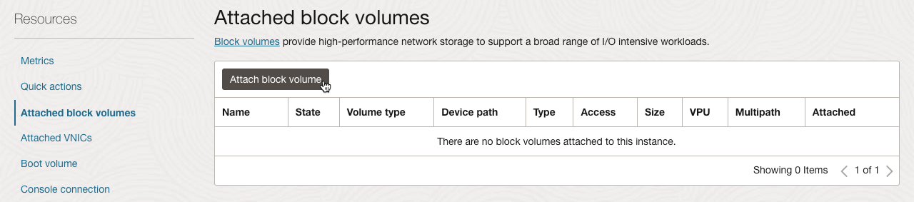
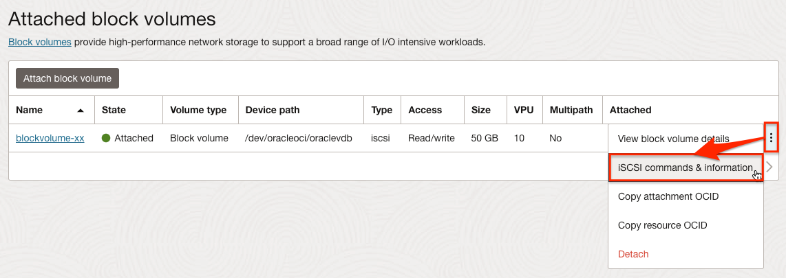
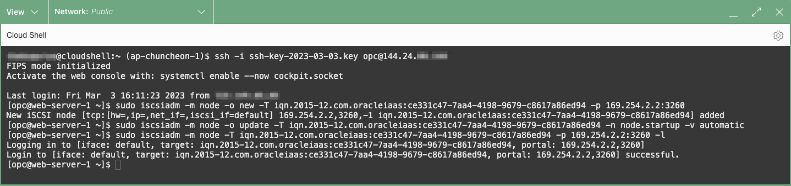
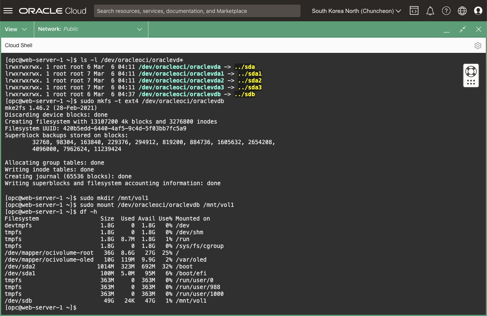
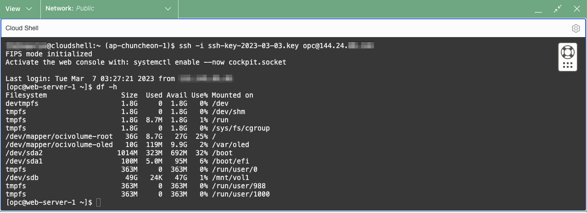

<!-- Not tested -->
# Create and Attach a Block Volume Service

## Introduction

OCI Block Volume 서비스를 통해 블록 스토리지 볼륨을 동적으로 프로비저닝하고 관리할 수 있습니다. 애플리케이션 요구 사항을 충족하기 위해 필요에 따라 볼륨을 생성, 장착, 연결, 이동할 수 있습니다. 인스턴스에 장착되고 연결되면 일반 하드 드라이브와 같이 볼륨을 사용할 수 있습니다. 데이터 손실 없이 볼륨 연결을 끊고 다른 인스턴스에 연결할 수도 있습니다.

Block Volume을 이해하기 위해 [Block Volume 개요](https://docs.oracle.com/en-us/iaas/Content/Block/Concepts/overview.htm) 문서를 읽어보거나, 다음 비디오를 보기 바랍니다.

[Oracle Cloud Infrastructure Block Volume: Overview](youtube:pmyxqM2eQwI)

예상 시간: 30분

### 목표

이 실습에서는 다음을 수행합니다:

- Block Volume 생성
- Block Volume을 컴퓨트 인스턴스에 장착
- Block Volume 마운트

### 전제조건
- Oracle Cloud Trial Account 또는 Paid Account
 
## Task 1: Block Volume 생성

Block Volume의 일반적인 용도는 컴퓨트 인스턴스에 스토리지 용량을 추가하는 것입니다. 오라클 클라우드 콘솔 또는 API를 통해 Block Volume을 생성할 수 있습니다. 생성되면 Volume Attachment를 통해 볼륨을 인스턴스에 장착할 수 있습니다. 장착후 iSCSI 또는 반가상화 모드로 인스턴스 게스트 OS에서 볼륨을 연결합니다. 그런 다음 볼륨을 마운트하고 인스턴스에서 사용할 수 있습니다.

1. 왼쪽 상단의 **Navigation Menu**를 클릭하고 **Storage**으로 이동한 다음 **Block Storage** 아래 **Block Volumes**을 선택합니다.

    https://cloud.oracle.com/block-storage/volumes

2. Block Volume 서비스에서 **Create Block Volume**을 클릭하고 기본정보를 입력합니다.:

    <if type="freetier">
     - **Name:** blockvolume-xx
     - **Compartment:** 이전 단계에서 만든 compartment를 선택합니다.</if>
     <if type="livelabs">
     - **Name:** username-BV
     - **Compartment:** username-compartment</if>
     - **Availability Domain:** AD가 3중화 되어 있는 경우, 컴퓨트 인스턴스와 같은 AD로 선택합니다.

     

3. Volume Size and Performance에서 Custom을 선택하여 사이즈를 변경합니다.

    >**노트**: 사이즈는 **50 GB**에서 **32 TB**까지 설정이 가능하며, 범위내에서 1 GB 단위로 조절가능합니다. 기본값은 1024 GB(1 TB)입니다. 여기서는 최소값을 선택합니다.

     - **Size**: **50 GB** 설정

    

4. 볼륨 성능(IOPS/GB)을 조절할 수 있습니다. 여기서는 기본값은 **Balanced**를 그대로 사용합니다.

    >**노트**: Block Volume 성능은 Volume Performance Units(VPUs) 개념을 사용합니다. GB 당 IOPS를 높이기 위해 VPU를 높이거나, 비용절감을 위해 낮출 수 있습니다. Lower Cost, Balanced, Higher Performance, Ultra High Performance 레벨이 있으며, 변경을 통해 성능을 조절할 수 있습니다. 자세한 사항은 공식 문서 [Block Volume Performance Levels](https://docs.oracle.com/en-us/iaas/Content/Block/Concepts/blockvolumeperformance.htm#perf_levels)를 참조합니다.

     - **Lower Cost**: 스트리밍, 로그 처리 및 데이터 웨어하우스와 같은 대규모 순차 I/O가 있는 처리량 집약적 워크로드에 권장됩니다. 비용은 스토리지에 대한 비용뿐이며 추가 VPU 비용은 없습니다. 이 옵션은 블록 볼륨에만 사용할 수 있으며 부트 볼륨에는 사용할 수 없습니다. 
     
     - **Balanced**: 신규 및 기존 블록 및 부트 볼륨에 대한 기본 성능 수준이며 대부분의 워크로드에 대해 성능과 비용 절감을 고려한 기본 성능을 제공합니다. 이 옵션을 사용하면 매월 GB당 10개의 VPU를 구매하게 됩니다. 
     
     - **Higher Performance**: 보다 높은 I/O 요구 사항이 있는 워크로드에 권장됩니다. 이 옵션을 사용하면 매월 GB당 20개의 VPU를 구매하게 됩니다.
     
     - **Ultra High Performance**: I/O 요구 사항이 가장 높고 가능한 최고의 성능이 필요한 워크로드에 권장됩니다. 이 옵션을 사용하면 GB당 월 30 ~ 120 VPU 중에서 구매할 수 있습니다.

     

    >**노트**: Block Volume에 대해서 자동 튜닝 기능을 제공합니다. 
    - Target Volume Performance 화면에서 **Performance Based Auto-tune** 활성화하면 VPU의 최소, 최대값을 지정할 수 있으며, Block Volume의 성능에 병목이 발생하는 경우 해당 범위 내에서 증가되며, 사용이 줄면 자동으로 VPU를 줄입니다. 
    - **Detached Volume Auto-tune**을 활성화하면, 컴퓨트 인스턴스에서 탈착되어 더이상 사용하지 않는 경우, 24시간 후에 자동으로 Lower Cost로 VPU에 대한 비용을 줄일 수 있습니다. 자세한 사항은 본 글 끝부분에 있는 Learn More를 참조하세요.

5. 백업 정책은 여기서는 따로 설정하기 않습니다.

     블록 볼륨 백업 정책(Backup Policy) 요약: 세 가지 사전 정의된 백업 정책(Bronze, Silver 및 Gold)이 있습니다. 각 백업 정책에는 백업 빈도와 보존 기간이 설정되어 있습니다.

     - **Bronze Policy:** 브론즈 정책에는 매월 1일에 실행되는 월별 증분 백업이 포함됩니다. 이러한 백업은 12개월 동안 보존됩니다. 이 정책에는 매년 1월 1일에 실행되는 전체 백업도 포함됩니다. 전체 백업은 5년 동안 유지됩니다.

     - **Silver Policy:** 실버 정책에는 일요일에 실행되는 주간 증분 백업이 포함됩니다. 이러한 백업은 4주 동안 유지됩니다. 이 정책에는 매월 1일에 실행되고 12개월 동안 유지되는 월별 증분 백업도 포함됩니다. 또한 매년 1월 1일에 실행되는 전체 백업을 포함합니다. 전체 백업은 5년 동안 유지됩니다.

     - **Gold Policy**: 골드 정책에는 일일 증분 백업이 포함됩니다. 이러한 백업은 7일 동안 유지됩니다. 이 정책에는 일요일에 실행되고 4주 동안 유지되는 주간 증분 백업도 포함됩니다. 또한 매월 1일에 실행되고 12개월 동안 유지되는 월별 증분 백업과 매년 1월 1일에 실행되는 전체 백업이 포함됩니다. 전체 백업은 5년 동안 유지됩니다.    

3. 다른 값들은 기본값으로 두고 **Create Block Volume**을 클릭하여 볼륨을 생성합니다. **AVAILABLE** 상태가 될때까지 기다립니다.

   

## Task 2: 인스턴스에 Block Volume 부착

1. 블록 볼륨이 생성되면 컴퓨트 인스턴스에 연결할 수 있습니다. 블록 볼륨을 VM 인스턴스에 연결할 때 연결 유형에는 iSCSI 또는 반가상화의 두 가지 옵션이 있습니다.

     - **iSCSI:** 베어 메탈 인스턴스에 연결할 때는 iSCSI 방식이 유일한 옵션입니다. 볼륨이 부착되면, 컴퓨트 인스턴스에 로그인하여 추가적인 iscsiadm 명령들을 수행하여 iSCSI 연결을 구성해야 합니다.

     - **Paravirtualized(반가상화):** VM 인스턴스에 볼륨을 연결할 때는 추가적으로 반가상화 방식도 사용가능합니다. 반가상화 방식으로 볼륨이 부착되면, 바로 컴퓨트 인스턴스에서 사용할 수 있습니다. 추가적 명령을 실행할 필요가 없습니다. 그러나 iSCSI 방식의 IOPS 성능이 반가상화 방식의 IOPS 보다 더 높습니다.

         * 참조 [Volume Attachment Types](https://docs.oracle.com/en-us/iaas/Content/Block/Concepts/overview.htm#attachtype)

     여기서는 추가적인 명령이 필요한 사항을 확인하기 위해 ISCSI 방식으로 연결해 보겠습니다.

2. 왼쪽 상단의 **Navigation Menu**를 클릭하고 **Compute**으로 이동한 다음 **Instances** 을 선택합니다. 이전 실습에서 만든 인스턴스로 이동합니다. 왼쪽 아래 **Resource** 하위에 **Attached block volumes**을 클릭합니다.

3. **Attach block volume**을 클릭합니다.

    


4. 만든 Block Volume을 아래와 같이 부착합니다:

     - **Volume:** 방금 만든 Block Volume, 예, blockvolume-xx
     - **Attachment type:** iSCSI

        
           

     - **Device Path:** `/dev/oracleoci/oraclevdb` 선택        

     - **Attach**을 클릭합니다.   

5. 볼륨이 부착되면, 오른쪽 액션메뉴에서 **iSCSI commands and information**을 클릭합니다.

    

6. 인스턴스에서 탈부착시 실행해야하는 iSCSI 명령을 확인할 수 있습니다.    

    

7. 인스턴스에 접속하기 위해, Cloud Shell에서 다음 명령을 실행합니다.

    ```shell
    <copy>ssh -i <private_ssh_key> opc@<public_ip_address></copy>
    ```

8. iSCSI Connect 명령들을 복사해서 접속한 컴퓨트 인스턴스에서 실행합니다.

    

9. 볼륨이 부착되면, 이제 디스크를 포맷하고, 마운트합니다.

    ```shell
    # Block Volume이 부착되었는지 확인
    <copy>ls -l /dev/oracleoci/oraclevd*</copy>
    ```
    ```shell
    # ext4 형식으로 포맷
    # 프롬프트가 뜨는 경우 y 입력
    <copy>sudo mkfs -t ext4 /dev/oracleoci/oraclevdb</copy>
    ```
    
    ```shell
    # 마운트할 폴더 생성후 마운트
    <copy>
    sudo mkdir /mnt/vol1
    sudo mount /dev/oracleoci/oraclevdb /mnt/vol1
    </copy>
    ```

    ```shell
    <copy>df -h</copy>
    ```

    

    >**노트:** Block Volume을 생성하고, 처음 마운트 할 때 포맷이 필요합니다. 포맷은 원하는 파일 형식으로 해당 OS에서 사용할 수 있게 진행합니다.

10. 인스턴스가 재기동에도 마운트를 유지하려면 /etc/fstab을 수정해야 합니다.

    ```shell
    <copy>
    sudo vi /etc/fstab
    </copy>
    ```

    ```shell
    # 다음 엔트리 추가
    <copy>
    /dev/oracleoci/oraclevdb /mnt/vol1 ext4 defaults,_netdev,nofail 0 2
    </copy>
    ```

    - 업데이트 예시 - 기존 내용의 제일 아래에 마운트 정보를 한 줄 추가합니다.

        ```shell
        #
        # /etc/fstab
        # Created by anaconda on Thu Jun 12 01:18:32 2025
        #
        # Accessible filesystems, by reference, are maintained under '/dev/disk/'.
        # See man pages fstab(5), findfs(8), mount(8) and/or blkid(8) for more info.
        #
        # After editing this file, run 'systemctl daemon-reload' to update systemd
        # units generated from this file.
        #
        ...
        ## ORACLE CLOUD INFRASTRUCTURE CUSTOMERS
        ##
        ...
        ## More information:
        ## https://docs.us-phoenix-1.oraclecloud.com/Content/Block/Tasks/connectingtoavolume.htm
        /.swapfile      none    swap    sw      0       0

        /dev/oracleoci/oraclevdb /mnt/vol1 ext4 defaults,_netdev,nofail 0 2
        ```

11. 마운트합니다.

    ```shell
    <copy>
    sudo systemctl daemon-reload
    sudo mount -a
    </copy>
    ```

12. 인스턴스 재시작시에도 자동으로 마운트되는 지 확인하기 위해 재 시작 합니다.

    ```shell
    <copy>
    sudo reboot
    </copy>
    ```

13. 재시작이 완료후 SSH로 재접속후 마운트 결과를 확인해 봅니다.

    

## Learn More

- [Announcing dynamic performance scaling with OCI Block Volume auto-tuning](https://blogs.oracle.com/cloud-infrastructure/post/oci-block-volume-performance-auto-tune-and-feature-updates)
- [Auto-tune Detached Block Volumes for Cost Savings](https://blogs.oracle.com/cloud-infrastructure/post/auto-tune-detached-block-volumes-for-cost-savings)

## Acknowledgements

- **Author** - DongHee Lee, March 2023
- **Last Updated By/Date** - DongHee Lee, December 2025
