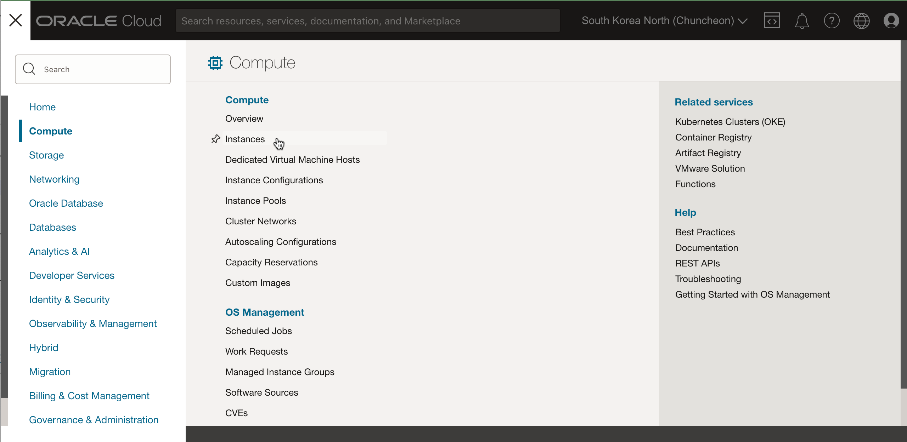
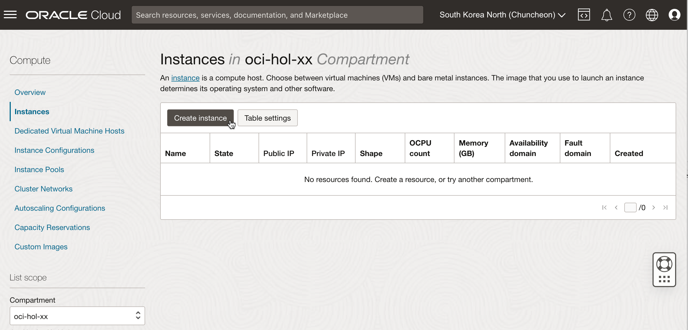
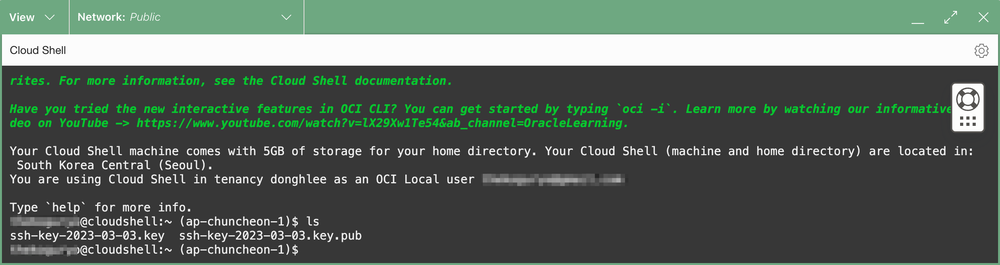
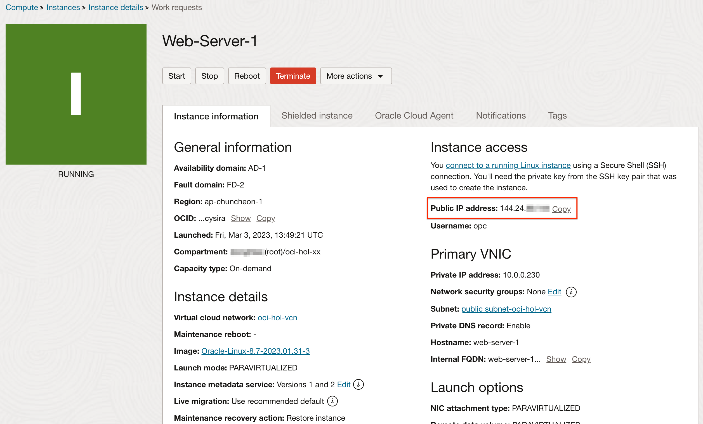
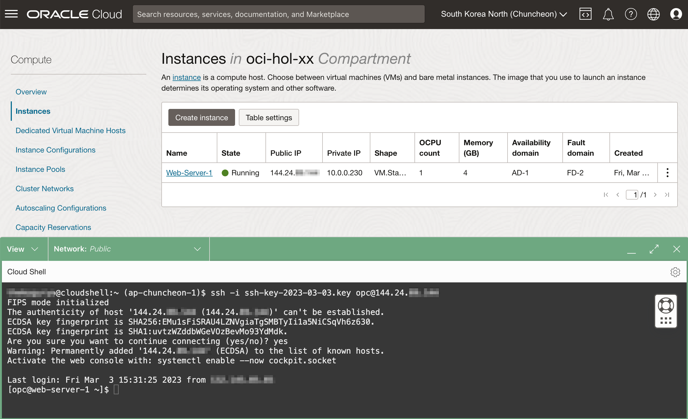
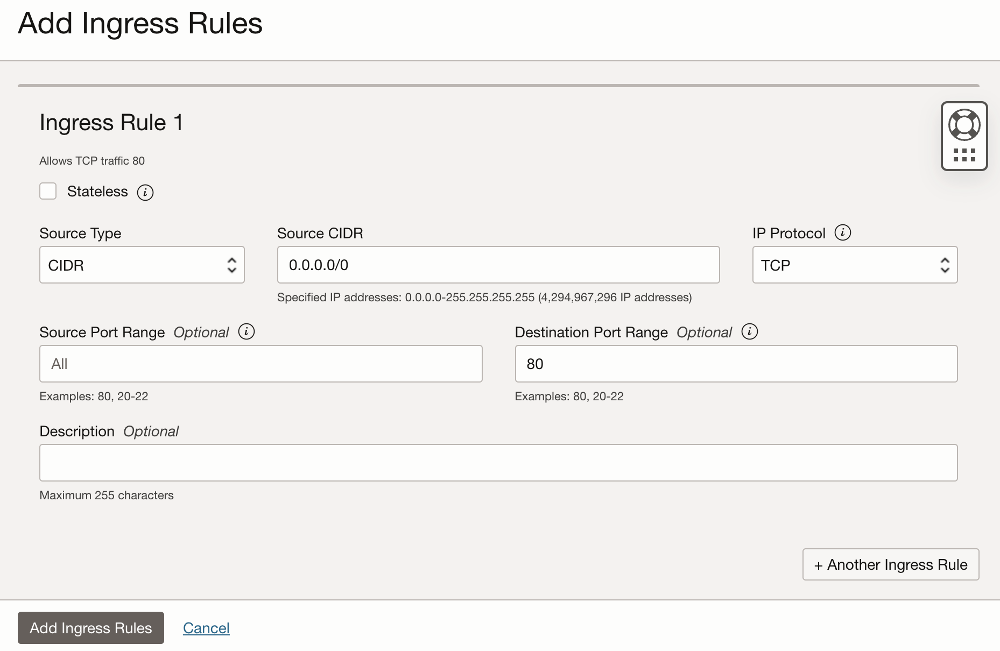

# Create a Compute Service

## Introduction

Oracle Cloud Infrastructure Compute 서비스를 사용하여 인스턴스로 지칭하는 컴퓨트 호스트를 프로비저닝하고 관리할 수 있습니다. 컴퓨팅 및 애플리케이션 요구 사항을 충족하기 위해 필요한 인스턴스를 만들 수 있습니다. 인스턴스를 생성한 다음, 로컬 컴퓨터에서 안전하게 접근할 수 있으며, 인스턴스를 재시작하거나 또는 블록 볼륨을 장착 또는 분리할 수 있으며, 작업이 끝나면, 인스턴스를 종료할 수 있습니다. 컴퓨트 인스턴스를 종료한 경우에도, 인스턴스에 장착하여 사용했던 볼륨은 종료하지 않은 경우 데이터는 보존됩니다.

Oracle Cloud Infrastructure Compute 인스턴스 작업에 대한 추가 정보로써 [Compute 인스턴스에 대한 모범 사례](https://docs.cloud.oracle.com/iaas/Content/Compute/References/bestpracticescompute.htm)를 참조바랍니다.

예상 시간: 30분

[](youtube:09kahbIF0Ew)

### 목표

이 실습에서는 다음을 수행합니다:

- Compute 인스턴스 생성
- Compute 인스턴스에 SSH로 접속
- Apache HTTP 서버 설치

### 전제조건
- Oracle Cloud Trial Account 또는 Paid Account
  
## Task 1: Compute 인스턴스 생성

Oracle Cloud Infrastructure는 Bare Metal 및 Virtual Machine 인스턴스를 모두 제공합니다.

- **베어 메탈** - 베어 메탈 컴퓨트 인스턴스는 최고의 성능과 강력한 격리를 위해 전용 물리 서버를 제공합니다.
- **가상 머신** - 가상 머신(VM)은 물리적 베어메탈 하드웨어 위에 실행되는 독립적인 컴퓨팅 환경입니다. 가상화를 통해 서로 격리된 다수의 가상 머신을 실행할 수 있습니다. 가상머신은 전체 물리 시스템의 성능과 리소스(CPU, 메모리, 네트워크 대역폭, 스토리지)를 요구할 만큼의 많은 자원과 성능에 대한 요구가 상대적으로 적은 애플리케이션을 실행하는 데 이상적입니다.

Oracle Cloud Infrastructure VM 컴퓨트 인스턴스는 동일한 클라우드 최적화 하드웨어, 펌웨어, 소프트웨어 스택 및 네트워킹 인프라를 활용하여 Bare Metal 인스턴스와 동일한 하드웨어에서 실행됩니다.

1. 왼쪽 상단의 **Navigation Menu**를 클릭하고 **Compute**으로 이동한 다음 **Instances** 을 선택합니다.

	

2. **Create Instance**을 클릭합니다. 이제 가상 머신을 만들 것입니다.

    

3. Create Compute Instance 화면이 뜹니다.

    이름을 **Web-Server-1**로 입력합니다.

    

4. Placement - 고급 옵션을 열면 Capacity Type을 선택할 수 있습니다. 여기서는 기본값인 **On-demand capacity**을 사용합니다.

     

    - **On-demand capacity**: 사용할 때만 컴퓨트 자원에 대한 비용을 지불하는 방식, 일반적인 경우에 사용합니다.
    - **Preemptible capacity**: 선점형 인스턴스는 일반 인스턴스 가격의 50% 가격으로 책정됩니다. 갑자기 자원을 회수당할 수 있습니다. 잠시 사용할 때 유용합니다.
    - **Capacity reservation**: 추후 사용을 위한 용량을 예약하고 사용하는 방식으로, 추후 생성시 필요한 자원에 대해 보장받습니다. 예약된 용량 중에 미사용 용량은 일반 인스턴스 가격의 85% 가격으로 책정됩니다.
    - **Dedicated host**: 전용 가상 머신 호스트를 생성하고 해당 호스트에 가상 머신을 생성하는 방식으로, 전용 서버를 다른 고객과 자원을 공유하지 않고 사용합니다. 격리된 자원 요구시 사용할 수 있습니다. 전용 가상 머신 호스트를 생성하면 그에 대한 비용이 발생합니다.

    - **노트** - _OCI는 모든 리전에서 동일한 성능과 가격을 제공하는 [일관된 글로벌 가격](https://www.oracle.com/cloud/pricing/#rc30p1)을 제공합니다._

5. Image & Shape - 사용할 이미지와 Shape(CPU, Memory 크기)을 선택합니다.

    

    - Change Image를 선택하면 제공하는 다양한 이미지를 확인할 수 있습니다. 리눅스 및 윈도우를 지원합니다. 리눅스를 사용할 경우 기술지원이 포함된 Oracle Linux를 권장합니다. OS에 따라 버전과 빌드이미지를 날짜로 선택할 수 있습니다.

        

        RedHat Linux는 [Learn More](#LearnMore)를 확인합니다.

    - Change Shape을 선택하면, 인스턴스 유형(VM, 베어메탈)을 고를 수 있고, AMD, Intel, Arm CPU를 제공합니다. 기본 AMD를 선택합니다.

        

        * _Flex Shape을 제공하여, 비용 최적화된 Shape을 사용할 수 있습니다._ 고정된 CPU, Memory 중에 고르는 것이 아니라, 원하는 CPU, 원하는 메모리 크기를 직접 고를 수 있습니다. 

        
    

6. Networking - 앞선 실습에서 만든 VCN내에 Public Subnet을 선택합니다. 생성될 인스턴스에 대한 접속을 위해 **Assign a public IPv4 address**을 선택하여 Public IP를 할당합니다.

    

7. Add SSH Keys - SSH 접속을 위한 키를 등록하는 부분입니다. 별도로 생성해서 등록해도 되지만 편의상 **Generate a key pair for me**를 선택하여, 키를 자동으로 생성합니다. 
    - _Save private key_, _Save public key_를 클릭하여, 반드시 개인키와 공개키 둘다 다운로드 받습니다.

    

8. Create를 클릭하여 인스턴스를 생성합니다.

9. 콘솔 상단에서 Cloud Shell 아이콘을 클릭합니다.

    Cloud Shell이 ​​시작될 때 콘솔의 Region 기준으로, Cloud Shell의 OCI CLI 컨텍스트가 기본 설정됩니다.

    

10. 다운받은 SSH Key를 업로드하기 위해 Cloud Shell 오른쪽 위의 아이콘을 클릭한후 Upload를 클릭합니다.

    

11. 개인키를 먼저 업로드 합니다.

    

12. 공개키도 동일하게 업로드 합니다.

    

13. 파일의 권한을 변경합니다.

    ```
    chmod 400 ssh-key-2023-03-03.key*
    ```

14. 인스턴스의 상태가 *RUNNING*이 되면, 인스턴스의 Public IP를 확인합니다.

    

## Task 2: Compute 인스턴스 접속 및 웹서버 설치하기

1. 인스턴스에 접속하기 위해, Cloud Shell에서 다음 명령을 실행합니다.

    >**노트:** Oracle Linux VM에서 기본 유저명은 **opc**입니다.

    ```
    <copy>ssh -i <private_ssh_key> opc@<public_ip_address></copy>
    ```

    

2. 컴퓨트 인스턴스에 아파치 HTTP 웹서버를 설치하고, 인터넷으로 접속할 예정입니다. Cloud Shell에서 SSH로 접속한 상태에서 다음 명령들을 순서대로 실행합니다.

    >**노트:** 아파치 HTTP 웹서버는 Apache Software Foundation에서 개발한 오픈소스 웹서버입니다. 웹 컨텐츠를 호스팅하고, 브라우저의 요청에 대한 응답을 합니다. 테스트 목적으로 아래와 같이 설치합니다.

    - Apache HTTP 서버 설치

        ```
        <copy>sudo yum install httpd -y</copy>
        ```

    - Apache 서버를 시작하고, VM 재시작시에도 자동으로 시작되게 설정합니다.

        ```
        <copy>sudo apachectl start
        sudo systemctl enable httpd</copy>
        ```

    - Apache 설정이 정상인지 체크합니다.

        ```
        <copy>sudo apachectl configtest</copy>
        ```

    - HTTP 서버가 외부 요청을 수신할 수 있도록 리눅스 OS 레벨 방화벽을 개방합니다.

        ```
        <copy>sudo firewall-cmd --permanent --zone=public --add-service=http
        sudo firewall-cmd --reload</copy>
        ```

    - 웹서버의 인덱스 파일을 생성합니다.

        ```
        <copy>sudo bash -c 'echo Hello Apache on Web-Server-1 >/var/www/html/index.html'</copy>
        ```

3. 브라우저를 열고 `http://<public_ip_address>` (Linux VM의 Public IP)로 접속해 봅니다.

    >**노트:** Security Lists에 아직 80 포트가 열려있지 않기 때문에, 응답에 실패하는 것이 정상입니다.

4. 왼쪽 상단의 **Navigation Menu**를 클릭하고 **Networking**으로 이동한 다음 **Virtual Cloud Networks** 을 선택합니다.

5. 실습에서 만들어서 사용하는 VCN을 클릭합니다. 예, oci-hol-vcn

6. 왼쪽 아래 Resources 아래 **Security Lists**을 클릭합니다.

    

7. **Default Security List**를 클릭합니다.

8. 80 포트에 대한 개방이 필요합니다. **Add Ingress Rules**을 클릭한 후 아래 값으로 인그레스 규칙을 추가합니다.

    - **Source Type:** CIDR
    - **Source CIDR**: 0.0.0.0/0
    - **IP Protocol:** TCP
    - **Source Port Range:** All
    - **Destination Port Range:** 80
    - 아래 **Add Ingress Rules** 클릭

    

8. 브라우저에서 다시 `http://<public_ip_address>` (Linux VM의 Public IP)로 접속해 봅니다. 아래와 같이 index.html 페이지 접속된 결과가 보일 것입니다.

    

이제 **다음 실습을 진행**하시면 됩니다.

## Troubleshooting

1. 브라우저에서 웹 서버가 접속이 안되면, 다음을 확인해 봅니다:

    - VCN Security Lists에서 트래픽을 막을 수 있습니다. VCN Security List의 인그레스 규칙에 80 포트가 열렸는지 확인합니다.
    - 컴퓨트 인스턴스상의 리눅스 OS상의 방화벽에서 트래픽을 막을 수 있습니다. 아래 명령으로 확인합니다.

        * 퍼블릭 존에 http가 보이는 지 확인합니다.

            ```
        
            [opc@web-server-1 ~]$ <copy>sudo firewall-cmd --zone=public --list-services</copy>
            dhcpv6-client http ssh
            ```

        * httpd 서비스가 80 포트로 리스닝하고 있는 지 확인합니다. 포트가 다르다면 VCN Security List에서 해당 포트를 개방합니다.

            ```
        
            [opc@web-server-1 ~]$ <copy>sudo netstat -tulnp | grep httpd</copy>
            tcp6       0      0 :::80                   :::*                    LISTEN      58543/httpd
            ```

    - 브라우저를 실행하고 있는 사내망이 트래픽을 막을 수 있습니다.

        * Cloud Shell에서 접속을 테스트 해봅니다.
        
            ```
            curl http://<public_ip_address>
            ```

2. `sudo` 명령이 혹시 실패했다면, 컴퓨트 인스턴스에서 해당 명령을 실행한 것인지, Cloud Shell에서 실행한 것인지 다시 한번 확인합니다. 컴퓨트 인스턴스에서 아파치 웹서버 관련 작업을 수행했는 지 다시 한번 확인합니다.

## Learn More

- [RHEL runs on OCI supported by Oracle and Red Hat](https://blogs.oracle.com/cloud-infrastructure/post/red-hat-enterprise-linux-supported-oci)
## Acknowledgements

- **Author** - Rajeshwari Rai, Prasenjit Sarkar, DongHee Lee
- **Contributors** - Oracle LiveLabs QA Team (Kamryn Vinson, QA Intern, Arabella Yao, Product Manager, DB Product Management)
- **Korean Translator & Contributors** - DongHee Lee, March 2023
- **Last Updated By/Date** - DongHee Lee, March 2023