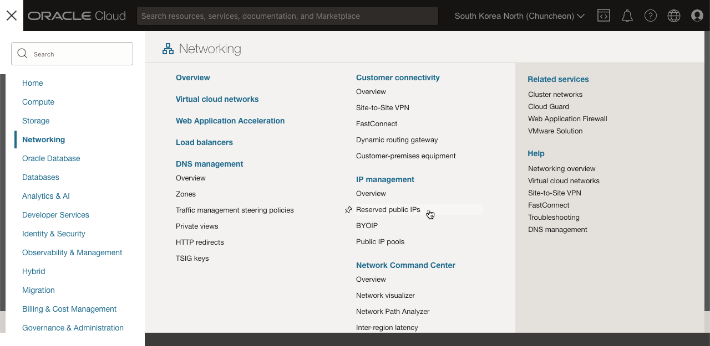
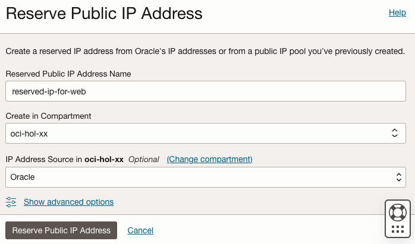
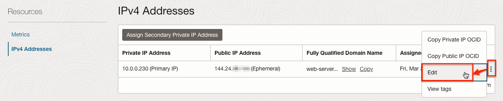
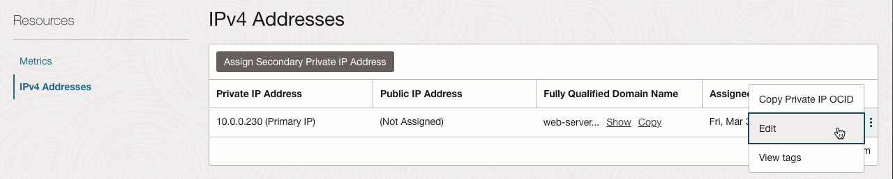
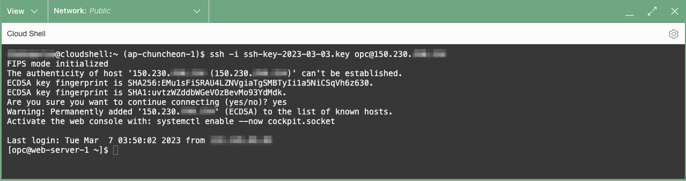
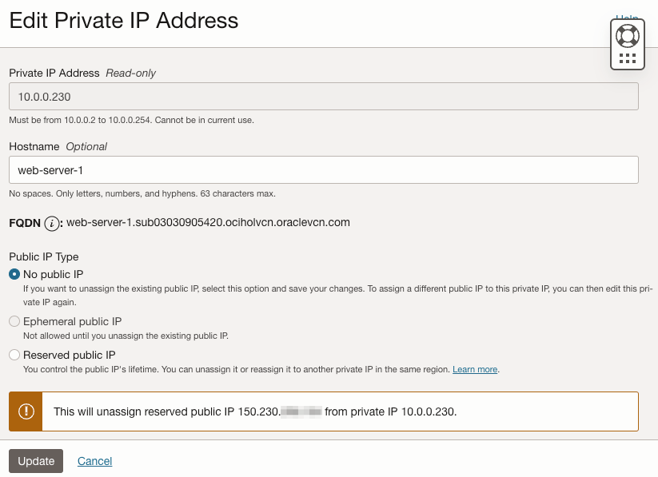

#  Using Reserved Public IP

## Introduction

Public IP 주소는 인터넷에서 연결할 수 있는 IPv4 주소입니다. 테넌시의 리소스가 인터넷에서 직접 연결할 수 있어야 하는 경우 Public IP 주소가 있어야 합니다. 이전 실습에서 컴퓨터 인스턴스 생성시 할당한 Public IP는 Ephemeral Public IP 유형입니다. Ephemeral Public IP도 인스턴스 생성후 IP가 변경되지 않지만, 유저가 인스턴스가 종료(Terminate) 하는 경우에 해당 IP는 반납이 됩니다. 일반적으로는 운영 서비스인 경우에는, 클라이언트가 대상에 접근시 DNS를 사용하는 것이 맞지만, 요건에 따라 IP 변경없이 사용할 수 있는 Reserved Public IP가 필요합니다. 이번 실습에서는 이에 대해 알아보겠습니다.

- **Ephemeral Public IP** : 일시적인 공인 IP로 일반적으로 Instance의 시작할 때 부여되며, 종료(Terminate)될 때까지 변경되지 않습니다.
- **Reserved Public IP** : 유저가 예약하여, 보유할 수 있는, 지속하는 공인 IP입니다. 해당 Public IP를 해당 Instance에서 할당해지하고 다른 Instance에 재할당 할 수도 있습니다.
- 참조 문서 - [Public IP Addresses - Types of Public IPs](https://docs.oracle.com/en-us/iaas/Content/Network/Tasks/managingpublicIPs.htm#overview)

>**노트**: _작성일(2023년 3월) 기준으로 OCI에서 Reserved Public IP는 무료입니다. 사용시 별도 비용이 발생하지 않습니다._

예상 시간: 20분

### 목표

이 실습에서는 다음을 수행합니다:

- Reserved IP 생성
- Compute 인스턴스에 Reserved IP 부여

### 전제조건
- Oracle Cloud Trial Account 또는 Paid Account
- [Lab 3: Create a Compute Service](../workshops/tenancy/index.html?lab=compute-service) 완료

## Task 1: Reserved Public IP 생성

1. 왼쪽 상단의 **Navigation Menu**를 클릭하고 **Networking**으로 이동한 다음 **IP Management** 하위의 **Reserved public IPs**를 선택합니다.

    

2. **Reserve Public IP Address** 클릭

3. 생성 정보를 입력합니다:

    - **Reserved Public IP Address Name**: 예, reserved-ip-for-web
    - **Create in Compartment**: 사용중인 Compartment
    - **IP Address Source**: Oracle 선택

    

4. **Reserve Public IP Address**를 클릭하여 생성합니다.

5. 예약된 Public IP는 필요한 자원에 할당해서 사용할 수 있습니다.

    

## Task 2: 컴퓨트 인스턴스에 Reserved Public IP 할당

1. 왼쪽 상단의 **Navigation Menu**를 클릭하고 **Compute**으로 이동한 다음 **Instances** 을 선택합니다.

2. 앞서 만든 Web-Server-1 인스턴스를 클릭합니다.

3. **Resources** 하위의 **Attached VNICs**을 클릭합니다.

4. Primary VNIC을 볼 수 있습니다. 이름을 클릭합니다.

5. VNIC 상세화면에서 **Resources** 하위의 **IPv4 Addresses**을 클릭합니다.

6. 할당된 Private IP와 Public IP를 볼 수 있습니다.

7. 오른쪽 액션 메뉴에서 **Edit**를 클릭합니다.

    

8. 현재 할당된 임시 Public IP 반납을 위해 먼저 **No public IP**으로 변경후 저장합니다.

    

9. Public IP가 반납되었습니다. 다시 오른쪽 액션 메뉴에서 **Edit**를 클릭합니다.

    

10. **Reserved public IP** 유형을 선택하고, 예약해 둔 Public IP를 지정후 저장합니다.

        

11. 예약된 Public IP가 인스턴스에 할당되었습니다.

        

12. Cloud Shell에서 Web-Server-1을 새로 할당한 Public IP로 접속해 봅니다. 

    

13. 브라우저에서 Web-Server-1을 새로 할당한 Public IP로 접속해 봅니다.

    

14. 이처럼 Reserved Public IP을 만들어 사용할 수 있으며, 인스턴스에 할당해서 사용합니다. 해당 인스턴스가 종료(Terminate)한 경우에도 다른 인스턴스에 다시 할당하여 사용할 수 있습니다.

## Task 3: Reserved Public IP 반납

1. 할당시와 동일한 순서로 컴퓨트 인스턴스의 Primary VNIC 상세화면으로 이동합니다.

2. VNIC에 할당된 **IPv4 Address**로 이동하여, 오른쪽 액션 메뉴에서 **Edit**를 클릭합니다.

3. **No public IP**으로 변경하여 사용하던 Reserved Public IP를 반납합니다.

    

4. 이후 실습과정을 위해 Ephemeral Public IP를 다시 할당합니다.

이제 **다음 실습을 진행**하시면 됩니다.

## Acknowledgements

- **Author** - Flavio Pereira, Larry Beausoleil, DongHee Lee
- **Adapted by** -  Yaisah Granillo, Cloud Solution Engineer
- **Korean Translator & Contributors** - DongHee Lee, March 2023
- **Last Updated By/Date** - DongHee Lee, March 2023

