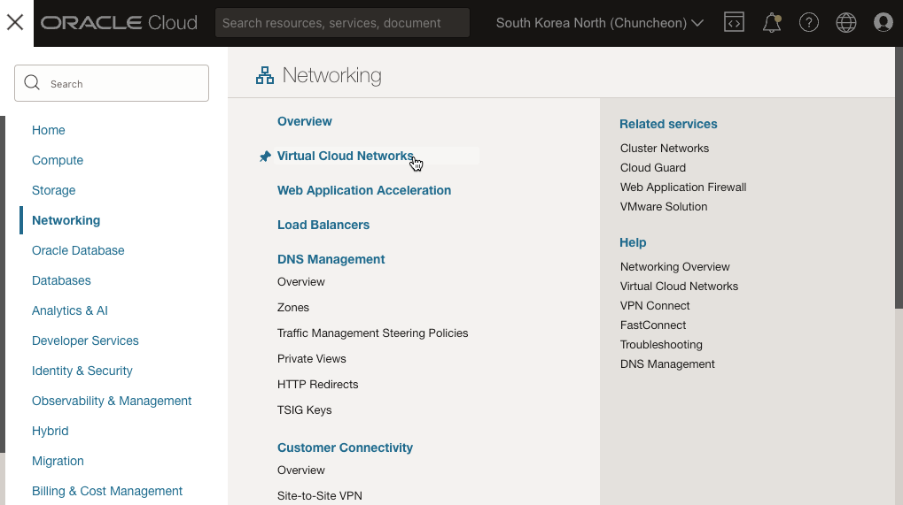
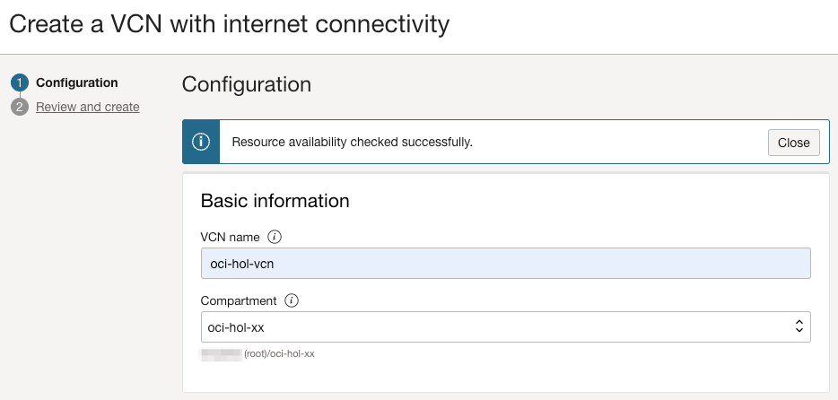
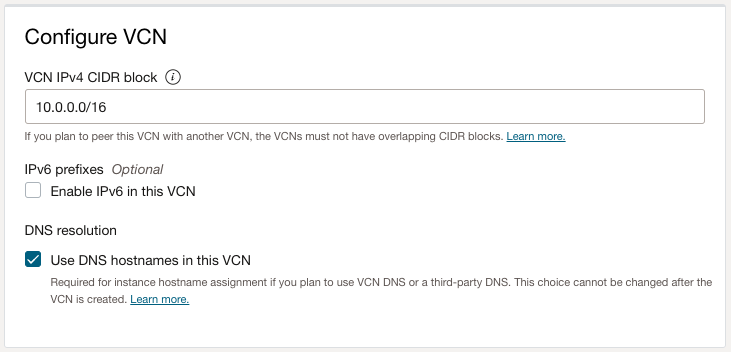
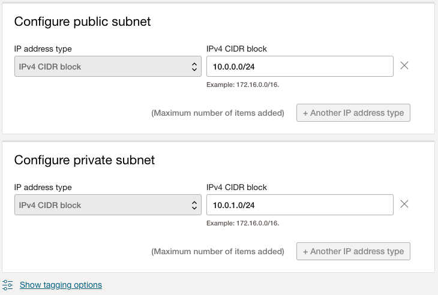

# Create Virtual Cloud Networks

## Introduction

Oracle Cloud Infrastructure(OCI) Compute를 사용하려면 먼저 VCN(가상 클라우드 네트워크)이 필요합니다. VCN에는 보안 목록, 컴퓨팅 인스턴스, 로드 밸런서 및 기타 여러 유형의 네트워크 자산이 포함됩니다.

네트워크 컴포넌트와 그들간의 관계를 이해하기 위해 [네트워킹 개요](https://docs.cloud.oracle.com/iaas/Content/Network/Concepts/overview.htm) 문서를 읽어보거나, 다음 비디오를 보기 바랍니다.

예상 시간: 15분

다음은 VCN 생성 과정을 안내하는 동영상입니다. 현재 오라클 클라우드 콘솔에서 보는 화면과 일부 다를 수 있습니다.

[Oracle Cloud Infrastructure Networking: Overview](youtube:eOGPej8n_ws)

### 목표

이 실습에서는 다음을 수행합니다:

- Virtual Cloud Network 생성

### 전제조건
- Oracle Cloud Trial Account 또는 Paid Account

## Task 1: VCN 및 서브넷 생성

네트워크 자원을 만들만한 VCN이 없는 경우, 아래와 같이 새 VCN을 만듭니다.

1. 왼쪽 상단의 **Navigation Menu**를 클릭하고 **Networking**으로 이동한 다음 **Virtual Cloud Networks** 을 선택합니다.

    

2. 이전 단계에서 만든 compartment를 선택합니다.

3. **Start VCN Wizard**을 선택합니다.

4. **Create VCN with Internet Connectivity**를 선택하고, **Start VCN Wizard**를 클릭합니다. 인터넷 연결이 되는 관련 자원들을 포함하여 VCN이 만들어지게 됩니다.

    

5. 새 VCN의 이름(예, oci-hol-vcn)하고 사용할 Compartment를 선택합니다. 나머지는 기본값을 사용합니다.

    |                  **Field**          |  **Value**  |
    |-------------------------------------|:-----------:|
    | VCN Name                            | oci-hol-vcn |
    | Compartment                         | ***Identity and Access Management Lab***에서 만든 Compartment 선택, 예, oci-hol-xx|
    | VCN CIDR Block                      | 10.0.0.0/16 |
    | Use DNS Hostnames In This VCN       | Checked |  
    | Public Subnet CIDR Block            | 10.0.0.0/24 |
    | Private Subnet CIDR Block           | 10.0.1.0/24 |

    

6. VCN 설정    

    

    - /16 부터 /30 까지 설정할 수 있습니다.
    - [IP Addresses Reserved for Use by Oracle](https://docs.oracle.com/en-us/iaas/Content/Network/Concepts/overview.htm#Reserved)을 참고하여 해당 범위를 제외하고 설정합니다.
    - **Use DNS Hostnames In This VCN** 선택시 _`<hostname>.<subnet-DNS-label>.<VCN-DNS-label>.oraclevcn.com`_ 형식으로 인스턴스의 FQDN이 포맷이 정해집니다.

        * 참고 - [DNS in Your Virtual Cloud Network](https://docs.oracle.com/en-us/iaas/Content/Network/Concepts/dns.htm)

7. Subnet 설정

        

    - **노트**: _서브넷내의 주소 3개는 내부적으로 사용합니다_      

        * 예시

        |                  **Field**          |  **Value**  |   **Comment**  |
        |-------------------------------------|:-----------:|:--------------:|
        | Subnet CIDR                         | 10.0.0.0/24 |                |
        | The first IP address                | 10.0.0.0    | 네트워크 주소     |
        | The last IP address                 | 10.0.0.255  | 브로드캐스트 주소  |
        | The first host address              | 10.0.0.1    | 서브넷 디폴트 게이트웨이 주소 |
        | The remaining addresses             | 10.0.0.2 to 10.0.0.254 | 유저 사용 가능 주소 |

        * 참고 문서 - [Three IP Addresses in Each Subnet](https://docs.oracle.com/en-us/iaas/Content/Network/Concepts/overview.htm#Reserved__reserved_subnet)

8. 설정후 **Next**을 클릭합니다.

9. 생성될 VCN과 관련 네트워크 자원들을 리뷰합니다. Gateway, Security List, Route Table이 추가적으로 만들어 지는 것을 볼 수 있습니다.

10. **Create**을 클릭합니다.

11. 인터넷 연결이 되는 관련 자원들을 포함하여 VCN이 만들어지게 됩니다.

  

12. **View Virtual Cloud Network** 클릭하면, 생성된 VCN의 상세페이지로 이동하며, 만들어진 자원을 확인할 수 있습니다.

이제 **다음 실습을 진행**하시면 됩니다.

## Acknowledgements

- **Author** - Rajeshwari Rai, Prasenjit Sarkar, DongHee Lee
- **Contributors** - Oracle LiveLabs QA Team (Kamryn Vinson, QA Intern, Arabella Yao, Product Manager, DB Product Management)
- **Korean Translator & Contributors** - DongHee Lee, March 2023
- **Last Updated By/Date** - DongHee Lee, March 2023

