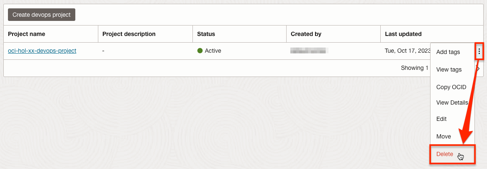

# Clean Up (Optional)

## Introduction

다음 과정은 실습으로 생성된 자원을 정리하는 과정입니다. 실습 진행 정도에 따라 일부 달라질 수 있습니다.

예상시간: 10 분

### 목표

- helm delete를 사용하여 MuShop 앱 삭제
- helm delete를 이용하여 추가 설치한 앱 삭제
- istio 삭제
- OKE 클러스터를 포함한 자원 정리

### 전제 조건

- Oracle Cloud Account

## Task 1: 설치된 helm releases를 조회

1. **helm list** 명령어를 사용하여 설치된 Helm 차트를 모두 조회합니다.

    ````shell
    <copy>
    helm list --all-namespaces
    </copy>
    ````

    Sample response:

    ````shell
    NAME                      NAMESPACE        REVISION UPDATED                       STATUS   CHART                 APP VERSION
    elasticsearch             logging          1        2023-10-16 02:31:54.793026467 deployed elasticsearch-19.13.4 8.10.3     
    fluent-bit                logging          1        2023-10-16 02:41:04.663228486 deployed fluent-bit-0.39.0     2.1.10     
    mushop                    mushop           1        2023-10-12 03:41:38.593653781 deployed mushop-0.2.1          2.0        
    mushop-utils              mushop-utilities 1        2023-10-12 03:32:10.88419933  deployed mushop-setup-0.0.2    1.0        
    oci-kubernetes-monitoring default          1        2023-10-16 08:55:30.03630867  deployed oci-onm-3.0.2         3.0.0    
    ````

## Task 2: MuShop App 정리

1. mushop 이름으로 앱을 삭제합니다.

    ````shell
    <copy>
    helm delete mushop --namespace mushop
    kubectl delete ns mushop
    </copy>
    ````

## Task 3: MuShop 유틸리티 정리

1. mushop-utils 이름으로 앱을 삭제합니다.

    ````shell
    <copy>
    helm delete mushop-utils -n mushop-utilities
    kubectl delete ns mushop-utilities
    </copy>
    ````

    > *Note:* `helm delete` 명령으로 mushop-utils를 삭제하게 되면, Service Type도 함께 삭제되어 ingress controller가 사용하는 OCI Load Balancer도 함께 Terminate 됩니다.

## Task 4: 추가 설치 자원 정리

1. elasticsearch, fluent-bit 이름으로 앱을 삭제합니다.

    ````shell
    <copy>
    helm delete elasticsearch -n logging
    helm delete fluent-bit  -n logging
    kubectl delete ns logging    
    </copy>
    ````

2. 설치된 istio를 삭제합니다.
    ````shell
    <copy>
    istioctl x uninstall --purge
    kubectl delete ns istio-system
    </copy>
    ````

3. 마이크로 서비스 생성 실습을 진행한 경우 Load Balancer Type의 서비스를 사용하였습니다. 이를 먼저 삭제하지 않고 OKE 클러스터를 삭제하면 클러스터 삭제이후에도 Oracle Cloud Infrastructure Load Balancer는 남게 됩니다. 사전에 삭제합니다. `kubectl get svc -A` 명령으로 확인된 Load Balancer 형식 서비스를 모두 삭제합니다.

## Task 5: OCI Kubernetes Monitoring Solution 삭제

1.. **Developer Services** &gt; **Resource Manager** &gt; **Stack**으로 이동합니다.

2. oke-kubernetes-stack을 클릭합니다.

3. **Destroy**를 클릭하게 스택으로 생성된 자원을 삭제합니다.


## Task 6: OKE 클러스터 종료

1. OKE Cluster를 삭제합니다.

    

2. Confirm 확인 후 삭제합니다.

3. VCN

    Quick Create 모드로 VCN을 함께 만든 경우에 클러스터 삭제후에도 VCN은 여전히 그대로 남아 있습니다. 필요한 경우 직접 VCN을 삭제합니다.


## Task 7: OCIR 정리

1. **Developer Services** &gt; **Container Registry**로 이동하여, 개발한 마이크로 서비스 앱 및 DevOps 서비스로 배포한 앱을 삭제합니다.

## Task 8: DevOps 프로젝트 삭제

1. **Developer Services** &gt; **DevOps**로 이동합니다.

2. 삭제할 DevOps 프로젝트 오른쪽 액션메뉴에서 **Delete**를 클릭합니다.

    

3. 하위 자원 삭제를 위해 **Delete cascade**를 체크하고 삭제합니다.

    

## Task 9: Log 자원 삭제

1. **Observability & Management** &gt; **Agent Configurations**로 이동합니다.

2. oci-hol-xx 내에 만든 agent-config를 삭제합니다.

3. **Logs**로 이동합니다.

4. oci-hol 컴파트먼트내 만든 모든 Log Group내의 Log들을 삭제합니다.

5. **Log Groups**으로 이동합니다.

6. oci-hol-xx 컴파트먼트내 기본으로 있는 _Audit 이외에 만든 로그 그룹을 삭제합니다.

7. **Developer Services** &gt; **Application Integration** &gt; **Notifications**로 이동합니다.

8. oci-hol 컴파트먼트내 만든 DevOps용 토픽을 삭제합니다.

## Task 10: IAM 자원 삭제

1. 앞서 만든 Policy(DevOps Policy, Logging Policy)를 삭제합니다.
2. 앞서 만든 Dynamic Group을 삭제합니다.
3. 사용한 컴파트먼트가 더 이상 필요하지 않은 경우 삭제합니다.


## Acknowledgements

- **Author** - DongHee Lee
- **Last Updated By/Date** - DongHee Lee, October 2023
